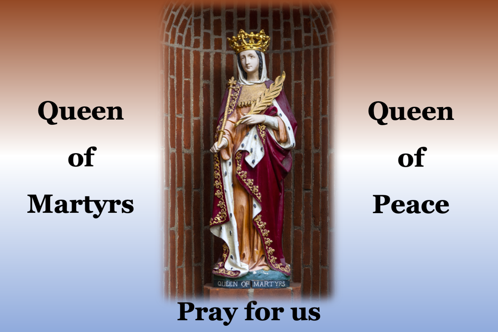

# Martyrdom and Korean Catholic Heritage

Hello, my name is Eunsoo. I’m a Korean-American Catholic and parishioner at [Our Lady of Peace Church & Shrine](https://www.olop-shrine.org) in California, USA. On September 20, 2025, our parish celebrated the feast day of the Korean Martyrs - St. Andrew Kim Taegon, Paul Chong Hasang and Companions.

This page was created to share their inspiring faith and the rich cultural traditions. The original exhibition consisted of 14 display panels, each featuring 8–9 letter-sized pages. Even though it was designed for displaying, we hope their remarkable stories are conveyed to you well. We invite you to explore Korean Catholic history, the lives of various martyrs, pilgrimage sites, and the beauty of Korean culture. If you have any questions or would like to leave a comment, please feel free to contact me at eschoi.stanford@gmail.com.

Below are two short videos introducing Korean Catholic history and the upcoming World Youth Day 2027 in Seoul.
- [Korean Martyr Saints](https://youtu.be/fE61T_ygxbc?si=GOe9PvMrmwydtbcQ)
- [World Youth Day 2027 in Seoul, Korea](https://youtu.be/IBgqQ6_d22w?si=vLLgW2e6lwaJDnVH)
  
## [Korean Catholic History](KoreanCatholicHistory.pdf)

## Martyrs
- [103 Saint and 124 Blessed Korean Martyrs](KoreanMartyrs.pdf)
- [Foreign Martyrs in Korea](ForeignMartyrsInKorea.pdf)
- [Early Church Martyrs](EarlyChurchMartyrs.pdf)
- [Martyrs from the World Around Us](MartyrsFromTheWorldAroundUs.pdf)

## Catholic Pilgrimage
- [Catholic Pilgrimage In Seoul](CatholicPilgrimageInSeoul.pdf)
- [Catholic Pilgrimage Outside Seoul](CatholicPilgrimageOutsideSeoul.pdf)
  
## [Modern Korean Catholic Church](ModernKoreanCatholicChurch.pdf)

## [World Youth Day 2027 in Seoul, Korea](WorldYouthDay.pdf)

## Korean Culture
- [Traditional Korean Culture](TraditionalKoreanCulture.pdf)
- [Modern Korean Culture](ModernKoreanCulture.pdf)
- [Korean Language and Social Etiquette](KoreanLanguageAndSocialEtiquette.pdf)

## Quiz
- [Quiz on Martyrdom and Korean Catholic Heritage](Quiz.pdf)
- [Quiz for Children on Martyrdom and Korean Catholic Heritage](QuizForChildren.pdf)

## [Click Here to Download the Full Exhibition (ver.2)](MartyrdomAndKoreanCatholicHeritage_v2-compressed.pdf)

