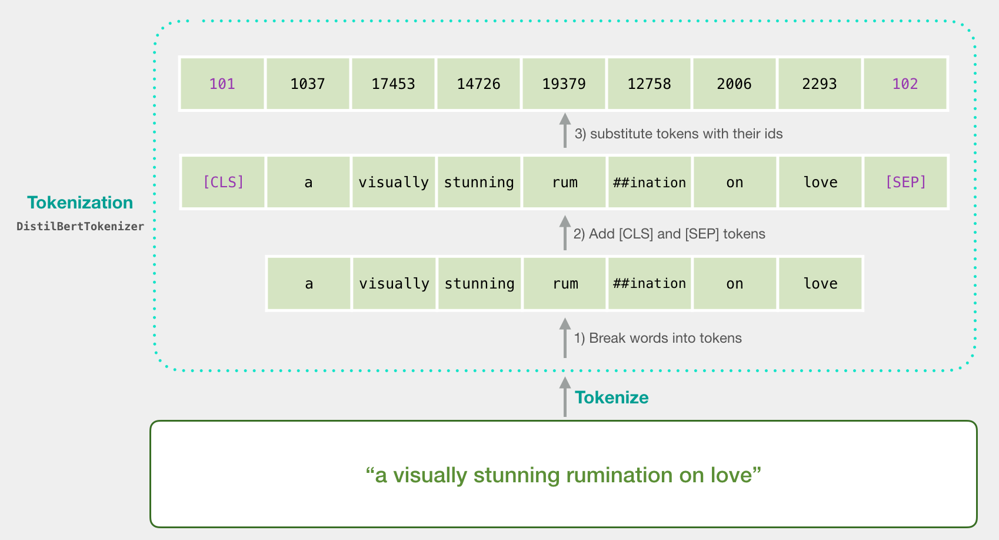

[<-PREV](sequence.md)

# Transformer 

## 1. Intuition

## 2. Attention mechanism and Transformer's architecture

### 3. Pre-training Transformer models

- Many more options at [https://huggingface.co/transformers/pretrained_models.html](https://huggingface.co/transformers/pretrained_models.html)

## 4. BERT (Bidirectional Encoder Representations from Transformers)
### 4.1 Text preprocessing - Tokenization

### 4.2 Pretraining BERT

1. Pre-training: Semi-supervised training on larget amounts of text
    - Masked Language Model (MLM)
    - Next Sentence Prediction (NSP) 
2. Fine-tuning: Supervised training on a specific task with a labeled dataset 

### 4.3 How to use BERT for classification

1. Use a [CLS] token (Context vector) only
2. Use last_hidden_states and Pooling
3. Use last_hidden_states as input for RNN model

[<-PREV](sequence.md)
