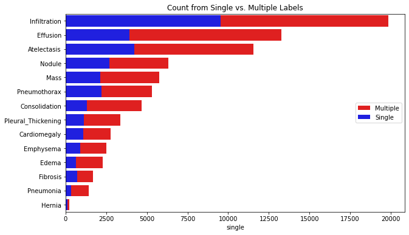
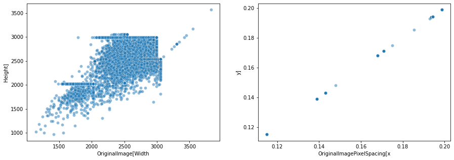
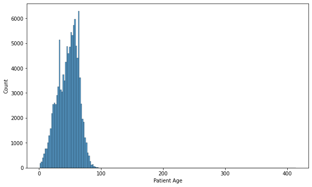
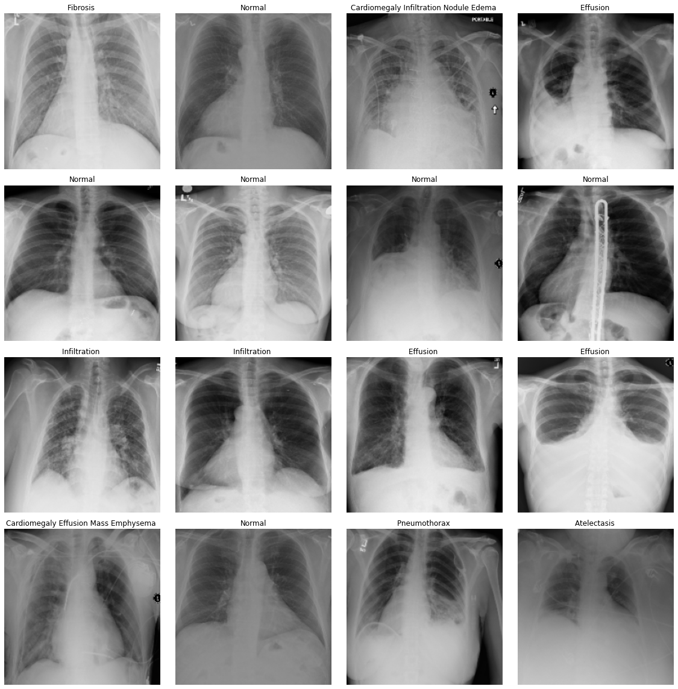
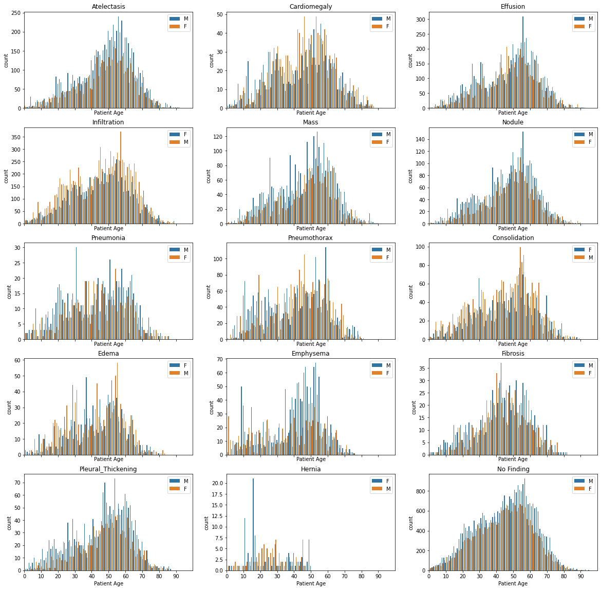
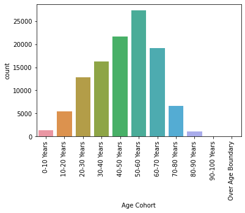
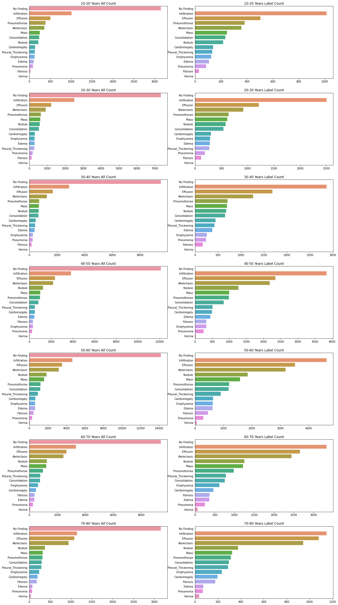

# Outline Part 1
1. Import libraries, set up directories, and read data 
2. Quick data check
3. Feature engineering
4. Exploratory data analysis

# 1. Import libraries, set up directories and read data


```python
import numpy as np
import pandas as pd
import matplotlib.pyplot as plt
import seaborn as sns
from PIL import Image

from os import path
from glob import glob
```


```python
input_dir1 = '../input/data/'
input_dir2 = '../input/chestxray8-dataframe/'
output_dir = ''
```


```python
all_df = pd.read_csv(input_dir1 + 'Data_Entry_2017.csv')
bad_df = pd.read_csv(input_dir2 + 'cxr14_bad_labels.csv', index_col = 'Unnamed: 0')
```

# 2. Quick data check


```python
print(all_df.info())
all_df.head()
```

    <class 'pandas.core.frame.DataFrame'>
    RangeIndex: 112120 entries, 0 to 112119
    Data columns (total 12 columns):
     #   Column                       Non-Null Count   Dtype  
    ---  ------                       --------------   -----  
     0   Image Index                  112120 non-null  object 
     1   Finding Labels               112120 non-null  object 
     2   Follow-up #                  112120 non-null  int64  
     3   Patient ID                   112120 non-null  int64  
     4   Patient Age                  112120 non-null  int64  
     5   Patient Gender               112120 non-null  object 
     6   View Position                112120 non-null  object 
     7   OriginalImage[Width          112120 non-null  int64  
     8   Height]                      112120 non-null  int64  
     9   OriginalImagePixelSpacing[x  112120 non-null  float64
     10  y]                           112120 non-null  float64
     11  Unnamed: 11                  0 non-null       float64
    dtypes: float64(3), int64(5), object(4)
    memory usage: 10.3+ MB
    None


<div>
<style scoped>
    .dataframe tbody tr th:only-of-type {
        vertical-align: middle;
    }

    .dataframe tbody tr th {
        vertical-align: top;
    }

    .dataframe thead th {
        text-align: right;
    }
</style>
<table border="1" class="dataframe">
  <thead>
    <tr style="text-align: right;">
      <th></th>
      <th>Image Index</th>
      <th>Finding Labels</th>
      <th>Follow-up #</th>
      <th>Patient ID</th>
      <th>Patient Age</th>
      <th>Patient Gender</th>
      <th>View Position</th>
      <th>OriginalImage[Width</th>
      <th>Height]</th>
      <th>OriginalImagePixelSpacing[x</th>
      <th>y]</th>
      <th>Unnamed: 11</th>
    </tr>
  </thead>
  <tbody>
    <tr>
      <th>0</th>
      <td>00000001_000.png</td>
      <td>Cardiomegaly</td>
      <td>0</td>
      <td>1</td>
      <td>58</td>
      <td>M</td>
      <td>PA</td>
      <td>2682</td>
      <td>2749</td>
      <td>0.143</td>
      <td>0.143</td>
      <td>NaN</td>
    </tr>
    <tr>
      <th>1</th>
      <td>00000001_001.png</td>
      <td>Cardiomegaly|Emphysema</td>
      <td>1</td>
      <td>1</td>
      <td>58</td>
      <td>M</td>
      <td>PA</td>
      <td>2894</td>
      <td>2729</td>
      <td>0.143</td>
      <td>0.143</td>
      <td>NaN</td>
    </tr>
    <tr>
      <th>2</th>
      <td>00000001_002.png</td>
      <td>Cardiomegaly|Effusion</td>
      <td>2</td>
      <td>1</td>
      <td>58</td>
      <td>M</td>
      <td>PA</td>
      <td>2500</td>
      <td>2048</td>
      <td>0.168</td>
      <td>0.168</td>
      <td>NaN</td>
    </tr>
    <tr>
      <th>3</th>
      <td>00000002_000.png</td>
      <td>No Finding</td>
      <td>0</td>
      <td>2</td>
      <td>81</td>
      <td>M</td>
      <td>PA</td>
      <td>2500</td>
      <td>2048</td>
      <td>0.171</td>
      <td>0.171</td>
      <td>NaN</td>
    </tr>
    <tr>
      <th>4</th>
      <td>00000003_000.png</td>
      <td>Hernia</td>
      <td>0</td>
      <td>3</td>
      <td>81</td>
      <td>F</td>
      <td>PA</td>
      <td>2582</td>
      <td>2991</td>
      <td>0.143</td>
      <td>0.143</td>
      <td>NaN</td>
    </tr>
  </tbody>
</table>
</div>


```python
print(bad_df.info())
bad_df.head()
```

    <class 'pandas.core.frame.DataFrame'>
    Int64Index: 432 entries, 0 to 431
    Data columns (total 4 columns):
     #   Column       Non-Null Count  Dtype  
    ---  ------       --------------  -----  
     0   Index        432 non-null    object 
     1   Inverted     432 non-null    float64
     2   Not frontal  432 non-null    float64
     3   Rotated      432 non-null    float64
    dtypes: float64(3), object(1)
    memory usage: 16.9+ KB
    None


<div>
<style scoped>
    .dataframe tbody tr th:only-of-type {
        vertical-align: middle;
    }

    .dataframe tbody tr th {
        vertical-align: top;
    }

    .dataframe thead th {
        text-align: right;
    }
</style>
<table border="1" class="dataframe">
  <thead>
    <tr style="text-align: right;">
      <th></th>
      <th>Index</th>
      <th>Inverted</th>
      <th>Not frontal</th>
      <th>Rotated</th>
    </tr>
  </thead>
  <tbody>
    <tr>
      <th>0</th>
      <td>00000583_024.png</td>
      <td>1.0</td>
      <td>0.0</td>
      <td>0.0</td>
    </tr>
    <tr>
      <th>1</th>
      <td>00002180_000.png</td>
      <td>1.0</td>
      <td>0.0</td>
      <td>0.0</td>
    </tr>
    <tr>
      <th>2</th>
      <td>00002300_026.png</td>
      <td>1.0</td>
      <td>0.0</td>
      <td>0.0</td>
    </tr>
    <tr>
      <th>3</th>
      <td>00002371_015.png</td>
      <td>1.0</td>
      <td>0.0</td>
      <td>0.0</td>
    </tr>
    <tr>
      <th>4</th>
      <td>00006209_001.png</td>
      <td>1.0</td>
      <td>0.0</td>
      <td>0.0</td>
    </tr>
  </tbody>
</table>
</div>


# 3. Feature engineering

## 3.1 Data cleaning
Remove image from bad_df from all_df


```python
all_df = all_df[~all_df['Image Index'].isin(bad_df['Index'])]
```

## 3.2 Data organizing
Add Path column


```python
image_path = {path.basename(x): x[len(input_dir1):] for x in glob(input_dir1 + 'images_*/images/*png')}
all_df['Path'] = all_df['Image Index'].map(image_path.get)
```

## 3.3 Convert to categorical


```python
class_names = ['Atelectasis',
               'Cardiomegaly', 
               'Effusion', 
               'Infiltration', 
               'Mass', 
               'Nodule',
               'Pneumonia', 
               'Pneumothorax',
               'Consolidation',
               'Edema',
               'Emphysema', 
               'Fibrosis',                
               'Pleural_Thickening',
               'Hernia',
               'No Finding']

n_classes = len(class_names)
n_cases = all_df.shape[0]

df = all_df.copy()[['Image Index','Path','Patient ID','Finding Labels']]

def to_categorical(x, class_name):
    if class_name in x:
        return 1
    return 0

for class_name in class_names:
    df[class_name] = np.vectorize(to_categorical)(all_df['Finding Labels'], class_name)

# Used np.vectorize instead of apply for speed
# df[class_name] = all_df['Finding Labels'].apply(lambda x: 1 if class_name in x else 0)
```


```python
print(df.info())
df.head()
```

    <class 'pandas.core.frame.DataFrame'>
    Int64Index: 111863 entries, 0 to 112119
    Data columns (total 19 columns):
     #   Column              Non-Null Count   Dtype 
    ---  ------              --------------   ----- 
     0   Image Index         111863 non-null  object
     1   Path                111863 non-null  object
     2   Patient ID          111863 non-null  int64 
     3   Finding Labels      111863 non-null  object
     4   Atelectasis         111863 non-null  int64 
     5   Cardiomegaly        111863 non-null  int64 
     6   Effusion            111863 non-null  int64 
     7   Infiltration        111863 non-null  int64 
     8   Mass                111863 non-null  int64 
     9   Nodule              111863 non-null  int64 
     10  Pneumonia           111863 non-null  int64 
     11  Pneumothorax        111863 non-null  int64 
     12  Consolidation       111863 non-null  int64 
     13  Edema               111863 non-null  int64 
     14  Emphysema           111863 non-null  int64 
     15  Fibrosis            111863 non-null  int64 
     16  Pleural_Thickening  111863 non-null  int64 
     17  Hernia              111863 non-null  int64 
     18  No Finding          111863 non-null  int64 
    dtypes: int64(16), object(3)
    memory usage: 17.1+ MB
    None


<div>
<style scoped>
    .dataframe tbody tr th:only-of-type {
        vertical-align: middle;
    }

    .dataframe tbody tr th {
        vertical-align: top;
    }

    .dataframe thead th {
        text-align: right;
    }
</style>
<table border="1" class="dataframe">
  <thead>
    <tr style="text-align: right;">
      <th></th>
      <th>Image Index</th>
      <th>Path</th>
      <th>Patient ID</th>
      <th>Finding Labels</th>
      <th>Atelectasis</th>
      <th>Cardiomegaly</th>
      <th>Effusion</th>
      <th>Infiltration</th>
      <th>Mass</th>
      <th>Nodule</th>
      <th>Pneumonia</th>
      <th>Pneumothorax</th>
      <th>Consolidation</th>
      <th>Edema</th>
      <th>Emphysema</th>
      <th>Fibrosis</th>
      <th>Pleural_Thickening</th>
      <th>Hernia</th>
      <th>No Finding</th>
    </tr>
  </thead>
  <tbody>
    <tr>
      <th>0</th>
      <td>00000001_000.png</td>
      <td>images_001/images/00000001_000.png</td>
      <td>1</td>
      <td>Cardiomegaly</td>
      <td>0</td>
      <td>1</td>
      <td>0</td>
      <td>0</td>
      <td>0</td>
      <td>0</td>
      <td>0</td>
      <td>0</td>
      <td>0</td>
      <td>0</td>
      <td>0</td>
      <td>0</td>
      <td>0</td>
      <td>0</td>
      <td>0</td>
    </tr>
    <tr>
      <th>1</th>
      <td>00000001_001.png</td>
      <td>images_001/images/00000001_001.png</td>
      <td>1</td>
      <td>Cardiomegaly|Emphysema</td>
      <td>0</td>
      <td>1</td>
      <td>0</td>
      <td>0</td>
      <td>0</td>
      <td>0</td>
      <td>0</td>
      <td>0</td>
      <td>0</td>
      <td>0</td>
      <td>1</td>
      <td>0</td>
      <td>0</td>
      <td>0</td>
      <td>0</td>
    </tr>
    <tr>
      <th>2</th>
      <td>00000001_002.png</td>
      <td>images_001/images/00000001_002.png</td>
      <td>1</td>
      <td>Cardiomegaly|Effusion</td>
      <td>0</td>
      <td>1</td>
      <td>1</td>
      <td>0</td>
      <td>0</td>
      <td>0</td>
      <td>0</td>
      <td>0</td>
      <td>0</td>
      <td>0</td>
      <td>0</td>
      <td>0</td>
      <td>0</td>
      <td>0</td>
      <td>0</td>
    </tr>
    <tr>
      <th>3</th>
      <td>00000002_000.png</td>
      <td>images_001/images/00000002_000.png</td>
      <td>2</td>
      <td>No Finding</td>
      <td>0</td>
      <td>0</td>
      <td>0</td>
      <td>0</td>
      <td>0</td>
      <td>0</td>
      <td>0</td>
      <td>0</td>
      <td>0</td>
      <td>0</td>
      <td>0</td>
      <td>0</td>
      <td>0</td>
      <td>0</td>
      <td>1</td>
    </tr>
    <tr>
      <th>4</th>
      <td>00000003_000.png</td>
      <td>images_001/images/00000003_000.png</td>
      <td>3</td>
      <td>Hernia</td>
      <td>0</td>
      <td>0</td>
      <td>0</td>
      <td>0</td>
      <td>0</td>
      <td>0</td>
      <td>0</td>
      <td>0</td>
      <td>0</td>
      <td>0</td>
      <td>0</td>
      <td>0</td>
      <td>0</td>
      <td>1</td>
      <td>0</td>
    </tr>
  </tbody>
</table>
</div>


# 4. Exploratory Data Analysis
1. Label EDA (df)
2. Non-Label EDA (all_df)

## 4.1 Label EDA


```python
count = df.drop(['Image Index', 'Path', 'Patient ID', 'Finding Labels'], axis=1).sum()
```

### 4.1.1 Normal vs. Sick count & ratio


```python
normal_sick_count = np.array([ count['No Finding'], n_cases - count['No Finding']])
print("The ratio between Normal vs. Sick", (normal_sick_count/n_cases*100).round(2))

sns.barplot(x=['Normal', 'Sick'], y=normal_sick_count)
plt.ylabel('Count');
```

    The ratio between Normal vs. Sick [53.81 46.19]


    

    


### 4.1.2 Label count & ratio with/without 'No Finding'


```python
sorted_count = count.sort_values(ascending=False)

disease_ratio = pd.concat([(sorted_count / n_cases * 100).round(2), (sorted_count / (n_cases - sorted_count['No Finding']) * 100).round(2)], axis=1)
disease_ratio.columns = ['all_ratio', 'label_ratio'] 
disease_ratio['label_ratio']['No Finding'] = 0
print(disease_ratio)

fig, ax = plt.subplots(nrows=1, ncols=2, figsize = (20, 6), dpi=200)

sns.barplot(x=sorted_count, y=sorted_count.index, ax=ax[0])
ax[0].set_yticklabels(ax[0].get_yticklabels())
ax[0].set_title('All Counting')

temp = sorted_count['No Finding']
sorted_count['No Finding'] = 0
sns.barplot(x=sorted_count, y=sorted_count.index, ax=ax[1])
ax[1].set_yticklabels(ax[1].get_yticklabels())
ax[1].set_title('Label Counting without \'No Finding\'');
sorted_count['No Finding'] = temp
```

                        all_ratio  label_ratio
    No Finding              53.81         0.00
    Infiltration            17.76        38.45
    Effusion                11.88        25.71
    Atelectasis             10.32        22.34
    Nodule                   5.65        12.23
    Mass                     5.16        11.17
    Pneumothorax             4.73        10.24
    Consolidation            4.17         9.02
    Pleural_Thickening       3.02         6.54
    Cardiomegaly             2.48         5.37
    Emphysema                2.24         4.86
    Edema                    2.05         4.44
    Fibrosis                 1.50         3.26
    Pneumonia                1.28         2.77
    Hernia                   0.20         0.44


    

    


### 4.1.3 Label count from single vs. multiple labels


```python
single_count = {}

def isSingle(x, class_name):
    if class_name in x and '|' not in x:
        return 1
    return 0

for class_name in class_names:
    single_count[class_name]= np.vectorize(isSingle)(all_df['Finding Labels'], class_name).sum()

single_count = pd.Series(data=single_count, index=class_names)
single_count = pd.concat([single_count, count], axis=1)
single_count.columns = ['single', 'total']
single_count = single_count.sort_values('total', ascending=False)
single_count = single_count.drop('No Finding', axis=0)

plt.figure(figsize=(10,6))
sns.barplot(x=single_count['total'], y=single_count.index, color='red', label='Multiple')
sns.barplot(x=single_count['single'], y=single_count.index, color='blue', label='Single');

plt.legend(loc='center right')
plt.title('Count from Single vs. Multiple Labels');
```


    

    


## 4.2 Non-Label EDA


```python
print(all_df.info())
all_df.head()
```

    <class 'pandas.core.frame.DataFrame'>
    Int64Index: 111863 entries, 0 to 112119
    Data columns (total 13 columns):
     #   Column                       Non-Null Count   Dtype  
    ---  ------                       --------------   -----  
     0   Image Index                  111863 non-null  object 
     1   Finding Labels               111863 non-null  object 
     2   Follow-up #                  111863 non-null  int64  
     3   Patient ID                   111863 non-null  int64  
     4   Patient Age                  111863 non-null  int64  
     5   Patient Gender               111863 non-null  object 
     6   View Position                111863 non-null  object 
     7   OriginalImage[Width          111863 non-null  int64  
     8   Height]                      111863 non-null  int64  
     9   OriginalImagePixelSpacing[x  111863 non-null  float64
     10  y]                           111863 non-null  float64
     11  Unnamed: 11                  0 non-null       float64
     12  Path                         111863 non-null  object 
    dtypes: float64(3), int64(5), object(5)
    memory usage: 11.9+ MB
    None


<div>
<style scoped>
    .dataframe tbody tr th:only-of-type {
        vertical-align: middle;
    }

    .dataframe tbody tr th {
        vertical-align: top;
    }

    .dataframe thead th {
        text-align: right;
    }
</style>
<table border="1" class="dataframe">
  <thead>
    <tr style="text-align: right;">
      <th></th>
      <th>Image Index</th>
      <th>Finding Labels</th>
      <th>Follow-up #</th>
      <th>Patient ID</th>
      <th>Patient Age</th>
      <th>Patient Gender</th>
      <th>View Position</th>
      <th>OriginalImage[Width</th>
      <th>Height]</th>
      <th>OriginalImagePixelSpacing[x</th>
      <th>y]</th>
      <th>Unnamed: 11</th>
      <th>Path</th>
    </tr>
  </thead>
  <tbody>
    <tr>
      <th>0</th>
      <td>00000001_000.png</td>
      <td>Cardiomegaly</td>
      <td>0</td>
      <td>1</td>
      <td>58</td>
      <td>M</td>
      <td>PA</td>
      <td>2682</td>
      <td>2749</td>
      <td>0.143</td>
      <td>0.143</td>
      <td>NaN</td>
      <td>images_001/images/00000001_000.png</td>
    </tr>
    <tr>
      <th>1</th>
      <td>00000001_001.png</td>
      <td>Cardiomegaly|Emphysema</td>
      <td>1</td>
      <td>1</td>
      <td>58</td>
      <td>M</td>
      <td>PA</td>
      <td>2894</td>
      <td>2729</td>
      <td>0.143</td>
      <td>0.143</td>
      <td>NaN</td>
      <td>images_001/images/00000001_001.png</td>
    </tr>
    <tr>
      <th>2</th>
      <td>00000001_002.png</td>
      <td>Cardiomegaly|Effusion</td>
      <td>2</td>
      <td>1</td>
      <td>58</td>
      <td>M</td>
      <td>PA</td>
      <td>2500</td>
      <td>2048</td>
      <td>0.168</td>
      <td>0.168</td>
      <td>NaN</td>
      <td>images_001/images/00000001_002.png</td>
    </tr>
    <tr>
      <th>3</th>
      <td>00000002_000.png</td>
      <td>No Finding</td>
      <td>0</td>
      <td>2</td>
      <td>81</td>
      <td>M</td>
      <td>PA</td>
      <td>2500</td>
      <td>2048</td>
      <td>0.171</td>
      <td>0.171</td>
      <td>NaN</td>
      <td>images_001/images/00000002_000.png</td>
    </tr>
    <tr>
      <th>4</th>
      <td>00000003_000.png</td>
      <td>Hernia</td>
      <td>0</td>
      <td>3</td>
      <td>81</td>
      <td>F</td>
      <td>PA</td>
      <td>2582</td>
      <td>2991</td>
      <td>0.143</td>
      <td>0.143</td>
      <td>NaN</td>
      <td>images_001/images/00000003_000.png</td>
    </tr>
  </tbody>
</table>
</div>


### 4.2.1 Patient ID


```python
print('Total image count: ', n_cases)
n_patient = all_df['Patient ID'].nunique()
print('Patient count: ', n_patient)
print('Average image count per patient: ', round(n_cases / n_patient, 2))
```

    Total image count:  111863
    Patient count:  30773
    Average image count per patient:  3.64


### 4.2.2 View Position
AP: Anterior to Posterior, PA: Posterior to Anterior


```python
all_df['View Position'].value_counts()
```


    PA    67235
    AP    44628
    Name: View Position, dtype: int64


### 4.2.3 Image size and pixel spacing
- Original Image Width and Height
- OriginalImagePixelSpacing[x y]


```python
fig, ax = plt.subplots(nrows=1, ncols=2, figsize=(15, 5))
sns.scatterplot(x='OriginalImage[Width',y='Height]', data=all_df, alpha=0.5, ax=ax[0])
sns.scatterplot(x='OriginalImagePixelSpacing[x',y='y]', data=all_df, alpha=0.5, ax=ax[1]);
```


    

    


### 4.2.4 Patient Age


```python
plt.figure(figsize=(10, 6))
sns.histplot(x='Patient Age', data=all_df, bins=200)
plt.show()
print("----------Top 20 oldest----------")
print(all_df['Patient Age'].sort_values(ascending=False)[:20])
print("----------Top 20 youngest----------")
print(all_df['Patient Age'].sort_values()[:20])
```


    

    


    ----------Top 20 oldest----------
    46965     414
    86264     413
    91369     412
    85404     412
    20852     412
    84810     411
    101194    155
    104590    155
    98495     154
    95794     153
    74884     152
    78795     151
    58650     150
    62929     149
    48284     148
    55742     148
    58464      95
    576        94
    74733      94
    74737      94
    Name: Patient Age, dtype: int64
    ----------Top 20 youngest----------
    57957     1
    57878     1
    73481     1
    39077     1
    50004     1
    71121     1
    38783     1
    45965     1
    36231     1
    40274     1
    53114     1
    25266     1
    94960     1
    23160     2
    50344     2
    105069    2
    23042     2
    36504     2
    57842     2
    65980     2
    Name: Patient Age, dtype: int64


### 4.2.5 Patient Age vs. Sick/Healthy and Gender


```python
fig, ax = plt.subplots(nrows=1, ncols=3, figsize=(25, 6), dpi=200)


sns.histplot(x='Patient Age',  data=all_df, ax=ax[0], bins=200)
ax[0].set_title('Age Distribution')
ax[0].set_xlim(0, 100)


sns.histplot(x='Patient Age', data=all_df[all_df['Finding Labels'].isin(['No Finding'])], ax=ax[1], bins = 200, label='Normal')
sns.histplot(x='Patient Age', data=all_df[~all_df['Finding Labels'].isin(['No Finding'])], ax=ax[1], bins = 200, color='red', label='Sick')
ax[1].set_xlim(0, 100)
ax[1].set_ylim(0, 4000)
ax[1].set_title('Age Distribution by Normal vs. Sick')
ax[1].legend()

sns.histplot(x='Patient Age', data=all_df[all_df['Patient Gender']=='M'], ax=ax[2], bins = 200, label='Male')
sns.histplot(x='Patient Age', data=all_df[all_df['Patient Gender']=='F'], ax=ax[2], bins = 200, color='yellow', label='Female')
ax[2].set_title('Age Distribution by Male vs. Female')
ax[2].set_ylim(0, 4000)
ax[2].set_xlim(0, 100)
ax[2].legend();
```


    

    


### 4.2.6 Patient Age vs. Gender in each label


```python
def isCategory(x, class_name):
    if class_name in x:
        return True
    return False
fig, ax = plt.subplots(5, 3, sharex=True,figsize=(20, 20))
ax = ax.flatten()
x = np.arange(0, 100, 10)
for i, class_name in enumerate(class_names) :
    sns.countplot(x='Patient Age', hue="Patient Gender",data=all_df[np.vectorize(isCategory)(all_df['Finding Labels'], class_name)], ax=ax[i])
    ax[i].set_xlim(0,100)
    ax[i].set_title(class_name)   
    ax[i].set_xticks(x)
    ax[i].set_xticklabels(x)
    ax[i].legend(loc='upper right')
```


    

    


## 4.3 Age Cohort Analysis


```python
age_levels = ['{}-{}'.format(i*10,(i+1)*10)+' Years' for i in range(0, 10)]
age_levels.append('Over Age Boundary')

def age_cohort(age):
    q = age // 10
    if 0 <= q < 10:
        return age_levels[q]
    else: 
        return age_levels[-1]    

all_df['Age Cohort'] = all_df['Patient Age'].apply(age_cohort)

sns.countplot(x='Age Cohort', data=all_df, order=age_levels)
plt.xticks(rotation=90);
```


    

    


```python
fig, ax = plt.subplots(nrows=7, ncols=2, figsize = (20, 40))

for i, age_level in enumerate(age_levels[1:-3]):
    
    age_count = df.loc[all_df[all_df['Age Cohort'] == age_level].index][class_names].sum().sort_values(ascending=False)

    sns.barplot(x=age_count, y=age_count.index, ax=ax[i][0])
    ax[i][0].set_yticklabels(ax[i][0].get_yticklabels())
    ax[i][0].set_title(age_level + ' All Count')

    temp = age_count['No Finding']
    age_count['No Finding'] = 0
    sns.barplot(x=age_count, y=age_count.index, ax=ax[i][1])
    ax[i][1].set_yticklabels(ax[i][1].get_yticklabels())
    ax[i][1].set_title(age_level + ' Label Count');
    sorted_count['No Finding'] = temp

```


    

    


# 

# 5. Finalize and save the dataframe


```python
df = df.drop(['Image Index', 'Finding Labels'], axis=1)
df.to_csv(output_dir + 'chestxray_df.csv')
```


```python
print(df.info())
df.head()
```

    <class 'pandas.core.frame.DataFrame'>
    Int64Index: 111863 entries, 0 to 112119
    Data columns (total 17 columns):
     #   Column              Non-Null Count   Dtype 
    ---  ------              --------------   ----- 
     0   Path                111863 non-null  object
     1   Patient ID          111863 non-null  int64 
     2   Atelectasis         111863 non-null  int64 
     3   Cardiomegaly        111863 non-null  int64 
     4   Effusion            111863 non-null  int64 
     5   Infiltration        111863 non-null  int64 
     6   Mass                111863 non-null  int64 
     7   Nodule              111863 non-null  int64 
     8   Pneumonia           111863 non-null  int64 
     9   Pneumothorax        111863 non-null  int64 
     10  Consolidation       111863 non-null  int64 
     11  Edema               111863 non-null  int64 
     12  Emphysema           111863 non-null  int64 
     13  Fibrosis            111863 non-null  int64 
     14  Pleural_Thickening  111863 non-null  int64 
     15  Hernia              111863 non-null  int64 
     16  No Finding          111863 non-null  int64 
    dtypes: int64(16), object(1)
    memory usage: 19.4+ MB
    None


<div>
<style scoped>
    .dataframe tbody tr th:only-of-type {
        vertical-align: middle;
    }

    .dataframe tbody tr th {
        vertical-align: top;
    }

    .dataframe thead th {
        text-align: right;
    }
</style>
<table border="1" class="dataframe">
  <thead>
    <tr style="text-align: right;">
      <th></th>
      <th>Path</th>
      <th>Patient ID</th>
      <th>Atelectasis</th>
      <th>Cardiomegaly</th>
      <th>Effusion</th>
      <th>Infiltration</th>
      <th>Mass</th>
      <th>Nodule</th>
      <th>Pneumonia</th>
      <th>Pneumothorax</th>
      <th>Consolidation</th>
      <th>Edema</th>
      <th>Emphysema</th>
      <th>Fibrosis</th>
      <th>Pleural_Thickening</th>
      <th>Hernia</th>
      <th>No Finding</th>
    </tr>
  </thead>
  <tbody>
    <tr>
      <th>0</th>
      <td>images_001/images/00000001_000.png</td>
      <td>1</td>
      <td>0</td>
      <td>1</td>
      <td>0</td>
      <td>0</td>
      <td>0</td>
      <td>0</td>
      <td>0</td>
      <td>0</td>
      <td>0</td>
      <td>0</td>
      <td>0</td>
      <td>0</td>
      <td>0</td>
      <td>0</td>
      <td>0</td>
    </tr>
    <tr>
      <th>1</th>
      <td>images_001/images/00000001_001.png</td>
      <td>1</td>
      <td>0</td>
      <td>1</td>
      <td>0</td>
      <td>0</td>
      <td>0</td>
      <td>0</td>
      <td>0</td>
      <td>0</td>
      <td>0</td>
      <td>0</td>
      <td>1</td>
      <td>0</td>
      <td>0</td>
      <td>0</td>
      <td>0</td>
    </tr>
    <tr>
      <th>2</th>
      <td>images_001/images/00000001_002.png</td>
      <td>1</td>
      <td>0</td>
      <td>1</td>
      <td>1</td>
      <td>0</td>
      <td>0</td>
      <td>0</td>
      <td>0</td>
      <td>0</td>
      <td>0</td>
      <td>0</td>
      <td>0</td>
      <td>0</td>
      <td>0</td>
      <td>0</td>
      <td>0</td>
    </tr>
    <tr>
      <th>3</th>
      <td>images_001/images/00000002_000.png</td>
      <td>2</td>
      <td>0</td>
      <td>0</td>
      <td>0</td>
      <td>0</td>
      <td>0</td>
      <td>0</td>
      <td>0</td>
      <td>0</td>
      <td>0</td>
      <td>0</td>
      <td>0</td>
      <td>0</td>
      <td>0</td>
      <td>0</td>
      <td>1</td>
    </tr>
    <tr>
      <th>4</th>
      <td>images_001/images/00000003_000.png</td>
      <td>3</td>
      <td>0</td>
      <td>0</td>
      <td>0</td>
      <td>0</td>
      <td>0</td>
      <td>0</td>
      <td>0</td>
      <td>0</td>
      <td>0</td>
      <td>0</td>
      <td>0</td>
      <td>0</td>
      <td>0</td>
      <td>1</td>
      <td>0</td>
    </tr>
  </tbody>
</table>
</div>


