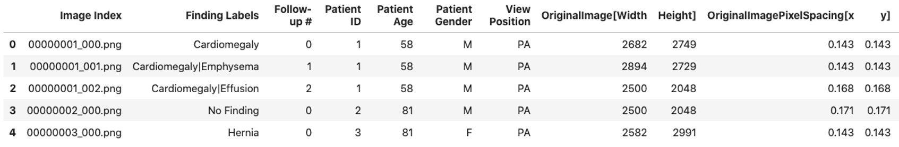
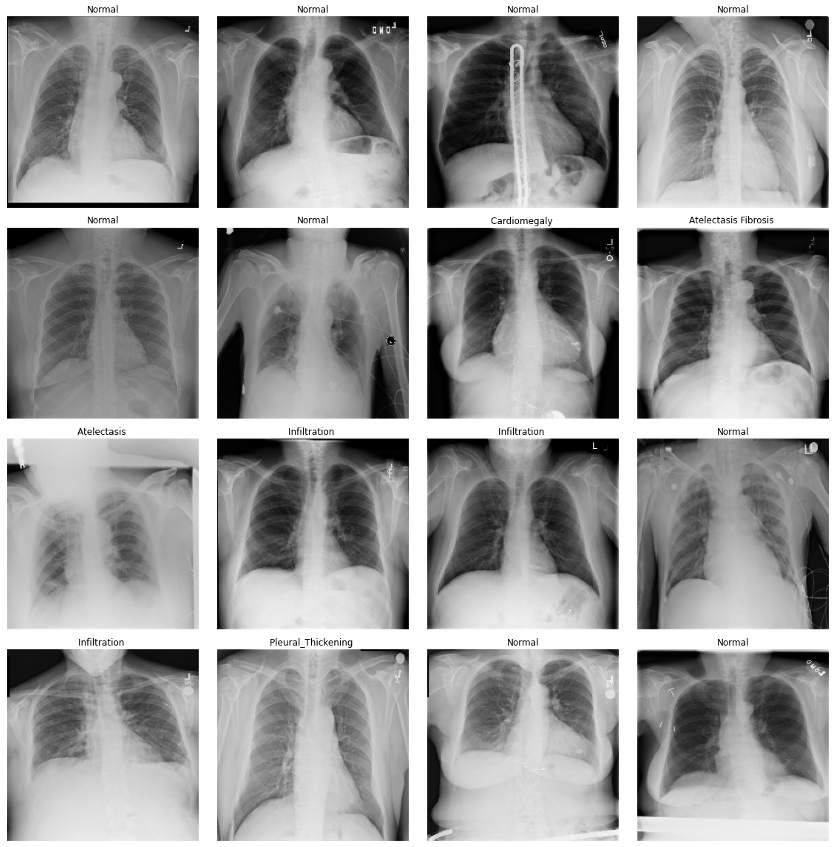

[<- PREV](README.md) [ NEXT->](chestxray-part1.md)

# Introduction: NIH Chest X-ray Dataset of 14 Common Thorax Disease Categories

You may directly download from the NIH website or use the Kaggle website.
- [Direct download NIH Chest X-ray Dataset](https://nihcc.app.box.com/v/ChestXray-NIHCC)
- [Kaggle NIH Chest X-ray Dataset](https://www.kaggle.com/nih-chest-xrays/data)

Additionally, I removed some of the images that were inverted, rotated or not-frontal view of the chest according to the dataframe found [here](https://www.kaggle.com/redwankarimsony/chestxray8-dataframe). 

## Chest X-ray14 dataframe

- Image Index: 112,120 entries

- Finding Labels: 'No Finding’ + 14 thorax disease labels 

  index | Labels   
  -----:|:----:
  1     | Cardiomegaly       
  2     | Emphysema          
  3     | Effusion           
  4     | Hernia             
  5     | Infiltration       
  6     | Mass                
  7     | Nodule              
  8     | Atelectasis        
  9     | Pneumothorax        
  10    | Pleural Thickening 
  11    | Pneumonia          
  12    | Fibrosis           
  13    | Edema              
  14    | Consolidation      

- Meta data: Follow-up #, Patient Age, Patient Gender, View Position, Original Image size (Width, Height), Original Image Pixel Spacing (x, y) 

## Chest X-ray14 sample images

[<- PREV](README.md) [ NEXT->](chestxray-part1.md)
