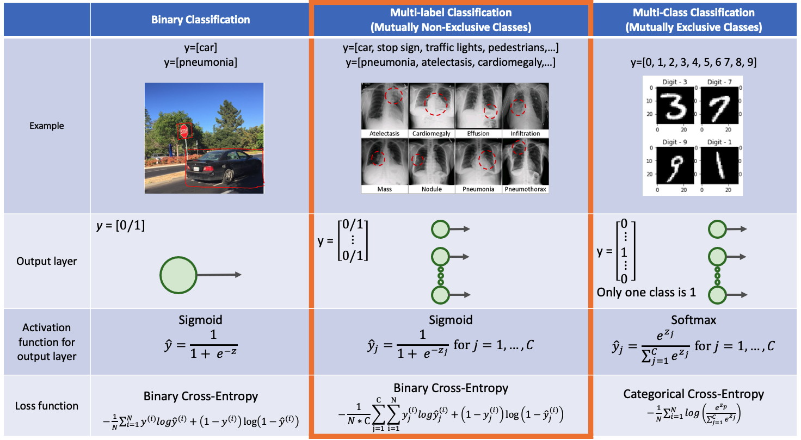
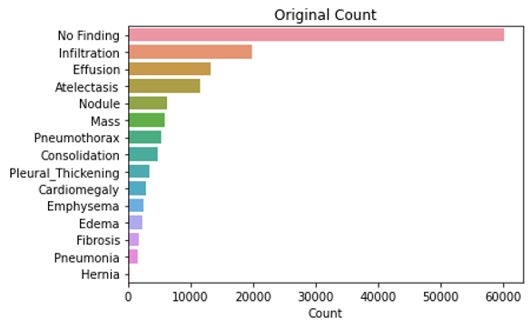

[<- PREV](README.md) [ NEXT ->](chestxray-part2.md)

# 4 key challenges
1. Multi-label classification
2. Class imbalance
3. Data leakage
4. Computation ability for big data (>100K)

## 1. Multi-label classification
- Differences between **Binary classification**, **Multi-class classification** and **Multi-label classification**

  

- Set up for multi-label classification
  * Assign label_train, label_valid, and label_test with 14 labels
    
  * Activation function for output layer: Sigmoid
  * Loss function: Binary cross-entropy or Weighted binary cross-entropy multi-label loss
  * Metrics tips for Tensorflow
    * Use BinaryAccuracy() instead of Accuracy()
    * AUC(multi-label=True)  

## 2. Class imbalance

### 2.1 Resample
- Undersample: low frequency labels 
- Oversample: high frequency labels
- Exclude extremely imbalanced label

### 2.2 Weighted loss: Weighted binary cross-entropy
- postive weight for label j

    
- negative wieght for label j:  $ w_{nj} = \frac{2 * The-total-number-of-train-set}{The-number-of-negatives-in-calss-j} $

    
- Weighted binary cross-entropy for multi-label loss

    

### 2.3 Proper metrics 
- ROC AUC, PR AUC, F1-score 
- Recall, Precision
- Do not use Accuracy

## 3. Data leakage
- Patient overlap between train set and valid/test set can cause data leakage
    * The number of total images: 111,863
    * The number of unique patients: 30,773
    * The average number of images per patient: 3.64
- Split train and test set by **Patient ID**, not by Image ID

## 4. Computation power for big data (>100K)
- Try using a TPU accelerator
    * Cloud TPU is accessible from Google colab and Kaggle 
    * The two major deep learning frameworks, TensorFlow and Pytorch, are supported by Cloud TPU 
 > ***Tensor Processing Unit (TPU)** is an AI accelerator application-specific integrated circuit (ASIC) developed by Google specifically for neural network machine learning, particularly using Google's own TensorFlow software.*
- Training time per epoch

  GPU | TPU
  :-----: | :-----:
  90 minutes | 90 seconds

[<- PREV](README.md) [ NEXT ->](chestxray-part2.md)
