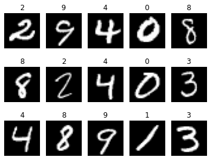
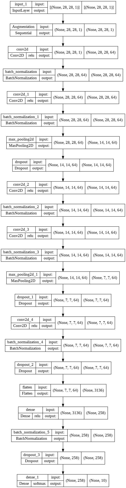
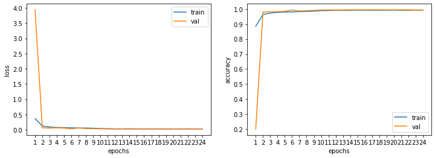
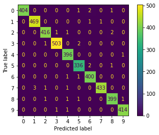
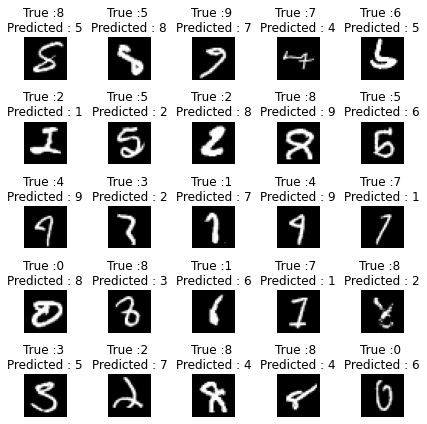
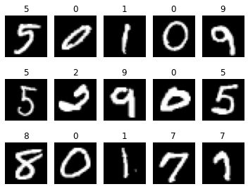

[<-PREV](digitrecognizer.md)

# Computer Vision - Classification with Keras


1. Import libraries, set up directories, and load data
2. Modeling
    - 3.1 Hyperparameters
    - 3.2 Prepare train, valid, and test data
    - 3.3 Build, Compile, and Train a model
    - 3.3 Evaluate the model performance
    - 3.4 Error analylsis
3. Predict

- Reference
    - Data: [Digit Recognizer](https://www.kaggle.com/competitions/digit-recognizer/data)
    - [TensorFlow Core v2.8.0 Keras](https://www.tensorflow.org/api_docs/python/tf/keras)

## 1. Import libraries, set up directories, and load data


```python
import numpy as np
import pandas as pd
import matplotlib.pyplot as plt
import seaborn as sns

import tensorflow as tf
print('TensorFlow version: ', tf.__version__)
```

    TensorFlow version:  2.8.0


```python
input_dir = '/digitrecognizer/'
output_dir = '/digitrecognizer/'
```


```python
train_df = pd.read_csv(input_dir + 'train.csv')
test_df = pd.read_csv(input_dir + 'test.csv')
```

## 2. Modeling

### 2.1 Hyperparameters


```python
seed = 42

n_classes = 10
shape = (28, 28, 1)

epochs = 50
batch_size = 128 

```

### 2.2 Prepare train, valid, and test data


```python
# X_train, y_train, X_valid, y_valid, X_test 

X_train = train_df.drop('label', axis = 1)
y_train = train_df['label']

X_test = test_df
```


```python
X_train = X_train.values.reshape(-1, *shape)/255.0
y_train = tf.keras.utils.to_categorical(y_train, num_classes=n_classes)

X_test = X_test.values.reshape(-1, 28, 28, 1)/255.0
```


```python
from sklearn.model_selection import train_test_split

X_train, X_valid, y_train, y_valid = train_test_split(X_train, y_train, test_size=0.1, random_state=seed)
print(f"X_train: {X_train.shape}, X_valid: {X_valid.shape}, X_test: {X_test.shape}")
```

    X_train: (37800, 28, 28, 1), X_valid: (4200, 28, 28, 1), X_test: (28000, 28, 28, 1)


```python
# visualize 
import random 

nrow, ncol = 3, 5
fig, ax = plt.subplots(nrow, ncol, figsize=(5, 4))
ax = ax.flatten()

index = random.sample(range(len(X_train)), nrow * ncol)

for i, idx in enumerate(index):
    ax[i].imshow(X_train[idx][:,:, 0], cmap='gray')
    ax[i].axis('off')
    ax[i].set_title(np.argmax(y_train[idx]))
plt.tight_layout()
plt.show()
```


    

    


### 2.3 Build, Compile, and Train a model


```python
def build_model():
    """
    [[Conv2D->relu -> BatchNormalization]*2 -> MaxPool2D -> Dropout]*2 -> 
    [Conv2D->relu]*2 -> BatchNormalization -> Dropout -> 
    Flatten -> Dense -> BatchNormalization -> Dropout -> Out
    
    """
    
    augmentation_layer = tf.keras.Sequential([
        tf.keras.layers.experimental.preprocessing.RandomRotation(factor=0.1, seed=seed),
        tf.keras.layers.experimental.preprocessing.RandomTranslation(height_factor=0.1, width_factor=0.1, seed=seed),
        tf.keras.layers.experimental.preprocessing.RandomZoom(height_factor=0.1, width_factor=0.1, seed=seed)
    ], name='Augmentation')
    
    model = tf.keras.Sequential([
        
        tf.keras.layers.Input(shape=shape),
        augmentation_layer,        
        
        tf.keras.layers.Conv2D(filters=64, kernel_size=5, padding='Same', activation='relu', input_shape=shape),
        tf.keras.layers.BatchNormalization(),
        tf.keras.layers.Conv2D(filters=64, kernel_size=5, padding='Same', activation='relu'),
        tf.keras.layers.BatchNormalization(),
        tf.keras.layers.MaxPooling2D(2),
        tf.keras.layers.Dropout(0.25),
        
        tf.keras.layers.Conv2D(filters=64, kernel_size=3, padding='Same', activation='relu'),
        tf.keras.layers.BatchNormalization(),
        tf.keras.layers.Conv2D(filters=64, kernel_size=3, padding='Same', activation='relu'),
        tf.keras.layers.BatchNormalization(),
        tf.keras.layers.MaxPooling2D(pool_size=2, strides=2),
        tf.keras.layers.Dropout(0.25),
        
        tf.keras.layers.Conv2D(filters=64, kernel_size=3, padding='Same', activation='relu'),
        tf.keras.layers.BatchNormalization(),
        tf.keras.layers.Dropout(0.25),
        
        tf.keras.layers.Flatten(),
        tf.keras.layers.Dense(258, activation='relu'),
        tf.keras.layers.BatchNormalization(),
        tf.keras.layers.Dropout(0.25),

        tf.keras.layers.Dense(n_classes, activation='softmax')
    ])
    return model  
    
```


```python
model = build_model()

optimizer = tf.keras.optimizers.RMSprop(learning_rate=1e-03, rho=0.9, epsilon=1e-08, decay=0.0)
loss = tf.keras.losses.CategoricalCrossentropy()
metrics = [tf.keras.metrics.CategoricalAccuracy(name='accuracy')]

model.compile(optimizer=optimizer, loss=loss, metrics=metrics)
```


```python
print(model.summary())

from tensorflow.keras.utils import plot_model
plot_model(model, to_file=output_dir + 'mymodel.png', show_shapes=True, show_layer_names=True, show_layer_activations=True)
```

    Model: "sequential"
    _________________________________________________________________
     Layer (type)                Output Shape              Param #   
    =================================================================
     Augmentation (Sequential)   (None, 28, 28, 1)         0         
                                                                     
     conv2d (Conv2D)             (None, 28, 28, 64)        1664      
                                                                     
     batch_normalization (BatchN  (None, 28, 28, 64)       256       
     ormalization)                                                   
                                                                     
     conv2d_1 (Conv2D)           (None, 28, 28, 64)        102464    
                                                                     
     batch_normalization_1 (Batc  (None, 28, 28, 64)       256       
     hNormalization)                                                 
                                                                     
     max_pooling2d (MaxPooling2D  (None, 14, 14, 64)       0         
     )                                                               
                                                                     
     dropout (Dropout)           (None, 14, 14, 64)        0         
                                                                     
     conv2d_2 (Conv2D)           (None, 14, 14, 64)        36928     
                                                                     
     batch_normalization_2 (Batc  (None, 14, 14, 64)       256       
     hNormalization)                                                 
                                                                     
     conv2d_3 (Conv2D)           (None, 14, 14, 64)        36928     
                                                                     
     batch_normalization_3 (Batc  (None, 14, 14, 64)       256       
     hNormalization)                                                 
                                                                     
     max_pooling2d_1 (MaxPooling  (None, 7, 7, 64)         0         
     2D)                                                             
                                                                     
     dropout_1 (Dropout)         (None, 7, 7, 64)          0         
                                                                     
     conv2d_4 (Conv2D)           (None, 7, 7, 64)          36928     
                                                                     
     batch_normalization_4 (Batc  (None, 7, 7, 64)         256       
     hNormalization)                                                 
                                                                     
     dropout_2 (Dropout)         (None, 7, 7, 64)          0         
                                                                     
     flatten (Flatten)           (None, 3136)              0         
                                                                     
     dense (Dense)               (None, 258)               809346    
                                                                     
     batch_normalization_5 (Batc  (None, 258)              1032      
     hNormalization)                                                 
                                                                     
     dropout_3 (Dropout)         (None, 258)               0         
                                                                     
     dense_1 (Dense)             (None, 10)                2590      
                                                                     
    =================================================================
    Total params: 1,029,160
    Trainable params: 1,028,004
    Non-trainable params: 1,156
    _________________________________________________________________
    None


    

    


```python
FILEPATH = output_dir + "mymodel.h5"
ckp = tf.keras.callbacks.ModelCheckpoint(FILEPATH, monitor='val_loss', verbose=1, save_best_only=True)
rlr = tf.keras.callbacks.ReduceLROnPlateau(monitor='val_loss', factor=0.1, patience=3, verbose=1, min_delta=1e-4, min_lr=1e-8, cooldown=1)
es = tf.keras.callbacks.EarlyStopping(monitor='val_loss', min_delta=1e-4, patience=5, restore_best_weights=True, verbose=1)

history = model.fit(
    x = X_train,
    y = y_train,
    epochs = epochs,
    batch_size = batch_size,
    steps_per_epoch = X_train.shape[0] // batch_size,
    validation_data = (X_valid, y_valid),
    validation_steps = X_valid.shape[0] // batch_size, 
    callbacks = [ckp, rlr, es],
    verbose = 1
)
```

    Epoch 1/50
    295/295 [==============================] - ETA: 0s - loss: 0.3651 - accuracy: 0.8846
    Epoch 1: val_loss improved from inf to 3.93664, saving model to /digitrecognizer/mymodel.h5
    295/295 [==============================] - 22s 59ms/step - loss: 0.3651 - accuracy: 0.8846 - val_loss: 3.9366 - val_accuracy: 0.2014 - lr: 0.0010
    Epoch 2/50
    295/295 [==============================] - ETA: 0s - loss: 0.1233 - accuracy: 0.9627
    Epoch 2: val_loss improved from 3.93664 to 0.06527, saving model to /digitrecognizer/mymodel.h5
    295/295 [==============================] - 19s 62ms/step - loss: 0.1233 - accuracy: 0.9627 - val_loss: 0.0653 - val_accuracy: 0.9800 - lr: 0.0010
    Epoch 3/50
    295/295 [==============================] - ETA: 0s - loss: 0.0915 - accuracy: 0.9720
    Epoch 3: val_loss improved from 0.06527 to 0.05503, saving model to /digitrecognizer/mymodel.h5
    295/295 [==============================] - 19s 63ms/step - loss: 0.0915 - accuracy: 0.9720 - val_loss: 0.0550 - val_accuracy: 0.9810 - lr: 0.0010
    Epoch 4/50
    295/295 [==============================] - ETA: 0s - loss: 0.0749 - accuracy: 0.9767
    Epoch 4: val_loss did not improve from 0.05503
    295/295 [==============================] - 17s 58ms/step - loss: 0.0749 - accuracy: 0.9767 - val_loss: 0.0638 - val_accuracy: 0.9812 - lr: 0.0010
    Epoch 5/50
    295/295 [==============================] - ETA: 0s - loss: 0.0677 - accuracy: 0.9789
    Epoch 5: val_loss improved from 0.05503 to 0.05292, saving model to /digitrecognizer/mymodel.h5
    295/295 [==============================] - 17s 57ms/step - loss: 0.0677 - accuracy: 0.9789 - val_loss: 0.0529 - val_accuracy: 0.9841 - lr: 0.0010
    Epoch 6/50
    294/295 [============================>.] - ETA: 0s - loss: 0.0645 - accuracy: 0.9795
    Epoch 6: val_loss improved from 0.05292 to 0.03036, saving model to /digitrecognizer/mymodel.h5
    295/295 [==============================] - 16s 53ms/step - loss: 0.0643 - accuracy: 0.9795 - val_loss: 0.0304 - val_accuracy: 0.9924 - lr: 0.0010
    Epoch 7/50
    295/295 [==============================] - ETA: 0s - loss: 0.0564 - accuracy: 0.9823
    Epoch 7: val_loss did not improve from 0.03036
    295/295 [==============================] - 15s 52ms/step - loss: 0.0564 - accuracy: 0.9823 - val_loss: 0.0577 - val_accuracy: 0.9858 - lr: 0.0010
    Epoch 8/50
    295/295 [==============================] - ETA: 0s - loss: 0.0557 - accuracy: 0.9836
    Epoch 8: val_loss did not improve from 0.03036
    295/295 [==============================] - 16s 53ms/step - loss: 0.0557 - accuracy: 0.9836 - val_loss: 0.0383 - val_accuracy: 0.9883 - lr: 0.0010
    Epoch 9/50
    295/295 [==============================] - ETA: 0s - loss: 0.0503 - accuracy: 0.9850
    Epoch 9: val_loss did not improve from 0.03036
    
    Epoch 9: ReduceLROnPlateau reducing learning rate to 0.00010000000474974513.
    295/295 [==============================] - 16s 53ms/step - loss: 0.0503 - accuracy: 0.9850 - val_loss: 0.0353 - val_accuracy: 0.9897 - lr: 0.0010
    Epoch 10/50
    295/295 [==============================] - ETA: 0s - loss: 0.0387 - accuracy: 0.9881
    Epoch 10: val_loss improved from 0.03036 to 0.02882, saving model to /digitrecognizer/mymodel.h5
    295/295 [==============================] - 17s 56ms/step - loss: 0.0387 - accuracy: 0.9881 - val_loss: 0.0288 - val_accuracy: 0.9922 - lr: 1.0000e-04
    Epoch 11/50
    294/295 [============================>.] - ETA: 0s - loss: 0.0358 - accuracy: 0.9892
    Epoch 11: val_loss improved from 0.02882 to 0.02643, saving model to /digitrecognizer/mymodel.h5
    295/295 [==============================] - 16s 55ms/step - loss: 0.0359 - accuracy: 0.9891 - val_loss: 0.0264 - val_accuracy: 0.9929 - lr: 1.0000e-04
    Epoch 12/50
    295/295 [==============================] - ETA: 0s - loss: 0.0291 - accuracy: 0.9908
    Epoch 12: val_loss improved from 0.02643 to 0.02459, saving model to /digitrecognizer/mymodel.h5
    295/295 [==============================] - 16s 54ms/step - loss: 0.0291 - accuracy: 0.9908 - val_loss: 0.0246 - val_accuracy: 0.9929 - lr: 1.0000e-04
    Epoch 13/50
    295/295 [==============================] - ETA: 0s - loss: 0.0304 - accuracy: 0.9907
    Epoch 13: val_loss did not improve from 0.02459
    295/295 [==============================] - 15s 52ms/step - loss: 0.0304 - accuracy: 0.9907 - val_loss: 0.0256 - val_accuracy: 0.9929 - lr: 1.0000e-04
    Epoch 14/50
    294/295 [============================>.] - ETA: 0s - loss: 0.0333 - accuracy: 0.9903
    Epoch 14: val_loss did not improve from 0.02459
    295/295 [==============================] - 16s 53ms/step - loss: 0.0332 - accuracy: 0.9903 - val_loss: 0.0247 - val_accuracy: 0.9934 - lr: 1.0000e-04
    Epoch 15/50
    295/295 [==============================] - ETA: 0s - loss: 0.0298 - accuracy: 0.9915
    Epoch 15: val_loss did not improve from 0.02459
    
    Epoch 15: ReduceLROnPlateau reducing learning rate to 1.0000000474974514e-05.
    295/295 [==============================] - 15s 52ms/step - loss: 0.0298 - accuracy: 0.9915 - val_loss: 0.0250 - val_accuracy: 0.9934 - lr: 1.0000e-04
    Epoch 16/50
    295/295 [==============================] - ETA: 0s - loss: 0.0285 - accuracy: 0.9912
    Epoch 16: val_loss improved from 0.02459 to 0.02454, saving model to /digitrecognizer/mymodel.h5
    295/295 [==============================] - 16s 54ms/step - loss: 0.0285 - accuracy: 0.9912 - val_loss: 0.0245 - val_accuracy: 0.9937 - lr: 1.0000e-05
    Epoch 17/50
    295/295 [==============================] - ETA: 0s - loss: 0.0290 - accuracy: 0.9913
    Epoch 17: val_loss improved from 0.02454 to 0.02432, saving model to /digitrecognizer/mymodel.h5
    295/295 [==============================] - 16s 56ms/step - loss: 0.0290 - accuracy: 0.9913 - val_loss: 0.0243 - val_accuracy: 0.9939 - lr: 1.0000e-05
    Epoch 18/50
    295/295 [==============================] - ETA: 0s - loss: 0.0287 - accuracy: 0.9913
    Epoch 18: val_loss improved from 0.02432 to 0.02415, saving model to /digitrecognizer/mymodel.h5
    295/295 [==============================] - 16s 55ms/step - loss: 0.0287 - accuracy: 0.9913 - val_loss: 0.0242 - val_accuracy: 0.9939 - lr: 1.0000e-05
    Epoch 19/50
    295/295 [==============================] - ETA: 0s - loss: 0.0289 - accuracy: 0.9910
    Epoch 19: val_loss improved from 0.02415 to 0.02401, saving model to /digitrecognizer/mymodel.h5
    295/295 [==============================] - 16s 54ms/step - loss: 0.0289 - accuracy: 0.9910 - val_loss: 0.0240 - val_accuracy: 0.9934 - lr: 1.0000e-05
    Epoch 20/50
    295/295 [==============================] - ETA: 0s - loss: 0.0274 - accuracy: 0.9919
    Epoch 20: val_loss did not improve from 0.02401
    295/295 [==============================] - 16s 53ms/step - loss: 0.0274 - accuracy: 0.9919 - val_loss: 0.0241 - val_accuracy: 0.9939 - lr: 1.0000e-05
    Epoch 21/50
    295/295 [==============================] - ETA: 0s - loss: 0.0290 - accuracy: 0.9908
    Epoch 21: val_loss did not improve from 0.02401
    295/295 [==============================] - 16s 54ms/step - loss: 0.0290 - accuracy: 0.9908 - val_loss: 0.0240 - val_accuracy: 0.9934 - lr: 1.0000e-05
    Epoch 22/50
    295/295 [==============================] - ETA: 0s - loss: 0.0296 - accuracy: 0.9909
    Epoch 22: val_loss did not improve from 0.02401
    
    Epoch 22: ReduceLROnPlateau reducing learning rate to 1.0000000656873453e-06.
    295/295 [==============================] - 16s 53ms/step - loss: 0.0296 - accuracy: 0.9909 - val_loss: 0.0242 - val_accuracy: 0.9934 - lr: 1.0000e-05
    Epoch 23/50
    295/295 [==============================] - ETA: 0s - loss: 0.0264 - accuracy: 0.9920
    Epoch 23: val_loss did not improve from 0.02401
    295/295 [==============================] - 16s 53ms/step - loss: 0.0264 - accuracy: 0.9920 - val_loss: 0.0241 - val_accuracy: 0.9932 - lr: 1.0000e-06
    Epoch 24/50
    294/295 [============================>.] - ETA: 0s - loss: 0.0283 - accuracy: 0.9916
    Epoch 24: val_loss did not improve from 0.02401
    Restoring model weights from the end of the best epoch: 19.
    295/295 [==============================] - 16s 54ms/step - loss: 0.0283 - accuracy: 0.9916 - val_loss: 0.0242 - val_accuracy: 0.9932 - lr: 1.0000e-06
    Epoch 24: early stopping


### 2.4 Evaluate the model performance


```python
# Visualize 
fig, ax = plt.subplots(1, 2, figsize=(12, 4))
ax = ax.flatten() #ravel() 
x = np.arange(1, len(history.history['loss'])+1)

loc = ['upper right', 'lower right']
for i, met in enumerate(['loss', 'accuracy']):
    ax[i].plot(x, history.history[met])
    ax[i].plot(x, history.history['val_' + met])
    ax[i].set_xlabel('epochs')
    ax[i].set_xticks(x)
    ax[i].set_ylabel(met)
    ax[i].legend(['train', 'val'], loc=loc[i])
```


    

    


```python
valid_loss, valid_accuracy = model.evaluate(X_valid, y_valid, verbose=1)

y_valid_class = np.argmax(y_valid, axis=-1)

y_valid_prob = model.predict(X_valid) 
y_valid_pred = np.argmax(y_valid_prob, axis=-1)
```

    132/132 [==============================] - 2s 10ms/step - loss: 0.0248 - accuracy: 0.9931


```python
from sklearn.metrics import ConfusionMatrixDisplay, classification_report

ConfusionMatrixDisplay.from_predictions(y_valid_class, y_valid_pred)
print(classification_report(y_valid_class, y_valid_pred))
```

                  precision    recall  f1-score   support
    
               0       1.00      0.99      1.00       408
               1       0.99      1.00      0.99       471
               2       0.99      0.99      0.99       420
               3       1.00      0.99      1.00       506
               4       0.99      1.00      0.99       397
               5       0.99      0.99      0.99       339
               6       0.99      1.00      0.99       402
               7       1.00      0.99      0.99       438
               8       0.99      0.99      0.99       403
               9       1.00      1.00      1.00       416
    
        accuracy                           0.99      4200
       macro avg       0.99      0.99      0.99      4200
    weighted avg       0.99      0.99      0.99      4200
    


    

    


### 2.5 Error analysis


```python
error_index = np.argwhere(y_valid_class != y_valid_pred).flatten()
error_index.shape
```


    (29,)


```python
# visualize error cases

nrows, ncols = 5, 5
fig, ax = plt.subplots(nrows, ncols, figsize=(6, 6))
ax = ax.flatten()

for i, idx in enumerate(error_index[:nrows*ncols]):
    ax[i].imshow(X_valid[idx][:,:, 0], cmap='gray')
    ax[i].axis('off')
    ax[i].set_title(f'True :{y_valid_class[idx]} \nPredicted : {y_valid_pred[idx]}')
plt.tight_layout()
plt.show()
```


    

    


## 3. Prediction


```python
y_test_prob = model.predict(X_test)
y_test_pred = np.argmax(y_test_prob, axis=-1)

y_test_pred[:20]
```


    array([2, 0, 9, 0, 3, 7, 0, 3, 0, 3, 5, 7, 4, 0, 4, 3, 3, 1, 9, 0])


```python
# visualize 
import random 

nrows, ncols = 3, 5
fig, ax = plt.subplots(nrows, ncols, figsize=(5, 4))
ax = ax.flatten()

index = random.sample(range(len(X_test)), nrows * ncols)

for i, idx in enumerate(index):
    ax[i].imshow(X_test[idx][:,:, 0], cmap='gray')
    ax[i].axis('off')
    ax[i].set_title(y_test_pred[idx])
plt.tight_layout()
plt.show()
```


    

    


```python
submission = pd.read_csv(input_dir + 'sample_submission.csv')
submission['Label'] = y_test_pred

filepath = output_dir + 'keras_submission.csv'
submission.to_csv(filepath, index=False)
```

[<-PREV](digitrecognizer.md)
