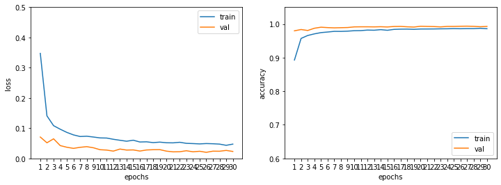

[PREV](digitrecognizer.md)

# Computer Vision - Classification with Pytorch

1. Import libraries, set up devicce and directories, and load data
1. Modeling
    - 2.1 Hyperparameters
    - 2.2 Prepare train, valid, and test data
    - 2.3 Build, Compile, and Train a model
    - 2.3 Evaluate the model performance
    - 2.4 Error analylsis
1. Predict


- Reference
    - Data: [Digit Recognizer](https://www.kaggle.com/competitions/digit-recognizer/data)
    - [PyTorch v1.11.0 ](https://pytorch.org/docs/stable/index.html)
    - [torchvision v0.12](https://pytorch.org/vision/stable/index.html)
    

## 1. Import libraries, set up device and directories, and load data


```python
import numpy as np
import pandas as pd
import matplotlib.pyplot as plt
import seaborn as sns

import torch
print('torch version: ', torch.__version__)
import torchvision
print('torchvision version: ', torchvision.__version__)
```

    torch version:  1.11.0+cu113
    torchvision version:  0.12.0+cu113


```python
def get_device():
    if torch.cuda.is_available():
        device = 'cuda:0'
    else:
        device = 'cpu'
    return device

device = get_device()
print("device:", device)
```

    device: cuda:0


```python
input_dir = '/digitrecognizer/'
output_dir = '/digitrecognizer/'
```


```python
train_df = pd.read_csv(input_dir + 'train.csv')
test_df = pd.read_csv(input_dir + 'test.csv')
```

## 2. Modeling

### 2.1 Hyperparameters


```python
seed = 42

n_classes = 10
shape = (28, 28, 1)

epochs = 30
batch_size = 128 
```

### 2.2 Prepare train, valid, and test data


```python
# X_train, y_train, X_valid, y_valid, X_test 

X_train = train_df.drop('label', axis = 1)
y_train = train_df['label']

X_test = test_df
```


```python
from sklearn.model_selection import train_test_split

X_train, X_valid, y_train, y_valid = train_test_split(X_train, y_train, test_size=0.1, random_state=seed)
print(f"X_train: {X_train.shape}, X_valid: {X_valid.shape}, X_test: {X_test.shape}")
```

    X_train: (37800, 784), X_valid: (4200, 784), X_test: (28000, 784)


```python
from torchvision.transforms.transforms import RandomResizedCrop
from torchvision import transforms
from torch.utils.data import Dataset, DataLoader

transform = {
    'train': transforms.Compose([
        transforms.ToPILImage(), 
        transforms.RandomAffine(degrees=36, translate=(0.1, 0.1)),
        transforms.RandomResizedCrop(shape[0], scale=(0.81, 1), ratio=(0.9, 1.1)),
        transforms.ToTensor(),# [0, 1) & (CxHxW)
        transforms.Normalize((0.5), (0.5)) # [-1,1)
    ]),
    'test': transforms.Compose([
        transforms.ToPILImage(),
        transforms.ToTensor(), 
        transforms.Normalize((0.5), (0.5))                       
    ])
}

class DigitRecognizerDataset(Dataset):
    def __init__(self, X, y=None, transforms=None):
        self.X = X
        self.y = y
        self.transforms = transforms
    
    def __len__(self):
        return len(self.X)
    
    def __getitem__(self, idx):

        data = self.X.iloc[idx,:].values.astype(np.uint8).reshape(28, 28, 1)

        if self.transforms is not None:
            data = self.transforms(data)
        
        if self.y is not None:
            label = self.y.iloc[idx]
            return (data, label)
        else:
            return data
             
trainset = DigitRecognizerDataset(X_train, y_train, transform['train'])
validset = DigitRecognizerDataset(X_valid, y_valid, transform['test'])
testset = DigitRecognizerDataset(X_test, transforms=transform['test'])

trainloader = DataLoader(trainset, batch_size=batch_size, shuffle=True)
validloader = DataLoader(validset, batch_size=batch_size, shuffle=False)
testloader = DataLoader(testset, batch_size=batch_size, shuffle=False)
```


```python
dataiter = iter(trainloader)
images, labels = dataiter.next()
print("type: ", type(images), type(labels))
print("shape: ", images.shape, labels.shape)
```

    type:  <class 'torch.Tensor'> <class 'torch.Tensor'>
    shape:  torch.Size([128, 1, 28, 28]) torch.Size([128])


```python
import random

nrows, ncols = 3, 5
fig, ax = plt.subplots(nrows, ncols, figsize=(5, 4))
ax = ax.flatten()

index = random.sample(range(len(images)), nrows * ncols)

for i, idx in enumerate(index):
    ax[i].imshow(images[idx].numpy().squeeze(), cmap='gray')
    ax[i].axis('off')
    ax[i].set_title(labels[idx].numpy())
plt.tight_layout()
plt.show()
```


    

    


### 2.3 Build, Compile, and Train a model


```python
from torch import nn, optim
import torch.nn.functional as F
import copy
```


```python
class Net(nn.Module):
    """
    [[Conv2D->relu -> BatchNormalization]*2 -> MaxPool2D -> Dropout]*2 -> 
    [Conv2D->relu]*2 -> BatchNormalization -> Dropout -> 
    Flatten -> Dense -> BatchNormalization -> Dropout -> Out
    
    """

    def __init__(self):
        super(Net, self).__init__()
        
        self.conv1 = nn.Sequential(
            nn.Conv2d(in_channels=1, out_channels=64, kernel_size=5, stride=1, padding='same'),
            nn.ReLU(),
            nn.BatchNorm2d(num_features=64),
            nn.Conv2d(in_channels=64, out_channels=64, kernel_size=5, stride=1, padding='same'),
            nn.ReLU(),
            nn.BatchNorm2d(num_features=64),
            nn.MaxPool2d(kernel_size=2),
            nn.Dropout2d(p=0.25)
        )
        self.conv2 = nn.Sequential(
            nn.Conv2d(64, 64, 3, padding='same'),
            nn.ReLU(),
            nn.BatchNorm2d(64),
            nn.Conv2d(64, 64, 3, padding='same'),
            nn.ReLU(),
            nn.BatchNorm2d(64),
            nn.MaxPool2d(2),
            nn.Dropout2d(p=0.25)
        )
        self.conv3 = nn.Sequential(
            nn.Conv2d(64, 64, 3, padding='same'),
            nn.ReLU(),
            nn.BatchNorm2d(64),
            nn.Dropout2d(0.25)
        )        
        self.fc1 = nn.Sequential(
            nn.Linear(in_features=3136, out_features=258),
            nn.ReLU(),
            nn.BatchNorm1d(258),
            nn.Dropout(0.25)
        )
        self.fc2 = nn.Linear(258, n_classes)
        
    def forward(self, x):
        x = self.conv1(x)
        x = self.conv2(x)
        x = self.conv3(x)
        x = x.view(x.size(0), -1)
        x = self.fc1(x)
        x = self.fc2(x)
        return x

net = Net().to(device)
print(net)
```

    Net(
      (conv1): Sequential(
        (0): Conv2d(1, 64, kernel_size=(5, 5), stride=(1, 1), padding=same)
        (1): ReLU()
        (2): BatchNorm2d(64, eps=1e-05, momentum=0.1, affine=True, track_running_stats=True)
        (3): Conv2d(64, 64, kernel_size=(5, 5), stride=(1, 1), padding=same)
        (4): ReLU()
        (5): BatchNorm2d(64, eps=1e-05, momentum=0.1, affine=True, track_running_stats=True)
        (6): MaxPool2d(kernel_size=2, stride=2, padding=0, dilation=1, ceil_mode=False)
        (7): Dropout2d(p=0.25, inplace=False)
      )
      (conv2): Sequential(
        (0): Conv2d(64, 64, kernel_size=(3, 3), stride=(1, 1), padding=same)
        (1): ReLU()
        (2): BatchNorm2d(64, eps=1e-05, momentum=0.1, affine=True, track_running_stats=True)
        (3): Conv2d(64, 64, kernel_size=(3, 3), stride=(1, 1), padding=same)
        (4): ReLU()
        (5): BatchNorm2d(64, eps=1e-05, momentum=0.1, affine=True, track_running_stats=True)
        (6): MaxPool2d(kernel_size=2, stride=2, padding=0, dilation=1, ceil_mode=False)
        (7): Dropout2d(p=0.25, inplace=False)
      )
      (conv3): Sequential(
        (0): Conv2d(64, 64, kernel_size=(3, 3), stride=(1, 1), padding=same)
        (1): ReLU()
        (2): BatchNorm2d(64, eps=1e-05, momentum=0.1, affine=True, track_running_stats=True)
        (3): Dropout2d(p=0.25, inplace=False)
      )
      (fc1): Sequential(
        (0): Linear(in_features=3136, out_features=258, bias=True)
        (1): ReLU()
        (2): BatchNorm1d(258, eps=1e-05, momentum=0.1, affine=True, track_running_stats=True)
        (3): Dropout(p=0.25, inplace=False)
      )
      (fc2): Linear(in_features=258, out_features=10, bias=True)
    )


```python
criterion = nn.CrossEntropyLoss(reduction='sum')
optimizer = optim.RMSprop(net.parameters(), lr=1e-3, alpha=0.9)
```


```python
def save_checkpoint(ckp_filename, net, optimizer):
    state = {'state_dict': net.state_dict(), 'optimizer': optimizer.state_dict()}
    torch.save(state, ckp_filename)
        
def load_checkpoint(ckp_filename, net, optimizer):
    state = torch.load(ckp_filename)
    net.load_state_dict(state['state_dict'])
    optimizer.load_state_dict(state['optimizer'])
```


```python
def train():

    net.train()
    running_loss = 0
    correct = 0

    for data, label in trainloader:
        data, label = data.to(device), label.to(device)

        optimizer.zero_grad()
        output = net(data)
        loss = criterion(output, label)
        _, pred = output.max(1)

        loss.backward()
        optimizer.step()

        running_loss += loss.item()
        correct += torch.sum(pred == label).item()
    
    return running_loss/len(trainloader.dataset), correct/len(trainloader.dataset)

def evaluate():

    net.eval()
    running_loss = 0
    correct = 0

    with torch.no_grad():
        for data, label in validloader:
            data, label = data.to(device), label.to(device)
            output = net(data)
            loss = criterion(output, label)
            _, pred = output.max(1)

            running_loss += loss.item()
            correct += torch.sum(pred == label).item()
    
    return running_loss/len(validloader.dataset), correct/len(validloader.dataset)

```


```python
def net_fit():

    history = {'loss':[], 'accuracy':[], 'val_loss':[], 'val_accuracy':[]}
    
    for epoch in range(epochs):

        best_val_loss = 1
        best_net = copy.deepcopy(net.state_dict())

        loss, accuracy = train()
        val_loss, val_accuracy = evaluate()  

        history['loss'].append(loss)
        history['accuracy'].append(accuracy)
        history['val_loss'].append(val_loss)
        history['val_accuracy'].append(val_accuracy)

        print(f'Epoch {epoch+1} of {epochs} --- loss: {loss:.4f}, accuracy: {accuracy:.4f}, val_loss: {val_loss:.4f}, val_accuracy: {val_accuracy:.4f}')
        
        if best_val_loss > val_loss:
            best_val_loss = val_loss
            best_net = copy.deepcopy(net.state_dict())
        
    net.load_state_dict(best_net)
    save_checkpoint(output_dir + 'mynet.pth', net, optimizer)
    print('Done Training')

    return history

history = net_fit()
```

    Epoch 1 of 30 --- loss: 0.3474, accuracy: 0.8928, val_loss: 0.0708, val_accuracy: 0.9798
    Epoch 2 of 30 --- loss: 0.1408, accuracy: 0.9571, val_loss: 0.0518, val_accuracy: 0.9836
    Epoch 3 of 30 --- loss: 0.1083, accuracy: 0.9658, val_loss: 0.0648, val_accuracy: 0.9807
    Epoch 4 of 30 --- loss: 0.0967, accuracy: 0.9707, val_loss: 0.0425, val_accuracy: 0.9874
    Epoch 5 of 30 --- loss: 0.0861, accuracy: 0.9744, val_loss: 0.0370, val_accuracy: 0.9905
    Epoch 6 of 30 --- loss: 0.0778, accuracy: 0.9762, val_loss: 0.0333, val_accuracy: 0.9893
    Epoch 7 of 30 --- loss: 0.0725, accuracy: 0.9781, val_loss: 0.0368, val_accuracy: 0.9886
    Epoch 8 of 30 --- loss: 0.0734, accuracy: 0.9780, val_loss: 0.0389, val_accuracy: 0.9890
    Epoch 9 of 30 --- loss: 0.0708, accuracy: 0.9787, val_loss: 0.0353, val_accuracy: 0.9895
    Epoch 10 of 30 --- loss: 0.0679, accuracy: 0.9801, val_loss: 0.0289, val_accuracy: 0.9914
    Epoch 11 of 30 --- loss: 0.0674, accuracy: 0.9804, val_loss: 0.0276, val_accuracy: 0.9917
    Epoch 12 of 30 --- loss: 0.0633, accuracy: 0.9819, val_loss: 0.0242, val_accuracy: 0.9917
    Epoch 13 of 30 --- loss: 0.0601, accuracy: 0.9815, val_loss: 0.0310, val_accuracy: 0.9914
    Epoch 14 of 30 --- loss: 0.0569, accuracy: 0.9832, val_loss: 0.0277, val_accuracy: 0.9919
    Epoch 15 of 30 --- loss: 0.0602, accuracy: 0.9813, val_loss: 0.0282, val_accuracy: 0.9912
    Epoch 16 of 30 --- loss: 0.0544, accuracy: 0.9840, val_loss: 0.0244, val_accuracy: 0.9926
    Epoch 17 of 30 --- loss: 0.0549, accuracy: 0.9847, val_loss: 0.0280, val_accuracy: 0.9929
    Epoch 18 of 30 --- loss: 0.0523, accuracy: 0.9849, val_loss: 0.0289, val_accuracy: 0.9917
    Epoch 19 of 30 --- loss: 0.0539, accuracy: 0.9842, val_loss: 0.0291, val_accuracy: 0.9910
    Epoch 20 of 30 --- loss: 0.0518, accuracy: 0.9851, val_loss: 0.0242, val_accuracy: 0.9933
    Epoch 21 of 30 --- loss: 0.0515, accuracy: 0.9852, val_loss: 0.0218, val_accuracy: 0.9929
    Epoch 22 of 30 --- loss: 0.0534, accuracy: 0.9853, val_loss: 0.0221, val_accuracy: 0.9924
    Epoch 23 of 30 --- loss: 0.0499, accuracy: 0.9857, val_loss: 0.0254, val_accuracy: 0.9914
    Epoch 24 of 30 --- loss: 0.0491, accuracy: 0.9858, val_loss: 0.0219, val_accuracy: 0.9929
    Epoch 25 of 30 --- loss: 0.0481, accuracy: 0.9863, val_loss: 0.0237, val_accuracy: 0.9929
    Epoch 26 of 30 --- loss: 0.0492, accuracy: 0.9860, val_loss: 0.0202, val_accuracy: 0.9933
    Epoch 27 of 30 --- loss: 0.0485, accuracy: 0.9863, val_loss: 0.0240, val_accuracy: 0.9936
    Epoch 28 of 30 --- loss: 0.0474, accuracy: 0.9863, val_loss: 0.0238, val_accuracy: 0.9931
    Epoch 29 of 30 --- loss: 0.0434, accuracy: 0.9872, val_loss: 0.0265, val_accuracy: 0.9919
    Epoch 30 of 30 --- loss: 0.0474, accuracy: 0.9860, val_loss: 0.0231, val_accuracy: 0.9929
    Done Training


### 2.4 Evaluate the model performance


```python
# Visualize 
fig, ax = plt.subplots(1, 2, figsize=(12, 4))
ax = ax.flatten() #ravel() 
x = np.arange(1, len(history['loss'])+1)

loc = ['upper right', 'lower right']
for i, met in enumerate(['loss', 'accuracy']):
    ax[i].plot(x, history[met])
    ax[i].plot(x, history['val_' + met])
    ax[i].set_xlabel('epochs')
    ax[i].set_xticks(x)
    ax[i].set_ylabel(met)
    ax[i].legend(['train', 'val'], loc=loc[i])

ax[0].set_ylim(0, 0.5)
ax[1].set_ylim(0.6, 1.05);
```


    

    


```python
def predict(dataloader, hasLabel=False):

    net.eval()
    y_pred = torch.LongTensor()

    with torch.no_grad():
        for data in dataloader:
            if hasLabel:
                data = data[0].to(device)
            else:
                data = data.to(device)
        
            output = net(data)
            _, pred = output.cpu().max(1)

            y_pred = torch.cat((y_pred, pred), dim=0)
    return y_pred
```


```python
valid_loss, valid_accuracy = evaluate()
print(f'loss: {valid_loss:.4f}, accuracy: {valid_accuracy:.4f}')

y_valid_pred = predict(validloader, hasLabel=True).numpy()
y_valid = y_valid.to_numpy()
```

    loss: 0.0231, accuracy: 0.9929


```python
from sklearn.metrics import ConfusionMatrixDisplay, classification_report

ConfusionMatrixDisplay.from_predictions(y_valid, y_valid_pred)
print(classification_report(y_valid, y_valid_pred))
```

                  precision    recall  f1-score   support
    
               0       1.00      1.00      1.00       408
               1       1.00      1.00      1.00       471
               2       1.00      0.99      0.99       420
               3       1.00      1.00      1.00       506
               4       0.99      0.98      0.99       397
               5       0.99      0.99      0.99       339
               6       0.99      1.00      0.99       402
               7       1.00      0.99      0.99       438
               8       0.99      0.99      0.99       403
               9       0.98      1.00      0.99       416
    
        accuracy                           0.99      4200
       macro avg       0.99      0.99      0.99      4200
    weighted avg       0.99      0.99      0.99      4200
    


    

    


### 2.5 Error analysis


```python
error_index = np.argwhere(y_valid!= y_valid_pred).flatten()
error_index.shape
```


    (30,)


```python
# visualize error cases

nrows, ncols = 5, 5
fig, ax = plt.subplots(nrows, ncols, figsize=(6, 6))
ax = ax.flatten()

for i, idx in enumerate(error_index[:nrows*ncols]):
    ax[i].imshow(X_valid.iloc[idx].to_numpy().reshape(28,28), cmap='gray')
    ax[i].axis('off')
    ax[i].set_title(f' True: {y_valid[idx]} \nPred: {y_valid_pred[idx]}')
plt.tight_layout()
plt.show()
```


    

    


## 3. Prediction


```python
y_test_pred = predict(testloader, hasLabel=False)

y_test_pred = y_test_pred.numpy()
y_test_pred[:20]
```


    array([2, 0, 9, 0, 3, 7, 0, 3, 0, 3, 5, 7, 4, 0, 4, 3, 3, 1, 9, 0])


```python
# visualize 
import random 

nrows, ncols = 3, 5
fig, ax = plt.subplots(nrows, ncols, figsize=(5, 4))
ax = ax.flatten()

index = random.sample(range(len(X_test)), nrows * ncols)

for i, idx in enumerate(index):
    ax[i].imshow(X_test.iloc[idx].to_numpy().reshape(28, 28), cmap='gray')
    ax[i].axis('off')
    ax[i].set_title(y_test_pred[idx])
plt.tight_layout()
plt.show()
```


    

    


```python
submission = pd.read_csv(input_dir + 'sample_submission.csv')
submission['Label'] = y_test_pred

filepath = output_dir + 'pytorch_submission.csv'
submission.to_csv(filepath, index=False)
```

[PREV](digitrecognizer.md)
