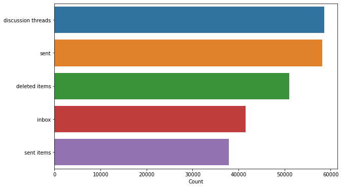

[<-PREV](enronemail.md)

# The Enron Email Part 1. 
1. Import libraries, set up directories, and read data
2. Quick data check
3. Data preparation
    - Feature engineering: Extract, Combine, Transform
    - Data Cleaning: Outliers, Missing Data, Categorical Data
4. Exploratory data analysis
5. Finalize and save the data

# 1. Import libraries, set up directories, and read data


```python
import numpy as np
import pandas as pd
import matplotlib.pyplot as plt
import seaborn as sns

import email 
import re
import string
from nltk.corpus import stopwords
stop = stopwords.words('english')
import wordcloud
```


```python
input_dir = '../input/enron-email-dataset/'
output_dir = ''
```


```python
all_df = pd.read_csv(input_dir + 'emails.csv')
```

# 2. Quick data check


```python
print(all_df.info())
all_df.head()
```

    <class 'pandas.core.frame.DataFrame'>
    RangeIndex: 517401 entries, 0 to 517400
    Data columns (total 2 columns):
     #   Column   Non-Null Count   Dtype 
    ---  ------   --------------   ----- 
     0   file     517401 non-null  object
     1   message  517401 non-null  object
    dtypes: object(2)
    memory usage: 7.9+ MB
    None


<div>
<style scoped>
    .dataframe tbody tr th:only-of-type {
        vertical-align: middle;
    }

    .dataframe tbody tr th {
        vertical-align: top;
    }

    .dataframe thead th {
        text-align: right;
    }
</style>
<table border="1" class="dataframe">
  <thead>
    <tr style="text-align: right;">
      <th></th>
      <th>file</th>
      <th>message</th>
    </tr>
  </thead>
  <tbody>
    <tr>
      <th>0</th>
      <td>allen-p/_sent_mail/1.</td>
      <td>Message-ID: &lt;18782981.1075855378110.JavaMail.e...</td>
    </tr>
    <tr>
      <th>1</th>
      <td>allen-p/_sent_mail/10.</td>
      <td>Message-ID: &lt;15464986.1075855378456.JavaMail.e...</td>
    </tr>
    <tr>
      <th>2</th>
      <td>allen-p/_sent_mail/100.</td>
      <td>Message-ID: &lt;24216240.1075855687451.JavaMail.e...</td>
    </tr>
    <tr>
      <th>3</th>
      <td>allen-p/_sent_mail/1000.</td>
      <td>Message-ID: &lt;13505866.1075863688222.JavaMail.e...</td>
    </tr>
    <tr>
      <th>4</th>
      <td>allen-p/_sent_mail/1001.</td>
      <td>Message-ID: &lt;30922949.1075863688243.JavaMail.e...</td>
    </tr>
  </tbody>
</table>
</div>


```python
print(all_df.iloc[1]['file'])
```

    allen-p/_sent_mail/10.


```python
print(all_df.iloc[1]['message'])
```

    Message-ID: <15464986.1075855378456.JavaMail.evans@thyme>
    Date: Fri, 4 May 2001 13:51:00 -0700 (PDT)
    From: phillip.allen@enron.com
    To: john.lavorato@enron.com
    Subject: Re:
    Mime-Version: 1.0
    Content-Type: text/plain; charset=us-ascii
    Content-Transfer-Encoding: 7bit
    X-From: Phillip K Allen
    X-To: John J Lavorato <John J Lavorato/ENRON@enronXgate@ENRON>
    X-cc: 
    X-bcc: 
    X-Folder: \Phillip_Allen_Jan2002_1\Allen, Phillip K.\'Sent Mail
    X-Origin: Allen-P
    X-FileName: pallen (Non-Privileged).pst
    
    Traveling to have a business meeting takes the fun out of the trip.  Especially if you have to prepare a presentation.  I would suggest holding the business plan meetings here then take a trip without any formal business meetings.  I would even try and get some honest opinions on whether a trip is even desired or necessary.
    
    As far as the business meetings, I think it would be more productive to try and stimulate discussions across the different groups about what is working and what is not.  Too often the presenter speaks and the others are quiet just waiting for their turn.   The meetings might be better if held in a round table discussion format.  
    
    My suggestion for where to go is Austin.  Play golf and rent a ski boat and jet ski's.  Flying somewhere takes too much time.
    


# 3. Data preparation

## 3.1 Feature engineering

### 3.1.1 Extract Folder information


```python
header_cols = ['X-Folder','Subject']
all_df[header_cols + ['Body']] = None
for i in range(all_df.shape[0]):
    e = email.message_from_string(all_df.loc[i]['message'])
    for col in header_cols:
        all_df.loc[i][col] = e.get(col)
    all_df.loc[i]['Body'] = e.get_payload()
```


```python
def preprocess_folder(x):
    if x is None or x == "":
        return np.nan
    return x.split('\\')[-1].lower()

all_df['X-Folder'] = all_df['X-Folder'].apply(preprocess_folder)
```


```python
all_df.head()
```


<div>
<style scoped>
    .dataframe tbody tr th:only-of-type {
        vertical-align: middle;
    }

    .dataframe tbody tr th {
        vertical-align: top;
    }

    .dataframe thead th {
        text-align: right;
    }
</style>
<table border="1" class="dataframe">
  <thead>
    <tr style="text-align: right;">
      <th></th>
      <th>file</th>
      <th>message</th>
      <th>X-Folder</th>
      <th>Subject</th>
      <th>Body</th>
    </tr>
  </thead>
  <tbody>
    <tr>
      <th>0</th>
      <td>allen-p/_sent_mail/1.</td>
      <td>Message-ID: &lt;18782981.1075855378110.JavaMail.e...</td>
      <td>'sent mail</td>
      <td></td>
      <td>Here is our forecast\n\n</td>
    </tr>
    <tr>
      <th>1</th>
      <td>allen-p/_sent_mail/10.</td>
      <td>Message-ID: &lt;15464986.1075855378456.JavaMail.e...</td>
      <td>'sent mail</td>
      <td>Re:</td>
      <td>Traveling to have a business meeting takes the...</td>
    </tr>
    <tr>
      <th>2</th>
      <td>allen-p/_sent_mail/100.</td>
      <td>Message-ID: &lt;24216240.1075855687451.JavaMail.e...</td>
      <td>'sent mail</td>
      <td>Re: test</td>
      <td>test successful.  way to go!!!</td>
    </tr>
    <tr>
      <th>3</th>
      <td>allen-p/_sent_mail/1000.</td>
      <td>Message-ID: &lt;13505866.1075863688222.JavaMail.e...</td>
      <td>'sent mail</td>
      <td></td>
      <td>Randy,\n\n Can you send me a schedule of the s...</td>
    </tr>
    <tr>
      <th>4</th>
      <td>allen-p/_sent_mail/1001.</td>
      <td>Message-ID: &lt;30922949.1075863688243.JavaMail.e...</td>
      <td>'sent mail</td>
      <td>Re: Hello</td>
      <td>Let's shoot for Tuesday at 11:45.</td>
    </tr>
  </tbody>
</table>
</div>


### 3.1.2 Extract selected Folder data to df from all_df


```python
all_df['X-Folder'].value_counts()[:20]
```


    all documents          128103
    discussion threads      58609
    sent                    58168
    deleted items           50987
    inbox                   41507
    sent items              37920
    notes inbox             36665
    'sent mail              30237
    untitled                 8957
    personal                 2642
    attachments              2026
    meetings                 1872
    calendar                 1732
    schedule crawler         1398
    logistics                1192
    tw-commercial group      1159
    california               1052
    bill williams iii        1022
    deal discrepancies        897
    management                802
    Name: X-Folder, dtype: int64


```python
classes = list(all_df['X-Folder'].value_counts()[1:6].index)
print(classes)
```

    ['discussion threads', 'sent', 'deleted items', 'inbox', 'sent items']


```python
df = all_df[all_df['X-Folder'].isin(classes)]
```


```python
df.head()
```


<div>
<style scoped>
    .dataframe tbody tr th:only-of-type {
        vertical-align: middle;
    }

    .dataframe tbody tr th {
        vertical-align: top;
    }

    .dataframe thead th {
        text-align: right;
    }
</style>
<table border="1" class="dataframe">
  <thead>
    <tr style="text-align: right;">
      <th></th>
      <th>file</th>
      <th>message</th>
      <th>X-Folder</th>
      <th>Subject</th>
      <th>Body</th>
    </tr>
  </thead>
  <tbody>
    <tr>
      <th>1232</th>
      <td>allen-p/deleted_items/1.</td>
      <td>Message-ID: &lt;21543395.1075855374340.JavaMail.e...</td>
      <td>deleted items</td>
      <td>Fwd: Bishops Corner</td>
      <td>\n \n&gt;From: "Greg Thorse" \n&gt;To: \n&gt;CC: "Phill...</td>
    </tr>
    <tr>
      <th>1233</th>
      <td>allen-p/deleted_items/10.</td>
      <td>Message-ID: &lt;25363451.1075855374674.JavaMail.e...</td>
      <td>deleted items</td>
      <td>Your Approval is Overdue: Access Request for m...</td>
      <td>This request has been pending your approval fo...</td>
    </tr>
    <tr>
      <th>1234</th>
      <td>allen-p/deleted_items/100.</td>
      <td>Message-ID: &lt;19705494.1075858631723.JavaMail.e...</td>
      <td>deleted items</td>
      <td>NT Earnings Information</td>
      <td>If you cannot read this email, please click he...</td>
    </tr>
    <tr>
      <th>1235</th>
      <td>allen-p/deleted_items/101.</td>
      <td>Message-ID: &lt;7996335.1075858632216.JavaMail.ev...</td>
      <td>deleted items</td>
      <td>50% Hotel Discount Notice #7734228 for PHILLIP</td>
      <td>\n[IMAGE] \t\t[IMAGE] \t\n\t\tDear PHILLIP,   ...</td>
    </tr>
    <tr>
      <th>1236</th>
      <td>allen-p/deleted_items/102.</td>
      <td>Message-ID: &lt;8914065.1075858632242.JavaMail.ev...</td>
      <td>deleted items</td>
      <td>UPDATE - Supported Internet Email Addresses</td>
      <td>\nEarlier this week, Enron Global Technology a...</td>
    </tr>
  </tbody>
</table>
</div>


### 3.1.3 Combine 'Subject' and 'Body' as 'Text'


```python
df['Text'] = df['Subject'] + ' ' + df['Body']
```

    /opt/conda/lib/python3.7/site-packages/ipykernel_launcher.py:1: SettingWithCopyWarning: 
    A value is trying to be set on a copy of a slice from a DataFrame.
    Try using .loc[row_indexer,col_indexer] = value instead
    
    See the caveats in the documentation: https://pandas.pydata.org/pandas-docs/stable/user_guide/indexing.html#returning-a-view-versus-a-copy
      """Entry point for launching an IPython kernel.


```python
print(df.info())
df.head()
```

    <class 'pandas.core.frame.DataFrame'>
    Int64Index: 247191 entries, 1232 to 517400
    Data columns (total 6 columns):
     #   Column    Non-Null Count   Dtype 
    ---  ------    --------------   ----- 
     0   file      247191 non-null  object
     1   message   247191 non-null  object
     2   X-Folder  247191 non-null  object
     3   Subject   247191 non-null  object
     4   Body      247191 non-null  object
     5   Text      247191 non-null  object
    dtypes: object(6)
    memory usage: 13.2+ MB
    None


<div>
<style scoped>
    .dataframe tbody tr th:only-of-type {
        vertical-align: middle;
    }

    .dataframe tbody tr th {
        vertical-align: top;
    }

    .dataframe thead th {
        text-align: right;
    }
</style>
<table border="1" class="dataframe">
  <thead>
    <tr style="text-align: right;">
      <th></th>
      <th>file</th>
      <th>message</th>
      <th>X-Folder</th>
      <th>Subject</th>
      <th>Body</th>
      <th>Text</th>
    </tr>
  </thead>
  <tbody>
    <tr>
      <th>1232</th>
      <td>allen-p/deleted_items/1.</td>
      <td>Message-ID: &lt;21543395.1075855374340.JavaMail.e...</td>
      <td>deleted items</td>
      <td>Fwd: Bishops Corner</td>
      <td>\n \n&gt;From: "Greg Thorse" \n&gt;To: \n&gt;CC: "Phill...</td>
      <td>Fwd: Bishops Corner \n \n&gt;From: "Greg Thorse" ...</td>
    </tr>
    <tr>
      <th>1233</th>
      <td>allen-p/deleted_items/10.</td>
      <td>Message-ID: &lt;25363451.1075855374674.JavaMail.e...</td>
      <td>deleted items</td>
      <td>Your Approval is Overdue: Access Request for m...</td>
      <td>This request has been pending your approval fo...</td>
      <td>Your Approval is Overdue: Access Request for m...</td>
    </tr>
    <tr>
      <th>1234</th>
      <td>allen-p/deleted_items/100.</td>
      <td>Message-ID: &lt;19705494.1075858631723.JavaMail.e...</td>
      <td>deleted items</td>
      <td>NT Earnings Information</td>
      <td>If you cannot read this email, please click he...</td>
      <td>NT Earnings Information If you cannot read thi...</td>
    </tr>
    <tr>
      <th>1235</th>
      <td>allen-p/deleted_items/101.</td>
      <td>Message-ID: &lt;7996335.1075858632216.JavaMail.ev...</td>
      <td>deleted items</td>
      <td>50% Hotel Discount Notice #7734228 for PHILLIP</td>
      <td>\n[IMAGE] \t\t[IMAGE] \t\n\t\tDear PHILLIP,   ...</td>
      <td>50% Hotel Discount Notice #7734228 for PHILLIP...</td>
    </tr>
    <tr>
      <th>1236</th>
      <td>allen-p/deleted_items/102.</td>
      <td>Message-ID: &lt;8914065.1075858632242.JavaMail.ev...</td>
      <td>deleted items</td>
      <td>UPDATE - Supported Internet Email Addresses</td>
      <td>\nEarlier this week, Enron Global Technology a...</td>
      <td>UPDATE - Supported Internet Email Addresses \n...</td>
    </tr>
  </tbody>
</table>
</div>


## 3.2 Data cleaning
### 3.2.1 Text data cleaning


```python
def preprocess(x):
    # lower case
    x = x.lower()
    # remove new lines
    x = re.sub(r'\n+', ' ', x)
    # remove punctuations
    x = re.sub('[' + string.punctuation + ']', ' ', x)
    # remove white spaces
    x = re.sub(r'\s+', ' ', x)
    # remove stopwords
    x = ' '.join([word for word in x.split() if word not in stop])
    return x

df['Text'] = df['Text'].apply(preprocess)
```

    /opt/conda/lib/python3.7/site-packages/ipykernel_launcher.py:14: SettingWithCopyWarning: 
    A value is trying to be set on a copy of a slice from a DataFrame.
    Try using .loc[row_indexer,col_indexer] = value instead
    
    See the caveats in the documentation: https://pandas.pydata.org/pandas-docs/stable/user_guide/indexing.html#returning-a-view-versus-a-copy
      


### 3.2.2 Categorical data


```python
folder_dummies = pd.get_dummies(df['X-Folder'])
df = pd.concat([df, folder_dummies], axis = 1)
```


```python
df.head()
```


<div>
<style scoped>
    .dataframe tbody tr th:only-of-type {
        vertical-align: middle;
    }

    .dataframe tbody tr th {
        vertical-align: top;
    }

    .dataframe thead th {
        text-align: right;
    }
</style>
<table border="1" class="dataframe">
  <thead>
    <tr style="text-align: right;">
      <th></th>
      <th>file</th>
      <th>message</th>
      <th>X-Folder</th>
      <th>Subject</th>
      <th>Body</th>
      <th>Text</th>
      <th>deleted items</th>
      <th>discussion threads</th>
      <th>inbox</th>
      <th>sent</th>
      <th>sent items</th>
    </tr>
  </thead>
  <tbody>
    <tr>
      <th>1232</th>
      <td>allen-p/deleted_items/1.</td>
      <td>Message-ID: &lt;21543395.1075855374340.JavaMail.e...</td>
      <td>deleted items</td>
      <td>Fwd: Bishops Corner</td>
      <td>\n \n&gt;From: "Greg Thorse" \n&gt;To: \n&gt;CC: "Phill...</td>
      <td>fwd bishops corner greg thorse cc phillip alle...</td>
      <td>1</td>
      <td>0</td>
      <td>0</td>
      <td>0</td>
      <td>0</td>
    </tr>
    <tr>
      <th>1233</th>
      <td>allen-p/deleted_items/10.</td>
      <td>Message-ID: &lt;25363451.1075855374674.JavaMail.e...</td>
      <td>deleted items</td>
      <td>Your Approval is Overdue: Access Request for m...</td>
      <td>This request has been pending your approval fo...</td>
      <td>approval overdue access request matt smith enr...</td>
      <td>1</td>
      <td>0</td>
      <td>0</td>
      <td>0</td>
      <td>0</td>
    </tr>
    <tr>
      <th>1234</th>
      <td>allen-p/deleted_items/100.</td>
      <td>Message-ID: &lt;19705494.1075858631723.JavaMail.e...</td>
      <td>deleted items</td>
      <td>NT Earnings Information</td>
      <td>If you cannot read this email, please click he...</td>
      <td>nt earnings information cannot read email plea...</td>
      <td>1</td>
      <td>0</td>
      <td>0</td>
      <td>0</td>
      <td>0</td>
    </tr>
    <tr>
      <th>1235</th>
      <td>allen-p/deleted_items/101.</td>
      <td>Message-ID: &lt;7996335.1075858632216.JavaMail.ev...</td>
      <td>deleted items</td>
      <td>50% Hotel Discount Notice #7734228 for PHILLIP</td>
      <td>\n[IMAGE] \t\t[IMAGE] \t\n\t\tDear PHILLIP,   ...</td>
      <td>50 hotel discount notice 7734228 phillip image...</td>
      <td>1</td>
      <td>0</td>
      <td>0</td>
      <td>0</td>
      <td>0</td>
    </tr>
    <tr>
      <th>1236</th>
      <td>allen-p/deleted_items/102.</td>
      <td>Message-ID: &lt;8914065.1075858632242.JavaMail.ev...</td>
      <td>deleted items</td>
      <td>UPDATE - Supported Internet Email Addresses</td>
      <td>\nEarlier this week, Enron Global Technology a...</td>
      <td>update supported internet email addresses earl...</td>
      <td>1</td>
      <td>0</td>
      <td>0</td>
      <td>0</td>
      <td>0</td>
    </tr>
  </tbody>
</table>
</div>


# 4. Exploratory Data Analysis


```python
count = df[classes].sum()
fig = plt.figure(figsize=(10, 6))
sns.barplot(x=count, y=count.index)
plt.xlabel('Count');
```


    

    


```python
contents = ' '.join(df.sample(2000)['Text'])
fig, ax = plt.subplots(figsize=(10, 14))
wc = wordcloud.WordCloud(width=800, height=600, max_words=200).generate(contents)
ax.axis('off')
ax.imshow(wc);
```


    

    


# 5. Finalize and save the data


```python
df = df.drop(columns = ['file','message','Subject','Body', 'X-Folder'], axis = 1)
```


```python
df.head()
```


<div>
<style scoped>
    .dataframe tbody tr th:only-of-type {
        vertical-align: middle;
    }

    .dataframe tbody tr th {
        vertical-align: top;
    }

    .dataframe thead th {
        text-align: right;
    }
</style>
<table border="1" class="dataframe">
  <thead>
    <tr style="text-align: right;">
      <th></th>
      <th>Text</th>
      <th>deleted items</th>
      <th>discussion threads</th>
      <th>inbox</th>
      <th>sent</th>
      <th>sent items</th>
    </tr>
  </thead>
  <tbody>
    <tr>
      <th>1232</th>
      <td>fwd bishops corner greg thorse cc phillip alle...</td>
      <td>1</td>
      <td>0</td>
      <td>0</td>
      <td>0</td>
      <td>0</td>
    </tr>
    <tr>
      <th>1233</th>
      <td>approval overdue access request matt smith enr...</td>
      <td>1</td>
      <td>0</td>
      <td>0</td>
      <td>0</td>
      <td>0</td>
    </tr>
    <tr>
      <th>1234</th>
      <td>nt earnings information cannot read email plea...</td>
      <td>1</td>
      <td>0</td>
      <td>0</td>
      <td>0</td>
      <td>0</td>
    </tr>
    <tr>
      <th>1235</th>
      <td>50 hotel discount notice 7734228 phillip image...</td>
      <td>1</td>
      <td>0</td>
      <td>0</td>
      <td>0</td>
      <td>0</td>
    </tr>
    <tr>
      <th>1236</th>
      <td>update supported internet email addresses earl...</td>
      <td>1</td>
      <td>0</td>
      <td>0</td>
      <td>0</td>
      <td>0</td>
    </tr>
  </tbody>
</table>
</div>


```python
df.to_csv(output_dir + 'preprocessed.csv', index=False)
```
[<-PREV](enronemail.md)
