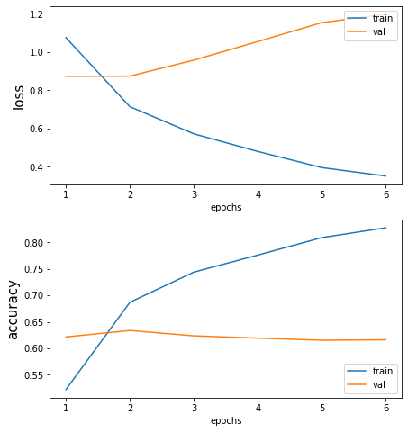
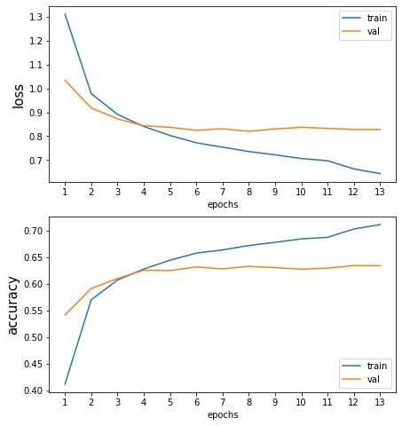
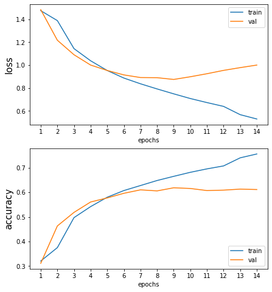
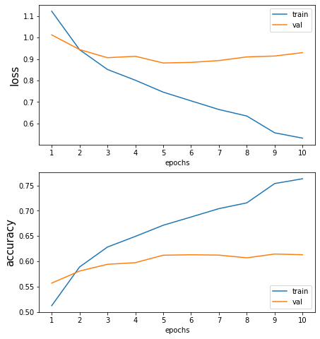

[<-PREV](enronemail.md)

# The Enron Email 
# Part 2. NLP - Deep Learning

1. Set up
2. Train Test split
3. Prepare embedding 
4. Build a model
5. Fit/Train the model
6. Predict on Test Set 
7. Evaluate the model


# 1. Set up

## 1.1 Import libraries


```python
import numpy as np
import pandas as pd
import matplotlib.pyplot as plt
import seaborn as sns

import tensorflow as tf
print('Tensorflow version: ', tf.__version__)
from tensorflow import keras
```

    Tensorflow version:  2.4.1


## 1.2 TPU configuration


```python
# Accelerator

def setup_accelerator():
    try:
        tpu = tf.distribute.cluster_resolver.TPUClusterResolver()
        tf.config.experimental_connect_to_cluster(tpu)
        tf.tpu.experimental.initialize_tpu_system(tpu)
        strategy = tf.distribute.experimental.TPUStrategy(tpu)
        print('Running on TPU: ', tpu.master())
    except ValueError:
        strategy = tf.distribute.get_strategy() # for CPU or GPU
    print('Number of replicas:', strategy.num_replicas_in_sync)
    return strategy

strategy = setup_accelerator()
```

    Running on TPU:  grpc://10.0.0.2:8470
    Number of replicas: 8


## 1.3 Set up directories


```python
input_dir = '../input/enronemail-part1-2/'
output_dir = ''
```

## 1.4 Load the data


```python
df = pd.read_csv(input_dir + 'preprocessed.csv')
df['Text'] = df['Text'].astype(str)
```


```python
print(df.info())
df.head()
```

    <class 'pandas.core.frame.DataFrame'>
    RangeIndex: 247191 entries, 0 to 247190
    Data columns (total 6 columns):
     #   Column              Non-Null Count   Dtype 
    ---  ------              --------------   ----- 
     0   Text                247191 non-null  object
     1   deleted items       247191 non-null  int64 
     2   discussion threads  247191 non-null  int64 
     3   inbox               247191 non-null  int64 
     4   sent                247191 non-null  int64 
     5   sent items          247191 non-null  int64 
    dtypes: int64(5), object(1)
    memory usage: 11.3+ MB
    None


<div>
<style scoped>
    .dataframe tbody tr th:only-of-type {
        vertical-align: middle;
    }

    .dataframe tbody tr th {
        vertical-align: top;
    }

    .dataframe thead th {
        text-align: right;
    }
</style>
<table border="1" class="dataframe">
  <thead>
    <tr style="text-align: right;">
      <th></th>
      <th>Text</th>
      <th>deleted items</th>
      <th>discussion threads</th>
      <th>inbox</th>
      <th>sent</th>
      <th>sent items</th>
    </tr>
  </thead>
  <tbody>
    <tr>
      <th>0</th>
      <td>fwd bishops corner greg thorse cc phillip alle...</td>
      <td>1</td>
      <td>0</td>
      <td>0</td>
      <td>0</td>
      <td>0</td>
    </tr>
    <tr>
      <th>1</th>
      <td>approval overdue access request matt smith enr...</td>
      <td>1</td>
      <td>0</td>
      <td>0</td>
      <td>0</td>
      <td>0</td>
    </tr>
    <tr>
      <th>2</th>
      <td>nt earnings information cannot read email plea...</td>
      <td>1</td>
      <td>0</td>
      <td>0</td>
      <td>0</td>
      <td>0</td>
    </tr>
    <tr>
      <th>3</th>
      <td>50 hotel discount notice 7734228 phillip image...</td>
      <td>1</td>
      <td>0</td>
      <td>0</td>
      <td>0</td>
      <td>0</td>
    </tr>
    <tr>
      <th>4</th>
      <td>update supported internet email addresses earl...</td>
      <td>1</td>
      <td>0</td>
      <td>0</td>
      <td>0</td>
      <td>0</td>
    </tr>
  </tbody>
</table>
</div>


## 1.4 Set up parameters


```python
classes = df.drop(['Text'], axis=1).columns.to_list()
n_classes = len(classes)

SEED = 42
BATCH_SIZE = 16 * strategy.num_replicas_in_sync
```

# 2. Train Test Split


```python
from sklearn.model_selection import train_test_split

X = df['Text']
y = df.drop(['Text'], axis = 1)

#X_train, X_discard, y_train, y_discard = train_test_split(X, y, test_size=0.5, random_state=SEED)
#X_train, X_test, y_train, y_test = train_test_split(X_train, y_train, test_size=0.1, random_state=SEED)
X_train, X_test, y_train, y_test = train_test_split(X, y, test_size=0.1, random_state=SEED)
n_train = len(X_train)
n_test = len(X_test)
print('The size of train set: ', n_train)
print('The size of test set: ', n_test)
```

    The size of train set:  222471
    The size of test set:  24720


# 3. Preparation embedding

## 3.1 Tokenize


```python
from keras.preprocessing.text import Tokenizer

t = Tokenizer()
t.fit_on_texts(X)
vocab_size = len(t.word_index) + 1
X_train_encoded = t.texts_to_sequences(X_train)
X_test_encoded = t.texts_to_sequences(X_test)
```


```python
print(len(X_train[0]), len(X_train_encoded[0]))
print(X_train[0])
print(X_train_encoded[0])
```

    1047 23
    fwd bishops corner greg thorse cc phillip allen subject bishops corner date sat 29 dec 2001 17 02 59 0600 phillip could please e mail draw file created bishops corner working submitting rather recreate send back fill new draw totals also need vendor payee list created land soft costs need format draw number bank one format would easier get create please take look following summary compare numbers see agree land soft costs initial draw 1 608 683 05 galaxy draw 1 250 000 00 galaxy draw 2 223 259 09 total paid date cash 2 081 942 14 project cost 10 740 980 87 loan amount 8 055 736 65 equity required 2 685 244 22 developer profit 326 202 57 balance funding 2 359 041 65 total paid date 2 081 942 14 balance fund cash 277 099 51 galaxy draw 3 467 566 66 bank one draw 1 190 467 15 final cash funding 277 099 51 think thought fund however see accounted cash portion developer fee paid cis looking right please let know attach files discussed working day monday hope get possible thanks lot greg thorse chat friends online try msn messenger click
    [757, 24343, 817, 599, 464, 24343, 8305, 383, 3218, 4942, 3182, 757, 85, 105, 292, 796, 1626, 335, 166, 44, 171, 205, 128]


## 3.2 Pad


```python
from keras.preprocessing.sequence import pad_sequences

max_length = 150
X_train_padded = pad_sequences(X_train_encoded, maxlen=max_length, padding='post')
X_test_padded = pad_sequences(X_test_encoded, maxlen=max_length, padding='post')
```


```python
print(X_train_padded[0])
```

    [  757 24343   817   599   464 24343  8305   383  3218  4942  3182   757
        85   105   292   796  1626   335   166    44   171   205   128     0
         0     0     0     0     0     0     0     0     0     0     0     0
         0     0     0     0     0     0     0     0     0     0     0     0
         0     0     0     0     0     0     0     0     0     0     0     0
         0     0     0     0     0     0     0     0     0     0     0     0
         0     0     0     0     0     0     0     0     0     0     0     0
         0     0     0     0     0     0     0     0     0     0     0     0
         0     0     0     0     0     0     0     0     0     0     0     0
         0     0     0     0     0     0     0     0     0     0     0     0
         0     0     0     0     0     0     0     0     0     0     0     0
         0     0     0     0     0     0     0     0     0     0     0     0
         0     0     0     0     0     0]


```python
print(X_train_padded[11])
```

    [   77   155 30246   100   683   459  4343     9 28684    75   482  1486
     18819   124   482 10945    77   155 30246   100  3190  2579 14896 10850
      2361  2159     9 28684    75   482  1486 18819   124   482 10945    77
       155 30246   100  3116 10913  2646   286     9 28684    75   482  1486
     18819   124   482 10945    77   155 30246   100  3316    14   611    96
       208   629  3468   124   504     9 28684    75   482  1486 18819  8308
       482 10945    77   155 30246   876   230    47   121     8   408    14
       124   429  8320  2008   163    14   324  4113   916  6088   504   813
        18  1656   990    47  2548    12    34   601   902   380    36  3695
       215 17604   113  1063 15070  3358   401    36  3369  2357   215   533
      1811   876   401   495   687    14  1288   380   533   684 32767  1063
      4444   587  2740   569   506  1744  1569   371 75352 44380 75353 75354
        12    34   380 75355   248  1063]


# Word Embedding 1: Embedding learned from Training data

# 4. Build a model & Compile


```python
from keras.models import Sequential
from keras.layers import SimpleRNN, GRU, LSTM, Bidirectional
from keras.layers import Dense, Flatten
from keras.layers.embeddings import Embedding
```


```python
with strategy.scope():
    
    model = Sequential()
    model.add(Embedding(vocab_size, 300, input_length=max_length))
    model.add(GRU(256, dropout=0.3))
    model.add(Flatten())
    model.add(Dense(n_classes, activation='softmax'))

    model.compile(loss='categorical_crossentropy', optimizer='adam', metrics=['accuracy'])

model.summary()
```

    Model: "sequential"
    _________________________________________________________________
    Layer (type)                 Output Shape              Param #   
    =================================================================
    embedding (Embedding)        (None, 150, 300)          158679300 
    _________________________________________________________________
    gru (GRU)                    (None, 256)               428544    
    _________________________________________________________________
    flatten (Flatten)            (None, 256)               0         
    _________________________________________________________________
    dense (Dense)                (None, 5)                 1285      
    =================================================================
    Total params: 159,109,129
    Trainable params: 159,109,129
    Non-trainable params: 0
    _________________________________________________________________


# 5. Fit/Train the model


```python
FILEPATH = output_dir + "enronemail_gru_training_embedding.h5"
ckp = tf.keras.callbacks.ModelCheckpoint(FILEPATH, monitor = 'val_loss', verbose = 1, save_best_only = True, mode = 'min')
rlr = tf.keras.callbacks.ReduceLROnPlateau(monitor = 'val_loss', factor = 0.1, patience = 3, verbose = 1, min_delta = 1e-4, min_lr = 1e-8, mode = 'min', cooldown=1)
es = tf.keras.callbacks.EarlyStopping(monitor = 'val_loss', min_delta = 1e-4, patience = 5, mode = 'min', restore_best_weights = True, verbose = 1)
```


```python
history = model.fit(X_train_padded, 
                    y_train, 
                    validation_split=0.1, 
                    steps_per_epoch = n_train // BATCH_SIZE,
                    epochs=50, 
                    batch_size = BATCH_SIZE,
                    callbacks = [ckp, rlr, es],
                    verbose=1)
```

    Epoch 1/50


    /opt/conda/lib/python3.7/site-packages/tensorflow/python/framework/indexed_slices.py:430: UserWarning: Converting sparse IndexedSlices to a dense Tensor with 158679300 elements. This may consume a large amount of memory.
      num_elements)


    1738/1738 [==============================] - 114s 61ms/step - loss: 1.2968 - accuracy: 0.4131 - val_loss: 0.8730 - val_accuracy: 0.6215
    
    Epoch 00001: val_loss improved from inf to 0.87301, saving model to enronemail_gru_training_embedding.h5
    Epoch 2/50
    1738/1738 [==============================] - 100s 58ms/step - loss: 0.7480 - accuracy: 0.6740 - val_loss: 0.8741 - val_accuracy: 0.6337
    
    Epoch 00002: val_loss did not improve from 0.87301
    Epoch 3/50
    1738/1738 [==============================] - 101s 58ms/step - loss: 0.5998 - accuracy: 0.7337 - val_loss: 0.9578 - val_accuracy: 0.6236
    
    Epoch 00003: val_loss did not improve from 0.87301
    Epoch 4/50
    1738/1738 [==============================] - 102s 58ms/step - loss: 0.5064 - accuracy: 0.7672 - val_loss: 1.0548 - val_accuracy: 0.6193
    
    Epoch 00004: val_loss did not improve from 0.87301
    
    Epoch 00004: ReduceLROnPlateau reducing learning rate to 0.00010000000474974513.
    Epoch 5/50
    1738/1738 [==============================] - 102s 59ms/step - loss: 0.4218 - accuracy: 0.7969 - val_loss: 1.1538 - val_accuracy: 0.6153
    
    Epoch 00005: val_loss did not improve from 0.87301
    Epoch 6/50
    1738/1738 [==============================] - 101s 58ms/step - loss: 0.3586 - accuracy: 0.8251 - val_loss: 1.1974 - val_accuracy: 0.6161
    
    Epoch 00006: val_loss did not improve from 0.87301
    Restoring model weights from the end of the best epoch.
    Epoch 00006: early stopping


```python
def plot_results(history):
    
    fig, ax = plt.subplots(2, 1, figsize=(7, 8))
    x = np.arange(1, len(history.history['loss'])+1)

    ax[0].plot(x, history.history['loss'])
    ax[0].plot(x, history.history['val_loss'])
    ax[0].set_xlabel('epochs')
    ax[0].set_xticks(x)
    ax[0].set_ylabel('loss', fontsize=15)
    ax[0].legend(['train', 'val'], loc='upper right')

    ax[1].plot(x, history.history['accuracy'])
    ax[1].plot(x, history.history['val_accuracy'])
    ax[1].set_xlabel('epochs')
    ax[1].set_xticks(x)
    ax[1].set_ylabel('accuracy', fontsize=15)
    ax[1].legend(['train', 'val'], loc='lower right');
    
```


```python
plot_results(history)
```


    

    


# 6. Evaluation


```python
test_acc = model.evaluate(X_test_padded, y_test)
```

    773/773 [==============================] - 14s 16ms/step - loss: 0.8708 - accuracy: 0.6218


# Word embedding 2: Glove


```python
embeddings_index = {}
f = open('/kaggle/input/gloveicg/Glove/glove.6B.300d.txt','r',encoding='utf-8')
for line in f:
    values = line.split(' ')
    word = values[0]
    coefs = np.asarray(values[1:], dtype='float32')
    embeddings_index[word] = coefs
f.close()

print('Loaded %s word vectors.' % len(embeddings_index))
```

    Loaded 400000 word vectors.


```python
embedding_matrix = np.zeros((vocab_size, 300))
for word, i in t.word_index.items():
    embedding_vector = embeddings_index.get(word)
    if embedding_vector is not None:
        embedding_matrix[i] = embedding_vector
```


```python
with strategy.scope():
    
    model2 = Sequential()
    model2.add(Embedding(vocab_size, 300, weights=[embedding_matrix], input_length=max_length, trainable=False))
    model2.add(GRU(256, dropout=0.3))
    model2.add(Flatten())
    model2.add(Dense(n_classes, activation='softmax'))

    model2.compile(loss='categorical_crossentropy', optimizer='adam', metrics=['accuracy'])

print(model2.summary())

FILEPATH = output_dir + "enronemail_gru_glove_embedding.h5"
ckp = tf.keras.callbacks.ModelCheckpoint(FILEPATH, monitor = 'val_loss', verbose = 1, save_best_only = True, mode = 'min')
rlr = tf.keras.callbacks.ReduceLROnPlateau(monitor = 'val_loss', factor = 0.1, patience = 3, verbose = 1, min_delta = 1e-4, min_lr = 1e-8, mode = 'min', cooldown=1)
es = tf.keras.callbacks.EarlyStopping(monitor = 'val_loss', min_delta = 1e-4, patience = 5, mode = 'min', restore_best_weights = True, verbose = 1)

history = model2.fit(X_train_padded, 
                     y_train, 
                     validation_split=0.1, 
                     steps_per_epoch = n_train // BATCH_SIZE,
                     epochs=50, 
                     batch_size = BATCH_SIZE,
                     callbacks = [ckp, rlr, es],
                     verbose=1)

plot_results(history)
test_acc2 = model2.evaluate(X_test_padded, y_test)
```

    Model: "sequential_1"
    _________________________________________________________________
    Layer (type)                 Output Shape              Param #   
    =================================================================
    embedding_1 (Embedding)      (None, 150, 300)          158679300 
    _________________________________________________________________
    gru_1 (GRU)                  (None, 256)               428544    
    _________________________________________________________________
    flatten_1 (Flatten)          (None, 256)               0         
    _________________________________________________________________
    dense_1 (Dense)              (None, 5)                 1285      
    =================================================================
    Total params: 159,109,129
    Trainable params: 429,829
    Non-trainable params: 158,679,300
    _________________________________________________________________
    None
    Epoch 1/50
    1738/1738 [==============================] - 49s 25ms/step - loss: 1.4711 - accuracy: 0.3289 - val_loss: 1.0338 - val_accuracy: 0.5414
    
    Epoch 00001: val_loss improved from inf to 1.03379, saving model to enronemail_gru_glove_embedding.h5
    Epoch 2/50
    1738/1738 [==============================] - 41s 23ms/step - loss: 1.0099 - accuracy: 0.5568 - val_loss: 0.9179 - val_accuracy: 0.5912
    
    Epoch 00002: val_loss improved from 1.03379 to 0.91792, saving model to enronemail_gru_glove_embedding.h5
    Epoch 3/50
    1738/1738 [==============================] - 41s 23ms/step - loss: 0.9063 - accuracy: 0.6013 - val_loss: 0.8729 - val_accuracy: 0.6099
    
    Epoch 00003: val_loss improved from 0.91792 to 0.87294, saving model to enronemail_gru_glove_embedding.h5
    Epoch 4/50
    1738/1738 [==============================] - 41s 24ms/step - loss: 0.8541 - accuracy: 0.6223 - val_loss: 0.8437 - val_accuracy: 0.6255
    
    Epoch 00004: val_loss improved from 0.87294 to 0.84375, saving model to enronemail_gru_glove_embedding.h5
    Epoch 5/50
    1738/1738 [==============================] - 41s 23ms/step - loss: 0.8134 - accuracy: 0.6394 - val_loss: 0.8372 - val_accuracy: 0.6249
    
    Epoch 00005: val_loss improved from 0.84375 to 0.83722, saving model to enronemail_gru_glove_embedding.h5
    Epoch 6/50
    1738/1738 [==============================] - 40s 23ms/step - loss: 0.7828 - accuracy: 0.6533 - val_loss: 0.8248 - val_accuracy: 0.6316
    
    Epoch 00006: val_loss improved from 0.83722 to 0.82481, saving model to enronemail_gru_glove_embedding.h5
    Epoch 7/50
    1738/1738 [==============================] - 42s 24ms/step - loss: 0.7652 - accuracy: 0.6591 - val_loss: 0.8311 - val_accuracy: 0.6280
    
    Epoch 00007: val_loss did not improve from 0.82481
    Epoch 8/50
    1738/1738 [==============================] - 41s 23ms/step - loss: 0.7414 - accuracy: 0.6698 - val_loss: 0.8206 - val_accuracy: 0.6328
    
    Epoch 00008: val_loss improved from 0.82481 to 0.82061, saving model to enronemail_gru_glove_embedding.h5
    Epoch 9/50
    1738/1738 [==============================] - 40s 23ms/step - loss: 0.7246 - accuracy: 0.6774 - val_loss: 0.8303 - val_accuracy: 0.6305
    
    Epoch 00009: val_loss did not improve from 0.82061
    Epoch 10/50
    1738/1738 [==============================] - 40s 23ms/step - loss: 0.7040 - accuracy: 0.6863 - val_loss: 0.8373 - val_accuracy: 0.6273
    
    Epoch 00010: val_loss did not improve from 0.82061
    Epoch 11/50
    1738/1738 [==============================] - 41s 24ms/step - loss: 0.6940 - accuracy: 0.6899 - val_loss: 0.8329 - val_accuracy: 0.6295
    
    Epoch 00011: val_loss did not improve from 0.82061
    
    Epoch 00011: ReduceLROnPlateau reducing learning rate to 0.00010000000474974513.
    Epoch 12/50
    1738/1738 [==============================] - 41s 23ms/step - loss: 0.6710 - accuracy: 0.6985 - val_loss: 0.8281 - val_accuracy: 0.6342
    
    Epoch 00012: val_loss did not improve from 0.82061
    Epoch 13/50
    1738/1738 [==============================] - 40s 23ms/step - loss: 0.6456 - accuracy: 0.7111 - val_loss: 0.8278 - val_accuracy: 0.6340
    
    Epoch 00013: val_loss did not improve from 0.82061
    Restoring model weights from the end of the best epoch.
    Epoch 00013: early stopping
    773/773 [==============================] - 13s 16ms/step - loss: 0.8235 - accuracy: 0.6350


    

    


# LSTM


```python
with strategy.scope():
    
    model3 = Sequential()
    model3.add(Embedding(vocab_size, 300, weights=[embedding_matrix], input_length=max_length, trainable=False))
    model3.add(LSTM(200))
    model3.add(Flatten())
    model3.add(Dense(n_classes, activation='softmax'))

    model3.compile(loss='categorical_crossentropy', optimizer='adam', metrics=['accuracy'])

print(model3.summary())

FILEPATH = output_dir + "enronemail_lstm_glove_embedding.h5"
ckp = tf.keras.callbacks.ModelCheckpoint(FILEPATH, monitor = 'val_loss', verbose = 1, save_best_only = True, mode = 'min')
rlr = tf.keras.callbacks.ReduceLROnPlateau(monitor = 'val_loss', factor = 0.1, patience = 3, verbose = 1, min_delta = 1e-4, min_lr = 1e-8, mode = 'min', cooldown=1)
es = tf.keras.callbacks.EarlyStopping(monitor = 'val_loss', min_delta = 1e-4, patience = 5, mode = 'min', restore_best_weights = True, verbose = 1)

history = model3.fit(X_train_padded, 
                     y_train, 
                     validation_split=0.1, 
                     steps_per_epoch = n_train // BATCH_SIZE,
                     epochs=50, 
                     batch_size = BATCH_SIZE,
                     callbacks = [ckp, rlr, es],
                     verbose=1)

plot_results(history)

test_acc3 = model3.evaluate(X_test_padded, y_test)
```

    Model: "sequential_2"
    _________________________________________________________________
    Layer (type)                 Output Shape              Param #   
    =================================================================
    embedding_2 (Embedding)      (None, 150, 300)          158679300 
    _________________________________________________________________
    lstm (LSTM)                  (None, 200)               400800    
    _________________________________________________________________
    flatten_2 (Flatten)          (None, 200)               0         
    _________________________________________________________________
    dense_2 (Dense)              (None, 5)                 1005      
    =================================================================
    Total params: 159,081,105
    Trainable params: 401,805
    Non-trainable params: 158,679,300
    _________________________________________________________________
    None
    Epoch 1/50
    1738/1738 [==============================] - 46s 24ms/step - loss: 1.5032 - accuracy: 0.3104 - val_loss: 1.4844 - val_accuracy: 0.3113
    
    Epoch 00001: val_loss improved from inf to 1.48439, saving model to enronemail_lstm_glove_embedding.h5
    Epoch 2/50
    1738/1738 [==============================] - 39s 23ms/step - loss: 1.4633 - accuracy: 0.3307 - val_loss: 1.2175 - val_accuracy: 0.4633
    
    Epoch 00002: val_loss improved from 1.48439 to 1.21747, saving model to enronemail_lstm_glove_embedding.h5
    Epoch 3/50
    1738/1738 [==============================] - 39s 22ms/step - loss: 1.1743 - accuracy: 0.4844 - val_loss: 1.0909 - val_accuracy: 0.5184
    
    Epoch 00003: val_loss improved from 1.21747 to 1.09088, saving model to enronemail_lstm_glove_embedding.h5
    Epoch 4/50
    1738/1738 [==============================] - 39s 22ms/step - loss: 1.0644 - accuracy: 0.5298 - val_loss: 1.0007 - val_accuracy: 0.5607
    
    Epoch 00004: val_loss improved from 1.09088 to 1.00074, saving model to enronemail_lstm_glove_embedding.h5
    Epoch 5/50
    1738/1738 [==============================] - 39s 22ms/step - loss: 0.9740 - accuracy: 0.5720 - val_loss: 0.9534 - val_accuracy: 0.5773
    
    Epoch 00005: val_loss improved from 1.00074 to 0.95344, saving model to enronemail_lstm_glove_embedding.h5
    Epoch 6/50
    1738/1738 [==============================] - 39s 22ms/step - loss: 0.9027 - accuracy: 0.6008 - val_loss: 0.9148 - val_accuracy: 0.5961
    
    Epoch 00006: val_loss improved from 0.95344 to 0.91480, saving model to enronemail_lstm_glove_embedding.h5
    Epoch 7/50
    1738/1738 [==============================] - 40s 23ms/step - loss: 0.8507 - accuracy: 0.6225 - val_loss: 0.8917 - val_accuracy: 0.6102
    
    Epoch 00007: val_loss improved from 0.91480 to 0.89169, saving model to enronemail_lstm_glove_embedding.h5
    Epoch 8/50
    1738/1738 [==============================] - 39s 22ms/step - loss: 0.8014 - accuracy: 0.6446 - val_loss: 0.8903 - val_accuracy: 0.6059
    
    Epoch 00008: val_loss improved from 0.89169 to 0.89033, saving model to enronemail_lstm_glove_embedding.h5
    Epoch 9/50
    1738/1738 [==============================] - 39s 22ms/step - loss: 0.7544 - accuracy: 0.6636 - val_loss: 0.8751 - val_accuracy: 0.6186
    
    Epoch 00009: val_loss improved from 0.89033 to 0.87506, saving model to enronemail_lstm_glove_embedding.h5
    Epoch 10/50
    1738/1738 [==============================] - 39s 23ms/step - loss: 0.7062 - accuracy: 0.6833 - val_loss: 0.8985 - val_accuracy: 0.6157
    
    Epoch 00010: val_loss did not improve from 0.87506
    Epoch 11/50
    1738/1738 [==============================] - 40s 23ms/step - loss: 0.6757 - accuracy: 0.6941 - val_loss: 0.9250 - val_accuracy: 0.6072
    
    Epoch 00011: val_loss did not improve from 0.87506
    Epoch 12/50
    1738/1738 [==============================] - 40s 23ms/step - loss: 0.6485 - accuracy: 0.7047 - val_loss: 0.9542 - val_accuracy: 0.6090
    
    Epoch 00012: val_loss did not improve from 0.87506
    
    Epoch 00012: ReduceLROnPlateau reducing learning rate to 0.00010000000474974513.
    Epoch 13/50
    1738/1738 [==============================] - 39s 23ms/step - loss: 0.5852 - accuracy: 0.7332 - val_loss: 0.9783 - val_accuracy: 0.6131
    
    Epoch 00013: val_loss did not improve from 0.87506
    Epoch 14/50
    1738/1738 [==============================] - 40s 23ms/step - loss: 0.5342 - accuracy: 0.7547 - val_loss: 1.0006 - val_accuracy: 0.6115
    
    Epoch 00014: val_loss did not improve from 0.87506
    Restoring model weights from the end of the best epoch.
    Epoch 00014: early stopping
    773/773 [==============================] - 13s 16ms/step - loss: 0.8726 - accuracy: 0.6194


    

    


## Bidirectional LSTM


```python
with strategy.scope():
    
    model4 = Sequential()
    model4.add(Embedding(vocab_size, 300, weights=[embedding_matrix], input_length=max_length, trainable=False))
    model4.add(Bidirectional(LSTM(100)))
    model4.add(Flatten())
    model4.add(Dense(n_classes, activation='softmax'))

    model4.compile(loss='categorical_crossentropy', optimizer='adam', metrics=['accuracy'])

print(model4.summary())

FILEPATH = output_dir + "enronemail_bidirectionallstm_glove_embedding.h5"
ckp = tf.keras.callbacks.ModelCheckpoint(FILEPATH, monitor = 'val_loss', verbose = 1, save_best_only = True, mode = 'min')
rlr = tf.keras.callbacks.ReduceLROnPlateau(monitor = 'val_loss', factor = 0.1, patience = 3, verbose = 1, min_delta = 1e-4, min_lr = 1e-8, mode = 'min', cooldown=1)
es = tf.keras.callbacks.EarlyStopping(monitor = 'val_loss', min_delta = 1e-4, patience = 5, mode = 'min', restore_best_weights = True, verbose = 1)

history = model4.fit(X_train_padded, 
                     y_train, 
                     validation_split=0.1, 
                     steps_per_epoch = n_train // BATCH_SIZE,
                     epochs=50, 
                     batch_size = BATCH_SIZE,
                     callbacks = [ckp, rlr, es],
                     verbose=1)

plot_results(history)

test_acc4 = model4.evaluate(X_test_padded, y_test)
```

    Model: "sequential_3"
    _________________________________________________________________
    Layer (type)                 Output Shape              Param #   
    =================================================================
    embedding_3 (Embedding)      (None, 150, 300)          158679300 
    _________________________________________________________________
    bidirectional (Bidirectional (None, 200)               320800    
    _________________________________________________________________
    flatten_3 (Flatten)          (None, 200)               0         
    _________________________________________________________________
    dense_3 (Dense)              (None, 5)                 1005      
    =================================================================
    Total params: 159,001,105
    Trainable params: 321,805
    Non-trainable params: 158,679,300
    _________________________________________________________________
    None
    Epoch 1/50
    1738/1738 [==============================] - 53s 27ms/step - loss: 1.2255 - accuracy: 0.4652 - val_loss: 1.0123 - val_accuracy: 0.5570
    
    Epoch 00001: val_loss improved from inf to 1.01232, saving model to enronemail_bidirectionallstm_glove_embedding.h5
    Epoch 2/50
    1738/1738 [==============================] - 43s 25ms/step - loss: 0.9646 - accuracy: 0.5807 - val_loss: 0.9440 - val_accuracy: 0.5808
    
    Epoch 00002: val_loss improved from 1.01232 to 0.94402, saving model to enronemail_bidirectionallstm_glove_embedding.h5
    Epoch 3/50
    1738/1738 [==============================] - 43s 25ms/step - loss: 0.8719 - accuracy: 0.6199 - val_loss: 0.9060 - val_accuracy: 0.5942
    
    Epoch 00003: val_loss improved from 0.94402 to 0.90601, saving model to enronemail_bidirectionallstm_glove_embedding.h5
    Epoch 4/50
    1738/1738 [==============================] - 43s 24ms/step - loss: 0.8115 - accuracy: 0.6444 - val_loss: 0.9128 - val_accuracy: 0.5974
    
    Epoch 00004: val_loss did not improve from 0.90601
    Epoch 5/50
    1738/1738 [==============================] - 44s 26ms/step - loss: 0.7665 - accuracy: 0.6625 - val_loss: 0.8816 - val_accuracy: 0.6121
    
    Epoch 00005: val_loss improved from 0.90601 to 0.88162, saving model to enronemail_bidirectionallstm_glove_embedding.h5
    Epoch 6/50
    1738/1738 [==============================] - 43s 25ms/step - loss: 0.7207 - accuracy: 0.6808 - val_loss: 0.8843 - val_accuracy: 0.6130
    
    Epoch 00006: val_loss did not improve from 0.88162
    Epoch 7/50
    1738/1738 [==============================] - 43s 24ms/step - loss: 0.6751 - accuracy: 0.7005 - val_loss: 0.8928 - val_accuracy: 0.6123
    
    Epoch 00007: val_loss did not improve from 0.88162
    Epoch 8/50
    1738/1738 [==============================] - 43s 25ms/step - loss: 0.6434 - accuracy: 0.7130 - val_loss: 0.9098 - val_accuracy: 0.6069
    
    Epoch 00008: val_loss did not improve from 0.88162
    
    Epoch 00008: ReduceLROnPlateau reducing learning rate to 0.00010000000474974513.
    Epoch 9/50
    1738/1738 [==============================] - 43s 25ms/step - loss: 0.5762 - accuracy: 0.7444 - val_loss: 0.9139 - val_accuracy: 0.6144
    
    Epoch 00009: val_loss did not improve from 0.88162
    Epoch 10/50
    1738/1738 [==============================] - 43s 25ms/step - loss: 0.5304 - accuracy: 0.7650 - val_loss: 0.9297 - val_accuracy: 0.6130
    
    Epoch 00010: val_loss did not improve from 0.88162
    Restoring model weights from the end of the best epoch.
    Epoch 00010: early stopping
    773/773 [==============================] - 14s 17ms/step - loss: 0.8755 - accuracy: 0.6124


    

    

[<-PREV](enronemail.md)
