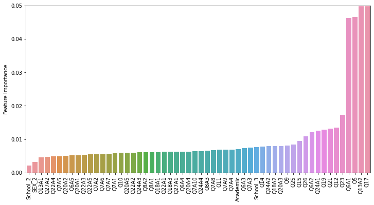
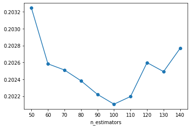

[<-PREV](../project.md)

# Supervised Learning for Regression of Subjective Wellbeing using Tree Based Algorithms
1. Import libraries, set up directories, and read data
2. Quick data check
3. Exploratory data analysis (EDA)
4. Modeling
    - Decision Tree
    - Random Forest
    - AdaBoost
    - GradientBoost
    - XGBoost
5. Compare the results
6. Save and load a model

## 1. Import libraries, set up directories, and read data


```python
import numpy as np
import pandas as pd
import matplotlib.pyplot as plt
import seaborn as sns
```


```python
mypath = '/happiness/'
```


```python
df = pd.read_csv(mypath + 'happiness.csv', na_values=['?'])
```

## 2. Quick data check


```python
print(df.info())
df.head()
```

    <class 'pandas.core.frame.DataFrame'>
    RangeIndex: 8426 entries, 0 to 8425
    Data columns (total 57 columns):
     #   Column      Non-Null Count  Dtype  
    ---  ------      --------------  -----  
     0   SEX         8426 non-null   int64  
     1   Q5          8384 non-null   float64
     2   Q6A1        8422 non-null   float64
     3   Q6A2        8419 non-null   float64
     4   Q6A3        8414 non-null   float64
     5   Q6A4        8413 non-null   float64
     6   Q6A5        8417 non-null   float64
     7   Q7A1        8424 non-null   float64
     8   Q7A2        8420 non-null   float64
     9   Q7A3        8418 non-null   float64
     10  Q7A4        8417 non-null   float64
     11  Q7A5        8421 non-null   float64
     12  Q7A6        8416 non-null   float64
     13  Q7A7        8410 non-null   float64
     14  Q7A8        8410 non-null   float64
     15  Q7A9        8403 non-null   float64
     16  Q7A10       8422 non-null   float64
     17  Q8A1        8423 non-null   float64
     18  Q8A2        8411 non-null   float64
     19  Q8A3        8407 non-null   float64
     20  Q9          8420 non-null   float64
     21  Q10         8421 non-null   float64
     22  Q11         8424 non-null   float64
     23  Q12         8409 non-null   float64
     24  Q13A1       8424 non-null   float64
     25  Q13A2       8394 non-null   float64
     26  Q14         8421 non-null   float64
     27  Q15         8422 non-null   float64
     28  Q17         8407 non-null   float64
     29  Q18A1       8417 non-null   float64
     30  Q18A2       8412 non-null   float64
     31  Q18A3       8411 non-null   float64
     32  Q19         8415 non-null   float64
     33  Q20A1       8424 non-null   float64
     34  Q20A2       8419 non-null   float64
     35  Q20A3       8422 non-null   float64
     36  Q20A4       8424 non-null   float64
     37  Q20A5       8423 non-null   float64
     38  Q21         8404 non-null   float64
     39  Q22A1       8417 non-null   float64
     40  Q22A2       8416 non-null   float64
     41  Q22A3       8409 non-null   float64
     42  Q22A4       8406 non-null   float64
     43  Q22A5       8412 non-null   float64
     44  Q23         8409 non-null   float64
     45  Q24A1       8420 non-null   float64
     46  Q24A2       8411 non-null   float64
     47  Q24A3       8411 non-null   float64
     48  Q24A4       8403 non-null   float64
     49  Q25         8404 non-null   float64
     50  Q26         8416 non-null   float64
     51  Q27A1       8418 non-null   float64
     52  Q27A2       8414 non-null   float64
     53  Academic    8403 non-null   float64
     54  School      8426 non-null   int64  
     55  SubWell     8324 non-null   float64
     56  Eudaimonia  8383 non-null   float64
    dtypes: float64(55), int64(2)
    memory usage: 3.7 MB
    None


  <div id="df-2e546699-1508-4f3a-a030-55c363b1e2f5">
    <div class="colab-df-container">
      <div>
<style scoped>
    .dataframe tbody tr th:only-of-type {
        vertical-align: middle;
    }

    .dataframe tbody tr th {
        vertical-align: top;
    }

    .dataframe thead th {
        text-align: right;
    }
</style>
<table border="1" class="dataframe">
  <thead>
    <tr style="text-align: right;">
      <th></th>
      <th>SEX</th>
      <th>Q5</th>
      <th>Q6A1</th>
      <th>Q6A2</th>
      <th>Q6A3</th>
      <th>Q6A4</th>
      <th>Q6A5</th>
      <th>Q7A1</th>
      <th>Q7A2</th>
      <th>Q7A3</th>
      <th>...</th>
      <th>Q24A3</th>
      <th>Q24A4</th>
      <th>Q25</th>
      <th>Q26</th>
      <th>Q27A1</th>
      <th>Q27A2</th>
      <th>Academic</th>
      <th>School</th>
      <th>SubWell</th>
      <th>Eudaimonia</th>
    </tr>
  </thead>
  <tbody>
    <tr>
      <th>0</th>
      <td>1</td>
      <td>8.0</td>
      <td>5.0</td>
      <td>5.0</td>
      <td>5.0</td>
      <td>4.0</td>
      <td>5.0</td>
      <td>5.0</td>
      <td>5.0</td>
      <td>3.0</td>
      <td>...</td>
      <td>3.0</td>
      <td>3.0</td>
      <td>6.0</td>
      <td>7.0</td>
      <td>4.0</td>
      <td>1.0</td>
      <td>4.0</td>
      <td>3</td>
      <td>3.714286</td>
      <td>4.000000</td>
    </tr>
    <tr>
      <th>1</th>
      <td>2</td>
      <td>8.0</td>
      <td>4.0</td>
      <td>4.0</td>
      <td>4.0</td>
      <td>3.0</td>
      <td>4.0</td>
      <td>5.0</td>
      <td>3.0</td>
      <td>3.0</td>
      <td>...</td>
      <td>2.0</td>
      <td>3.0</td>
      <td>5.0</td>
      <td>4.0</td>
      <td>2.0</td>
      <td>1.0</td>
      <td>3.0</td>
      <td>3</td>
      <td>4.428571</td>
      <td>4.333333</td>
    </tr>
    <tr>
      <th>2</th>
      <td>1</td>
      <td>7.0</td>
      <td>4.0</td>
      <td>4.0</td>
      <td>4.0</td>
      <td>4.0</td>
      <td>3.0</td>
      <td>5.0</td>
      <td>4.0</td>
      <td>5.0</td>
      <td>...</td>
      <td>1.0</td>
      <td>1.0</td>
      <td>8.0</td>
      <td>3.0</td>
      <td>1.0</td>
      <td>1.0</td>
      <td>3.0</td>
      <td>3</td>
      <td>2.571429</td>
      <td>3.500000</td>
    </tr>
    <tr>
      <th>3</th>
      <td>1</td>
      <td>8.0</td>
      <td>2.0</td>
      <td>2.0</td>
      <td>3.0</td>
      <td>4.0</td>
      <td>4.0</td>
      <td>3.0</td>
      <td>4.0</td>
      <td>2.0</td>
      <td>...</td>
      <td>2.0</td>
      <td>1.0</td>
      <td>1.0</td>
      <td>2.0</td>
      <td>1.0</td>
      <td>1.0</td>
      <td>5.0</td>
      <td>3</td>
      <td>2.000000</td>
      <td>2.500000</td>
    </tr>
    <tr>
      <th>4</th>
      <td>1</td>
      <td>5.0</td>
      <td>1.0</td>
      <td>1.0</td>
      <td>3.0</td>
      <td>3.0</td>
      <td>3.0</td>
      <td>1.0</td>
      <td>3.0</td>
      <td>4.0</td>
      <td>...</td>
      <td>1.0</td>
      <td>2.0</td>
      <td>3.0</td>
      <td>4.0</td>
      <td>1.0</td>
      <td>1.0</td>
      <td>3.0</td>
      <td>3</td>
      <td>1.428571</td>
      <td>3.666667</td>
    </tr>
  </tbody>
</table>
<p>5 rows × 57 columns</p>
</div>
      <button class="colab-df-convert" onclick="convertToInteractive('df-2e546699-1508-4f3a-a030-55c363b1e2f5')"
              title="Convert this dataframe to an interactive table."
              style="display:none;">

  <svg xmlns="http://www.w3.org/2000/svg" height="24px"viewBox="0 0 24 24"
       width="24px">
    <path d="M0 0h24v24H0V0z" fill="none"/>
    <path d="M18.56 5.44l.94 2.06.94-2.06 2.06-.94-2.06-.94-.94-2.06-.94 2.06-2.06.94zm-11 1L8.5 8.5l.94-2.06 2.06-.94-2.06-.94L8.5 2.5l-.94 2.06-2.06.94zm10 10l.94 2.06.94-2.06 2.06-.94-2.06-.94-.94-2.06-.94 2.06-2.06.94z"/><path d="M17.41 7.96l-1.37-1.37c-.4-.4-.92-.59-1.43-.59-.52 0-1.04.2-1.43.59L10.3 9.45l-7.72 7.72c-.78.78-.78 2.05 0 2.83L4 21.41c.39.39.9.59 1.41.59.51 0 1.02-.2 1.41-.59l7.78-7.78 2.81-2.81c.8-.78.8-2.07 0-2.86zM5.41 20L4 18.59l7.72-7.72 1.47 1.35L5.41 20z"/>
  </svg>
      </button>

  <style>
    .colab-df-container {
      display:flex;
      flex-wrap:wrap;
      gap: 12px;
    }

    .colab-df-convert {
      background-color: #E8F0FE;
      border: none;
      border-radius: 50%;
      cursor: pointer;
      display: none;
      fill: #1967D2;
      height: 32px;
      padding: 0 0 0 0;
      width: 32px;
    }

    .colab-df-convert:hover {
      background-color: #E2EBFA;
      box-shadow: 0px 1px 2px rgba(60, 64, 67, 0.3), 0px 1px 3px 1px rgba(60, 64, 67, 0.15);
      fill: #174EA6;
    }

    [theme=dark] .colab-df-convert {
      background-color: #3B4455;
      fill: #D2E3FC;
    }

    [theme=dark] .colab-df-convert:hover {
      background-color: #434B5C;
      box-shadow: 0px 1px 3px 1px rgba(0, 0, 0, 0.15);
      filter: drop-shadow(0px 1px 2px rgba(0, 0, 0, 0.3));
      fill: #FFFFFF;
    }
  </style>

      <script>
        const buttonEl =
          document.querySelector('#df-2e546699-1508-4f3a-a030-55c363b1e2f5 button.colab-df-convert');
        buttonEl.style.display =
          google.colab.kernel.accessAllowed ? 'block' : 'none';

        async function convertToInteractive(key) {
          const element = document.querySelector('#df-2e546699-1508-4f3a-a030-55c363b1e2f5');
          const dataTable =
            await google.colab.kernel.invokeFunction('convertToInteractive',
                                                     [key], {});
          if (!dataTable) return;

          const docLinkHtml = 'Like what you see? Visit the ' +
            '<a target="_blank" href=https://colab.research.google.com/notebooks/data_table.ipynb>data table notebook</a>'
            + ' to learn more about interactive tables.';
          element.innerHTML = '';
          dataTable['output_type'] = 'display_data';
          await google.colab.output.renderOutput(dataTable, element);
          const docLink = document.createElement('div');
          docLink.innerHTML = docLinkHtml;
          element.appendChild(docLink);
        }
      </script>
    </div>
  </div>


```python
df.describe()
```


  <div id="df-11d93e83-01ef-4ec2-adab-8834bb30850c">
    <div class="colab-df-container">
      <div>
<style scoped>
    .dataframe tbody tr th:only-of-type {
        vertical-align: middle;
    }

    .dataframe tbody tr th {
        vertical-align: top;
    }

    .dataframe thead th {
        text-align: right;
    }
</style>
<table border="1" class="dataframe">
  <thead>
    <tr style="text-align: right;">
      <th></th>
      <th>SEX</th>
      <th>Q5</th>
      <th>Q6A1</th>
      <th>Q6A2</th>
      <th>Q6A3</th>
      <th>Q6A4</th>
      <th>Q6A5</th>
      <th>Q7A1</th>
      <th>Q7A2</th>
      <th>Q7A3</th>
      <th>...</th>
      <th>Q24A3</th>
      <th>Q24A4</th>
      <th>Q25</th>
      <th>Q26</th>
      <th>Q27A1</th>
      <th>Q27A2</th>
      <th>Academic</th>
      <th>School</th>
      <th>SubWell</th>
      <th>Eudaimonia</th>
    </tr>
  </thead>
  <tbody>
    <tr>
      <th>count</th>
      <td>8426.000000</td>
      <td>8384.000000</td>
      <td>8422.000000</td>
      <td>8419.000000</td>
      <td>8414.000000</td>
      <td>8413.000000</td>
      <td>8417.000000</td>
      <td>8424.000000</td>
      <td>8420.000000</td>
      <td>8418.000000</td>
      <td>...</td>
      <td>8411.000000</td>
      <td>8403.000000</td>
      <td>8404.000000</td>
      <td>8416.000000</td>
      <td>8418.000000</td>
      <td>8414.000000</td>
      <td>8403.000000</td>
      <td>8426.000000</td>
      <td>8324.000000</td>
      <td>8383.000000</td>
    </tr>
    <tr>
      <th>mean</th>
      <td>1.525991</td>
      <td>7.469466</td>
      <td>4.170150</td>
      <td>4.175437</td>
      <td>4.271096</td>
      <td>3.724949</td>
      <td>3.823571</td>
      <td>4.580722</td>
      <td>3.948100</td>
      <td>3.895700</td>
      <td>...</td>
      <td>3.615860</td>
      <td>3.538736</td>
      <td>7.652903</td>
      <td>7.039211</td>
      <td>3.652649</td>
      <td>4.286309</td>
      <td>3.149708</td>
      <td>2.062426</td>
      <td>3.661684</td>
      <td>3.719551</td>
    </tr>
    <tr>
      <th>std</th>
      <td>0.499354</td>
      <td>2.069362</td>
      <td>0.881884</td>
      <td>0.888663</td>
      <td>0.788651</td>
      <td>0.978218</td>
      <td>0.911417</td>
      <td>0.726127</td>
      <td>0.874085</td>
      <td>0.956734</td>
      <td>...</td>
      <td>1.114164</td>
      <td>1.115030</td>
      <td>2.142449</td>
      <td>2.154878</td>
      <td>0.966490</td>
      <td>0.847822</td>
      <td>1.032769</td>
      <td>0.819724</td>
      <td>0.765980</td>
      <td>0.761259</td>
    </tr>
    <tr>
      <th>min</th>
      <td>1.000000</td>
      <td>0.000000</td>
      <td>1.000000</td>
      <td>1.000000</td>
      <td>1.000000</td>
      <td>1.000000</td>
      <td>1.000000</td>
      <td>1.000000</td>
      <td>1.000000</td>
      <td>1.000000</td>
      <td>...</td>
      <td>1.000000</td>
      <td>1.000000</td>
      <td>0.000000</td>
      <td>0.000000</td>
      <td>1.000000</td>
      <td>1.000000</td>
      <td>1.000000</td>
      <td>1.000000</td>
      <td>1.000000</td>
      <td>1.000000</td>
    </tr>
    <tr>
      <th>25%</th>
      <td>1.000000</td>
      <td>6.000000</td>
      <td>4.000000</td>
      <td>4.000000</td>
      <td>4.000000</td>
      <td>3.000000</td>
      <td>3.000000</td>
      <td>4.000000</td>
      <td>3.000000</td>
      <td>3.000000</td>
      <td>...</td>
      <td>3.000000</td>
      <td>3.000000</td>
      <td>6.000000</td>
      <td>5.000000</td>
      <td>3.000000</td>
      <td>4.000000</td>
      <td>3.000000</td>
      <td>1.000000</td>
      <td>3.142857</td>
      <td>3.166667</td>
    </tr>
    <tr>
      <th>50%</th>
      <td>2.000000</td>
      <td>8.000000</td>
      <td>4.000000</td>
      <td>4.000000</td>
      <td>4.000000</td>
      <td>4.000000</td>
      <td>4.000000</td>
      <td>5.000000</td>
      <td>4.000000</td>
      <td>4.000000</td>
      <td>...</td>
      <td>4.000000</td>
      <td>4.000000</td>
      <td>8.000000</td>
      <td>7.000000</td>
      <td>4.000000</td>
      <td>4.000000</td>
      <td>3.000000</td>
      <td>2.000000</td>
      <td>3.714286</td>
      <td>3.666667</td>
    </tr>
    <tr>
      <th>75%</th>
      <td>2.000000</td>
      <td>9.000000</td>
      <td>5.000000</td>
      <td>5.000000</td>
      <td>5.000000</td>
      <td>4.000000</td>
      <td>5.000000</td>
      <td>5.000000</td>
      <td>5.000000</td>
      <td>5.000000</td>
      <td>...</td>
      <td>4.000000</td>
      <td>4.000000</td>
      <td>10.000000</td>
      <td>9.000000</td>
      <td>4.000000</td>
      <td>5.000000</td>
      <td>4.000000</td>
      <td>3.000000</td>
      <td>4.285714</td>
      <td>4.333333</td>
    </tr>
    <tr>
      <th>max</th>
      <td>2.000000</td>
      <td>10.000000</td>
      <td>5.000000</td>
      <td>5.000000</td>
      <td>5.000000</td>
      <td>5.000000</td>
      <td>5.000000</td>
      <td>5.000000</td>
      <td>5.000000</td>
      <td>5.000000</td>
      <td>...</td>
      <td>5.000000</td>
      <td>5.000000</td>
      <td>10.000000</td>
      <td>10.000000</td>
      <td>5.000000</td>
      <td>5.000000</td>
      <td>5.000000</td>
      <td>3.000000</td>
      <td>5.000000</td>
      <td>5.000000</td>
    </tr>
  </tbody>
</table>
<p>8 rows × 57 columns</p>
</div>
      <button class="colab-df-convert" onclick="convertToInteractive('df-11d93e83-01ef-4ec2-adab-8834bb30850c')"
              title="Convert this dataframe to an interactive table."
              style="display:none;">

  <svg xmlns="http://www.w3.org/2000/svg" height="24px"viewBox="0 0 24 24"
       width="24px">
    <path d="M0 0h24v24H0V0z" fill="none"/>
    <path d="M18.56 5.44l.94 2.06.94-2.06 2.06-.94-2.06-.94-.94-2.06-.94 2.06-2.06.94zm-11 1L8.5 8.5l.94-2.06 2.06-.94-2.06-.94L8.5 2.5l-.94 2.06-2.06.94zm10 10l.94 2.06.94-2.06 2.06-.94-2.06-.94-.94-2.06-.94 2.06-2.06.94z"/><path d="M17.41 7.96l-1.37-1.37c-.4-.4-.92-.59-1.43-.59-.52 0-1.04.2-1.43.59L10.3 9.45l-7.72 7.72c-.78.78-.78 2.05 0 2.83L4 21.41c.39.39.9.59 1.41.59.51 0 1.02-.2 1.41-.59l7.78-7.78 2.81-2.81c.8-.78.8-2.07 0-2.86zM5.41 20L4 18.59l7.72-7.72 1.47 1.35L5.41 20z"/>
  </svg>
      </button>

  <style>
    .colab-df-container {
      display:flex;
      flex-wrap:wrap;
      gap: 12px;
    }

    .colab-df-convert {
      background-color: #E8F0FE;
      border: none;
      border-radius: 50%;
      cursor: pointer;
      display: none;
      fill: #1967D2;
      height: 32px;
      padding: 0 0 0 0;
      width: 32px;
    }

    .colab-df-convert:hover {
      background-color: #E2EBFA;
      box-shadow: 0px 1px 2px rgba(60, 64, 67, 0.3), 0px 1px 3px 1px rgba(60, 64, 67, 0.15);
      fill: #174EA6;
    }

    [theme=dark] .colab-df-convert {
      background-color: #3B4455;
      fill: #D2E3FC;
    }

    [theme=dark] .colab-df-convert:hover {
      background-color: #434B5C;
      box-shadow: 0px 1px 3px 1px rgba(0, 0, 0, 0.15);
      filter: drop-shadow(0px 1px 2px rgba(0, 0, 0, 0.3));
      fill: #FFFFFF;
    }
  </style>

      <script>
        const buttonEl =
          document.querySelector('#df-11d93e83-01ef-4ec2-adab-8834bb30850c button.colab-df-convert');
        buttonEl.style.display =
          google.colab.kernel.accessAllowed ? 'block' : 'none';

        async function convertToInteractive(key) {
          const element = document.querySelector('#df-11d93e83-01ef-4ec2-adab-8834bb30850c');
          const dataTable =
            await google.colab.kernel.invokeFunction('convertToInteractive',
                                                     [key], {});
          if (!dataTable) return;

          const docLinkHtml = 'Like what you see? Visit the ' +
            '<a target="_blank" href=https://colab.research.google.com/notebooks/data_table.ipynb>data table notebook</a>'
            + ' to learn more about interactive tables.';
          element.innerHTML = '';
          dataTable['output_type'] = 'display_data';
          await google.colab.output.renderOutput(dataTable, element);
          const docLink = document.createElement('div');
          docLink.innerHTML = docLinkHtml;
          element.appendChild(docLink);
        }
      </script>
    </div>
  </div>


## 3. Exploratory data analysis (EDA)


```python
df.isna().sum()
```


    SEX             0
    Q5             42
    Q6A1            4
    Q6A2            7
    Q6A3           12
    Q6A4           13
    Q6A5            9
    Q7A1            2
    Q7A2            6
    Q7A3            8
    Q7A4            9
    Q7A5            5
    Q7A6           10
    Q7A7           16
    Q7A8           16
    Q7A9           23
    Q7A10           4
    Q8A1            3
    Q8A2           15
    Q8A3           19
    Q9              6
    Q10             5
    Q11             2
    Q12            17
    Q13A1           2
    Q13A2          32
    Q14             5
    Q15             4
    Q17            19
    Q18A1           9
    Q18A2          14
    Q18A3          15
    Q19            11
    Q20A1           2
    Q20A2           7
    Q20A3           4
    Q20A4           2
    Q20A5           3
    Q21            22
    Q22A1           9
    Q22A2          10
    Q22A3          17
    Q22A4          20
    Q22A5          14
    Q23            17
    Q24A1           6
    Q24A2          15
    Q24A3          15
    Q24A4          23
    Q25            22
    Q26            10
    Q27A1           8
    Q27A2          12
    Academic       23
    School          0
    SubWell       102
    Eudaimonia     43
    dtype: int64


```python
df = df.dropna()
df.isna().sum()
```


    SEX           0
    Q5            0
    Q6A1          0
    Q6A2          0
    Q6A3          0
    Q6A4          0
    Q6A5          0
    Q7A1          0
    Q7A2          0
    Q7A3          0
    Q7A4          0
    Q7A5          0
    Q7A6          0
    Q7A7          0
    Q7A8          0
    Q7A9          0
    Q7A10         0
    Q8A1          0
    Q8A2          0
    Q8A3          0
    Q9            0
    Q10           0
    Q11           0
    Q12           0
    Q13A1         0
    Q13A2         0
    Q14           0
    Q15           0
    Q17           0
    Q18A1         0
    Q18A2         0
    Q18A3         0
    Q19           0
    Q20A1         0
    Q20A2         0
    Q20A3         0
    Q20A4         0
    Q20A5         0
    Q21           0
    Q22A1         0
    Q22A2         0
    Q22A3         0
    Q22A4         0
    Q22A5         0
    Q23           0
    Q24A1         0
    Q24A2         0
    Q24A3         0
    Q24A4         0
    Q25           0
    Q26           0
    Q27A1         0
    Q27A2         0
    Academic      0
    School        0
    SubWell       0
    Eudaimonia    0
    dtype: int64


```python
df.describe()
```


  <div id="df-19c5833b-876c-4326-90ff-041f9b995d2c">
    <div class="colab-df-container">
      <div>
<style scoped>
    .dataframe tbody tr th:only-of-type {
        vertical-align: middle;
    }

    .dataframe tbody tr th {
        vertical-align: top;
    }

    .dataframe thead th {
        text-align: right;
    }
</style>
<table border="1" class="dataframe">
  <thead>
    <tr style="text-align: right;">
      <th></th>
      <th>SEX</th>
      <th>Q5</th>
      <th>Q6A1</th>
      <th>Q6A2</th>
      <th>Q6A3</th>
      <th>Q6A4</th>
      <th>Q6A5</th>
      <th>Q7A1</th>
      <th>Q7A2</th>
      <th>Q7A3</th>
      <th>...</th>
      <th>Q24A3</th>
      <th>Q24A4</th>
      <th>Q25</th>
      <th>Q26</th>
      <th>Q27A1</th>
      <th>Q27A2</th>
      <th>Academic</th>
      <th>School</th>
      <th>SubWell</th>
      <th>Eudaimonia</th>
    </tr>
  </thead>
  <tbody>
    <tr>
      <th>count</th>
      <td>7980.000000</td>
      <td>7980.000000</td>
      <td>7980.000000</td>
      <td>7980.000000</td>
      <td>7980.000000</td>
      <td>7980.000000</td>
      <td>7980.000000</td>
      <td>7980.000000</td>
      <td>7980.000000</td>
      <td>7980.000000</td>
      <td>...</td>
      <td>7980.000000</td>
      <td>7980.000000</td>
      <td>7980.000000</td>
      <td>7980.000000</td>
      <td>7980.000000</td>
      <td>7980.000000</td>
      <td>7980.000000</td>
      <td>7980.000000</td>
      <td>7980.000000</td>
      <td>7980.000000</td>
    </tr>
    <tr>
      <th>mean</th>
      <td>1.530451</td>
      <td>7.461779</td>
      <td>4.169925</td>
      <td>4.173684</td>
      <td>4.272306</td>
      <td>3.724812</td>
      <td>3.819674</td>
      <td>4.582080</td>
      <td>3.949123</td>
      <td>3.888722</td>
      <td>...</td>
      <td>3.618922</td>
      <td>3.537970</td>
      <td>7.652506</td>
      <td>7.028195</td>
      <td>3.651253</td>
      <td>4.287970</td>
      <td>3.145363</td>
      <td>2.078070</td>
      <td>3.657984</td>
      <td>3.717982</td>
    </tr>
    <tr>
      <th>std</th>
      <td>0.499103</td>
      <td>2.063090</td>
      <td>0.879903</td>
      <td>0.885844</td>
      <td>0.786469</td>
      <td>0.976711</td>
      <td>0.910420</td>
      <td>0.721992</td>
      <td>0.870291</td>
      <td>0.956058</td>
      <td>...</td>
      <td>1.111648</td>
      <td>1.111499</td>
      <td>2.139905</td>
      <td>2.148243</td>
      <td>0.964883</td>
      <td>0.846707</td>
      <td>1.035973</td>
      <td>0.815654</td>
      <td>0.766299</td>
      <td>0.759199</td>
    </tr>
    <tr>
      <th>min</th>
      <td>1.000000</td>
      <td>0.000000</td>
      <td>1.000000</td>
      <td>1.000000</td>
      <td>1.000000</td>
      <td>1.000000</td>
      <td>1.000000</td>
      <td>1.000000</td>
      <td>1.000000</td>
      <td>1.000000</td>
      <td>...</td>
      <td>1.000000</td>
      <td>1.000000</td>
      <td>0.000000</td>
      <td>0.000000</td>
      <td>1.000000</td>
      <td>1.000000</td>
      <td>1.000000</td>
      <td>1.000000</td>
      <td>1.000000</td>
      <td>1.000000</td>
    </tr>
    <tr>
      <th>25%</th>
      <td>1.000000</td>
      <td>6.000000</td>
      <td>4.000000</td>
      <td>4.000000</td>
      <td>4.000000</td>
      <td>3.000000</td>
      <td>3.000000</td>
      <td>4.000000</td>
      <td>3.000000</td>
      <td>3.000000</td>
      <td>...</td>
      <td>3.000000</td>
      <td>3.000000</td>
      <td>6.000000</td>
      <td>5.000000</td>
      <td>3.000000</td>
      <td>4.000000</td>
      <td>3.000000</td>
      <td>1.000000</td>
      <td>3.142857</td>
      <td>3.166667</td>
    </tr>
    <tr>
      <th>50%</th>
      <td>2.000000</td>
      <td>8.000000</td>
      <td>4.000000</td>
      <td>4.000000</td>
      <td>4.000000</td>
      <td>4.000000</td>
      <td>4.000000</td>
      <td>5.000000</td>
      <td>4.000000</td>
      <td>4.000000</td>
      <td>...</td>
      <td>4.000000</td>
      <td>4.000000</td>
      <td>8.000000</td>
      <td>7.000000</td>
      <td>4.000000</td>
      <td>4.000000</td>
      <td>3.000000</td>
      <td>2.000000</td>
      <td>3.714286</td>
      <td>3.666667</td>
    </tr>
    <tr>
      <th>75%</th>
      <td>2.000000</td>
      <td>9.000000</td>
      <td>5.000000</td>
      <td>5.000000</td>
      <td>5.000000</td>
      <td>4.000000</td>
      <td>5.000000</td>
      <td>5.000000</td>
      <td>5.000000</td>
      <td>5.000000</td>
      <td>...</td>
      <td>4.000000</td>
      <td>4.000000</td>
      <td>10.000000</td>
      <td>9.000000</td>
      <td>4.000000</td>
      <td>5.000000</td>
      <td>4.000000</td>
      <td>3.000000</td>
      <td>4.285714</td>
      <td>4.333333</td>
    </tr>
    <tr>
      <th>max</th>
      <td>2.000000</td>
      <td>10.000000</td>
      <td>5.000000</td>
      <td>5.000000</td>
      <td>5.000000</td>
      <td>5.000000</td>
      <td>5.000000</td>
      <td>5.000000</td>
      <td>5.000000</td>
      <td>5.000000</td>
      <td>...</td>
      <td>5.000000</td>
      <td>5.000000</td>
      <td>10.000000</td>
      <td>10.000000</td>
      <td>5.000000</td>
      <td>5.000000</td>
      <td>5.000000</td>
      <td>3.000000</td>
      <td>5.000000</td>
      <td>5.000000</td>
    </tr>
  </tbody>
</table>
<p>8 rows × 57 columns</p>
</div>
      <button class="colab-df-convert" onclick="convertToInteractive('df-19c5833b-876c-4326-90ff-041f9b995d2c')"
              title="Convert this dataframe to an interactive table."
              style="display:none;">

  <svg xmlns="http://www.w3.org/2000/svg" height="24px"viewBox="0 0 24 24"
       width="24px">
    <path d="M0 0h24v24H0V0z" fill="none"/>
    <path d="M18.56 5.44l.94 2.06.94-2.06 2.06-.94-2.06-.94-.94-2.06-.94 2.06-2.06.94zm-11 1L8.5 8.5l.94-2.06 2.06-.94-2.06-.94L8.5 2.5l-.94 2.06-2.06.94zm10 10l.94 2.06.94-2.06 2.06-.94-2.06-.94-.94-2.06-.94 2.06-2.06.94z"/><path d="M17.41 7.96l-1.37-1.37c-.4-.4-.92-.59-1.43-.59-.52 0-1.04.2-1.43.59L10.3 9.45l-7.72 7.72c-.78.78-.78 2.05 0 2.83L4 21.41c.39.39.9.59 1.41.59.51 0 1.02-.2 1.41-.59l7.78-7.78 2.81-2.81c.8-.78.8-2.07 0-2.86zM5.41 20L4 18.59l7.72-7.72 1.47 1.35L5.41 20z"/>
  </svg>
      </button>

  <style>
    .colab-df-container {
      display:flex;
      flex-wrap:wrap;
      gap: 12px;
    }

    .colab-df-convert {
      background-color: #E8F0FE;
      border: none;
      border-radius: 50%;
      cursor: pointer;
      display: none;
      fill: #1967D2;
      height: 32px;
      padding: 0 0 0 0;
      width: 32px;
    }

    .colab-df-convert:hover {
      background-color: #E2EBFA;
      box-shadow: 0px 1px 2px rgba(60, 64, 67, 0.3), 0px 1px 3px 1px rgba(60, 64, 67, 0.15);
      fill: #174EA6;
    }

    [theme=dark] .colab-df-convert {
      background-color: #3B4455;
      fill: #D2E3FC;
    }

    [theme=dark] .colab-df-convert:hover {
      background-color: #434B5C;
      box-shadow: 0px 1px 3px 1px rgba(0, 0, 0, 0.15);
      filter: drop-shadow(0px 1px 2px rgba(0, 0, 0, 0.3));
      fill: #FFFFFF;
    }
  </style>

      <script>
        const buttonEl =
          document.querySelector('#df-19c5833b-876c-4326-90ff-041f9b995d2c button.colab-df-convert');
        buttonEl.style.display =
          google.colab.kernel.accessAllowed ? 'block' : 'none';

        async function convertToInteractive(key) {
          const element = document.querySelector('#df-19c5833b-876c-4326-90ff-041f9b995d2c');
          const dataTable =
            await google.colab.kernel.invokeFunction('convertToInteractive',
                                                     [key], {});
          if (!dataTable) return;

          const docLinkHtml = 'Like what you see? Visit the ' +
            '<a target="_blank" href=https://colab.research.google.com/notebooks/data_table.ipynb>data table notebook</a>'
            + ' to learn more about interactive tables.';
          element.innerHTML = '';
          dataTable['output_type'] = 'display_data';
          await google.colab.output.renderOutput(dataTable, element);
          const docLink = document.createElement('div');
          docLink.innerHTML = docLinkHtml;
          element.appendChild(docLink);
        }
      </script>
    </div>
  </div>


```python
fig, ax = plt.subplots(nrows=1, ncols=2, figsize=(12, 4))
sns.histplot(data=df, x='SubWell', bins=40, ax=ax[0])
sns.histplot(data=df, x='Eudaimonia', bins=40, ax=ax[1])
ax[0].set_ylim(0, 800);
ax[1].set_ylim(0, 800);
```


    

    


```python
plt.figure(figsize=(6, 6))
sns.scatterplot(data=df, x='SubWell', y='Eudaimonia');
```


    

    


```python
corr = df.corr()
sns.heatmap(corr);
```


    

    


```python
plt.figure(figsize=(15, 1))
sns.heatmap(corr[['SubWell', 'Eudaimonia']].transpose());
```


    

    


```python
plt.figure(figsize=(10, 6))
plt.plot(corr['SubWell'].iloc[:-2], '.-', label='SubWell')
plt.plot(corr['Eudaimonia'].iloc[:-2], '.-', label='Eudaimonia')
plt.legend()
plt.ylabel('Correlation')
plt.xticks(rotation=90);
```


    

    


```python
plt.figure(figsize=(10, 6))
sorted_corr = corr['SubWell'].sort_values()[:-1]
sns.barplot(x=sorted_corr.index, y=sorted_corr)
plt.xticks(rotation=90);
```


    

    


```python
fig, ax = plt.subplots(nrows=1, ncols=3, figsize=(15, 5))
sns.barplot(data=df, x='SEX', y='SubWell', ax=ax[0])
sns.barplot(data=df, x='School', y='SubWell', ax=ax[1])
sns.barplot(data=df, x='Academic', y='SubWell', ax=ax[2]);
```


    

    


```python
sns.catplot(data=df, x='Academic', y='SubWell', col='School', kind='bar');
```


    

    


## 4. Modeling


```python
X = pd.get_dummies(df.drop(['SubWell', 'Eudaimonia'], axis=1), columns=['SEX', 'School'], drop_first=True)
y = df['SubWell']
```


```python
X.head()
```


  <div id="df-f8e6036c-96c6-44a4-8ef5-8f3dadf0eb3b">
    <div class="colab-df-container">
      <div>
<style scoped>
    .dataframe tbody tr th:only-of-type {
        vertical-align: middle;
    }

    .dataframe tbody tr th {
        vertical-align: top;
    }

    .dataframe thead th {
        text-align: right;
    }
</style>
<table border="1" class="dataframe">
  <thead>
    <tr style="text-align: right;">
      <th></th>
      <th>Q5</th>
      <th>Q6A1</th>
      <th>Q6A2</th>
      <th>Q6A3</th>
      <th>Q6A4</th>
      <th>Q6A5</th>
      <th>Q7A1</th>
      <th>Q7A2</th>
      <th>Q7A3</th>
      <th>Q7A4</th>
      <th>...</th>
      <th>Q24A3</th>
      <th>Q24A4</th>
      <th>Q25</th>
      <th>Q26</th>
      <th>Q27A1</th>
      <th>Q27A2</th>
      <th>Academic</th>
      <th>SEX_2</th>
      <th>School_2</th>
      <th>School_3</th>
    </tr>
  </thead>
  <tbody>
    <tr>
      <th>0</th>
      <td>8.0</td>
      <td>5.0</td>
      <td>5.0</td>
      <td>5.0</td>
      <td>4.0</td>
      <td>5.0</td>
      <td>5.0</td>
      <td>5.0</td>
      <td>3.0</td>
      <td>3.0</td>
      <td>...</td>
      <td>3.0</td>
      <td>3.0</td>
      <td>6.0</td>
      <td>7.0</td>
      <td>4.0</td>
      <td>1.0</td>
      <td>4.0</td>
      <td>0</td>
      <td>0</td>
      <td>1</td>
    </tr>
    <tr>
      <th>1</th>
      <td>8.0</td>
      <td>4.0</td>
      <td>4.0</td>
      <td>4.0</td>
      <td>3.0</td>
      <td>4.0</td>
      <td>5.0</td>
      <td>3.0</td>
      <td>3.0</td>
      <td>3.0</td>
      <td>...</td>
      <td>2.0</td>
      <td>3.0</td>
      <td>5.0</td>
      <td>4.0</td>
      <td>2.0</td>
      <td>1.0</td>
      <td>3.0</td>
      <td>1</td>
      <td>0</td>
      <td>1</td>
    </tr>
    <tr>
      <th>2</th>
      <td>7.0</td>
      <td>4.0</td>
      <td>4.0</td>
      <td>4.0</td>
      <td>4.0</td>
      <td>3.0</td>
      <td>5.0</td>
      <td>4.0</td>
      <td>5.0</td>
      <td>3.0</td>
      <td>...</td>
      <td>1.0</td>
      <td>1.0</td>
      <td>8.0</td>
      <td>3.0</td>
      <td>1.0</td>
      <td>1.0</td>
      <td>3.0</td>
      <td>0</td>
      <td>0</td>
      <td>1</td>
    </tr>
    <tr>
      <th>3</th>
      <td>8.0</td>
      <td>2.0</td>
      <td>2.0</td>
      <td>3.0</td>
      <td>4.0</td>
      <td>4.0</td>
      <td>3.0</td>
      <td>4.0</td>
      <td>2.0</td>
      <td>4.0</td>
      <td>...</td>
      <td>2.0</td>
      <td>1.0</td>
      <td>1.0</td>
      <td>2.0</td>
      <td>1.0</td>
      <td>1.0</td>
      <td>5.0</td>
      <td>0</td>
      <td>0</td>
      <td>1</td>
    </tr>
    <tr>
      <th>4</th>
      <td>5.0</td>
      <td>1.0</td>
      <td>1.0</td>
      <td>3.0</td>
      <td>3.0</td>
      <td>3.0</td>
      <td>1.0</td>
      <td>3.0</td>
      <td>4.0</td>
      <td>2.0</td>
      <td>...</td>
      <td>1.0</td>
      <td>2.0</td>
      <td>3.0</td>
      <td>4.0</td>
      <td>1.0</td>
      <td>1.0</td>
      <td>3.0</td>
      <td>0</td>
      <td>0</td>
      <td>1</td>
    </tr>
  </tbody>
</table>
<p>5 rows × 56 columns</p>
</div>
      <button class="colab-df-convert" onclick="convertToInteractive('df-f8e6036c-96c6-44a4-8ef5-8f3dadf0eb3b')"
              title="Convert this dataframe to an interactive table."
              style="display:none;">

  <svg xmlns="http://www.w3.org/2000/svg" height="24px"viewBox="0 0 24 24"
       width="24px">
    <path d="M0 0h24v24H0V0z" fill="none"/>
    <path d="M18.56 5.44l.94 2.06.94-2.06 2.06-.94-2.06-.94-.94-2.06-.94 2.06-2.06.94zm-11 1L8.5 8.5l.94-2.06 2.06-.94-2.06-.94L8.5 2.5l-.94 2.06-2.06.94zm10 10l.94 2.06.94-2.06 2.06-.94-2.06-.94-.94-2.06-.94 2.06-2.06.94z"/><path d="M17.41 7.96l-1.37-1.37c-.4-.4-.92-.59-1.43-.59-.52 0-1.04.2-1.43.59L10.3 9.45l-7.72 7.72c-.78.78-.78 2.05 0 2.83L4 21.41c.39.39.9.59 1.41.59.51 0 1.02-.2 1.41-.59l7.78-7.78 2.81-2.81c.8-.78.8-2.07 0-2.86zM5.41 20L4 18.59l7.72-7.72 1.47 1.35L5.41 20z"/>
  </svg>
      </button>

  <style>
    .colab-df-container {
      display:flex;
      flex-wrap:wrap;
      gap: 12px;
    }

    .colab-df-convert {
      background-color: #E8F0FE;
      border: none;
      border-radius: 50%;
      cursor: pointer;
      display: none;
      fill: #1967D2;
      height: 32px;
      padding: 0 0 0 0;
      width: 32px;
    }

    .colab-df-convert:hover {
      background-color: #E2EBFA;
      box-shadow: 0px 1px 2px rgba(60, 64, 67, 0.3), 0px 1px 3px 1px rgba(60, 64, 67, 0.15);
      fill: #174EA6;
    }

    [theme=dark] .colab-df-convert {
      background-color: #3B4455;
      fill: #D2E3FC;
    }

    [theme=dark] .colab-df-convert:hover {
      background-color: #434B5C;
      box-shadow: 0px 1px 3px 1px rgba(0, 0, 0, 0.15);
      filter: drop-shadow(0px 1px 2px rgba(0, 0, 0, 0.3));
      fill: #FFFFFF;
    }
  </style>

      <script>
        const buttonEl =
          document.querySelector('#df-f8e6036c-96c6-44a4-8ef5-8f3dadf0eb3b button.colab-df-convert');
        buttonEl.style.display =
          google.colab.kernel.accessAllowed ? 'block' : 'none';

        async function convertToInteractive(key) {
          const element = document.querySelector('#df-f8e6036c-96c6-44a4-8ef5-8f3dadf0eb3b');
          const dataTable =
            await google.colab.kernel.invokeFunction('convertToInteractive',
                                                     [key], {});
          if (!dataTable) return;

          const docLinkHtml = 'Like what you see? Visit the ' +
            '<a target="_blank" href=https://colab.research.google.com/notebooks/data_table.ipynb>data table notebook</a>'
            + ' to learn more about interactive tables.';
          element.innerHTML = '';
          dataTable['output_type'] = 'display_data';
          await google.colab.output.renderOutput(dataTable, element);
          const docLink = document.createElement('div');
          docLink.innerHTML = docLinkHtml;
          element.appendChild(docLink);
        }
      </script>
    </div>
  </div>


```python
from sklearn.model_selection import train_test_split
X_train, X_test, y_train, y_test = train_test_split(X, y, test_size=0.2, random_state=101)
```


```python
from sklearn.metrics import mean_absolute_error, mean_squared_error

res = {}
def report_save_evaluation(model_name, y_test, y_pred):
    
    MAE = mean_absolute_error(y_test, y_test)
    MSE = mean_squared_error(y_test, y_pred)
    RMSE = np.sqrt(MSE)

    print(f"MSE = {MSE}")
    print(f"RMSE = {RMSE}")

    res[model_name] = {'MSE': MSE, 'RMSE': RMSE}

```

### 4.1 Decision Tree


```python
from sklearn.tree import DecisionTreeRegressor
```


```python
model = DecisionTreeRegressor()
model.fit(X_train, y_train)
```


    DecisionTreeRegressor()


```python
y_pred = model.predict(X_test)
report_save_evaluation('Decision Tree', y_test, y_pred)
```

    MSE = 0.40012019842831564
    RMSE = 0.6325505500972358


### 4.2 Random Forest


```python
from sklearn.ensemble import RandomForestRegressor
```


```python
mses = []

for n in range(100, 2100, 100):
    model = RandomForestRegressor(n_estimators=n, oob_score=True)
    model.fit(X_train, y_train)

    y_pred = model.predict(X_test)
    MSE = mean_squared_error(y_test, y_pred)

    mses.append(MSE)
```


```python
plt.figure(figsize=(10, 5))
plt.plot(range(100, 2100, 100), mses, 'o-')
plt.xticks(range(100, 2100, 100))
plt.xlabel('n_estimators')
plt.ylabel('MSE');
```


    

    


```python
model = RandomForestRegressor(n_estimators=300, oob_score=True)
model.fit(X_train, y_train)
```


    RandomForestRegressor(n_estimators=300, oob_score=True)


```python
y_pred = model.predict(X_test)
report_save_evaluation('Random Forest', y_test, y_pred)
```

    MSE = 0.2051864014500637
    RMSE = 0.45297505610139693


```python
plt.figure(figsize=(12, 6))
featImp = pd.DataFrame(data=model.feature_importances_, index=X.columns, columns=['Feature Importance']).sort_values('Feature Importance')
sns.barplot(data=featImp, x=featImp.index, y='Feature Importance')
plt.xticks(rotation=90);
```


    

    


```python
plt.figure(figsize=(12, 6))
featImp = pd.DataFrame(data=model.feature_importances_, index=X.columns, columns=['Feature Importance']).sort_values('Feature Importance')
sns.barplot(data=featImp, x=featImp.index, y='Feature Importance')
plt.ylim(0, 0.05)
plt.xticks(rotation=90);
```


    

    


### 4.3 AdaBoost


```python
from sklearn.ensemble import AdaBoostRegressor
```


```python
#ns = np.linspace(200, 2000, 19, endpoint=True)
ns = np.arange(10, 31)
mses = []
for n in ns:
    model = AdaBoostRegressor(n_estimators=n)
    model.fit(X_train, y_train)
    y_pred = model.predict(X_test)
    mes = mean_squared_error(y_test, y_pred)
    mses.append(mes)
```


```python
plt.plot(ns, mses, 'o-')
plt.xticks(ns)
plt.xlabel('n_estimators')
plt.ylabel('MSE');
```


    

    


```python
model = AdaBoostRegressor(n_estimators=13)
model.fit(X_train, y_train)
```


    AdaBoostRegressor(n_estimators=13)


```python
y_pred = model.predict(X_test)
report_save_evaluation('AdaBoost', y_test, y_pred)
```

    MSE = 0.2517683337044946
    RMSE = 0.5017652177109276


### 4.4 GradientBoost


```python
from sklearn.ensemble import GradientBoostingRegressor
```


```python
from sklearn.model_selection import GridSearchCV
```


```python
model = GradientBoostingRegressor(max_depth=3, n_estimators=100)

#n_estimators = np.arange(50, 150, 10)
#max_depth = np.arange(2, 11)
max_leaf_nodes = np.arange(2, 11)
param_grid = {'max_leaf_nodes':max_leaf_nodes}
grid_model = GridSearchCV(model, param_grid, scoring='neg_mean_squared_error')
grid_model.fit(X_train, y_train)
```


    GridSearchCV(estimator=GradientBoostingRegressor(),
                 param_grid={'max_leaf_nodes': array([ 2,  3,  4,  5,  6,  7,  8,  9, 10])},
                 scoring='neg_mean_squared_error')


```python
grid_model.best_params_
```


    {'max_leaf_nodes': 5}


```python
plt.plot(max_leaf_nodes, -1*grid_model.cv_results_['mean_test_score'], 'o-')
plt.xlabel('max_leaf_nodes')
plt.ylabel('MSE')
plt.xticks(max_leaf_nodes);
```


    

    


```python
plt.plot(max_depth, -1*grid_model.cv_results_['mean_test_score'], 'o-')
plt.xlabel('max_depth')
plt.ylabel('MSE')
plt.xticks(max_depth);
```


    

    


```python
plt.plot(n_estimators, -1*grid_model.cv_results_['mean_test_score'], 'o-')
plt.xlabel('n_estimators')
plt.xticks(n_estimators);
```


    

    


```python
model = GradientBoostingRegressor(n_estimators=100, max_depth=3, max_leaf_nodes=5)
model.fit(X_train, y_train)
```


    GradientBoostingRegressor(max_leaf_nodes=5)


```python
y_pred = model.predict(X_test)
report_save_evaluation('GradientBoost', y_test, y_pred)
```

    MSE = 0.19679860672979316
    RMSE = 0.44361988991679935


### 4.5 XGBoost


```python
from xgboost import XGBRegressor
```


```python
#n_estimators = [32, 64, 100, 128, 200, 256]
n_estimators = np.arange(120, 131)
mses = []
for n in n_estimators:
    model = XGBRegressor(n_estimators=n)
    model.fit(X_train, y_train)
    y_pred = model.predict(X_test)
    mes = mean_squared_error(y_test, y_pred)
    mses.append(mes)
```

    [05:20:47] WARNING: /workspace/src/objective/regression_obj.cu:152: reg:linear is now deprecated in favor of reg:squarederror.
    [05:20:49] WARNING: /workspace/src/objective/regression_obj.cu:152: reg:linear is now deprecated in favor of reg:squarederror.
    [05:20:51] WARNING: /workspace/src/objective/regression_obj.cu:152: reg:linear is now deprecated in favor of reg:squarederror.
    [05:20:52] WARNING: /workspace/src/objective/regression_obj.cu:152: reg:linear is now deprecated in favor of reg:squarederror.
    [05:20:55] WARNING: /workspace/src/objective/regression_obj.cu:152: reg:linear is now deprecated in favor of reg:squarederror.
    [05:20:56] WARNING: /workspace/src/objective/regression_obj.cu:152: reg:linear is now deprecated in favor of reg:squarederror.
    [05:20:57] WARNING: /workspace/src/objective/regression_obj.cu:152: reg:linear is now deprecated in favor of reg:squarederror.
    [05:20:58] WARNING: /workspace/src/objective/regression_obj.cu:152: reg:linear is now deprecated in favor of reg:squarederror.
    [05:20:59] WARNING: /workspace/src/objective/regression_obj.cu:152: reg:linear is now deprecated in favor of reg:squarederror.
    [05:21:00] WARNING: /workspace/src/objective/regression_obj.cu:152: reg:linear is now deprecated in favor of reg:squarederror.
    [05:21:01] WARNING: /workspace/src/objective/regression_obj.cu:152: reg:linear is now deprecated in favor of reg:squarederror.


```python
plt.plot(n_estimators, mses, 'o-')
plt.xticks(n_estimators)
plt.xlabel('n_estimators')
plt.ylabel('MSE');
```


    

    


```python
model = XGBRegressor(n_estimators=123)
model.fit(X_train, y_train)
```

    [05:30:06] WARNING: /workspace/src/objective/regression_obj.cu:152: reg:linear is now deprecated in favor of reg:squarederror.


    XGBRegressor(n_estimators=123)


```python
y_pred = model.predict(X_test)
report_save_evaluation('XGBoost', y_test, y_pred)
```

    MSE = 0.19367026453328381
    RMSE = 0.440079838817099


```python
plt.figure(figsize=(12, 6))
featImp = pd.DataFrame(data=model.feature_importances_, index=X.columns, columns=['Feature Importance']).sort_values('Feature Importance')
sns.barplot(data=featImp, x=featImp.index, y='Feature Importance')
plt.xticks(rotation=90);
```


    

    


```python
plt.figure(figsize=(12, 6))
featImp = pd.DataFrame(data=model.feature_importances_, index=X.columns, columns=['Feature Importance']).sort_values('Feature Importance')
sns.barplot(data=featImp, x=featImp.index, y='Feature Importance')
plt.ylim(0, 0.05)
plt.xticks(rotation=90);
```


    

    


## 5. Compare the results


```python
res
```


    {'AdaBoost': {'MSE': 0.2517683337044946, 'RMSE': 0.5017652177109276},
     'Decision Tree': {'MSE': 0.40012019842831564, 'RMSE': 0.6325505500972358},
     'GradientBoost': {'MSE': 0.19679860672979316, 'RMSE': 0.44361988991679935},
     'Random Forest': {'MSE': 0.2051864014500637, 'RMSE': 0.45297505610139693},
     'XGBoost': {'MSE': 0.19367026453328381, 'RMSE': 0.440079838817099}}


```python
res_df = pd.DataFrame(data=res).transpose()
res_df
```


  <div id="df-f940806e-e65f-410f-a0a6-a72e8501fd8b">
    <div class="colab-df-container">
      <div>
<style scoped>
    .dataframe tbody tr th:only-of-type {
        vertical-align: middle;
    }

    .dataframe tbody tr th {
        vertical-align: top;
    }

    .dataframe thead th {
        text-align: right;
    }
</style>
<table border="1" class="dataframe">
  <thead>
    <tr style="text-align: right;">
      <th></th>
      <th>MSE</th>
      <th>RMSE</th>
    </tr>
  </thead>
  <tbody>
    <tr>
      <th>Decision Tree</th>
      <td>0.400120</td>
      <td>0.632551</td>
    </tr>
    <tr>
      <th>Random Forest</th>
      <td>0.205186</td>
      <td>0.452975</td>
    </tr>
    <tr>
      <th>XGBoost</th>
      <td>0.193670</td>
      <td>0.440080</td>
    </tr>
    <tr>
      <th>AdaBoost</th>
      <td>0.251768</td>
      <td>0.501765</td>
    </tr>
    <tr>
      <th>GradientBoost</th>
      <td>0.196799</td>
      <td>0.443620</td>
    </tr>
  </tbody>
</table>
</div>
      <button class="colab-df-convert" onclick="convertToInteractive('df-f940806e-e65f-410f-a0a6-a72e8501fd8b')"
              title="Convert this dataframe to an interactive table."
              style="display:none;">

  <svg xmlns="http://www.w3.org/2000/svg" height="24px"viewBox="0 0 24 24"
       width="24px">
    <path d="M0 0h24v24H0V0z" fill="none"/>
    <path d="M18.56 5.44l.94 2.06.94-2.06 2.06-.94-2.06-.94-.94-2.06-.94 2.06-2.06.94zm-11 1L8.5 8.5l.94-2.06 2.06-.94-2.06-.94L8.5 2.5l-.94 2.06-2.06.94zm10 10l.94 2.06.94-2.06 2.06-.94-2.06-.94-.94-2.06-.94 2.06-2.06.94z"/><path d="M17.41 7.96l-1.37-1.37c-.4-.4-.92-.59-1.43-.59-.52 0-1.04.2-1.43.59L10.3 9.45l-7.72 7.72c-.78.78-.78 2.05 0 2.83L4 21.41c.39.39.9.59 1.41.59.51 0 1.02-.2 1.41-.59l7.78-7.78 2.81-2.81c.8-.78.8-2.07 0-2.86zM5.41 20L4 18.59l7.72-7.72 1.47 1.35L5.41 20z"/>
  </svg>
      </button>

  <style>
    .colab-df-container {
      display:flex;
      flex-wrap:wrap;
      gap: 12px;
    }

    .colab-df-convert {
      background-color: #E8F0FE;
      border: none;
      border-radius: 50%;
      cursor: pointer;
      display: none;
      fill: #1967D2;
      height: 32px;
      padding: 0 0 0 0;
      width: 32px;
    }

    .colab-df-convert:hover {
      background-color: #E2EBFA;
      box-shadow: 0px 1px 2px rgba(60, 64, 67, 0.3), 0px 1px 3px 1px rgba(60, 64, 67, 0.15);
      fill: #174EA6;
    }

    [theme=dark] .colab-df-convert {
      background-color: #3B4455;
      fill: #D2E3FC;
    }

    [theme=dark] .colab-df-convert:hover {
      background-color: #434B5C;
      box-shadow: 0px 1px 3px 1px rgba(0, 0, 0, 0.15);
      filter: drop-shadow(0px 1px 2px rgba(0, 0, 0, 0.3));
      fill: #FFFFFF;
    }
  </style>

      <script>
        const buttonEl =
          document.querySelector('#df-f940806e-e65f-410f-a0a6-a72e8501fd8b button.colab-df-convert');
        buttonEl.style.display =
          google.colab.kernel.accessAllowed ? 'block' : 'none';

        async function convertToInteractive(key) {
          const element = document.querySelector('#df-f940806e-e65f-410f-a0a6-a72e8501fd8b');
          const dataTable =
            await google.colab.kernel.invokeFunction('convertToInteractive',
                                                     [key], {});
          if (!dataTable) return;

          const docLinkHtml = 'Like what you see? Visit the ' +
            '<a target="_blank" href=https://colab.research.google.com/notebooks/data_table.ipynb>data table notebook</a>'
            + ' to learn more about interactive tables.';
          element.innerHTML = '';
          dataTable['output_type'] = 'display_data';
          await google.colab.output.renderOutput(dataTable, element);
          const docLink = document.createElement('div');
          docLink.innerHTML = docLinkHtml;
          element.appendChild(docLink);
        }
      </script>
    </div>
  </div>


```python
plt.figure()
index = ['Decision Tree', 'Random Forest', 'AdaBoost', 'GradientBoost', 'XGBoost']
sns.barplot(data=res_df, x=res_df.index, y='MSE', order=index)
plt.ylim(0.10, 0.42)
plt.xticks(rotation=90)
plt.ylabel('MSE');
```


    

    


## 6. Save and load a model: XGBoost


```python
final_model = XGBRegressor(n_estimators=123)
final_model.fit(X_train, y_train)
```

    [05:27:55] WARNING: /workspace/src/objective/regression_obj.cu:152: reg:linear is now deprecated in favor of reg:squarederror.


    XGBRegressor(n_estimators=123)


```python
from joblib import dump
dump(final_model, mypath + 'happiness_randomforest.joblib')
```


    ['/happiness/happiness_randomforest.joblib']


```python
from joblib import load
loaded_model = load(mypath + 'happiness_randomforest.joblib')
```

    [05:28:05] WARNING: /workspace/src/objective/regression_obj.cu:152: reg:linear is now deprecated in favor of reg:squarederror.


```python
data = X_test.iloc[10].to_list()
```


```python
data = pd.DataFrame(data=data, index=X.columns).transpose()
data
```


  <div id="df-721cc488-bffd-4ebb-9033-9ee14b296d15">
    <div class="colab-df-container">
      <div>
<style scoped>
    .dataframe tbody tr th:only-of-type {
        vertical-align: middle;
    }

    .dataframe tbody tr th {
        vertical-align: top;
    }

    .dataframe thead th {
        text-align: right;
    }
</style>
<table border="1" class="dataframe">
  <thead>
    <tr style="text-align: right;">
      <th></th>
      <th>Q5</th>
      <th>Q6A1</th>
      <th>Q6A2</th>
      <th>Q6A3</th>
      <th>Q6A4</th>
      <th>Q6A5</th>
      <th>Q7A1</th>
      <th>Q7A2</th>
      <th>Q7A3</th>
      <th>Q7A4</th>
      <th>...</th>
      <th>Q24A3</th>
      <th>Q24A4</th>
      <th>Q25</th>
      <th>Q26</th>
      <th>Q27A1</th>
      <th>Q27A2</th>
      <th>Academic</th>
      <th>SEX_2</th>
      <th>School_2</th>
      <th>School_3</th>
    </tr>
  </thead>
  <tbody>
    <tr>
      <th>0</th>
      <td>3.0</td>
      <td>3.0</td>
      <td>2.0</td>
      <td>3.0</td>
      <td>3.0</td>
      <td>3.0</td>
      <td>1.0</td>
      <td>2.0</td>
      <td>4.0</td>
      <td>1.0</td>
      <td>...</td>
      <td>1.0</td>
      <td>2.0</td>
      <td>2.0</td>
      <td>6.0</td>
      <td>4.0</td>
      <td>3.0</td>
      <td>1.0</td>
      <td>0.0</td>
      <td>1.0</td>
      <td>0.0</td>
    </tr>
  </tbody>
</table>
<p>1 rows × 56 columns</p>
</div>
      <button class="colab-df-convert" onclick="convertToInteractive('df-721cc488-bffd-4ebb-9033-9ee14b296d15')"
              title="Convert this dataframe to an interactive table."
              style="display:none;">

  <svg xmlns="http://www.w3.org/2000/svg" height="24px"viewBox="0 0 24 24"
       width="24px">
    <path d="M0 0h24v24H0V0z" fill="none"/>
    <path d="M18.56 5.44l.94 2.06.94-2.06 2.06-.94-2.06-.94-.94-2.06-.94 2.06-2.06.94zm-11 1L8.5 8.5l.94-2.06 2.06-.94-2.06-.94L8.5 2.5l-.94 2.06-2.06.94zm10 10l.94 2.06.94-2.06 2.06-.94-2.06-.94-.94-2.06-.94 2.06-2.06.94z"/><path d="M17.41 7.96l-1.37-1.37c-.4-.4-.92-.59-1.43-.59-.52 0-1.04.2-1.43.59L10.3 9.45l-7.72 7.72c-.78.78-.78 2.05 0 2.83L4 21.41c.39.39.9.59 1.41.59.51 0 1.02-.2 1.41-.59l7.78-7.78 2.81-2.81c.8-.78.8-2.07 0-2.86zM5.41 20L4 18.59l7.72-7.72 1.47 1.35L5.41 20z"/>
  </svg>
      </button>

  <style>
    .colab-df-container {
      display:flex;
      flex-wrap:wrap;
      gap: 12px;
    }

    .colab-df-convert {
      background-color: #E8F0FE;
      border: none;
      border-radius: 50%;
      cursor: pointer;
      display: none;
      fill: #1967D2;
      height: 32px;
      padding: 0 0 0 0;
      width: 32px;
    }

    .colab-df-convert:hover {
      background-color: #E2EBFA;
      box-shadow: 0px 1px 2px rgba(60, 64, 67, 0.3), 0px 1px 3px 1px rgba(60, 64, 67, 0.15);
      fill: #174EA6;
    }

    [theme=dark] .colab-df-convert {
      background-color: #3B4455;
      fill: #D2E3FC;
    }

    [theme=dark] .colab-df-convert:hover {
      background-color: #434B5C;
      box-shadow: 0px 1px 3px 1px rgba(0, 0, 0, 0.15);
      filter: drop-shadow(0px 1px 2px rgba(0, 0, 0, 0.3));
      fill: #FFFFFF;
    }
  </style>

      <script>
        const buttonEl =
          document.querySelector('#df-721cc488-bffd-4ebb-9033-9ee14b296d15 button.colab-df-convert');
        buttonEl.style.display =
          google.colab.kernel.accessAllowed ? 'block' : 'none';

        async function convertToInteractive(key) {
          const element = document.querySelector('#df-721cc488-bffd-4ebb-9033-9ee14b296d15');
          const dataTable =
            await google.colab.kernel.invokeFunction('convertToInteractive',
                                                     [key], {});
          if (!dataTable) return;

          const docLinkHtml = 'Like what you see? Visit the ' +
            '<a target="_blank" href=https://colab.research.google.com/notebooks/data_table.ipynb>data table notebook</a>'
            + ' to learn more about interactive tables.';
          element.innerHTML = '';
          dataTable['output_type'] = 'display_data';
          await google.colab.output.renderOutput(dataTable, element);
          const docLink = document.createElement('div');
          docLink.innerHTML = docLinkHtml;
          element.appendChild(docLink);
        }
      </script>
    </div>
  </div>


```python
data_pred = loaded_model.predict(data)
print(data_pred)
```

    [3.3729956]

[<-PREV](../project.md)
