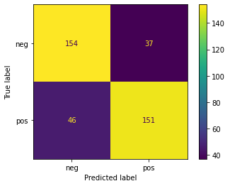
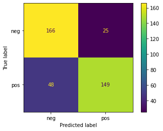
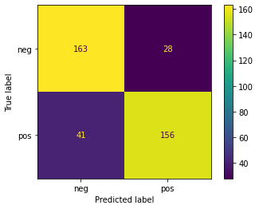
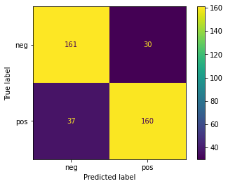
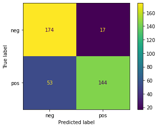
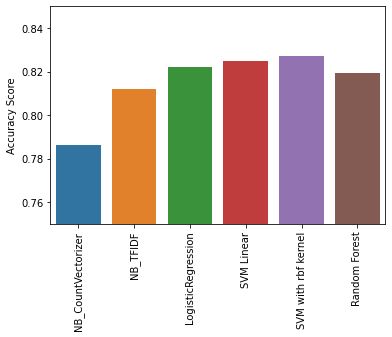

[<-PREV](../project.md)

# Naive Bayes and Natual Language Processing (NLP)

1. Import libraries, set up directory, and read data
2. Quick data check
3. Modeling

    3.1 Word embedding
    - Count vectorizer
    - Term Frequency - Inverse Document Frequency (TF-IDF)
    3.2 Model comparisons
    - Multinomial Naive Bayes
    - Logistic Regression
    - Linear SVM
4. Compare the results
5. Save and load a final model

## 1. Import libraries, set up directory, and read data


```python
import numpy as np
import pandas as pd
import matplotlib.pyplot as plt
import seaborn as sns
```


```python
mypath = '/project/'
```


```python
df = pd.read_csv(mypath + 'moviereviews.csv')
```

## 2. Quick data check


```python
print(df.info())
df.head()
```

    <class 'pandas.core.frame.DataFrame'>
    RangeIndex: 1938 entries, 0 to 1937
    Data columns (total 2 columns):
     #   Column  Non-Null Count  Dtype 
    ---  ------  --------------  ----- 
     0   label   1938 non-null   object
     1   review  1938 non-null   object
    dtypes: object(2)
    memory usage: 30.4+ KB
    None


  <div id="df-a8c69a1d-a1f8-4a7d-91ae-c73600afe4b6">
    <div class="colab-df-container">
      <div>
<style scoped>
    .dataframe tbody tr th:only-of-type {
        vertical-align: middle;
    }

    .dataframe tbody tr th {
        vertical-align: top;
    }

    .dataframe thead th {
        text-align: right;
    }
</style>
<table border="1" class="dataframe">
  <thead>
    <tr style="text-align: right;">
      <th></th>
      <th>label</th>
      <th>review</th>
    </tr>
  </thead>
  <tbody>
    <tr>
      <th>0</th>
      <td>neg</td>
      <td>how do films like mouse hunt get into theatres...</td>
    </tr>
    <tr>
      <th>1</th>
      <td>neg</td>
      <td>some talented actresses are blessed with a dem...</td>
    </tr>
    <tr>
      <th>2</th>
      <td>pos</td>
      <td>this has been an extraordinary year for austra...</td>
    </tr>
    <tr>
      <th>3</th>
      <td>pos</td>
      <td>according to hollywood movies made in last few...</td>
    </tr>
    <tr>
      <th>4</th>
      <td>neg</td>
      <td>my first press screening of 1998 and already i...</td>
    </tr>
  </tbody>
</table>
</div>
      <button class="colab-df-convert" onclick="convertToInteractive('df-a8c69a1d-a1f8-4a7d-91ae-c73600afe4b6')"
              title="Convert this dataframe to an interactive table."
              style="display:none;">

  <svg xmlns="http://www.w3.org/2000/svg" height="24px"viewBox="0 0 24 24"
       width="24px">
    <path d="M0 0h24v24H0V0z" fill="none"/>
    <path d="M18.56 5.44l.94 2.06.94-2.06 2.06-.94-2.06-.94-.94-2.06-.94 2.06-2.06.94zm-11 1L8.5 8.5l.94-2.06 2.06-.94-2.06-.94L8.5 2.5l-.94 2.06-2.06.94zm10 10l.94 2.06.94-2.06 2.06-.94-2.06-.94-.94-2.06-.94 2.06-2.06.94z"/><path d="M17.41 7.96l-1.37-1.37c-.4-.4-.92-.59-1.43-.59-.52 0-1.04.2-1.43.59L10.3 9.45l-7.72 7.72c-.78.78-.78 2.05 0 2.83L4 21.41c.39.39.9.59 1.41.59.51 0 1.02-.2 1.41-.59l7.78-7.78 2.81-2.81c.8-.78.8-2.07 0-2.86zM5.41 20L4 18.59l7.72-7.72 1.47 1.35L5.41 20z"/>
  </svg>
      </button>

  <style>
    .colab-df-container {
      display:flex;
      flex-wrap:wrap;
      gap: 12px;
    }

    .colab-df-convert {
      background-color: #E8F0FE;
      border: none;
      border-radius: 50%;
      cursor: pointer;
      display: none;
      fill: #1967D2;
      height: 32px;
      padding: 0 0 0 0;
      width: 32px;
    }

    .colab-df-convert:hover {
      background-color: #E2EBFA;
      box-shadow: 0px 1px 2px rgba(60, 64, 67, 0.3), 0px 1px 3px 1px rgba(60, 64, 67, 0.15);
      fill: #174EA6;
    }

    [theme=dark] .colab-df-convert {
      background-color: #3B4455;
      fill: #D2E3FC;
    }

    [theme=dark] .colab-df-convert:hover {
      background-color: #434B5C;
      box-shadow: 0px 1px 3px 1px rgba(0, 0, 0, 0.15);
      filter: drop-shadow(0px 1px 2px rgba(0, 0, 0, 0.3));
      fill: #FFFFFF;
    }
  </style>

      <script>
        const buttonEl =
          document.querySelector('#df-a8c69a1d-a1f8-4a7d-91ae-c73600afe4b6 button.colab-df-convert');
        buttonEl.style.display =
          google.colab.kernel.accessAllowed ? 'block' : 'none';

        async function convertToInteractive(key) {
          const element = document.querySelector('#df-a8c69a1d-a1f8-4a7d-91ae-c73600afe4b6');
          const dataTable =
            await google.colab.kernel.invokeFunction('convertToInteractive',
                                                     [key], {});
          if (!dataTable) return;

          const docLinkHtml = 'Like what you see? Visit the ' +
            '<a target="_blank" href=https://colab.research.google.com/notebooks/data_table.ipynb>data table notebook</a>'
            + ' to learn more about interactive tables.';
          element.innerHTML = '';
          dataTable['output_type'] = 'display_data';
          await google.colab.output.renderOutput(dataTable, element);
          const docLink = document.createElement('div');
          docLink.innerHTML = docLinkHtml;
          element.appendChild(docLink);
        }
      </script>
    </div>
  </div>


## 3. Modeling

### 3.1 Word embedding
- Count vectorizer
- TF-IDF


```python
X = df['review']
y = df['label']
```


```python
from sklearn.model_selection import train_test_split
X_train, X_test, y_train, y_test = train_test_split(X, y, test_size=0.2, random_state=101)
```


```python
from sklearn.feature_extraction.text import CountVectorizer

cv = CountVectorizer(stop_words='english')
cv_X_train = cv.fit_transform(X_train)
cv_X_test = cv.transform(X_test)
```


```python
from sklearn.feature_extraction.text import TfidfVectorizer
tfidf = TfidfVectorizer(stop_words='english')
tfidf_X_train = tfidf.fit_transform(X_train)
tfidf_X_test = tfidf.transform(X_test)
```


```python
from sklearn.metrics import ConfusionMatrixDisplay, classification_report, accuracy_score

def report_evaluation(y_test, y_pred):
    ConfusionMatrixDisplay.from_predictions(y_test, y_pred)
    print(classification_report(y_test, y_pred))

res = {}
def save_results(model_name, y_test, y_pred):
    res[model_name] = accuracy_score(y_test, y_pred)
```

### 3.2 Model comparisons

#### 3.2.1 Multinomial NB using Count vectorizer vs. TF-IDF embeddings


```python
from sklearn.naive_bayes import MultinomialNB
model = MultinomialNB()

model.fit(cv_X_train, y_train)
y_pred = model.predict(cv_X_test)
report_evaluation(y_test, y_pred)
save_results('NB_CountVectorizer', y_test, y_pred)
```

                  precision    recall  f1-score   support
    
             neg       0.77      0.81      0.79       191
             pos       0.80      0.77      0.78       197
    
        accuracy                           0.79       388
       macro avg       0.79      0.79      0.79       388
    weighted avg       0.79      0.79      0.79       388
    


    

    


```python
from sklearn.naive_bayes import MultinomialNB
model = MultinomialNB()

model.fit(tfidf_X_train, y_train)
y_pred = model.predict(tfidf_X_test)
report_evaluation(y_test, y_pred)
save_results('NB_TFIDF', y_test, y_pred)
```

                  precision    recall  f1-score   support
    
             neg       0.78      0.87      0.82       191
             pos       0.86      0.76      0.80       197
    
        accuracy                           0.81       388
       macro avg       0.82      0.81      0.81       388
    weighted avg       0.82      0.81      0.81       388
    


    

    


#### 3.2.2 Logistic Regression


```python
from sklearn.linear_model import LogisticRegression
model = LogisticRegression(max_iter=1000)
model.fit(tfidf_X_train, y_train)
y_pred = model.predict(tfidf_X_test)
report_evaluation(y_test, y_pred)
save_results('LogisticRegression', y_test, y_pred)
```

                  precision    recall  f1-score   support
    
             neg       0.80      0.85      0.83       191
             pos       0.85      0.79      0.82       197
    
        accuracy                           0.82       388
       macro avg       0.82      0.82      0.82       388
    weighted avg       0.82      0.82      0.82       388
    


    

    


#### 3.2.3 SVM


```python
from sklearn.svm import LinearSVC
model = LinearSVC()
model.fit(tfidf_X_train, y_train)
y_pred = model.predict(tfidf_X_test)
report_evaluation(y_test, y_pred)
save_results('SVM Linear', y_test, y_pred)
```

                  precision    recall  f1-score   support
    
             neg       0.81      0.84      0.82       191
             pos       0.84      0.81      0.82       197
    
        accuracy                           0.82       388
       macro avg       0.82      0.82      0.82       388
    weighted avg       0.83      0.82      0.82       388
    


    

    


```python
from sklearn.svm import SVC
model = SVC()
model.fit(tfidf_X_train, y_train)
y_pred = model.predict(tfidf_X_test)
report_evaluation(y_test, y_pred)
save_results('SVM with rbf kernel', y_test, y_pred)
```

                  precision    recall  f1-score   support
    
             neg       0.81      0.84      0.83       191
             pos       0.84      0.81      0.83       197
    
        accuracy                           0.83       388
       macro avg       0.83      0.83      0.83       388
    weighted avg       0.83      0.83      0.83       388
    


    

    


#### 3.2.4 Random Forest


```python
from pandas._libs.tslibs.nattype import nat_strings
from sklearn.ensemble import RandomForestClassifier

model = RandomForestClassifier(n_estimators=100, oob_score=True)
model.fit(tfidf_X_train, y_train)
y_pred = model.predict(tfidf_X_test)
report_evaluation(y_test, y_pred)
save_results('Random Forest', y_test, y_pred)
```

                  precision    recall  f1-score   support
    
             neg       0.77      0.91      0.83       191
             pos       0.89      0.73      0.80       197
    
        accuracy                           0.82       388
       macro avg       0.83      0.82      0.82       388
    weighted avg       0.83      0.82      0.82       388
    


    

    


## 4. Compare the results


```python
res
```


    {'LogisticRegression': 0.8221649484536082,
     'NB_CountVectorizer': 0.7860824742268041,
     'NB_TFIDF': 0.8118556701030928,
     'Random Forest': 0.8195876288659794,
     'SVM Linear': 0.8247422680412371,
     'SVM with rbf kernel': 0.8273195876288659}


```python
res_df = pd.Series(res)
res_df
```


    NB_CountVectorizer     0.786082
    NB_TFIDF               0.811856
    Random Forest          0.819588
    SVM Linear             0.824742
    LogisticRegression     0.822165
    SVM with rbf kernel    0.827320
    dtype: float64


```python
plt.figure()
index = ['NB_CountVectorizer', 'NB_TFIDF', 'LogisticRegression', 'SVM Linear', 'SVM with rbf kernel', 'Random Forest']
sns.barplot(x=res_df.index, y=res_df, order=index)
plt.ylim(0.75, 0.85)
plt.xticks(rotation=90)
plt.ylabel('Accuracy Score');
```


    

    


## 5. Save and load a final model: SVM with rbf kernel


```python
# Word embedding
tfidf = TfidfVectorizer(stop_words='english')
# Model application
model = SVC()

from sklearn.pipeline import Pipeline   

operations = [('tfidf', tfidf), ('model', model)]
final_model = Pipeline(operations)
final_model.fit(X_train, y_train)
```


    Pipeline(steps=[('tfidf', TfidfVectorizer(stop_words='english')),
                    ('model', SVC())])


```python
from joblib import dump
dump(final_model, mypath + 'moviereview_SVMwithRBF.joblib')
```


    ['/project/moviereview_SVMwithRBF.joblib']


```python
from joblib import load
loaded_model = load(mypath + 'moviereview_SVMwithRBF.joblib')
```


```python
new_tweet = ['great movie']
X_test = pd.Series(new_tweet)
```


```python
y_pred = loaded_model.predict(X_test)
y_pred
```


    array(['pos'], dtype=object)


```python
new_tweet = ['good movie']
X_test = pd.Series(new_tweet)
y_pred = loaded_model.predict(X_test)
y_pred
```


    array(['neg'], dtype=object)


```python
new_tweet = ['ok movie']
X_test = pd.Series(new_tweet)
y_pred = loaded_model.predict(X_test)
y_pred
```


    array(['neg'], dtype=object)


```python
new_tweet = ['bad movie']
X_test = pd.Series(new_tweet)
y_pred = loaded_model.predict(X_test)
y_pred
```


    array(['neg'], dtype=object)


[<-PREV](../project.md)
