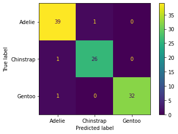

[<-PREV](../project.md)

# Supervised Learning - Classification of Penguin Species
1. Import libraries, set up directory, and read data
2. Quick data check 
3. Modeling
    - Logistic regression: StandardScaler, LogisticRegressionCV
    - KNN: Pipe(StandardScaler, KNeighborsClassifier), GridsearchCV
    - SVM
    - Decision tree
    - Random forest
    - Adaboost
    - Gradient boosting
    - XGBoost
4. Compare the results
5. Save and load a final model

## 1. Import libraries, set up directories, and read data


```python
import numpy as np
import pandas as pd
import matplotlib.pyplot as plt
import seaborn as sns
```


```python
mypath = '/project/'
```


```python
df = pd.read_csv(mypath + 'penguins.csv')
```

## 2. Quick data check

The data used here already organized through feature engineering and data cleaning. 


```python
print(df.info())
df.head()
```

    <class 'pandas.core.frame.DataFrame'>
    RangeIndex: 333 entries, 0 to 332
    Data columns (total 7 columns):
     #   Column             Non-Null Count  Dtype  
    ---  ------             --------------  -----  
     0   species            333 non-null    object 
     1   island             333 non-null    object 
     2   culmen_length_mm   333 non-null    float64
     3   culmen_depth_mm    333 non-null    float64
     4   flipper_length_mm  333 non-null    float64
     5   body_mass_g        333 non-null    float64
     6   sex                333 non-null    object 
    dtypes: float64(4), object(3)
    memory usage: 18.3+ KB
    None


  <div id="df-ef9b73d7-d42b-47d7-b90c-20a77edc8a79">
    <div class="colab-df-container">
      <div>
<style scoped>
    .dataframe tbody tr th:only-of-type {
        vertical-align: middle;
    }

    .dataframe tbody tr th {
        vertical-align: top;
    }

    .dataframe thead th {
        text-align: right;
    }
</style>
<table border="1" class="dataframe">
  <thead>
    <tr style="text-align: right;">
      <th></th>
      <th>species</th>
      <th>island</th>
      <th>culmen_length_mm</th>
      <th>culmen_depth_mm</th>
      <th>flipper_length_mm</th>
      <th>body_mass_g</th>
      <th>sex</th>
    </tr>
  </thead>
  <tbody>
    <tr>
      <th>0</th>
      <td>Adelie</td>
      <td>Torgersen</td>
      <td>39.1</td>
      <td>18.7</td>
      <td>181.0</td>
      <td>3750.0</td>
      <td>MALE</td>
    </tr>
    <tr>
      <th>1</th>
      <td>Adelie</td>
      <td>Torgersen</td>
      <td>39.5</td>
      <td>17.4</td>
      <td>186.0</td>
      <td>3800.0</td>
      <td>FEMALE</td>
    </tr>
    <tr>
      <th>2</th>
      <td>Adelie</td>
      <td>Torgersen</td>
      <td>40.3</td>
      <td>18.0</td>
      <td>195.0</td>
      <td>3250.0</td>
      <td>FEMALE</td>
    </tr>
    <tr>
      <th>3</th>
      <td>Adelie</td>
      <td>Torgersen</td>
      <td>36.7</td>
      <td>19.3</td>
      <td>193.0</td>
      <td>3450.0</td>
      <td>FEMALE</td>
    </tr>
    <tr>
      <th>4</th>
      <td>Adelie</td>
      <td>Torgersen</td>
      <td>39.3</td>
      <td>20.6</td>
      <td>190.0</td>
      <td>3650.0</td>
      <td>MALE</td>
    </tr>
  </tbody>
</table>
</div>
      <button class="colab-df-convert" onclick="convertToInteractive('df-ef9b73d7-d42b-47d7-b90c-20a77edc8a79')"
              title="Convert this dataframe to an interactive table."
              style="display:none;">

  <svg xmlns="http://www.w3.org/2000/svg" height="24px"viewBox="0 0 24 24"
       width="24px">
    <path d="M0 0h24v24H0V0z" fill="none"/>
    <path d="M18.56 5.44l.94 2.06.94-2.06 2.06-.94-2.06-.94-.94-2.06-.94 2.06-2.06.94zm-11 1L8.5 8.5l.94-2.06 2.06-.94-2.06-.94L8.5 2.5l-.94 2.06-2.06.94zm10 10l.94 2.06.94-2.06 2.06-.94-2.06-.94-.94-2.06-.94 2.06-2.06.94z"/><path d="M17.41 7.96l-1.37-1.37c-.4-.4-.92-.59-1.43-.59-.52 0-1.04.2-1.43.59L10.3 9.45l-7.72 7.72c-.78.78-.78 2.05 0 2.83L4 21.41c.39.39.9.59 1.41.59.51 0 1.02-.2 1.41-.59l7.78-7.78 2.81-2.81c.8-.78.8-2.07 0-2.86zM5.41 20L4 18.59l7.72-7.72 1.47 1.35L5.41 20z"/>
  </svg>
      </button>

  <style>
    .colab-df-container {
      display:flex;
      flex-wrap:wrap;
      gap: 12px;
    }

    .colab-df-convert {
      background-color: #E8F0FE;
      border: none;
      border-radius: 50%;
      cursor: pointer;
      display: none;
      fill: #1967D2;
      height: 32px;
      padding: 0 0 0 0;
      width: 32px;
    }

    .colab-df-convert:hover {
      background-color: #E2EBFA;
      box-shadow: 0px 1px 2px rgba(60, 64, 67, 0.3), 0px 1px 3px 1px rgba(60, 64, 67, 0.15);
      fill: #174EA6;
    }

    [theme=dark] .colab-df-convert {
      background-color: #3B4455;
      fill: #D2E3FC;
    }

    [theme=dark] .colab-df-convert:hover {
      background-color: #434B5C;
      box-shadow: 0px 1px 3px 1px rgba(0, 0, 0, 0.15);
      filter: drop-shadow(0px 1px 2px rgba(0, 0, 0, 0.3));
      fill: #FFFFFF;
    }
  </style>

      <script>
        const buttonEl =
          document.querySelector('#df-ef9b73d7-d42b-47d7-b90c-20a77edc8a79 button.colab-df-convert');
        buttonEl.style.display =
          google.colab.kernel.accessAllowed ? 'block' : 'none';

        async function convertToInteractive(key) {
          const element = document.querySelector('#df-ef9b73d7-d42b-47d7-b90c-20a77edc8a79');
          const dataTable =
            await google.colab.kernel.invokeFunction('convertToInteractive',
                                                     [key], {});
          if (!dataTable) return;

          const docLinkHtml = 'Like what you see? Visit the ' +
            '<a target="_blank" href=https://colab.research.google.com/notebooks/data_table.ipynb>data table notebook</a>'
            + ' to learn more about interactive tables.';
          element.innerHTML = '';
          dataTable['output_type'] = 'display_data';
          await google.colab.output.renderOutput(dataTable, element);
          const docLink = document.createElement('div');
          docLink.innerHTML = docLinkHtml;
          element.appendChild(docLink);
        }
      </script>
    </div>
  </div>


## 3. Modeling


```python
X = pd.get_dummies(df.drop('species', axis=1), drop_first=True)
y = df['species']
```


```python
X.head()
```


  <div id="df-0cb569b5-191f-4111-bd22-2a17fca65207">
    <div class="colab-df-container">
      <div>
<style scoped>
    .dataframe tbody tr th:only-of-type {
        vertical-align: middle;
    }

    .dataframe tbody tr th {
        vertical-align: top;
    }

    .dataframe thead th {
        text-align: right;
    }
</style>
<table border="1" class="dataframe">
  <thead>
    <tr style="text-align: right;">
      <th></th>
      <th>culmen_length_mm</th>
      <th>culmen_depth_mm</th>
      <th>flipper_length_mm</th>
      <th>body_mass_g</th>
      <th>island_Dream</th>
      <th>island_Torgersen</th>
      <th>sex_MALE</th>
    </tr>
  </thead>
  <tbody>
    <tr>
      <th>0</th>
      <td>39.1</td>
      <td>18.7</td>
      <td>181.0</td>
      <td>3750.0</td>
      <td>0</td>
      <td>1</td>
      <td>1</td>
    </tr>
    <tr>
      <th>1</th>
      <td>39.5</td>
      <td>17.4</td>
      <td>186.0</td>
      <td>3800.0</td>
      <td>0</td>
      <td>1</td>
      <td>0</td>
    </tr>
    <tr>
      <th>2</th>
      <td>40.3</td>
      <td>18.0</td>
      <td>195.0</td>
      <td>3250.0</td>
      <td>0</td>
      <td>1</td>
      <td>0</td>
    </tr>
    <tr>
      <th>3</th>
      <td>36.7</td>
      <td>19.3</td>
      <td>193.0</td>
      <td>3450.0</td>
      <td>0</td>
      <td>1</td>
      <td>0</td>
    </tr>
    <tr>
      <th>4</th>
      <td>39.3</td>
      <td>20.6</td>
      <td>190.0</td>
      <td>3650.0</td>
      <td>0</td>
      <td>1</td>
      <td>1</td>
    </tr>
  </tbody>
</table>
</div>
      <button class="colab-df-convert" onclick="convertToInteractive('df-0cb569b5-191f-4111-bd22-2a17fca65207')"
              title="Convert this dataframe to an interactive table."
              style="display:none;">

  <svg xmlns="http://www.w3.org/2000/svg" height="24px"viewBox="0 0 24 24"
       width="24px">
    <path d="M0 0h24v24H0V0z" fill="none"/>
    <path d="M18.56 5.44l.94 2.06.94-2.06 2.06-.94-2.06-.94-.94-2.06-.94 2.06-2.06.94zm-11 1L8.5 8.5l.94-2.06 2.06-.94-2.06-.94L8.5 2.5l-.94 2.06-2.06.94zm10 10l.94 2.06.94-2.06 2.06-.94-2.06-.94-.94-2.06-.94 2.06-2.06.94z"/><path d="M17.41 7.96l-1.37-1.37c-.4-.4-.92-.59-1.43-.59-.52 0-1.04.2-1.43.59L10.3 9.45l-7.72 7.72c-.78.78-.78 2.05 0 2.83L4 21.41c.39.39.9.59 1.41.59.51 0 1.02-.2 1.41-.59l7.78-7.78 2.81-2.81c.8-.78.8-2.07 0-2.86zM5.41 20L4 18.59l7.72-7.72 1.47 1.35L5.41 20z"/>
  </svg>
      </button>

  <style>
    .colab-df-container {
      display:flex;
      flex-wrap:wrap;
      gap: 12px;
    }

    .colab-df-convert {
      background-color: #E8F0FE;
      border: none;
      border-radius: 50%;
      cursor: pointer;
      display: none;
      fill: #1967D2;
      height: 32px;
      padding: 0 0 0 0;
      width: 32px;
    }

    .colab-df-convert:hover {
      background-color: #E2EBFA;
      box-shadow: 0px 1px 2px rgba(60, 64, 67, 0.3), 0px 1px 3px 1px rgba(60, 64, 67, 0.15);
      fill: #174EA6;
    }

    [theme=dark] .colab-df-convert {
      background-color: #3B4455;
      fill: #D2E3FC;
    }

    [theme=dark] .colab-df-convert:hover {
      background-color: #434B5C;
      box-shadow: 0px 1px 3px 1px rgba(0, 0, 0, 0.15);
      filter: drop-shadow(0px 1px 2px rgba(0, 0, 0, 0.3));
      fill: #FFFFFF;
    }
  </style>

      <script>
        const buttonEl =
          document.querySelector('#df-0cb569b5-191f-4111-bd22-2a17fca65207 button.colab-df-convert');
        buttonEl.style.display =
          google.colab.kernel.accessAllowed ? 'block' : 'none';

        async function convertToInteractive(key) {
          const element = document.querySelector('#df-0cb569b5-191f-4111-bd22-2a17fca65207');
          const dataTable =
            await google.colab.kernel.invokeFunction('convertToInteractive',
                                                     [key], {});
          if (!dataTable) return;

          const docLinkHtml = 'Like what you see? Visit the ' +
            '<a target="_blank" href=https://colab.research.google.com/notebooks/data_table.ipynb>data table notebook</a>'
            + ' to learn more about interactive tables.';
          element.innerHTML = '';
          dataTable['output_type'] = 'display_data';
          await google.colab.output.renderOutput(dataTable, element);
          const docLink = document.createElement('div');
          docLink.innerHTML = docLinkHtml;
          element.appendChild(docLink);
        }
      </script>
    </div>
  </div>


```python
from sklearn.model_selection import train_test_split
X_train, X_test, y_train, y_test = train_test_split(X, y, test_size=0.3, random_state=101)
```


```python
from sklearn.metrics import ConfusionMatrixDisplay, classification_report, accuracy_score

def display_evaluation(y_test, y_pred):
    ConfusionMatrixDisplay.from_predictions(y_test, y_pred)
    print(classification_report(y_test, y_pred))

res = {}
def save_results(model_name, y_test, y_pred):
    res[model_name] = accuracy_score(y_test, y_pred)
```

### 3.1. Logistic regression


```python
from sklearn.preprocessing import StandardScaler

scaler = StandardScaler()
scaled_X_train = scaler.fit_transform(X_train)
scaled_X_test = scaler.transform(X_test)
```


```python
from sklearn.linear_model import LogisticRegressionCV

grid_model = LogisticRegressionCV(Cs=10, penalty='elasticnet', solver='saga', l1_ratios=np.linspace(0, 1, 11, endpoint=True), max_iter=5000)
grid_model.fit(scaled_X_train, y_train)
```


    LogisticRegressionCV(l1_ratios=array([0. , 0.1, 0.2, 0.3, 0.4, 0.5, 0.6, 0.7, 0.8, 0.9, 1. ]),
                         max_iter=5000, penalty='elasticnet', solver='saga')


```python
grid_model.C_
```


    array([0.35938137, 0.35938137, 0.35938137])


```python
grid_model.l1_ratio_ # l2 regularization
```


    array([0., 0., 0.])


```python
grid_model.coef_
```


    array([[-1.63176911,  0.583529  , -0.56258439, -0.21351365, -0.29690623,
             0.36475327,  0.54818174],
           [ 1.32271732,  0.33396562, -0.23516838, -0.51263942,  0.92466079,
            -0.14803999, -0.43357714],
           [ 0.30905179, -0.91749462,  0.79775277,  0.72615308, -0.62775456,
            -0.21671328, -0.11460459]])


```python
coefs = pd.DataFrame(columns=X.columns, data=grid_model.coef_, index=grid_model.classes_)
```


```python
coefs
```


  <div id="df-bf066379-6df3-4b77-8045-427817fa7e02">
    <div class="colab-df-container">
      <div>
<style scoped>
    .dataframe tbody tr th:only-of-type {
        vertical-align: middle;
    }

    .dataframe tbody tr th {
        vertical-align: top;
    }

    .dataframe thead th {
        text-align: right;
    }
</style>
<table border="1" class="dataframe">
  <thead>
    <tr style="text-align: right;">
      <th></th>
      <th>culmen_length_mm</th>
      <th>culmen_depth_mm</th>
      <th>flipper_length_mm</th>
      <th>body_mass_g</th>
      <th>island_Dream</th>
      <th>island_Torgersen</th>
      <th>sex_MALE</th>
    </tr>
  </thead>
  <tbody>
    <tr>
      <th>Adelie</th>
      <td>-1.631769</td>
      <td>0.583529</td>
      <td>-0.562584</td>
      <td>-0.213514</td>
      <td>-0.296906</td>
      <td>0.364753</td>
      <td>0.548182</td>
    </tr>
    <tr>
      <th>Chinstrap</th>
      <td>1.322717</td>
      <td>0.333966</td>
      <td>-0.235168</td>
      <td>-0.512639</td>
      <td>0.924661</td>
      <td>-0.148040</td>
      <td>-0.433577</td>
    </tr>
    <tr>
      <th>Gentoo</th>
      <td>0.309052</td>
      <td>-0.917495</td>
      <td>0.797753</td>
      <td>0.726153</td>
      <td>-0.627755</td>
      <td>-0.216713</td>
      <td>-0.114605</td>
    </tr>
  </tbody>
</table>
</div>
      <button class="colab-df-convert" onclick="convertToInteractive('df-bf066379-6df3-4b77-8045-427817fa7e02')"
              title="Convert this dataframe to an interactive table."
              style="display:none;">

  <svg xmlns="http://www.w3.org/2000/svg" height="24px"viewBox="0 0 24 24"
       width="24px">
    <path d="M0 0h24v24H0V0z" fill="none"/>
    <path d="M18.56 5.44l.94 2.06.94-2.06 2.06-.94-2.06-.94-.94-2.06-.94 2.06-2.06.94zm-11 1L8.5 8.5l.94-2.06 2.06-.94-2.06-.94L8.5 2.5l-.94 2.06-2.06.94zm10 10l.94 2.06.94-2.06 2.06-.94-2.06-.94-.94-2.06-.94 2.06-2.06.94z"/><path d="M17.41 7.96l-1.37-1.37c-.4-.4-.92-.59-1.43-.59-.52 0-1.04.2-1.43.59L10.3 9.45l-7.72 7.72c-.78.78-.78 2.05 0 2.83L4 21.41c.39.39.9.59 1.41.59.51 0 1.02-.2 1.41-.59l7.78-7.78 2.81-2.81c.8-.78.8-2.07 0-2.86zM5.41 20L4 18.59l7.72-7.72 1.47 1.35L5.41 20z"/>
  </svg>
      </button>

  <style>
    .colab-df-container {
      display:flex;
      flex-wrap:wrap;
      gap: 12px;
    }

    .colab-df-convert {
      background-color: #E8F0FE;
      border: none;
      border-radius: 50%;
      cursor: pointer;
      display: none;
      fill: #1967D2;
      height: 32px;
      padding: 0 0 0 0;
      width: 32px;
    }

    .colab-df-convert:hover {
      background-color: #E2EBFA;
      box-shadow: 0px 1px 2px rgba(60, 64, 67, 0.3), 0px 1px 3px 1px rgba(60, 64, 67, 0.15);
      fill: #174EA6;
    }

    [theme=dark] .colab-df-convert {
      background-color: #3B4455;
      fill: #D2E3FC;
    }

    [theme=dark] .colab-df-convert:hover {
      background-color: #434B5C;
      box-shadow: 0px 1px 3px 1px rgba(0, 0, 0, 0.15);
      filter: drop-shadow(0px 1px 2px rgba(0, 0, 0, 0.3));
      fill: #FFFFFF;
    }
  </style>

      <script>
        const buttonEl =
          document.querySelector('#df-bf066379-6df3-4b77-8045-427817fa7e02 button.colab-df-convert');
        buttonEl.style.display =
          google.colab.kernel.accessAllowed ? 'block' : 'none';

        async function convertToInteractive(key) {
          const element = document.querySelector('#df-bf066379-6df3-4b77-8045-427817fa7e02');
          const dataTable =
            await google.colab.kernel.invokeFunction('convertToInteractive',
                                                     [key], {});
          if (!dataTable) return;

          const docLinkHtml = 'Like what you see? Visit the ' +
            '<a target="_blank" href=https://colab.research.google.com/notebooks/data_table.ipynb>data table notebook</a>'
            + ' to learn more about interactive tables.';
          element.innerHTML = '';
          dataTable['output_type'] = 'display_data';
          await google.colab.output.renderOutput(dataTable, element);
          const docLink = document.createElement('div');
          docLink.innerHTML = docLinkHtml;
          element.appendChild(docLink);
        }
      </script>
    </div>
  </div>


```python
plt.figure(figsize=(8, 4))
plt.plot(coefs.abs().transpose(), '-o')
plt.legend(coefs.index)
plt.ylabel('Absolute value of Coefficient')
plt.xticks(rotation=45);
```


    

    


```python
y_pred = grid_model.predict(scaled_X_test)
display_evaluation(y_test, y_pred)
save_results('Logistic Regression', y_test, y_pred)
```

                  precision    recall  f1-score   support
    
          Adelie       0.97      0.97      0.97        40
       Chinstrap       0.96      0.96      0.96        27
          Gentoo       1.00      1.00      1.00        33
    
        accuracy                           0.98       100
       macro avg       0.98      0.98      0.98       100
    weighted avg       0.98      0.98      0.98       100
    


    

    


### 3.2 KNN


```python
from sklearn.preprocessing import StandardScaler
scaler = StandardScaler()

from sklearn.neighbors import KNeighborsClassifier
model = KNeighborsClassifier()

from sklearn.pipeline import Pipeline
operations = [('scaler', scaler), ('model', model)]
pipe = Pipeline(operations)
```


```python
model.get_params()
```


    {'algorithm': 'auto',
     'leaf_size': 30,
     'metric': 'minkowski',
     'metric_params': None,
     'n_jobs': None,
     'n_neighbors': 5,
     'p': 2,
     'weights': 'uniform'}


```python
from sklearn.model_selection import GridSearchCV

param_grid = {'model__n_neighbors':np.arange(1, 30)}
grid_model = GridSearchCV(pipe, param_grid, scoring='accuracy')
grid_model.fit(X_train, y_train)
```


    GridSearchCV(estimator=Pipeline(steps=[('scaler', StandardScaler()),
                                           ('model', KNeighborsClassifier())]),
                 param_grid={'model__n_neighbors': array([ 1,  2,  3,  4,  5,  6,  7,  8,  9, 10, 11, 12, 13, 14, 15, 16, 17,
           18, 19, 20, 21, 22, 23, 24, 25, 26, 27, 28, 29])},
                 scoring='accuracy')


```python
grid_model.cv_results_.keys()
```


    dict_keys(['mean_fit_time', 'std_fit_time', 'mean_score_time', 'std_score_time', 'param_model__n_neighbors', 'params', 'split0_test_score', 'split1_test_score', 'split2_test_score', 'split3_test_score', 'split4_test_score', 'mean_test_score', 'std_test_score', 'rank_test_score'])


```python
grid_model.cv_results_['mean_test_score']
```


    array([0.99574468, 0.99148936, 1.        , 1.        , 1.        ,
           1.        , 1.        , 1.        , 1.        , 1.        ,
           1.        , 1.        , 1.        , 1.        , 1.        ,
           1.        , 1.        , 1.        , 1.        , 1.        ,
           1.        , 1.        , 0.99574468, 0.99574468, 0.98297872,
           0.99148936, 0.99148936, 0.98288622, 0.99148936])


```python
grid_model.best_params_
```


    {'model__n_neighbors': 3}


```python
plt.plot(grid_model.cv_results_['mean_test_score'], 'o-');
```


    

    


```python
# Elbow method

from sklearn.preprocessing import StandardScaler
scaler = StandardScaler()
scaled_X_train = scaler.fit_transform(X_train)
scaled_X_test = scaler.transform(X_test)

from sklearn.metrics import accuracy_score
accs = [] 
from sklearn.neighbors import KNeighborsClassifier
for k in range(1, 31):
    model = KNeighborsClassifier(n_neighbors=k)
    model.fit(scaled_X_train, y_train)
    y_pred = model.predict(scaled_X_test)
    acc = accuracy_score(y_test, y_pred)
    accs.append(acc)

print(accs)
```

    [0.99, 0.99, 0.99, 0.98, 0.98, 0.98, 0.98, 0.98, 0.98, 0.98, 0.98, 0.98, 0.98, 0.98, 0.98, 0.98, 0.98, 0.98, 0.98, 0.98, 0.98, 0.98, 0.98, 0.98, 0.98, 0.98, 0.99, 0.99, 0.96, 0.96]


```python
y_pred = grid_model.predict(X_test)
display_evaluation(y_test, y_pred)
save_results('KNN', y_test, y_pred)
```

                  precision    recall  f1-score   support
    
          Adelie       1.00      0.97      0.99        40
       Chinstrap       0.96      1.00      0.98        27
          Gentoo       1.00      1.00      1.00        33
    
        accuracy                           0.99       100
       macro avg       0.99      0.99      0.99       100
    weighted avg       0.99      0.99      0.99       100
    


    

    


### 3.3 SVM


```python
from sklearn.preprocessing import StandardScaler
scaler = StandardScaler()

from sklearn.svm import SVC
model = SVC()

from sklearn.pipeline import Pipeline
operations = [('scaler', scaler), ('model', model)]
pipe = Pipeline(operations)
```


```python
from sklearn.model_selection import GridSearchCV

C_values = [0.001, 0.01, 0.1, 0.5, 1]
gamma_values = ['scale', 'auto']
kernels = ['linear', 'poly', 'rbf', 'sigmoid']
param_grid = {'model__C':C_values, 'model__kernel': kernels, 'model__gamma': gamma_values}
grid_model = GridSearchCV(pipe, param_grid, scoring='accuracy')
grid_model.fit(X_train, y_train)
```


    GridSearchCV(estimator=Pipeline(steps=[('scaler', StandardScaler()),
                                           ('model', SVC())]),
                 param_grid={'model__C': [0.001, 0.01, 0.1, 0.5, 1],
                             'model__gamma': ['scale', 'auto'],
                             'model__kernel': ['linear', 'poly', 'rbf', 'sigmoid']},
                 scoring='accuracy')


```python
grid_model.cv_results_.keys()
```


    dict_keys(['mean_fit_time', 'std_fit_time', 'mean_score_time', 'std_score_time', 'param_model__C', 'param_model__gamma', 'param_model__kernel', 'params', 'split0_test_score', 'split1_test_score', 'split2_test_score', 'split3_test_score', 'split4_test_score', 'mean_test_score', 'std_test_score', 'rank_test_score'])


```python
grid_model.cv_results_['mean_test_score']
```


    array([0.61350601, 0.45494912, 0.45494912, 0.45494912, 0.61350601,
           0.45494912, 0.45494912, 0.45494912, 0.939963  , 0.57937095,
           0.45494912, 0.80277521, 0.939963  , 0.57937095, 0.45494912,
           0.80277521, 1.        , 0.87983349, 0.98723404, 0.98288622,
           1.        , 0.87983349, 0.98723404, 0.98288622, 1.        ,
           1.        , 1.        , 1.        , 1.        , 1.        ,
           1.        , 1.        , 1.        , 1.        , 1.        ,
           1.        , 1.        , 1.        , 1.        , 1.        ])


```python
grid_model.best_params_
```


    {'model__C': 0.1, 'model__gamma': 'scale', 'model__kernel': 'linear'}


```python
plt.plot(grid_model.cv_results_['mean_test_score'], 'o-')
plt.ylabel('Mean Test Score');
```


    

    


```python
len(grid_model.cv_results_['mean_test_score'])
```


    40


```python
grid_model.cv_results_['params'][30]
```


    {'model__C': 0.5, 'model__gamma': 'auto', 'model__kernel': 'rbf'}


```python
scaler = StandardScaler()
model = SVC(C=0.5, kernel='rbf', gamma='auto')
operations = [('scaler', scaler), ('model', model)]
pipe = Pipeline(operations)
pipe.fit(X_train, y_train)
```


    Pipeline(steps=[('scaler', StandardScaler()),
                    ('model', SVC(C=0.5, gamma='auto'))])


```python
y_pred = pipe.predict(X_test)
display_evaluation(y_test, y_pred)
save_results('SVM', y_test, y_pred)
```

                  precision    recall  f1-score   support
    
          Adelie       0.97      0.97      0.97        40
       Chinstrap       0.96      0.96      0.96        27
          Gentoo       1.00      1.00      1.00        33
    
        accuracy                           0.98       100
       macro avg       0.98      0.98      0.98       100
    weighted avg       0.98      0.98      0.98       100
    


    

    


### 3.4 Decision tree


```python
from sklearn.tree import DecisionTreeClassifier

model = DecisionTreeClassifier()

from sklearn.model_selection import GridSearchCV

param_grid = {'criterion':['gini', 'entropy'], 'max_depth':[2,3,4,5], 'max_leaf_nodes':np.arange(5, 15)}
grid_model = GridSearchCV(model, param_grid, scoring='accuracy')

grid_model.fit(X_train, y_train)
```


    GridSearchCV(estimator=DecisionTreeClassifier(),
                 param_grid={'criterion': ['gini', 'entropy'],
                             'max_depth': [2, 3, 4, 5],
                             'max_leaf_nodes': array([ 5,  6,  7,  8,  9, 10, 11, 12, 13, 14])},
                 scoring='accuracy')


```python
grid_model.best_params_
```


    {'criterion': 'gini', 'max_depth': 4, 'max_leaf_nodes': 9}


```python
plt.figure(figsize=(12, 5))
plt.plot(grid_model.cv_results_['mean_test_score'], '-o')
plt.ylabel('Mean Test Score');
```


    

    


```python
idxmax = grid_model.cv_results_['mean_test_score'].argmax()
```


```python
grid_model.cv_results_['params'][idxmax]
```


    {'criterion': 'gini', 'max_depth': 4, 'max_leaf_nodes': 9}


```python
model = DecisionTreeClassifier(criterion='gini', max_depth=4, max_leaf_nodes=9)
model.fit(X_train, y_train)
```


    DecisionTreeClassifier(max_depth=4, max_leaf_nodes=9)


```python
y_pred = model.predict(X_test)
display_evaluation(y_test, y_pred)
save_results('Decision Tree', y_test, y_pred)
```

                  precision    recall  f1-score   support
    
          Adelie       0.95      0.97      0.96        40
       Chinstrap       0.96      0.96      0.96        27
          Gentoo       1.00      0.97      0.98        33
    
        accuracy                           0.97       100
       macro avg       0.97      0.97      0.97       100
    weighted avg       0.97      0.97      0.97       100
    


    

    


```python
from sklearn.tree import plot_tree

plt.figure(figsize=(10, 10))
plot_tree(model);
```


    

    


### 3.5 Random forest


```python
from sklearn.ensemble import RandomForestClassifier

model = RandomForestClassifier()
```


```python
model.get_params()
```


    {'bootstrap': True,
     'ccp_alpha': 0.0,
     'class_weight': None,
     'criterion': 'gini',
     'max_depth': None,
     'max_features': 'auto',
     'max_leaf_nodes': None,
     'max_samples': None,
     'min_impurity_decrease': 0.0,
     'min_samples_leaf': 1,
     'min_samples_split': 2,
     'min_weight_fraction_leaf': 0.0,
     'n_estimators': 100,
     'n_jobs': None,
     'oob_score': False,
     'random_state': None,
     'verbose': 0,
     'warm_start': False}


```python
from sklearn.model_selection import GridSearchCV

oob_score = [True, False]
n_estimators = [64, 100, 128, 200, 256]
max_features = ['auto', 'log2'] # auto = sqrt(n)

param_grid = {'n_estimators':n_estimators, 'oob_score':oob_score,  'max_features': max_features}
grid_model = GridSearchCV(model, param_grid, scoring='accuracy')
grid_model.fit(X_train, y_train)
```


    GridSearchCV(estimator=RandomForestClassifier(),
                 param_grid={'max_features': ['auto', 'log2'],
                             'n_estimators': [64, 100, 128, 200, 256],
                             'oob_score': [True, False]},
                 scoring='accuracy')


```python
grid_model.best_params_
```


    {'max_features': 'auto', 'n_estimators': 200, 'oob_score': True}


```python
grid_model.cv_results_['mean_test_score']
```


    array([0.99574468, 0.99574468, 0.99574468, 0.99574468, 0.99574468,
           0.99574468, 1.        , 0.99574468, 0.99574468, 0.99574468,
           0.99574468, 0.99574468, 0.99574468, 0.99148936, 0.99574468,
           0.99574468, 0.99574468, 0.99574468, 0.99574468, 0.99574468])


```python
plt.plot(grid_model.cv_results_['mean_test_score']);
```


    

    


```python
y_pred = grid_model.predict(X_test)
display_evaluation(y_test, y_pred)
save_results('Random Forest', y_test, y_pred)
```

                  precision    recall  f1-score   support
    
          Adelie       0.98      1.00      0.99        40
       Chinstrap       1.00      0.96      0.98        27
          Gentoo       1.00      1.00      1.00        33
    
        accuracy                           0.99       100
       macro avg       0.99      0.99      0.99       100
    weighted avg       0.99      0.99      0.99       100
    


    

    


### 3.6 Adaboost


```python
from sklearn.ensemble import AdaBoostClassifier
from sklearn.metrics import accuracy_score

error_rates = []
ns = [1, 5, 10, 20, 50, 64]

for n in ns:

    model = AdaBoostClassifier(n_estimators=n)
    model.fit(X_train, y_train)
    y_pred = model.predict(X_test)
    err = 1 - accuracy_score(y_test, y_pred)
    error_rates.append(err)

```


```python
error_rates
```


    [0.29000000000000004,
     0.050000000000000044,
     0.040000000000000036,
     0.040000000000000036,
     0.040000000000000036,
     0.040000000000000036]


```python
plt.figure(figsize=(10, 4))
plt.plot(ns, error_rates, 'o-')
plt.xlabel('n_estimators')
plt.ylabel('Error Rates');
```


    

    


```python
model = AdaBoostClassifier(n_estimators=10)
model.fit(X_train, y_train)
```


    AdaBoostClassifier(n_estimators=10)


```python
y_pred = model.predict(X_test)
display_evaluation(y_test, y_pred)
save_results('Adaboost', y_test, y_pred)
```

                  precision    recall  f1-score   support
    
          Adelie       0.95      0.95      0.95        40
       Chinstrap       0.93      0.96      0.95        27
          Gentoo       1.00      0.97      0.98        33
    
        accuracy                           0.96       100
       macro avg       0.96      0.96      0.96       100
    weighted avg       0.96      0.96      0.96       100
    


    

    


### 3.7 Gradient Boosting


```python
from sklearn.ensemble import GradientBoostingClassifier
model = GradientBoostingClassifier()
```


```python
model.get_params()
```


    {'ccp_alpha': 0.0,
     'criterion': 'friedman_mse',
     'init': None,
     'learning_rate': 0.1,
     'loss': 'deviance',
     'max_depth': 3,
     'max_features': None,
     'max_leaf_nodes': None,
     'min_impurity_decrease': 0.0,
     'min_samples_leaf': 1,
     'min_samples_split': 2,
     'min_weight_fraction_leaf': 0.0,
     'n_estimators': 100,
     'n_iter_no_change': None,
     'random_state': None,
     'subsample': 1.0,
     'tol': 0.0001,
     'validation_fraction': 0.1,
     'verbose': 0,
     'warm_start': False}


```python
from sklearn.model_selection import GridSearchCV
#n_estimators = [1, 10, 20, 50, 64, 100, 128, 150, 200, 256]
n_estimators = [128, 150, 200]
param_grid = {'n_estimators': n_estimators, 'max_depth':np.arange(2, 11), 'max_leaf_nodes':np.arange(2, 21)} # max_depth, max_leaf_nodes
grid_model = GridSearchCV(model, param_grid, scoring='accuracy')
grid_model.fit(X_train, y_train)
```


    GridSearchCV(estimator=GradientBoostingClassifier(),
                 param_grid={'max_depth': array([ 2,  3,  4,  5,  6,  7,  8,  9, 10]),
                             'max_leaf_nodes': array([ 2,  3,  4,  5,  6,  7,  8,  9, 10, 11, 12, 13, 14, 15, 16, 17, 18,
           19, 20]),
                             'n_estimators': [128, 150, 200]},
                 scoring='accuracy')


```python
grid_model.best_params_
```


    {'max_depth': 3, 'max_leaf_nodes': 7, 'n_estimators': 150}


```python
#grid_model.cv_results_['mean_test_score']
```


```python
plt.plot(grid_model.cv_results_['mean_test_score'], 'o-')
#plt.ylim(0.97, 1)
plt.ylabel('Accuracy');
```


    

    


```python
y_pred = grid_model.predict(X_test)
display_evaluation(y_test, y_pred)
save_results('Gradient Boosting', y_test, y_pred)
```

                  precision    recall  f1-score   support
    
          Adelie       0.98      1.00      0.99        40
       Chinstrap       1.00      0.96      0.98        27
          Gentoo       1.00      1.00      1.00        33
    
        accuracy                           0.99       100
       macro avg       0.99      0.99      0.99       100
    weighted avg       0.99      0.99      0.99       100
    


    

    


### 3.8 XGBoost


```python
from xgboost import XGBClassifier

model = XGBClassifier()
model.get_params()
```


    {'base_score': 0.5,
     'booster': 'gbtree',
     'colsample_bylevel': 1,
     'colsample_bynode': 1,
     'colsample_bytree': 1,
     'gamma': 0,
     'learning_rate': 0.1,
     'max_delta_step': 0,
     'max_depth': 3,
     'min_child_weight': 1,
     'missing': None,
     'n_estimators': 100,
     'n_jobs': 1,
     'nthread': None,
     'objective': 'binary:logistic',
     'random_state': 0,
     'reg_alpha': 0,
     'reg_lambda': 1,
     'scale_pos_weight': 1,
     'seed': None,
     'silent': None,
     'subsample': 1,
     'verbosity': 1}


```python
from sklearn.metrics import accuracy_score

#ns = [10, 20, 50, 64, 100, 128, 150, 200, 256]
ns = range(1, 31)
accs = []
for n in ns:
    
    model = XGBClassifier(n_estimators=n)
    model.fit(X_train, y_train)
    y_pred = model.predict(X_test)
    acc = accuracy_score(y_test, y_pred)
    accs.append(acc)
```


```python
plt.plot(ns, accs, 'o-')
plt.xlabel('n_estimators')
plt.ylabel('Accuracy');
```


    

    


```python
model = XGBClassifier(n_estimators=15)
model.fit(X_train, y_train)
```


    XGBClassifier(n_estimators=15, objective='multi:softprob')


```python
y_pred = model.predict(X_test)
display_evaluation(y_test, y_pred)
save_results('XGBoost', y_test, y_pred)
```

                  precision    recall  f1-score   support
    
          Adelie       0.97      0.97      0.97        40
       Chinstrap       0.96      0.96      0.96        27
          Gentoo       1.00      1.00      1.00        33
    
        accuracy                           0.98       100
       macro avg       0.98      0.98      0.98       100
    weighted avg       0.98      0.98      0.98       100
    


    

    


## 4. Compare the results


```python
res
```


    {'Adaboost': 0.96,
     'Decision Tree': 0.97,
     'Gradient Boosting': 0.99,
     'KNN': 0.99,
     'Logistic Regression': 0.98,
     'Random Forest': 0.99,
     'SVM': 0.98,
     'XGBoost': 0.98}


```python
res_df = pd.Series(res)
res_df
```


    Logistic Regression    0.98
    KNN                    0.99
    SVM                    0.98
    Decision Tree          0.97
    Random Forest          0.99
    Adaboost               0.96
    XGBoost                0.98
    Gradient Boosting      0.99
    dtype: float64


```python
plt.figure()
index = ['Logistic Regression', 'KNN', 'SVM', 'Decision Tree', 'Random Forest', 'Adaboost', 'Gradient Boosting', 'XGBoost']
sns.barplot(x=res_df.index, y=res_df, order=index)
plt.ylim(0.9, 1)
plt.xticks(rotation=90)
plt.ylabel('Accuracy Score');
```


    

    


## 5. Save and load a final model: Gradient Boosting


```python
final_model = GradientBoostingClassifier(n_estimators=150, max_depth=3, max_leaf_nodes=7)
final_model.fit(X_train, y_train)
```


    GradientBoostingClassifier(max_leaf_nodes=7, n_estimators=150)


```python
from joblib import dump, load

dump(final_model, mypath + 'penguin_gradientboosting.joblib')
```


    ['/content/drive/MyDrive/Udemy/2022_PythonForMLDSMasterClass/project/penguin_gradientboosting.joblib']


```python
penguin = [[50.2, 18.7, 198.0, 3775.0, 1.0, 0.0, 0.0]]
```


```python
X_test = pd.DataFrame(data=penguin, columns=X.columns)
X_test
```


  <div id="df-e49aa091-14f4-476a-a837-8eca8e75b89b">
    <div class="colab-df-container">
      <div>
<style scoped>
    .dataframe tbody tr th:only-of-type {
        vertical-align: middle;
    }

    .dataframe tbody tr th {
        vertical-align: top;
    }

    .dataframe thead th {
        text-align: right;
    }
</style>
<table border="1" class="dataframe">
  <thead>
    <tr style="text-align: right;">
      <th></th>
      <th>culmen_length_mm</th>
      <th>culmen_depth_mm</th>
      <th>flipper_length_mm</th>
      <th>body_mass_g</th>
      <th>island_Dream</th>
      <th>island_Torgersen</th>
      <th>sex_MALE</th>
    </tr>
  </thead>
  <tbody>
    <tr>
      <th>0</th>
      <td>50.2</td>
      <td>18.7</td>
      <td>198.0</td>
      <td>3775.0</td>
      <td>1.0</td>
      <td>0.0</td>
      <td>0.0</td>
    </tr>
  </tbody>
</table>
</div>
      <button class="colab-df-convert" onclick="convertToInteractive('df-e49aa091-14f4-476a-a837-8eca8e75b89b')"
              title="Convert this dataframe to an interactive table."
              style="display:none;">

  <svg xmlns="http://www.w3.org/2000/svg" height="24px"viewBox="0 0 24 24"
       width="24px">
    <path d="M0 0h24v24H0V0z" fill="none"/>
    <path d="M18.56 5.44l.94 2.06.94-2.06 2.06-.94-2.06-.94-.94-2.06-.94 2.06-2.06.94zm-11 1L8.5 8.5l.94-2.06 2.06-.94-2.06-.94L8.5 2.5l-.94 2.06-2.06.94zm10 10l.94 2.06.94-2.06 2.06-.94-2.06-.94-.94-2.06-.94 2.06-2.06.94z"/><path d="M17.41 7.96l-1.37-1.37c-.4-.4-.92-.59-1.43-.59-.52 0-1.04.2-1.43.59L10.3 9.45l-7.72 7.72c-.78.78-.78 2.05 0 2.83L4 21.41c.39.39.9.59 1.41.59.51 0 1.02-.2 1.41-.59l7.78-7.78 2.81-2.81c.8-.78.8-2.07 0-2.86zM5.41 20L4 18.59l7.72-7.72 1.47 1.35L5.41 20z"/>
  </svg>
      </button>

  <style>
    .colab-df-container {
      display:flex;
      flex-wrap:wrap;
      gap: 12px;
    }

    .colab-df-convert {
      background-color: #E8F0FE;
      border: none;
      border-radius: 50%;
      cursor: pointer;
      display: none;
      fill: #1967D2;
      height: 32px;
      padding: 0 0 0 0;
      width: 32px;
    }

    .colab-df-convert:hover {
      background-color: #E2EBFA;
      box-shadow: 0px 1px 2px rgba(60, 64, 67, 0.3), 0px 1px 3px 1px rgba(60, 64, 67, 0.15);
      fill: #174EA6;
    }

    [theme=dark] .colab-df-convert {
      background-color: #3B4455;
      fill: #D2E3FC;
    }

    [theme=dark] .colab-df-convert:hover {
      background-color: #434B5C;
      box-shadow: 0px 1px 3px 1px rgba(0, 0, 0, 0.15);
      filter: drop-shadow(0px 1px 2px rgba(0, 0, 0, 0.3));
      fill: #FFFFFF;
    }
  </style>

      <script>
        const buttonEl =
          document.querySelector('#df-e49aa091-14f4-476a-a837-8eca8e75b89b button.colab-df-convert');
        buttonEl.style.display =
          google.colab.kernel.accessAllowed ? 'block' : 'none';

        async function convertToInteractive(key) {
          const element = document.querySelector('#df-e49aa091-14f4-476a-a837-8eca8e75b89b');
          const dataTable =
            await google.colab.kernel.invokeFunction('convertToInteractive',
                                                     [key], {});
          if (!dataTable) return;

          const docLinkHtml = 'Like what you see? Visit the ' +
            '<a target="_blank" href=https://colab.research.google.com/notebooks/data_table.ipynb>data table notebook</a>'
            + ' to learn more about interactive tables.';
          element.innerHTML = '';
          dataTable['output_type'] = 'display_data';
          await google.colab.output.renderOutput(dataTable, element);
          const docLink = document.createElement('div');
          docLink.innerHTML = docLinkHtml;
          element.appendChild(docLink);
        }
      </script>
    </div>
  </div>


```python
loaded_model = load(mypath + 'penguin_gradientboosting.joblib')
y_pred = loaded_model.predict(X_test)
y_prob_pred = loaded_model.predict_proba(X_test)
y_pred = loaded_model.predict(X_test)
```


```python
print(y_prob_pred, y_pred)
```

    [[9.26548553e-09 9.99999988e-01 2.99162945e-09]] ['Chinstrap']

[<-PREV](../project.md)
