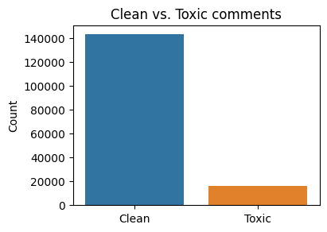
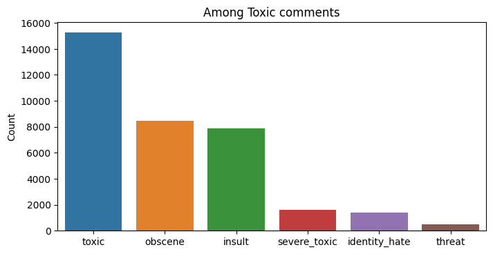
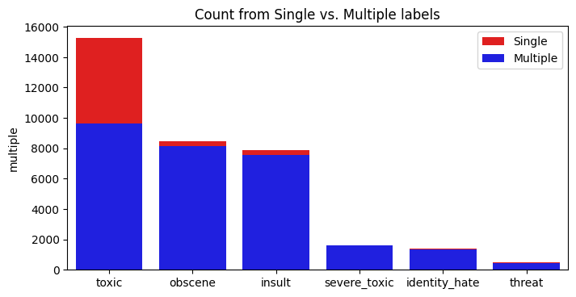
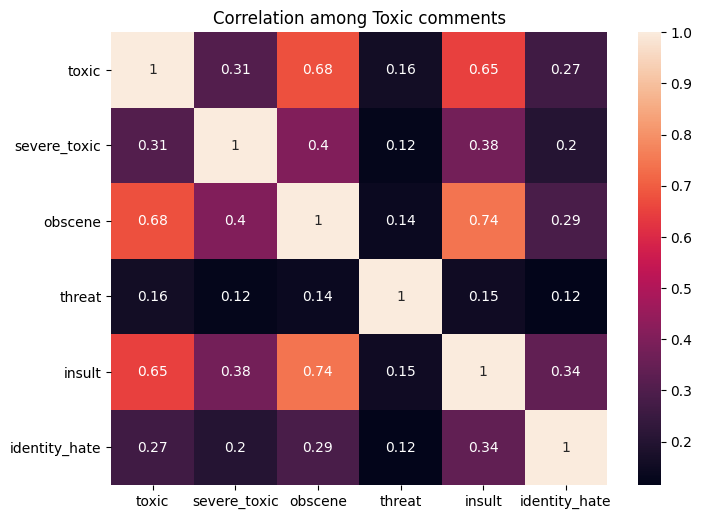
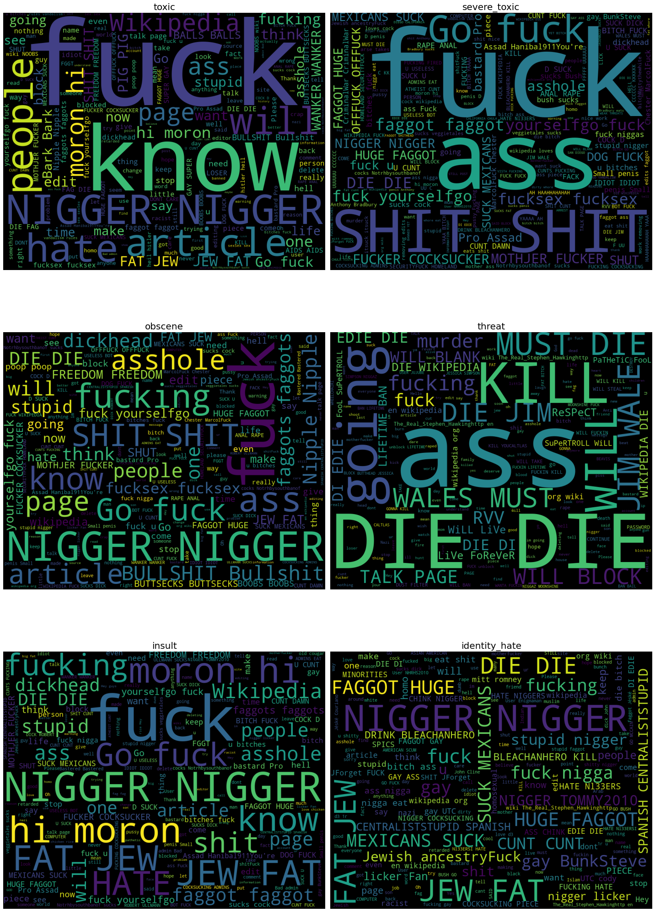
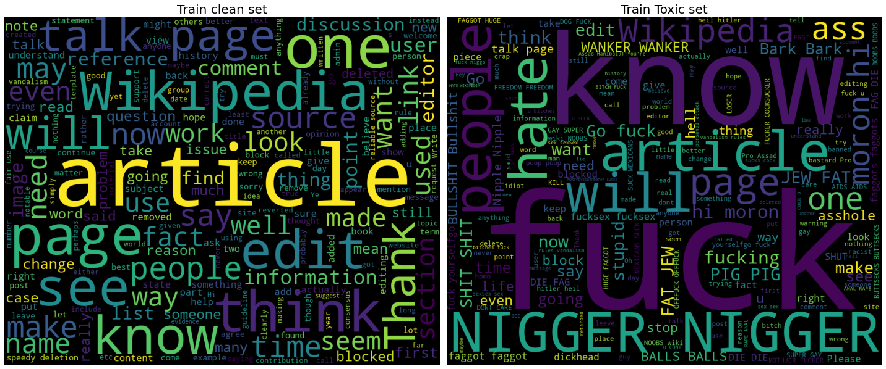
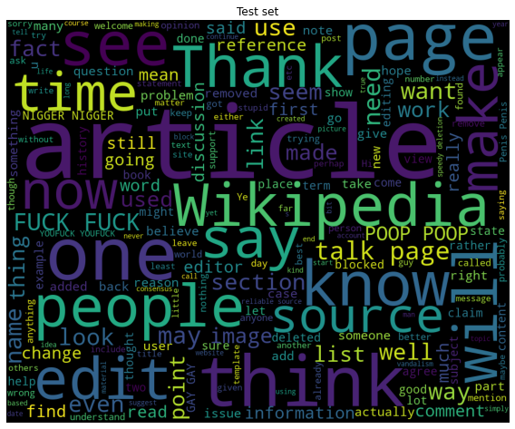
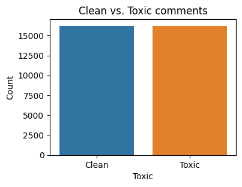

[<-PREV](toxiccomment.md) [NEXT->](toxiccomment-part2.md)


# Toxic Comment Classification Part 1
1. Set up
1. Quick data check
1. Exploratory data analysis
1. Feature engineering
1. Save the data

## 1. Set up
- Import libraries
- Set up directories
- Read the data


```python
import numpy as np
import pandas as pd
import matplotlib.pyplot as plt
import seaborn as sns
```


```python
input_dir = '../input/jigsaw-toxic-comment-classification-challenge/'
output_dir = ''
```


```python
train_df = pd.read_csv(input_dir + 'train.csv.zip')
test_df = pd.read_csv(input_dir + 'test.csv.zip')
label_df = pd.read_csv(input_dir + 'test_labels.csv.zip')
```

# 2. Quick data check


```python
train_df.info()
train_df.head()
```

    <class 'pandas.core.frame.DataFrame'>
    RangeIndex: 159571 entries, 0 to 159570
    Data columns (total 8 columns):
     #   Column         Non-Null Count   Dtype 
    ---  ------         --------------   ----- 
     0   id             159571 non-null  object
     1   comment_text   159571 non-null  object
     2   toxic          159571 non-null  int64 
     3   severe_toxic   159571 non-null  int64 
     4   obscene        159571 non-null  int64 
     5   threat         159571 non-null  int64 
     6   insult         159571 non-null  int64 
     7   identity_hate  159571 non-null  int64 
    dtypes: int64(6), object(2)
    memory usage: 9.7+ MB


<div>
<style scoped>
    .dataframe tbody tr th:only-of-type {
        vertical-align: middle;
    }

    .dataframe tbody tr th {
        vertical-align: top;
    }

    .dataframe thead th {
        text-align: right;
    }
</style>
<table border="1" class="dataframe">
  <thead>
    <tr style="text-align: right;">
      <th></th>
      <th>id</th>
      <th>comment_text</th>
      <th>toxic</th>
      <th>severe_toxic</th>
      <th>obscene</th>
      <th>threat</th>
      <th>insult</th>
      <th>identity_hate</th>
    </tr>
  </thead>
  <tbody>
    <tr>
      <th>0</th>
      <td>0000997932d777bf</td>
      <td>Explanation\nWhy the edits made under my usern...</td>
      <td>0</td>
      <td>0</td>
      <td>0</td>
      <td>0</td>
      <td>0</td>
      <td>0</td>
    </tr>
    <tr>
      <th>1</th>
      <td>000103f0d9cfb60f</td>
      <td>D'aww! He matches this background colour I'm s...</td>
      <td>0</td>
      <td>0</td>
      <td>0</td>
      <td>0</td>
      <td>0</td>
      <td>0</td>
    </tr>
    <tr>
      <th>2</th>
      <td>000113f07ec002fd</td>
      <td>Hey man, I'm really not trying to edit war. It...</td>
      <td>0</td>
      <td>0</td>
      <td>0</td>
      <td>0</td>
      <td>0</td>
      <td>0</td>
    </tr>
    <tr>
      <th>3</th>
      <td>0001b41b1c6bb37e</td>
      <td>"\nMore\nI can't make any real suggestions on ...</td>
      <td>0</td>
      <td>0</td>
      <td>0</td>
      <td>0</td>
      <td>0</td>
      <td>0</td>
    </tr>
    <tr>
      <th>4</th>
      <td>0001d958c54c6e35</td>
      <td>You, sir, are my hero. Any chance you remember...</td>
      <td>0</td>
      <td>0</td>
      <td>0</td>
      <td>0</td>
      <td>0</td>
      <td>0</td>
    </tr>
  </tbody>
</table>
</div>


```python
train_df.loc[20]['comment_text']
```


    '"\n\n Regarding your recent edits \n\nOnce again, please read WP:FILMPLOT before editing any more film articles.  Your edits are simply not good, with entirely too many unnecessary details and very bad writing.  Please stop before you do further damage. -\'\'\'\'\'\'The \'45 "'


```python
n_train = train_df.shape[0]
n_test = test_df.shape[0]
print('The length of train_df: ', n_train)
print('The length of test_df: ', n_test)
```

    The length of train_df:  159571
    The length of test_df:  153164


```python
classes = ['toxic',
           'severe_toxic',
           'obscene',
           'threat',
           'insult',
           'identity_hate']
n_classes = len(classes)
```

# 3. Exploratory data analysis

## 3.1 Label analysis


```python
count = train_df[classes]
count['clean']  = (count.sum(axis=1)==0).astype('int')
count = count.sum()
```

    /opt/conda/lib/python3.7/site-packages/ipykernel_launcher.py:2: SettingWithCopyWarning: 
    A value is trying to be set on a copy of a slice from a DataFrame.
    Try using .loc[row_indexer,col_indexer] = value instead
    
    See the caveats in the documentation: https://pandas.pydata.org/pandas-docs/stable/user_guide/indexing.html#returning-a-view-versus-a-copy
      


```python
clean_toxic_count = np.array([count['clean'], n_train - count['clean']])
plt.figure(figsize=(4, 3), dpi=100)
sns.barplot(x=['Clean', 'Toxic'], y=clean_toxic_count)
plt.title('Clean vs. Toxic comments')
plt.ylabel('Count');
```


    

    


```python
toxic_count = count.drop('clean')
toxic_count_sorted = count.drop('clean').sort_values(ascending=False)
plt.figure(figsize=(8, 4), dpi=100)
plt.title('Among Toxic comments')
sns.barplot(x=toxic_count_sorted.index, y=toxic_count_sorted
)
plt.ylabel('Count');
```


    

    


```python
label_count = (train_df[classes].sum(axis=1)) > 1
single_count = {}
def isSingle(x, y):
    if x==1 and y:
        return 1
    return 0
for class_name in classes:
    single_count[class_name] = np.vectorize(isSingle)(train_df[class_name], label_count).sum()
single_count = pd.Series(data=single_count, index=classes)
single_count = pd.concat([single_count, toxic_count], axis=1)
single_count.columns = ['multiple', 'total']
single_count = single_count.sort_values('total', ascending=False)

plt.figure(figsize=(8, 4), dpi=100)
sns.barplot(x=single_count.index, y=single_count['total'], color='red', label='Single')
sns.barplot(x=single_count.index, y=single_count['multiple'], color='blue', label='Multiple')
plt.legend(loc='upper right')
plt.title('Count from Single vs. Multiple labels');
```


    

    


```python
corr = train_df[classes].corr()
plt.figure(figsize=(8, 6), dpi=100)
sns.heatmap(corr, annot=True)
plt.title('Correlation among Toxic comments');
```


    

    


## 3.2 Text analysis


```python
import wordcloud
stopword = set(wordcloud.STOPWORDS)
```


```python
fig, ax = plt.subplots(nrows=3, ncols=2, figsize = (20,30))
ax = ax.flatten()

for i, class_name in enumerate(classes):
    contents = ' '.join(train_df[train_df[class_name]==1]['comment_text'])
    wc = wordcloud.WordCloud(width=1000, height=800, max_words=200).generate(contents)
    ax[i].axis('off')
    ax[i].imshow(wc)
    ax[i].set_title(class_name, fontsize=20);
plt.tight_layout()
```


    

    


```python
fig, ax = plt.subplots(nrows=1, ncols=2, figsize = (20,12))
contents = ' '.join(train_df[train_df[classes].sum(axis=1)==0]['comment_text'])
wc = wordcloud.WordCloud(width=1000, height=800, max_words=200).generate(contents)
ax[0].axis('off')
ax[0].imshow(wc)
ax[0].set_title('Train clean set', fontsize=20);

contents = ' '.join(train_df[train_df[classes].sum(axis=1)!=0]['comment_text'])
wc = wordcloud.WordCloud(width=1000, height=800, max_words=200).generate(contents)
ax[1].axis('off')
ax[1].imshow(wc)
ax[1].set_title('Train Toxic set', fontsize=20);

plt.tight_layout();
```


    

    


```python
fig, ax = plt.subplots(figsize = (8,12))
contents = ' '.join(test_df['comment_text'])
wc = wordcloud.WordCloud(width=1000, height=800, max_words=200).generate(contents)
ax.axis('off')
ax.imshow(wc)
ax.set_title('Test set')
plt.tight_layout();
```


    

    


# 4. Feature engineering

1. Combine Toxic text
1. Undersample Clean text so that the ratio between clean and Toxic is 1:1


```python
isToxic = train_df[classes].sum(axis=1)!=0

# Toxic comment
df = pd.DataFrame(columns = ['comment_text', 'Toxic'])
df['comment_text'] = train_df[isToxic]['comment_text']
df['Toxic'] = 1

# Clean comment
clean_df = pd.DataFrame(columns = ['comment_text', 'Toxic'])
clean_df['comment_text'] = train_df[~isToxic]['comment_text'].sample(n=df.shape[0], random_state = 42)
clean_df['Toxic'] = 0

# Concatenate
df = pd.concat([df, clean_df], axis=0)
```


```python
print(df['Toxic'].value_counts())

plt.figure(figsize=(4, 3), dpi=100)
sns.countplot(x='Toxic', data = df)
plt.xticks([0, 1], ['Clean', 'Toxic'])
plt.title('Clean vs. Toxic comments')
plt.ylabel('Count');
```

    0    16225
    1    16225
    Name: Toxic, dtype: int64


    

    


# 5. Save the data


```python
print(df.info())
df.head()
```

    <class 'pandas.core.frame.DataFrame'>
    Int64Index: 32450 entries, 6 to 111060
    Data columns (total 2 columns):
     #   Column        Non-Null Count  Dtype 
    ---  ------        --------------  ----- 
     0   comment_text  32450 non-null  object
     1   Toxic         32450 non-null  int64 
    dtypes: int64(1), object(1)
    memory usage: 1.8+ MB
    None


<div>
<style scoped>
    .dataframe tbody tr th:only-of-type {
        vertical-align: middle;
    }

    .dataframe tbody tr th {
        vertical-align: top;
    }

    .dataframe thead th {
        text-align: right;
    }
</style>
<table border="1" class="dataframe">
  <thead>
    <tr style="text-align: right;">
      <th></th>
      <th>comment_text</th>
      <th>Toxic</th>
    </tr>
  </thead>
  <tbody>
    <tr>
      <th>6</th>
      <td>COCKSUCKER BEFORE YOU PISS AROUND ON MY WORK</td>
      <td>1</td>
    </tr>
    <tr>
      <th>12</th>
      <td>Hey... what is it..\n@ | talk .\nWhat is it......</td>
      <td>1</td>
    </tr>
    <tr>
      <th>16</th>
      <td>Bye! \n\nDon't look, come or think of comming ...</td>
      <td>1</td>
    </tr>
    <tr>
      <th>42</th>
      <td>You are gay or antisemmitian? \n\nArchangel WH...</td>
      <td>1</td>
    </tr>
    <tr>
      <th>43</th>
      <td>FUCK YOUR FILTHY MOTHER IN THE ASS, DRY!</td>
      <td>1</td>
    </tr>
  </tbody>
</table>
</div>


```python
df.to_csv(output_dir + 'preprocessed.csv', index=False)
```


[<-PREV](toxiccomment.md) [NEXT->](toxiccomment-part2.md)
