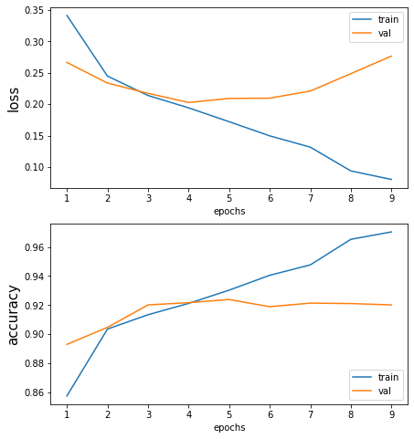
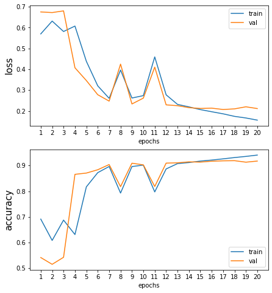

[<-PREV](toxiccomment.md)

# Toxic Comment Classification 
# Part 2. Deep Learning with RNNs for NLP 

1. Set up
2. Text preprocessing
    - Clean the text
    - Tokenize
    - Pad
3. Train Test split
4. Word embedding: GloVe
5. Build, Fit/Train, Predict, and Evaluate models
    - Simple GRU 
    - GlobalMaxPooling GRU
    - GlobalAveragePooling GRU
    - GlobalMaxPooling + GlobalAveragePooling GRU
    - Simple Bidirectional GRU
    - LSTM 
    - BiLSTM
6. Compare the results

# 1. Set up
## 1.1 Import libraries


```python
pip install clean-text
```

    Collecting clean-text
      Downloading clean_text-0.4.0-py3-none-any.whl (9.8 kB)
    Requirement already satisfied: emoji in /opt/conda/lib/python3.7/site-packages (from clean-text) (1.2.0)
    Collecting ftfy<7.0,>=6.0
      Downloading ftfy-6.0.3.tar.gz (64 kB)
         |████████████████████████████████| 64 kB 1.0 MB/s eta 0:00:01
    [?25hRequirement already satisfied: wcwidth in /opt/conda/lib/python3.7/site-packages (from ftfy<7.0,>=6.0->clean-text) (0.2.5)
    Building wheels for collected packages: ftfy
      Building wheel for ftfy (setup.py) ... [?25ldone
    [?25h  Created wheel for ftfy: filename=ftfy-6.0.3-py3-none-any.whl size=41913 sha256=d7bbf1e6469885bf6a0bdb84ba51c7fb561f89c889e5142796f97da2afa9c023
      Stored in directory: /root/.cache/pip/wheels/19/f5/38/273eb3b5e76dfd850619312f693716ac4518b498f5ffb6f56d
    Successfully built ftfy
    Installing collected packages: ftfy, clean-text
    Successfully installed clean-text-0.4.0 ftfy-6.0.3
    Note: you may need to restart the kernel to use updated packages.


```python
import numpy as np
import pandas as pd
import matplotlib.pyplot as plt
import seaborn as sns

from sklearn.model_selection import train_test_split

import tensorflow as tf
print('Tensorflow version: ', tf.__version__)
from tensorflow import keras

from cleantext import clean
```

    Tensorflow version:  2.4.1


## 1.2 Configuration - TPU


```python
def setup_accelerator():
    try:
        tpu = tf.distribute.cluster_resolver.TPUClusterResolver()
        tf.config.experimental_connect_to_cluster(tpu)
        tf.tpu.experimental.initialize_tpu_system(tpu)
        strategy = tf.distribute.experimental.TPUStrategy(tpu)
        print('Running on TPU: ', tpu.master())
    except ValueError:
        strategy = tf.distribute.get_strategy() # for CPU or GPU
    print('Number of replicas:', strategy.num_replicas_in_sync)
    return strategy

strategy = setup_accelerator()
```

    Running on TPU:  grpc://10.0.0.2:8470
    Number of replicas: 8


## 1.3 Set up directories


```python
input_dir = '../input/toxiccomment-part1/'
output_dir = ''
```


```python
results = {}
```

## 1.4 Load the data


```python
df = pd.read_csv(input_dir + 'preprocessed.csv')
```


```python
print(df.info())
df.head()
```

    <class 'pandas.core.frame.DataFrame'>
    RangeIndex: 32450 entries, 0 to 32449
    Data columns (total 2 columns):
     #   Column        Non-Null Count  Dtype 
    ---  ------        --------------  ----- 
     0   comment_text  32450 non-null  object
     1   Toxic         32450 non-null  int64 
    dtypes: int64(1), object(1)
    memory usage: 507.2+ KB
    None


<div>
<style scoped>
    .dataframe tbody tr th:only-of-type {
        vertical-align: middle;
    }

    .dataframe tbody tr th {
        vertical-align: top;
    }

    .dataframe thead th {
        text-align: right;
    }
</style>
<table border="1" class="dataframe">
  <thead>
    <tr style="text-align: right;">
      <th></th>
      <th>comment_text</th>
      <th>Toxic</th>
    </tr>
  </thead>
  <tbody>
    <tr>
      <th>0</th>
      <td>COCKSUCKER BEFORE YOU PISS AROUND ON MY WORK</td>
      <td>1</td>
    </tr>
    <tr>
      <th>1</th>
      <td>Hey... what is it..\n@ | talk .\nWhat is it......</td>
      <td>1</td>
    </tr>
    <tr>
      <th>2</th>
      <td>Bye! \n\nDon't look, come or think of comming ...</td>
      <td>1</td>
    </tr>
    <tr>
      <th>3</th>
      <td>You are gay or antisemmitian? \n\nArchangel WH...</td>
      <td>1</td>
    </tr>
    <tr>
      <th>4</th>
      <td>FUCK YOUR FILTHY MOTHER IN THE ASS, DRY!</td>
      <td>1</td>
    </tr>
  </tbody>
</table>
</div>


## 1.5 Configuration


```python
n_classes = 1
SEED = 42
BATCH_SIZE = 16 * strategy.num_replicas_in_sync
print(f'Batch size: {BATCH_SIZE}')

EPOCHS = 20
```

    Batch size: 128


## 1.6 Define X, y


```python
X = df['comment_text']
y = df['Toxic']
```

# 2. Text preprocessing

## 2.1 Clean the text


```python
def cleaning(text):
    return clean(text, no_line_breaks=True, no_urls=True, no_punct=True)

cleaned_X = np.vectorize(cleaning)(X)
```


```python
idx=10
print('----------Original text----------')
print(X[idx])
print('----------Cleaned text----------')
print(cleaned_X[idx])
```

    ----------Original text----------
    Why can't you believe how fat Artie is? Did you see him on his recent appearence on the Tonight Show with Jay Leno? He looks absolutely AWFUL! If I had to put money on it, I'd say that Artie Lange is a can't miss candidate for the 2007 Dead pool!   
    
      
    Kindly keep your malicious fingers off of my above comment, . Everytime you remove it, I will repost it!!!
    ----------Cleaned text----------
    why cant you believe how fat artie is did you see him on his recent appearence on the tonight show with jay leno he looks absolutely awful if i had to put money on it id say that artie lange is a cant miss candidate for the 2007 dead pool kindly keep your malicious fingers off of my above comment everytime you remove it i will repost it


## 2.2 Tokenize


```python
from keras.preprocessing.text import Tokenizer
from keras.preprocessing.sequence import pad_sequences

t = Tokenizer()
t.fit_on_texts(cleaned_X)
vocab_size = len(t.word_index) + 1
encoded_X = t.texts_to_sequences(cleaned_X)
```

## 2.3 Pad


```python
len_X = [len(x) for x in encoded_X ]

plt.figure(figsize = (6, 4))
sns.histplot(data=len_X, bins = np.arange(0, 410, 10))
plt.xlabel('The length of X');
```


    

    


```python
maxlen = 150
padded_X = pad_sequences(encoded_X, maxlen=maxlen, padding='post')
```


```python
idx = 1
print('----------Original----------')
print(X[idx])
print('----------Tokenized----------')
print(encoded_X[idx])
print('----------Padded----------')
print(padded_X[idx])
```

    ----------Original----------
    Hey... what is it..
    @ | talk .
    What is it... an exclusive group of some WP TALIBANS...who are good at destroying, self-appointed purist who GANG UP any one who asks them questions abt their ANTI-SOCIAL and DESTRUCTIVE (non)-contribution at WP?
    
    Ask Sityush to clean up his behavior than issue me nonsensical warnings...
    ----------Tokenized----------
    [197, 34, 8, 11, 50, 34, 8, 11, 29, 4706, 533, 7, 63, 832, 33755, 14, 111, 43, 3441, 6873, 33756, 51, 3124, 60, 74, 54, 51, 4985, 97, 397, 23129, 104, 10694, 6, 4707, 33757, 43, 832, 277, 23130, 3, 1457, 60, 65, 930, 105, 348, 23, 6874, 1203]
    ----------Padded----------
    [  197    34     8    11    50    34     8    11    29  4706   533     7
        63   832 33755    14   111    43  3441  6873 33756    51  3124    60
        74    54    51  4985    97   397 23129   104 10694     6  4707 33757
        43   832   277 23130     3  1457    60    65   930   105   348    23
      6874  1203     0     0     0     0     0     0     0     0     0     0
         0     0     0     0     0     0     0     0     0     0     0     0
         0     0     0     0     0     0     0     0     0     0     0     0
         0     0     0     0     0     0     0     0     0     0     0     0
         0     0     0     0     0     0     0     0     0     0     0     0
         0     0     0     0     0     0     0     0     0     0     0     0
         0     0     0     0     0     0     0     0     0     0     0     0
         0     0     0     0     0     0     0     0     0     0     0     0
         0     0     0     0     0     0]


# 3. Train Test splilt


```python
X_train, X_test, y_train, y_test = train_test_split(padded_X, y, test_size=0.2, random_state=SEED)
X_valid, X_test, y_valid, y_test = train_test_split(X_test, y_test, test_size=0.5, random_state=SEED)
n_train = X_train.shape[0]
n_valid = X_valid.shape[0]
n_test = X_test.shape[0]
print(f'The size of train set: {n_train}')
print(f'The size of valid set: {n_valid}')
print(f'The size of test set: {n_test}')
```

    The size of train set: 25960
    The size of valid set: 3245
    The size of test set: 3245


# 4. Word Embedding: GloVe


```python
embeddings_index = {}
f = open('../input/glove6b300dtxt/glove.6B.300d.txt','r',encoding='utf-8')
for line in f:
    values = line.split(' ')
    word = values[0]
    coefs = np.asarray(values[1:], dtype='float32')
    embeddings_index[word] = coefs
f.close()

print('Loaded %s word vectors.' % len(embeddings_index))
```

    Loaded 400000 word vectors.


```python
embed_size = 300
embedding_matrix = np.zeros((vocab_size, embed_size))
for word, i in t.word_index.items():
    embedding_vector = embeddings_index.get(word)
    if embedding_vector is not None:
        embedding_matrix[i] = embedding_vector
```

# 5. Build, Compile, Train, Evaluate models


```python
def plot_train_history(history):
    
    fig, ax = plt.subplots(2, 1, figsize=(7, 8))
    x = np.arange(1, len(history.history['loss'])+1)

    ax[0].plot(x, history.history['loss'])
    ax[0].plot(x, history.history['val_loss'])
    ax[0].set_xlabel('epochs')
    ax[0].set_xticks(x)
    ax[0].set_ylabel('loss', fontsize=15)
    ax[0].legend(['train', 'val'], loc='upper right')

    ax[1].plot(x, history.history['accuracy'])
    ax[1].plot(x, history.history['val_accuracy'])
    ax[1].set_xlabel('epochs')
    ax[1].set_xticks(x)
    ax[1].set_ylabel('accuracy', fontsize=15)
    ax[1].legend(['train', 'val'], loc='lower right');
```


```python
from keras.models import Sequential, Model
from keras.layers import Input, Dense, GlobalMaxPooling1D, GlobalAveragePooling1D, concatenate
from keras.layers import RNN, SimpleRNN, GRU, LSTM, Bidirectional
from keras.layers.embeddings import Embedding
from keras.callbacks import ModelCheckpoint, ReduceLROnPlateau, EarlyStopping
```

## 5.1 GRU

### 5.1.1 Simple GRU


```python
keras.backend.clear_session()

with strategy.scope():
    model = Sequential()
    model.add(Embedding(vocab_size, embed_size, weights=[embedding_matrix], input_length=maxlen, trainable=False))
    model.add(GRU(256))
    model.add(Dense(n_classes, activation='sigmoid'))
    model.compile(loss='binary_crossentropy', optimizer='adam', metrics=['accuracy'])

model.summary()

FILEPATH = output_dir + "toxiccomment_gru.h5"
ckp = ModelCheckpoint(FILEPATH, monitor = 'val_loss', verbose = 1, save_best_only = True, mode = 'min')
rlr = ReduceLROnPlateau(monitor = 'val_loss', factor = 0.1, patience = 3, verbose = 1, min_delta = 1e-4, min_lr = 1e-8, mode = 'min', cooldown=1)
es = EarlyStopping(monitor = 'val_loss', min_delta = 1e-4, patience = 5, mode = 'min', restore_best_weights = True, verbose = 1)

history = model.fit(X_train, 
                    y_train, 
                    steps_per_epoch= n_train // BATCH_SIZE,
                    validation_data=(X_valid, y_valid),
                    validation_batch_size=n_valid,
                    batch_size=BATCH_SIZE, 
                    epochs=EPOCHS,
                    callbacks=[ckp, rlr, es],
                    verbose=1)

plot_train_history(history)
test_result = model.evaluate(X_test, y_test, batch_size=strategy.num_replicas_in_sync)
results['Simple GRU'] = test_result
print(f"Test result: {test_result}")
```

    Model: "sequential"
    _________________________________________________________________
    Layer (type)                 Output Shape              Param #   
    =================================================================
    embedding (Embedding)        (None, 150, 300)          23203800  
    _________________________________________________________________
    gru (GRU)                    (None, 256)               428544    
    _________________________________________________________________
    dense (Dense)                (None, 1)                 257       
    =================================================================
    Total params: 23,632,601
    Trainable params: 428,801
    Non-trainable params: 23,203,800
    _________________________________________________________________
    Epoch 1/20
    202/202 [==============================] - 10s 30ms/step - loss: 0.5963 - accuracy: 0.6555 - val_loss: 0.4202 - val_accuracy: 0.8299
    
    Epoch 00001: val_loss improved from inf to 0.42023, saving model to toxiccomment_gru.h5
    Epoch 2/20
    202/202 [==============================] - 5s 22ms/step - loss: 0.4172 - accuracy: 0.8236 - val_loss: 0.4138 - val_accuracy: 0.8382
    
    Epoch 00002: val_loss improved from 0.42023 to 0.41385, saving model to toxiccomment_gru.h5
    Epoch 3/20
    202/202 [==============================] - 5s 22ms/step - loss: 0.4015 - accuracy: 0.8283 - val_loss: 0.2991 - val_accuracy: 0.8814
    
    Epoch 00003: val_loss improved from 0.41385 to 0.29911, saving model to toxiccomment_gru.h5
    Epoch 4/20
    202/202 [==============================] - 5s 22ms/step - loss: 0.3102 - accuracy: 0.8776 - val_loss: 0.2491 - val_accuracy: 0.8955
    
    Epoch 00004: val_loss improved from 0.29911 to 0.24906, saving model to toxiccomment_gru.h5
    Epoch 5/20
    202/202 [==============================] - 5s 23ms/step - loss: 0.2516 - accuracy: 0.8933 - val_loss: 0.2269 - val_accuracy: 0.9122
    
    Epoch 00005: val_loss improved from 0.24906 to 0.22691, saving model to toxiccomment_gru.h5
    Epoch 6/20
    202/202 [==============================] - 4s 22ms/step - loss: 0.2357 - accuracy: 0.9042 - val_loss: 0.2494 - val_accuracy: 0.8949
    
    Epoch 00006: val_loss did not improve from 0.22691
    Epoch 7/20
    202/202 [==============================] - 4s 22ms/step - loss: 0.2199 - accuracy: 0.9095 - val_loss: 0.2380 - val_accuracy: 0.8998
    
    Epoch 00007: val_loss did not improve from 0.22691
    Epoch 8/20
    202/202 [==============================] - 4s 22ms/step - loss: 0.2069 - accuracy: 0.9163 - val_loss: 0.2093 - val_accuracy: 0.9208
    
    Epoch 00008: val_loss improved from 0.22691 to 0.20935, saving model to toxiccomment_gru.h5
    Epoch 9/20
    202/202 [==============================] - 4s 22ms/step - loss: 0.1885 - accuracy: 0.9230 - val_loss: 0.2061 - val_accuracy: 0.9193
    
    Epoch 00009: val_loss improved from 0.20935 to 0.20607, saving model to toxiccomment_gru.h5
    Epoch 10/20
    202/202 [==============================] - 4s 22ms/step - loss: 0.1883 - accuracy: 0.9249 - val_loss: 0.2307 - val_accuracy: 0.9048
    
    Epoch 00010: val_loss did not improve from 0.20607
    Epoch 11/20
    202/202 [==============================] - 4s 22ms/step - loss: 0.1735 - accuracy: 0.9293 - val_loss: 0.2290 - val_accuracy: 0.9063
    
    Epoch 00011: val_loss did not improve from 0.20607
    Epoch 12/20
    202/202 [==============================] - 4s 22ms/step - loss: 0.1662 - accuracy: 0.9345 - val_loss: 0.2051 - val_accuracy: 0.9183
    
    Epoch 00012: val_loss improved from 0.20607 to 0.20506, saving model to toxiccomment_gru.h5
    Epoch 13/20
    202/202 [==============================] - 5s 23ms/step - loss: 0.1499 - accuracy: 0.9423 - val_loss: 0.2268 - val_accuracy: 0.9149
    
    Epoch 00013: val_loss did not improve from 0.20506
    Epoch 14/20
    202/202 [==============================] - 4s 22ms/step - loss: 0.1426 - accuracy: 0.9444 - val_loss: 0.2227 - val_accuracy: 0.9183
    
    Epoch 00014: val_loss did not improve from 0.20506
    Epoch 15/20
    202/202 [==============================] - 5s 22ms/step - loss: 0.1187 - accuracy: 0.9541 - val_loss: 0.2286 - val_accuracy: 0.9153
    
    Epoch 00015: val_loss did not improve from 0.20506
    
    Epoch 00015: ReduceLROnPlateau reducing learning rate to 0.00010000000474974513.
    Epoch 16/20
    202/202 [==============================] - 5s 22ms/step - loss: 0.0849 - accuracy: 0.9718 - val_loss: 0.2569 - val_accuracy: 0.9159
    
    Epoch 00016: val_loss did not improve from 0.20506
    Epoch 17/20
    202/202 [==============================] - 4s 22ms/step - loss: 0.0709 - accuracy: 0.9769 - val_loss: 0.2756 - val_accuracy: 0.9162
    
    Epoch 00017: val_loss did not improve from 0.20506
    Restoring model weights from the end of the best epoch.
    Epoch 00017: early stopping
    406/406 [==============================] - 6s 13ms/step - loss: 0.2235 - accuracy: 0.9106
    Test result: [0.22347930073738098, 0.9106317162513733]


    

    


### 5.1.2 GlobalMaxPooling GRU


```python
keras.backend.clear_session()

with strategy.scope():
    model = Sequential()
    model.add(Embedding(vocab_size, embed_size, weights=[embedding_matrix], input_length=maxlen, trainable=False))
    model.add(GRU(256, return_sequences=True))
    model.add(GlobalAveragePooling1D())
    model.add(Dense(n_classes, activation='sigmoid'))
    model.compile(loss='binary_crossentropy', optimizer='adam', metrics=['accuracy'])

model.summary()

FILEPATH = output_dir + "toxiccomment_gru_globalmaxpool.h5"
ckp = ModelCheckpoint(FILEPATH, monitor = 'val_loss', verbose = 1, save_best_only = True, mode = 'min')
rlr = ReduceLROnPlateau(monitor = 'val_loss', factor = 0.1, patience = 3, verbose = 1, min_delta = 1e-4, min_lr = 1e-8, mode = 'min', cooldown=1)
es = EarlyStopping(monitor = 'val_loss', min_delta = 1e-4, patience = 5, mode = 'min', restore_best_weights = True, verbose = 1)

history = model.fit(X_train, 
                    y_train, 
                    steps_per_epoch= n_train // BATCH_SIZE,
                    validation_data=(X_valid, y_valid),
                    validation_batch_size=n_valid,
                    batch_size=BATCH_SIZE, 
                    epochs=EPOCHS,
                    callbacks=[ckp, rlr, es],
                    verbose=1)

plot_train_history(history)
test_result = model.evaluate(X_test, y_test, batch_size=strategy.num_replicas_in_sync)
results['GlobalMaxPooling GRU'] = test_result
print(f"Test result: {test_result}")
```

    Model: "sequential"
    _________________________________________________________________
    Layer (type)                 Output Shape              Param #   
    =================================================================
    embedding (Embedding)        (None, 150, 300)          23203800  
    _________________________________________________________________
    gru (GRU)                    (None, 150, 256)          428544    
    _________________________________________________________________
    global_average_pooling1d (Gl (None, 256)               0         
    _________________________________________________________________
    dense (Dense)                (None, 1)                 257       
    =================================================================
    Total params: 23,632,601
    Trainable params: 428,801
    Non-trainable params: 23,203,800
    _________________________________________________________________
    Epoch 1/20
    202/202 [==============================] - 10s 27ms/step - loss: 0.4292 - accuracy: 0.8052 - val_loss: 0.2613 - val_accuracy: 0.8949
    
    Epoch 00001: val_loss improved from inf to 0.26133, saving model to toxiccomment_gru_globalmaxpool.h5
    Epoch 2/20
    202/202 [==============================] - 5s 22ms/step - loss: 0.2597 - accuracy: 0.8977 - val_loss: 0.2218 - val_accuracy: 0.9153
    
    Epoch 00002: val_loss improved from 0.26133 to 0.22177, saving model to toxiccomment_gru_globalmaxpool.h5
    Epoch 3/20
    202/202 [==============================] - 5s 23ms/step - loss: 0.2277 - accuracy: 0.9077 - val_loss: 0.2107 - val_accuracy: 0.9153
    
    Epoch 00003: val_loss improved from 0.22177 to 0.21067, saving model to toxiccomment_gru_globalmaxpool.h5
    Epoch 4/20
    202/202 [==============================] - 5s 23ms/step - loss: 0.2024 - accuracy: 0.9190 - val_loss: 0.2157 - val_accuracy: 0.9149
    
    Epoch 00004: val_loss did not improve from 0.21067
    Epoch 5/20
    202/202 [==============================] - 5s 23ms/step - loss: 0.1776 - accuracy: 0.9266 - val_loss: 0.2074 - val_accuracy: 0.9193
    
    Epoch 00005: val_loss improved from 0.21067 to 0.20744, saving model to toxiccomment_gru_globalmaxpool.h5
    Epoch 6/20
    202/202 [==============================] - 5s 22ms/step - loss: 0.1548 - accuracy: 0.9376 - val_loss: 0.2051 - val_accuracy: 0.9227
    
    Epoch 00006: val_loss improved from 0.20744 to 0.20506, saving model to toxiccomment_gru_globalmaxpool.h5
    Epoch 7/20
    202/202 [==============================] - 5s 22ms/step - loss: 0.1365 - accuracy: 0.9452 - val_loss: 0.2136 - val_accuracy: 0.9196
    
    Epoch 00007: val_loss did not improve from 0.20506
    Epoch 8/20
    202/202 [==============================] - 5s 23ms/step - loss: 0.1103 - accuracy: 0.9547 - val_loss: 0.2472 - val_accuracy: 0.9153
    
    Epoch 00008: val_loss did not improve from 0.20506
    Epoch 9/20
    202/202 [==============================] - 4s 22ms/step - loss: 0.0985 - accuracy: 0.9623 - val_loss: 0.2417 - val_accuracy: 0.9146
    
    Epoch 00009: val_loss did not improve from 0.20506
    
    Epoch 00009: ReduceLROnPlateau reducing learning rate to 0.00010000000474974513.
    Epoch 10/20
    202/202 [==============================] - 4s 22ms/step - loss: 0.0652 - accuracy: 0.9767 - val_loss: 0.3012 - val_accuracy: 0.9116
    
    Epoch 00010: val_loss did not improve from 0.20506
    Epoch 11/20
    202/202 [==============================] - 5s 22ms/step - loss: 0.0461 - accuracy: 0.9841 - val_loss: 0.3406 - val_accuracy: 0.9100
    
    Epoch 00011: val_loss did not improve from 0.20506
    Restoring model weights from the end of the best epoch.
    Epoch 00011: early stopping
    406/406 [==============================] - 6s 13ms/step - loss: 0.2246 - accuracy: 0.9149
    Test result: [0.22457848489284515, 0.9149460792541504]


    

    


### 5.1.3 GlobalAveragePooling GRU


```python
keras.backend.clear_session()

with strategy.scope():
    model = Sequential()
    model.add(Embedding(vocab_size, embed_size, weights=[embedding_matrix], input_length=maxlen, trainable=False))
    model.add(GRU(256, return_sequences=True))
    model.add(GlobalAveragePooling1D())
    model.add(Dense(n_classes, activation='sigmoid'))
    model.compile(loss='binary_crossentropy', optimizer='adam', metrics=['accuracy'])

model.summary()

FILEPATH = output_dir + "toxiccomment_gru_globalaveragepool.h5"
ckp = ModelCheckpoint(FILEPATH, monitor = 'val_loss', verbose = 1, save_best_only = True, mode = 'min')
rlr = ReduceLROnPlateau(monitor = 'val_loss', factor = 0.1, patience = 3, verbose = 1, min_delta = 1e-4, min_lr = 1e-8, mode = 'min', cooldown=1)
es = EarlyStopping(monitor = 'val_loss', min_delta = 1e-4, patience = 5, mode = 'min', restore_best_weights = True, verbose = 1)

history = model.fit(X_train, 
                    y_train, 
                    steps_per_epoch= n_train // BATCH_SIZE,
                    validation_data=(X_valid, y_valid),
                    validation_batch_size=n_valid,
                    batch_size=BATCH_SIZE, 
                    epochs=EPOCHS,
                    callbacks=[ckp, rlr, es],
                    verbose=1)

plot_train_history(history)
test_result = model.evaluate(X_test, y_test, batch_size=strategy.num_replicas_in_sync)
results['GlobalAveragePooling GRU'] = test_result
print(f"Test result: {test_result}")
```

    Model: "sequential"
    _________________________________________________________________
    Layer (type)                 Output Shape              Param #   
    =================================================================
    embedding (Embedding)        (None, 150, 300)          23203800  
    _________________________________________________________________
    gru (GRU)                    (None, 150, 256)          428544    
    _________________________________________________________________
    global_average_pooling1d (Gl (None, 256)               0         
    _________________________________________________________________
    dense (Dense)                (None, 1)                 257       
    =================================================================
    Total params: 23,632,601
    Trainable params: 428,801
    Non-trainable params: 23,203,800
    _________________________________________________________________
    Epoch 1/20
    202/202 [==============================] - 9s 28ms/step - loss: 0.4424 - accuracy: 0.7969 - val_loss: 0.2667 - val_accuracy: 0.8931
    
    Epoch 00001: val_loss improved from inf to 0.26665, saving model to toxiccomment_gru_globalaveragepool.h5
    Epoch 2/20
    202/202 [==============================] - 6s 26ms/step - loss: 0.2539 - accuracy: 0.9024 - val_loss: 0.2338 - val_accuracy: 0.9048
    
    Epoch 00002: val_loss improved from 0.26665 to 0.23375, saving model to toxiccomment_gru_globalaveragepool.h5
    Epoch 3/20
    202/202 [==============================] - 5s 22ms/step - loss: 0.2100 - accuracy: 0.9152 - val_loss: 0.2174 - val_accuracy: 0.9202
    
    Epoch 00003: val_loss improved from 0.23375 to 0.21741, saving model to toxiccomment_gru_globalaveragepool.h5
    Epoch 4/20
    202/202 [==============================] - 5s 23ms/step - loss: 0.2016 - accuracy: 0.9197 - val_loss: 0.2029 - val_accuracy: 0.9217
    
    Epoch 00004: val_loss improved from 0.21741 to 0.20289, saving model to toxiccomment_gru_globalaveragepool.h5
    Epoch 5/20
    202/202 [==============================] - 4s 22ms/step - loss: 0.1704 - accuracy: 0.9307 - val_loss: 0.2093 - val_accuracy: 0.9239
    
    Epoch 00005: val_loss did not improve from 0.20289
    Epoch 6/20
    202/202 [==============================] - 5s 23ms/step - loss: 0.1513 - accuracy: 0.9400 - val_loss: 0.2098 - val_accuracy: 0.9190
    
    Epoch 00006: val_loss did not improve from 0.20289
    Epoch 7/20
    202/202 [==============================] - 5s 22ms/step - loss: 0.1307 - accuracy: 0.9488 - val_loss: 0.2211 - val_accuracy: 0.9214
    
    Epoch 00007: val_loss did not improve from 0.20289
    
    Epoch 00007: ReduceLROnPlateau reducing learning rate to 0.00010000000474974513.
    Epoch 8/20
    202/202 [==============================] - 4s 22ms/step - loss: 0.0956 - accuracy: 0.9653 - val_loss: 0.2488 - val_accuracy: 0.9211
    
    Epoch 00008: val_loss did not improve from 0.20289
    Epoch 9/20
    202/202 [==============================] - 4s 22ms/step - loss: 0.0802 - accuracy: 0.9704 - val_loss: 0.2767 - val_accuracy: 0.9202
    
    Epoch 00009: val_loss did not improve from 0.20289
    Restoring model weights from the end of the best epoch.
    Epoch 00009: early stopping
    406/406 [==============================] - 6s 13ms/step - loss: 0.2171 - accuracy: 0.9153
    Test result: [0.21706654131412506, 0.9152542352676392]


    

    


### 5.1.4 GlobalAveragePooling + GlobalMaxPooling GRU


```python
keras.backend.clear_session()

with strategy.scope():
    inputs = Input(shape=(maxlen, ))
    x = Embedding(vocab_size, embed_size, weights=[embedding_matrix], trainable=False)(inputs)
    x = GRU(256, return_sequences=True)(x)
    avg_pool = GlobalAveragePooling1D()(x)
    max_pool = GlobalMaxPooling1D()(x)
    x = concatenate([avg_pool, max_pool])
    x = Dense(n_classes, activation='sigmoid')(x)
    
    model = Model(inputs=inputs, outputs=x)
    model.compile(loss='binary_crossentropy', optimizer='adam', metrics=['accuracy'])

model.summary()

FILEPATH = output_dir + "toxiccomment_gru_globalmaxaveragepool.h5"
ckp = ModelCheckpoint(FILEPATH, monitor = 'val_loss', verbose = 1, save_best_only = True, mode = 'min')
rlr = ReduceLROnPlateau(monitor = 'val_loss', factor = 0.1, patience = 3, verbose = 1, min_delta = 1e-4, min_lr = 1e-8, mode = 'min', cooldown=1)
es = EarlyStopping(monitor = 'val_loss', min_delta = 1e-4, patience = 5, mode = 'min', restore_best_weights = True, verbose = 1)

history = model.fit(X_train, 
                    y_train, 
                    steps_per_epoch= n_train // BATCH_SIZE,
                    validation_data=(X_valid, y_valid),
                    validation_batch_size=n_valid,
                    batch_size=BATCH_SIZE, 
                    epochs=EPOCHS,
                    callbacks=[ckp, rlr, es],
                    verbose=1)

plot_train_history(history)
test_result = model.evaluate(X_test, y_test, batch_size=strategy.num_replicas_in_sync)
results['GlobalMaxAveragePooling GRU'] = test_result
print(f"Test result: {test_result}")
```

    Model: "model"
    __________________________________________________________________________________________________
    Layer (type)                    Output Shape         Param #     Connected to                     
    ==================================================================================================
    input_1 (InputLayer)            [(None, 150)]        0                                            
    __________________________________________________________________________________________________
    embedding (Embedding)           (None, 150, 300)     23203800    input_1[0][0]                    
    __________________________________________________________________________________________________
    gru (GRU)                       (None, 150, 256)     428544      embedding[0][0]                  
    __________________________________________________________________________________________________
    global_average_pooling1d (Globa (None, 256)          0           gru[0][0]                        
    __________________________________________________________________________________________________
    global_max_pooling1d (GlobalMax (None, 256)          0           gru[0][0]                        
    __________________________________________________________________________________________________
    concatenate (Concatenate)       (None, 512)          0           global_average_pooling1d[0][0]   
                                                                     global_max_pooling1d[0][0]       
    __________________________________________________________________________________________________
    dense (Dense)                   (None, 1)            513         concatenate[0][0]                
    ==================================================================================================
    Total params: 23,632,857
    Trainable params: 429,057
    Non-trainable params: 23,203,800
    __________________________________________________________________________________________________
    Epoch 1/20
    202/202 [==============================] - 9s 27ms/step - loss: 0.3592 - accuracy: 0.8378 - val_loss: 0.2206 - val_accuracy: 0.9122
    
    Epoch 00001: val_loss improved from inf to 0.22059, saving model to toxiccomment_gru_globalmaxaveragepool.h5
    Epoch 2/20
    202/202 [==============================] - 5s 22ms/step - loss: 0.2105 - accuracy: 0.9137 - val_loss: 0.2158 - val_accuracy: 0.9143
    
    Epoch 00002: val_loss improved from 0.22059 to 0.21577, saving model to toxiccomment_gru_globalmaxaveragepool.h5
    Epoch 3/20
    202/202 [==============================] - 4s 22ms/step - loss: 0.1951 - accuracy: 0.9212 - val_loss: 0.2108 - val_accuracy: 0.9165
    
    Epoch 00003: val_loss improved from 0.21577 to 0.21076, saving model to toxiccomment_gru_globalmaxaveragepool.h5
    Epoch 4/20
    202/202 [==============================] - 4s 22ms/step - loss: 0.1621 - accuracy: 0.9366 - val_loss: 0.1932 - val_accuracy: 0.9260
    
    Epoch 00004: val_loss improved from 0.21076 to 0.19317, saving model to toxiccomment_gru_globalmaxaveragepool.h5
    Epoch 5/20
    202/202 [==============================] - 4s 22ms/step - loss: 0.1414 - accuracy: 0.9465 - val_loss: 0.1950 - val_accuracy: 0.9245
    
    Epoch 00005: val_loss did not improve from 0.19317
    Epoch 6/20
    202/202 [==============================] - 4s 22ms/step - loss: 0.1211 - accuracy: 0.9553 - val_loss: 0.1956 - val_accuracy: 0.9276
    
    Epoch 00006: val_loss did not improve from 0.19317
    Epoch 7/20
    202/202 [==============================] - 5s 23ms/step - loss: 0.0944 - accuracy: 0.9679 - val_loss: 0.2298 - val_accuracy: 0.9193
    
    Epoch 00007: val_loss did not improve from 0.19317
    
    Epoch 00007: ReduceLROnPlateau reducing learning rate to 0.00010000000474974513.
    Epoch 8/20
    202/202 [==============================] - 4s 22ms/step - loss: 0.0699 - accuracy: 0.9786 - val_loss: 0.2188 - val_accuracy: 0.9214
    
    Epoch 00008: val_loss did not improve from 0.19317
    Epoch 9/20
    202/202 [==============================] - 4s 22ms/step - loss: 0.0521 - accuracy: 0.9847 - val_loss: 0.2277 - val_accuracy: 0.9214
    
    Epoch 00009: val_loss did not improve from 0.19317
    Restoring model weights from the end of the best epoch.
    Epoch 00009: early stopping
    406/406 [==============================] - 6s 13ms/step - loss: 0.2064 - accuracy: 0.9217
    Test result: [0.2063855081796646, 0.9217256903648376]


    

    


### 5.1.5 Simple BiGRU


```python
keras.backend.clear_session()

with strategy.scope():
    inputs = Input(shape=(maxlen, ))
    x = Embedding(vocab_size, embed_size, weights=[embedding_matrix], trainable=False)(inputs)
    x = Bidirectional(GRU(128))(x)
    x = Dense(n_classes, activation='sigmoid')(x)
    
    model = Model(inputs=inputs, outputs=x)
    model.compile(loss='binary_crossentropy', optimizer='adam', metrics=['accuracy'])

model.summary()

FILEPATH = output_dir + "toxiccomment_bigru.h5"
ckp = ModelCheckpoint(FILEPATH, monitor = 'val_loss', verbose = 1, save_best_only = True, mode = 'min')
rlr = ReduceLROnPlateau(monitor = 'val_loss', factor = 0.1, patience = 3, verbose = 1, min_delta = 1e-4, min_lr = 1e-8, mode = 'min', cooldown=1)
es = EarlyStopping(monitor = 'val_loss', min_delta = 1e-4, patience = 5, mode = 'min', restore_best_weights = True, verbose = 1)

history = model.fit(X_train, 
                    y_train, 
                    steps_per_epoch= n_train // BATCH_SIZE,
                    validation_data=(X_valid, y_valid),
                    validation_batch_size=n_valid,
                    batch_size=BATCH_SIZE, 
                    epochs=EPOCHS,
                    callbacks=[ckp, rlr, es],
                    verbose=1)

plot_train_history(history)
test_result = model.evaluate(X_test, y_test, batch_size=strategy.num_replicas_in_sync)
results['Simple BiGRU'] = test_result
print(f"Test result: {test_result}")
```

    Model: "model"
    _________________________________________________________________
    Layer (type)                 Output Shape              Param #   
    =================================================================
    input_1 (InputLayer)         [(None, 150)]             0         
    _________________________________________________________________
    embedding (Embedding)        (None, 150, 300)          23203800  
    _________________________________________________________________
    bidirectional (Bidirectional (None, 256)               330240    
    _________________________________________________________________
    dense (Dense)                (None, 1)                 257       
    =================================================================
    Total params: 23,534,297
    Trainable params: 330,497
    Non-trainable params: 23,203,800
    _________________________________________________________________
    Epoch 1/20
    202/202 [==============================] - 12s 29ms/step - loss: 0.4345 - accuracy: 0.7858 - val_loss: 0.2258 - val_accuracy: 0.9143
    
    Epoch 00001: val_loss improved from inf to 0.22578, saving model to toxiccomment_bigru.h5
    Epoch 2/20
    202/202 [==============================] - 6s 23ms/step - loss: 0.2270 - accuracy: 0.9058 - val_loss: 0.2065 - val_accuracy: 0.9223
    
    Epoch 00002: val_loss improved from 0.22578 to 0.20655, saving model to toxiccomment_bigru.h5
    Epoch 3/20
    202/202 [==============================] - 5s 23ms/step - loss: 0.2078 - accuracy: 0.9166 - val_loss: 0.1993 - val_accuracy: 0.9242
    
    Epoch 00003: val_loss improved from 0.20655 to 0.19929, saving model to toxiccomment_bigru.h5
    Epoch 4/20
    202/202 [==============================] - 5s 23ms/step - loss: 0.1786 - accuracy: 0.9289 - val_loss: 0.2012 - val_accuracy: 0.9183
    
    Epoch 00004: val_loss did not improve from 0.19929
    Epoch 5/20
    202/202 [==============================] - 5s 23ms/step - loss: 0.1518 - accuracy: 0.9420 - val_loss: 0.2012 - val_accuracy: 0.9220
    
    Epoch 00005: val_loss did not improve from 0.19929
    Epoch 6/20
    202/202 [==============================] - 5s 23ms/step - loss: 0.1335 - accuracy: 0.9478 - val_loss: 0.2126 - val_accuracy: 0.9233
    
    Epoch 00006: val_loss did not improve from 0.19929
    
    Epoch 00006: ReduceLROnPlateau reducing learning rate to 0.00010000000474974513.
    Epoch 7/20
    202/202 [==============================] - 5s 23ms/step - loss: 0.1031 - accuracy: 0.9625 - val_loss: 0.2145 - val_accuracy: 0.9254
    
    Epoch 00007: val_loss did not improve from 0.19929
    Epoch 8/20
    202/202 [==============================] - 5s 24ms/step - loss: 0.0903 - accuracy: 0.9674 - val_loss: 0.2174 - val_accuracy: 0.9220
    
    Epoch 00008: val_loss did not improve from 0.19929
    Restoring model weights from the end of the best epoch.
    Epoch 00008: early stopping
    406/406 [==============================] - 6s 14ms/step - loss: 0.2209 - accuracy: 0.9177
    Test result: [0.22086463868618011, 0.9177195429801941]


    

    


### 5.1.6 GlobalMaxPooling + GlobalAveragePooling Bidirectional GRU


```python
keras.backend.clear_session()

with strategy.scope():
    inputs = Input(shape=(maxlen, ))
    x = Embedding(vocab_size, embed_size, weights=[embedding_matrix], trainable=False)(inputs)
    x = Bidirectional(GRU(128, return_sequences=True))(x)
    avg_pool = GlobalAveragePooling1D()(x)
    max_pool = GlobalMaxPooling1D()(x)
    x = concatenate([avg_pool, max_pool])
    x = Dense(n_classes, activation='sigmoid')(x)
    
    model = Model(inputs=inputs, outputs=x)
    model.compile(loss='binary_crossentropy', optimizer='adam', metrics=['accuracy'])

model.summary()

FILEPATH = output_dir + "toxiccomment_bigru_globalmaxaveragepool.h5"
ckp = ModelCheckpoint(FILEPATH, monitor = 'val_loss', verbose = 1, save_best_only = True, mode = 'min')
rlr = ReduceLROnPlateau(monitor = 'val_loss', factor = 0.1, patience = 3, verbose = 1, min_delta = 1e-4, min_lr = 1e-8, mode = 'min', cooldown=1)
es = EarlyStopping(monitor = 'val_loss', min_delta = 1e-4, patience = 5, mode = 'min', restore_best_weights = True, verbose = 1)

history = model.fit(X_train, 
                    y_train, 
                    steps_per_epoch= n_train // BATCH_SIZE,
                    validation_data=(X_valid, y_valid),
                    validation_batch_size=n_valid,
                    batch_size=BATCH_SIZE, 
                    epochs=EPOCHS,
                    callbacks=[ckp, rlr, es],
                    verbose=1)

plot_train_history(history)
test_result = model.evaluate(X_test, y_test, batch_size=strategy.num_replicas_in_sync)
results['GlobalMaxAveragePooling BiGRU'] = test_result
print(f"Test result: {test_result}")
```

    Model: "model"
    __________________________________________________________________________________________________
    Layer (type)                    Output Shape         Param #     Connected to                     
    ==================================================================================================
    input_1 (InputLayer)            [(None, 150)]        0                                            
    __________________________________________________________________________________________________
    embedding (Embedding)           (None, 150, 300)     23203800    input_1[0][0]                    
    __________________________________________________________________________________________________
    bidirectional (Bidirectional)   (None, 150, 256)     330240      embedding[0][0]                  
    __________________________________________________________________________________________________
    global_average_pooling1d (Globa (None, 256)          0           bidirectional[0][0]              
    __________________________________________________________________________________________________
    global_max_pooling1d (GlobalMax (None, 256)          0           bidirectional[0][0]              
    __________________________________________________________________________________________________
    concatenate (Concatenate)       (None, 512)          0           global_average_pooling1d[0][0]   
                                                                     global_max_pooling1d[0][0]       
    __________________________________________________________________________________________________
    dense (Dense)                   (None, 1)            513         concatenate[0][0]                
    ==================================================================================================
    Total params: 23,534,553
    Trainable params: 330,753
    Non-trainable params: 23,203,800
    __________________________________________________________________________________________________
    Epoch 1/20
    202/202 [==============================] - 12s 30ms/step - loss: 0.3708 - accuracy: 0.8297 - val_loss: 0.2141 - val_accuracy: 0.9190
    
    Epoch 00001: val_loss improved from inf to 0.21413, saving model to toxiccomment_bigru_globalmaxaveragepool.h5
    Epoch 2/20
    202/202 [==============================] - 6s 25ms/step - loss: 0.2070 - accuracy: 0.9156 - val_loss: 0.1996 - val_accuracy: 0.9242
    
    Epoch 00002: val_loss improved from 0.21413 to 0.19956, saving model to toxiccomment_bigru_globalmaxaveragepool.h5
    Epoch 3/20
    202/202 [==============================] - 5s 24ms/step - loss: 0.1887 - accuracy: 0.9218 - val_loss: 0.2072 - val_accuracy: 0.9165
    
    Epoch 00003: val_loss did not improve from 0.19956
    Epoch 4/20
    202/202 [==============================] - 5s 23ms/step - loss: 0.1606 - accuracy: 0.9382 - val_loss: 0.1897 - val_accuracy: 0.9260
    
    Epoch 00004: val_loss improved from 0.19956 to 0.18975, saving model to toxiccomment_bigru_globalmaxaveragepool.h5
    Epoch 5/20
    202/202 [==============================] - 5s 24ms/step - loss: 0.1389 - accuracy: 0.9511 - val_loss: 0.1888 - val_accuracy: 0.9279
    
    Epoch 00005: val_loss improved from 0.18975 to 0.18885, saving model to toxiccomment_bigru_globalmaxaveragepool.h5
    Epoch 6/20
    202/202 [==============================] - 5s 24ms/step - loss: 0.1210 - accuracy: 0.9564 - val_loss: 0.1912 - val_accuracy: 0.9242
    
    Epoch 00006: val_loss did not improve from 0.18885
    Epoch 7/20
    202/202 [==============================] - 5s 23ms/step - loss: 0.0965 - accuracy: 0.9668 - val_loss: 0.2079 - val_accuracy: 0.9239
    
    Epoch 00007: val_loss did not improve from 0.18885
    Epoch 8/20
    202/202 [==============================] - 5s 23ms/step - loss: 0.0754 - accuracy: 0.9767 - val_loss: 0.2075 - val_accuracy: 0.9270
    
    Epoch 00008: val_loss did not improve from 0.18885
    
    Epoch 00008: ReduceLROnPlateau reducing learning rate to 0.00010000000474974513.
    Epoch 9/20
    202/202 [==============================] - 5s 23ms/step - loss: 0.0525 - accuracy: 0.9859 - val_loss: 0.2118 - val_accuracy: 0.9263
    
    Epoch 00009: val_loss did not improve from 0.18885
    Epoch 10/20
    202/202 [==============================] - 5s 24ms/step - loss: 0.0441 - accuracy: 0.9899 - val_loss: 0.2169 - val_accuracy: 0.9263
    
    Epoch 00010: val_loss did not improve from 0.18885
    Restoring model weights from the end of the best epoch.
    Epoch 00010: early stopping
    406/406 [==============================] - 6s 14ms/step - loss: 0.2083 - accuracy: 0.9205
    Test result: [0.2082514762878418, 0.9204930663108826]


    

    


## 5.2 LSTM


```python
keras.backend.clear_session()

with strategy.scope():
    model = Sequential()
    model.add(Embedding(vocab_size, embed_size, weights=[embedding_matrix], input_length=maxlen, trainable=False))
    model.add(LSTM(256))
    model.add(Dense(n_classes, activation='sigmoid'))
    model.compile(loss='binary_crossentropy', optimizer='adam', metrics=['accuracy'])

model.summary()

FILEPATH = output_dir + "toxiccomment_lstm.h5"
ckp = ModelCheckpoint(FILEPATH, monitor = 'val_loss', verbose = 1, save_best_only = True, mode = 'min')
rlr = ReduceLROnPlateau(monitor = 'val_loss', factor = 0.1, patience = 3, verbose = 1, min_delta = 1e-4, min_lr = 1e-8, mode = 'min', cooldown=1)
es = EarlyStopping(monitor = 'val_loss', min_delta = 1e-4, patience = 5, mode = 'min', restore_best_weights = True, verbose = 1)

history = model.fit(X_train, 
                    y_train, 
                    steps_per_epoch= n_train // BATCH_SIZE,
                    validation_data=(X_valid, y_valid),
                    validation_batch_size=n_valid,
                    batch_size=BATCH_SIZE, 
                    epochs=EPOCHS,
                    callbacks=[ckp, rlr, es],
                    verbose=1)

plot_train_history(history)
test_result = model.evaluate(X_test, y_test, batch_size=strategy.num_replicas_in_sync)
results['LSTM'] = test_result
print(f"Test result: {test_result}")
```

    Model: "sequential"
    _________________________________________________________________
    Layer (type)                 Output Shape              Param #   
    =================================================================
    embedding (Embedding)        (None, 150, 300)          23203800  
    _________________________________________________________________
    lstm (LSTM)                  (None, 256)               570368    
    _________________________________________________________________
    dense (Dense)                (None, 1)                 257       
    =================================================================
    Total params: 23,774,425
    Trainable params: 570,625
    Non-trainable params: 23,203,800
    _________________________________________________________________
    Epoch 1/20
    202/202 [==============================] - 10s 28ms/step - loss: 0.5867 - accuracy: 0.6687 - val_loss: 0.6753 - val_accuracy: 0.5411
    
    Epoch 00001: val_loss improved from inf to 0.67531, saving model to toxiccomment_lstm.h5
    Epoch 2/20
    202/202 [==============================] - 5s 22ms/step - loss: 0.6546 - accuracy: 0.5690 - val_loss: 0.6723 - val_accuracy: 0.5146
    
    Epoch 00002: val_loss improved from 0.67531 to 0.67229, saving model to toxiccomment_lstm.h5
    Epoch 3/20
    202/202 [==============================] - 4s 22ms/step - loss: 0.5931 - accuracy: 0.6624 - val_loss: 0.6804 - val_accuracy: 0.5421
    
    Epoch 00003: val_loss did not improve from 0.67229
    Epoch 4/20
    202/202 [==============================] - 4s 22ms/step - loss: 0.6603 - accuracy: 0.5494 - val_loss: 0.4077 - val_accuracy: 0.8659
    
    Epoch 00004: val_loss improved from 0.67229 to 0.40768, saving model to toxiccomment_lstm.h5
    Epoch 5/20
    202/202 [==============================] - 4s 22ms/step - loss: 0.4339 - accuracy: 0.8314 - val_loss: 0.3465 - val_accuracy: 0.8709
    
    Epoch 00005: val_loss improved from 0.40768 to 0.34655, saving model to toxiccomment_lstm.h5
    Epoch 6/20
    202/202 [==============================] - 5s 22ms/step - loss: 0.3326 - accuracy: 0.8629 - val_loss: 0.2786 - val_accuracy: 0.8838
    
    Epoch 00006: val_loss improved from 0.34655 to 0.27860, saving model to toxiccomment_lstm.h5
    Epoch 7/20
    202/202 [==============================] - 5s 22ms/step - loss: 0.2754 - accuracy: 0.8901 - val_loss: 0.2479 - val_accuracy: 0.9042
    
    Epoch 00007: val_loss improved from 0.27860 to 0.24789, saving model to toxiccomment_lstm.h5
    Epoch 8/20
    202/202 [==============================] - 5s 22ms/step - loss: 0.2981 - accuracy: 0.8665 - val_loss: 0.4253 - val_accuracy: 0.8179
    
    Epoch 00008: val_loss did not improve from 0.24789
    Epoch 9/20
    202/202 [==============================] - 4s 22ms/step - loss: 0.3080 - accuracy: 0.8793 - val_loss: 0.2342 - val_accuracy: 0.9094
    
    Epoch 00009: val_loss improved from 0.24789 to 0.23423, saving model to toxiccomment_lstm.h5
    Epoch 10/20
    202/202 [==============================] - 4s 22ms/step - loss: 0.2849 - accuracy: 0.9027 - val_loss: 0.2623 - val_accuracy: 0.9029
    
    Epoch 00010: val_loss did not improve from 0.23423
    Epoch 11/20
    202/202 [==============================] - 4s 22ms/step - loss: 0.4109 - accuracy: 0.8282 - val_loss: 0.4109 - val_accuracy: 0.8185
    
    Epoch 00011: val_loss did not improve from 0.23423
    Epoch 12/20
    202/202 [==============================] - 4s 22ms/step - loss: 0.3167 - accuracy: 0.8680 - val_loss: 0.2300 - val_accuracy: 0.9097
    
    Epoch 00012: val_loss improved from 0.23423 to 0.23001, saving model to toxiccomment_lstm.h5
    Epoch 13/20
    202/202 [==============================] - 5s 22ms/step - loss: 0.2349 - accuracy: 0.9064 - val_loss: 0.2260 - val_accuracy: 0.9109
    
    Epoch 00013: val_loss improved from 0.23001 to 0.22597, saving model to toxiccomment_lstm.h5
    Epoch 14/20
    202/202 [==============================] - 4s 22ms/step - loss: 0.2254 - accuracy: 0.9099 - val_loss: 0.2166 - val_accuracy: 0.9146
    
    Epoch 00014: val_loss improved from 0.22597 to 0.21661, saving model to toxiccomment_lstm.h5
    Epoch 15/20
    202/202 [==============================] - 4s 22ms/step - loss: 0.2093 - accuracy: 0.9173 - val_loss: 0.2128 - val_accuracy: 0.9137
    
    Epoch 00015: val_loss improved from 0.21661 to 0.21280, saving model to toxiccomment_lstm.h5
    Epoch 16/20
    202/202 [==============================] - 5s 23ms/step - loss: 0.1987 - accuracy: 0.9205 - val_loss: 0.2141 - val_accuracy: 0.9171
    
    Epoch 00016: val_loss did not improve from 0.21280
    Epoch 17/20
    202/202 [==============================] - 5s 23ms/step - loss: 0.1864 - accuracy: 0.9263 - val_loss: 0.2077 - val_accuracy: 0.9186
    
    Epoch 00017: val_loss improved from 0.21280 to 0.20772, saving model to toxiccomment_lstm.h5
    Epoch 18/20
    202/202 [==============================] - 4s 22ms/step - loss: 0.1744 - accuracy: 0.9303 - val_loss: 0.2108 - val_accuracy: 0.9193
    
    Epoch 00018: val_loss did not improve from 0.20772
    Epoch 19/20
    202/202 [==============================] - 4s 22ms/step - loss: 0.1665 - accuracy: 0.9368 - val_loss: 0.2207 - val_accuracy: 0.9134
    
    Epoch 00019: val_loss did not improve from 0.20772
    Epoch 20/20
    202/202 [==============================] - 4s 22ms/step - loss: 0.1577 - accuracy: 0.9406 - val_loss: 0.2122 - val_accuracy: 0.9177
    
    Epoch 00020: val_loss did not improve from 0.20772
    
    Epoch 00020: ReduceLROnPlateau reducing learning rate to 0.00010000000474974513.
    406/406 [==============================] - 7s 13ms/step - loss: 0.2309 - accuracy: 0.9106
    Test result: [0.2308717519044876, 0.9106317162513733]


    

    


## 5.3 Bidirectional LSTM


```python
keras.backend.clear_session()

with strategy.scope():
    model = Sequential()
    model.add(Embedding(vocab_size, embed_size, weights=[embedding_matrix], input_length=maxlen, trainable=False))
    model.add(Bidirectional(LSTM(128)))
    model.add(Dense(n_classes, activation='sigmoid'))
    model.compile(loss='binary_crossentropy', optimizer='adam', metrics=['accuracy'])

model.summary()

FILEPATH = output_dir + "toxiccomment_bilstm.h5"
ckp = ModelCheckpoint(FILEPATH, monitor = 'val_loss', verbose = 1, save_best_only = True, mode = 'min')
rlr = ReduceLROnPlateau(monitor = 'val_loss', factor = 0.1, patience = 3, verbose = 1, min_delta = 1e-4, min_lr = 1e-8, mode = 'min', cooldown=1)
es = EarlyStopping(monitor = 'val_loss', min_delta = 1e-4, patience = 5, mode = 'min', restore_best_weights = True, verbose = 1)

history = model.fit(X_train, 
                    y_train, 
                    steps_per_epoch= n_train // BATCH_SIZE,
                    validation_data=(X_valid, y_valid),
                    validation_batch_size=n_valid,
                    batch_size=BATCH_SIZE, 
                    epochs=EPOCHS,
                    callbacks=[ckp, rlr, es],
                    verbose=1)

plot_train_history(history)
test_result = model.evaluate(X_test, y_test, batch_size=strategy.num_replicas_in_sync)
results['BiLSTM'] = test_result
print(f"Test result: {test_result}")
```

    Model: "sequential"
    _________________________________________________________________
    Layer (type)                 Output Shape              Param #   
    =================================================================
    embedding (Embedding)        (None, 150, 300)          23203800  
    _________________________________________________________________
    bidirectional (Bidirectional (None, 256)               439296    
    _________________________________________________________________
    dense (Dense)                (None, 1)                 257       
    =================================================================
    Total params: 23,643,353
    Trainable params: 439,553
    Non-trainable params: 23,203,800
    _________________________________________________________________
    Epoch 1/20
    202/202 [==============================] - 11s 30ms/step - loss: 0.4239 - accuracy: 0.8095 - val_loss: 0.2561 - val_accuracy: 0.8977
    
    Epoch 00001: val_loss improved from inf to 0.25612, saving model to toxiccomment_bilstm.h5
    Epoch 2/20
    202/202 [==============================] - 5s 23ms/step - loss: 0.2531 - accuracy: 0.8939 - val_loss: 0.2235 - val_accuracy: 0.9153
    
    Epoch 00002: val_loss improved from 0.25612 to 0.22354, saving model to toxiccomment_bilstm.h5
    Epoch 3/20
    202/202 [==============================] - 5s 22ms/step - loss: 0.2183 - accuracy: 0.9102 - val_loss: 0.2167 - val_accuracy: 0.9190
    
    Epoch 00003: val_loss improved from 0.22354 to 0.21674, saving model to toxiccomment_bilstm.h5
    Epoch 4/20
    202/202 [==============================] - 5s 23ms/step - loss: 0.2005 - accuracy: 0.9189 - val_loss: 0.2259 - val_accuracy: 0.9125
    
    Epoch 00004: val_loss did not improve from 0.21674
    Epoch 5/20
    202/202 [==============================] - 5s 23ms/step - loss: 0.1821 - accuracy: 0.9259 - val_loss: 0.2146 - val_accuracy: 0.9214
    
    Epoch 00005: val_loss improved from 0.21674 to 0.21463, saving model to toxiccomment_bilstm.h5
    Epoch 6/20
    202/202 [==============================] - 5s 23ms/step - loss: 0.1568 - accuracy: 0.9391 - val_loss: 0.2102 - val_accuracy: 0.9223
    
    Epoch 00006: val_loss improved from 0.21463 to 0.21020, saving model to toxiccomment_bilstm.h5
    Epoch 7/20
    202/202 [==============================] - 5s 22ms/step - loss: 0.1421 - accuracy: 0.9465 - val_loss: 0.2224 - val_accuracy: 0.9230
    
    Epoch 00007: val_loss did not improve from 0.21020
    Epoch 8/20
    202/202 [==============================] - 5s 26ms/step - loss: 0.1192 - accuracy: 0.9535 - val_loss: 0.2213 - val_accuracy: 0.9230
    
    Epoch 00008: val_loss did not improve from 0.21020
    Epoch 9/20
    202/202 [==============================] - 5s 23ms/step - loss: 0.1124 - accuracy: 0.9563 - val_loss: 0.2306 - val_accuracy: 0.9211
    
    Epoch 00009: val_loss did not improve from 0.21020
    
    Epoch 00009: ReduceLROnPlateau reducing learning rate to 0.00010000000474974513.
    Epoch 10/20
    202/202 [==============================] - 5s 23ms/step - loss: 0.0807 - accuracy: 0.9719 - val_loss: 0.2440 - val_accuracy: 0.9242
    
    Epoch 00010: val_loss did not improve from 0.21020
    Epoch 11/20
    202/202 [==============================] - 5s 23ms/step - loss: 0.0632 - accuracy: 0.9774 - val_loss: 0.2558 - val_accuracy: 0.9242
    
    Epoch 00011: val_loss did not improve from 0.21020
    Restoring model weights from the end of the best epoch.
    Epoch 00011: early stopping
    406/406 [==============================] - 6s 14ms/step - loss: 0.2381 - accuracy: 0.9082
    Test result: [0.23806650936603546, 0.9081664085388184]


    

    


# 6. Compare the results


```python
results = pd.DataFrame(results).transpose()
results.columns = ['loss', 'accuracy']
```


```python
results
```


<div>
<style scoped>
    .dataframe tbody tr th:only-of-type {
        vertical-align: middle;
    }

    .dataframe tbody tr th {
        vertical-align: top;
    }

    .dataframe thead th {
        text-align: right;
    }
</style>
<table border="1" class="dataframe">
  <thead>
    <tr style="text-align: right;">
      <th></th>
      <th>loss</th>
      <th>accuracy</th>
    </tr>
  </thead>
  <tbody>
    <tr>
      <th>Simple GRU</th>
      <td>0.223479</td>
      <td>0.910632</td>
    </tr>
    <tr>
      <th>GlobalMaxPooling GRU</th>
      <td>0.224578</td>
      <td>0.914946</td>
    </tr>
    <tr>
      <th>GlobalAveragePooling GRU</th>
      <td>0.217067</td>
      <td>0.915254</td>
    </tr>
    <tr>
      <th>GlobalMaxAveragePooling GRU</th>
      <td>0.206386</td>
      <td>0.921726</td>
    </tr>
    <tr>
      <th>Simple BiGRU</th>
      <td>0.220865</td>
      <td>0.917720</td>
    </tr>
    <tr>
      <th>GlobalMaxAveragePooling BiGRU</th>
      <td>0.208251</td>
      <td>0.920493</td>
    </tr>
    <tr>
      <th>LSTM</th>
      <td>0.230872</td>
      <td>0.910632</td>
    </tr>
    <tr>
      <th>BiLSTM</th>
      <td>0.238067</td>
      <td>0.908166</td>
    </tr>
  </tbody>
</table>
</div>


```python
fig, ax = plt.subplots(nrows=2, ncols=1, figsize=(6, 9))
sns.barplot(y=results.index, x='loss', data=results, ax=ax[0])
ax[0].set_xlim(0.1, 0.25)
sns.barplot(y=results.index, x='accuracy', data=results, ax=ax[1])
ax[1].set_xlim(0.90, 0.922);
```


    

    

[<-PREV](toxiccomment.md)
