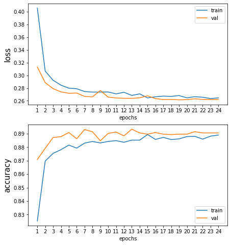
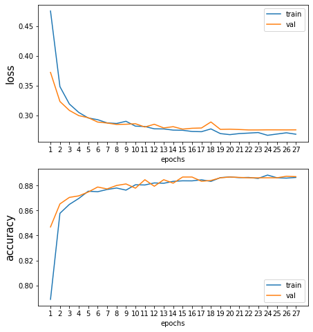
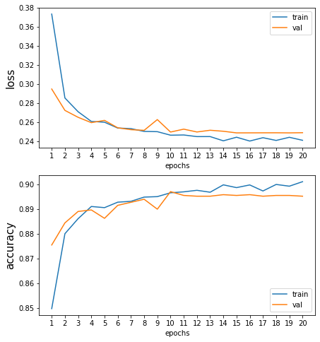
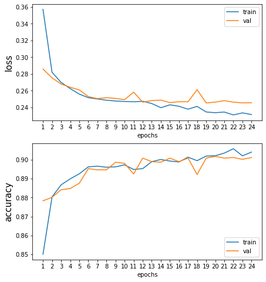
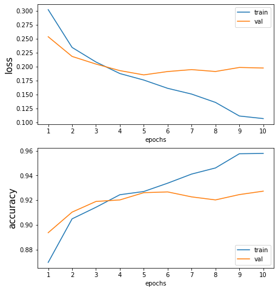
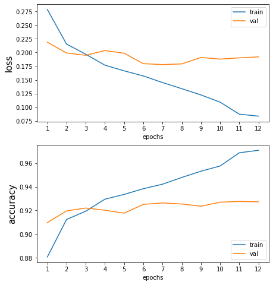
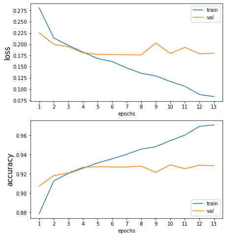
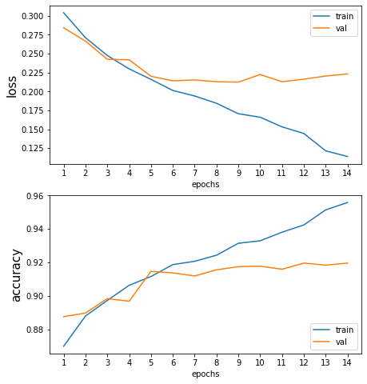
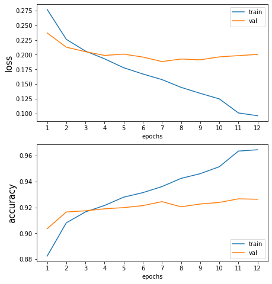
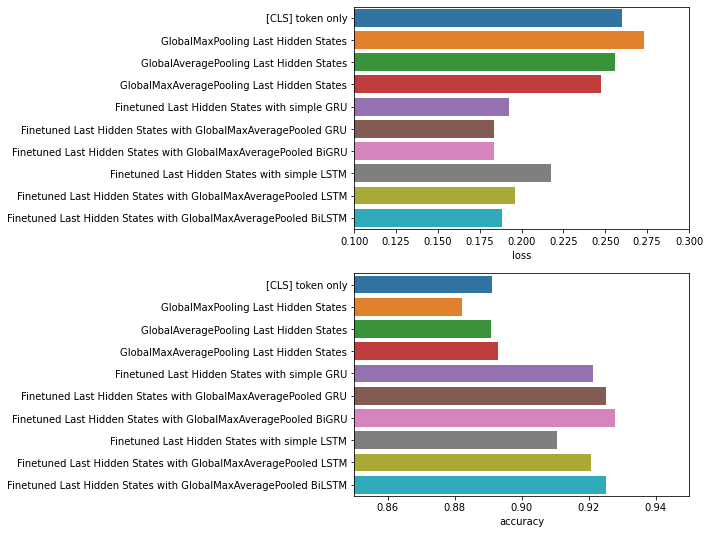

[<-PREV](toxiccomment.md)

# Toxic Comment Classification
# Part 3. Deep Learning with Transformers for NLP

1. Set up
2. Text preprocessing - Clean the text
3. Train Test split
4. Text preprocessing - Tokenize text
5. Build, Fit/Train, Predict, and Evaluate models
    - [CLS] token only
    - GlobalMaxPooling Last Hidden States
    - GlobalAveragePooling Last Hidden States
    - GlobalMaxAveragePooling Last Hidden States
    - Finetuned Last Hidden States with simple GRU
    - Finetuned Last Hidden States with GlobalMaxAveragePooled GRU 
    - Finetuned Last Hidden States with GlobalMaxAveragePooled BiGRU 
    - Finetuned Last Hidden States with simple LSTM
    - Finetuned Last Hidden States with GlobalMaxAveragePooled LSTM
    - Finetuned Last Hidden States with GlobalMaxAveragePooled BiLSTM 
6. Compare the results

# 1. Set up
## 1.1 Import libraries


```python
pip install clean-text
```

    Requirement already satisfied: clean-text in /opt/conda/lib/python3.7/site-packages (0.4.0)
    Requirement already satisfied: emoji in /opt/conda/lib/python3.7/site-packages (from clean-text) (1.2.0)
    Requirement already satisfied: ftfy<7.0,>=6.0 in /opt/conda/lib/python3.7/site-packages (from clean-text) (6.0.3)
    Requirement already satisfied: wcwidth in /opt/conda/lib/python3.7/site-packages (from ftfy<7.0,>=6.0->clean-text) (0.2.5)
    Note: you may need to restart the kernel to use updated packages.


```python
import numpy as np
import pandas as pd
import matplotlib.pyplot as plt
import seaborn as sns

from sklearn.model_selection import train_test_split

import tensorflow as tf
print('Tensorflow version: ', tf.__version__)
from tensorflow import keras

import transformers
from cleantext import clean
```

    Tensorflow version:  2.4.1


## 1.2 Configuration - TPU


```python
def setup_accelerator():
    try:
        tpu = tf.distribute.cluster_resolver.TPUClusterResolver()
        tf.config.experimental_connect_to_cluster(tpu)
        tf.tpu.experimental.initialize_tpu_system(tpu)
        strategy = tf.distribute.experimental.TPUStrategy(tpu)
        print('Running on TPU: ', tpu.master())
    except ValueError:
        strategy = tf.distribute.get_strategy() # for CPU or GPU
    print('Number of replicas:', strategy.num_replicas_in_sync)
    return strategy

strategy = setup_accelerator()
```

    Running on TPU:  grpc://10.0.0.2:8470
    Number of replicas: 8


## 1.3 Set up directories


```python
input_dir = '../input/toxiccomment-part1/'
output_dir = ''
```


```python
results = {}
```

## 1.4 Load the data


```python
df = pd.read_csv(input_dir + 'preprocessed.csv')
```


```python
print(df.info())
df.head()
```

    <class 'pandas.core.frame.DataFrame'>
    RangeIndex: 32450 entries, 0 to 32449
    Data columns (total 2 columns):
     #   Column        Non-Null Count  Dtype 
    ---  ------        --------------  ----- 
     0   comment_text  32450 non-null  object
     1   Toxic         32450 non-null  int64 
    dtypes: int64(1), object(1)
    memory usage: 507.2+ KB
    None


<div>
<style scoped>
    .dataframe tbody tr th:only-of-type {
        vertical-align: middle;
    }

    .dataframe tbody tr th {
        vertical-align: top;
    }

    .dataframe thead th {
        text-align: right;
    }
</style>
<table border="1" class="dataframe">
  <thead>
    <tr style="text-align: right;">
      <th></th>
      <th>comment_text</th>
      <th>Toxic</th>
    </tr>
  </thead>
  <tbody>
    <tr>
      <th>0</th>
      <td>COCKSUCKER BEFORE YOU PISS AROUND ON MY WORK</td>
      <td>1</td>
    </tr>
    <tr>
      <th>1</th>
      <td>Hey... what is it..\n@ | talk .\nWhat is it......</td>
      <td>1</td>
    </tr>
    <tr>
      <th>2</th>
      <td>Bye! \n\nDon't look, come or think of comming ...</td>
      <td>1</td>
    </tr>
    <tr>
      <th>3</th>
      <td>You are gay or antisemmitian? \n\nArchangel WH...</td>
      <td>1</td>
    </tr>
    <tr>
      <th>4</th>
      <td>FUCK YOUR FILTHY MOTHER IN THE ASS, DRY!</td>
      <td>1</td>
    </tr>
  </tbody>
</table>
</div>


## 1.5 Configuration


```python
n_classes = 1
SEED = 42
BATCH_SIZE = 16 * strategy.num_replicas_in_sync
print(f'Batch size: {BATCH_SIZE}')

EPOCHS = 50
SEQ_LEN = 150
```

    Batch size: 128


## 1.6 Define X, y


```python
X = df['comment_text'].astype(str)
y = df['Toxic'].values
```

# 2. Text preprocessing - Clean the text


```python
def cleaning(text):
    return clean(text, no_line_breaks=True, no_urls=True, no_punct=True)

cleaned_X = np.vectorize(cleaning)(X)
# cleaned_X = X.apply(cleaning)
```


```python
idx=11
print('----------Original text----------')
print(X[idx])
print('----------Cleaned text----------')
print(cleaned_X[idx])
```

    ----------Original text----------
    All of my edits are good.  Cunts like you who revert good edits because you're too stupid to understand how to write well , and then revert other edits just because you've decided to bear a playground grudge, are the problem.  Maybe one day you'll realise the damage you did to a noble project.  201.215.187.159
    ----------Cleaned text----------
    all of my edits are good cunts like you who revert good edits because youre too stupid to understand how to write well and then revert other edits just because youve decided to bear a playground grudge are the problem maybe one day youll realise the damage you did to a noble project 201215187159


# 3. Train Test split


```python
X_train, X_test, y_train, y_test = train_test_split(cleaned_X, y, test_size=0.2, random_state=SEED)
X_valid, X_test, y_valid, y_test = train_test_split(X_test, y_test, test_size=0.5, random_state=SEED)
n_train = X_train.shape[0]
n_valid = X_valid.shape[0]
n_test = X_test.shape[0]
print(f'The size of train set: {n_train}')
print(f'The size of valid set: {n_valid}')
print(f'The size of test set: {n_test}')
```

    The size of train set: 25960
    The size of valid set: 3245
    The size of test set: 3245


# 4. Text preprocessing - Tokenize text


```python
from transformers import DistilBertTokenizer, DistilBertConfig, TFDistilBertModel

def preprocessing_tokenize(X):
    model_name = 'distilbert-base-uncased'
    tokenizer = DistilBertTokenizer.from_pretrained(model_name)
    encoded_X = tokenizer(X.tolist(), padding=True, truncation=True, max_length=SEQ_LEN)
    input_X = [np.array(encoded_X['input_ids']), np.array(encoded_X['attention_mask'])]
    return input_X
```


```python
idx = 11
original_X_train_idx = X_train[idx]
```


```python
X_train = preprocessing_tokenize(X_train)
X_valid = preprocessing_tokenize(X_valid)
X_test = preprocessing_tokenize(X_test)
```


```python
print('-------------------original input--------------')
print(original_X_train_idx)
print('-------------------input_ids-------------------')
print(X_train[0][idx])
print('-------------------attention_mask--------------')
print(X_train[1][idx])
```

    -------------------original input--------------
    is it gay if you bang an animal of the same secks
    -------------------input_ids-------------------
    [  101  2003  2009  5637  2065  2017  9748  2019  4111  1997  1996  2168
     10819  5705   102     0     0     0     0     0     0     0     0     0
         0     0     0     0     0     0     0     0     0     0     0     0
         0     0     0     0     0     0     0     0     0     0     0     0
         0     0     0     0     0     0     0     0     0     0     0     0
         0     0     0     0     0     0     0     0     0     0     0     0
         0     0     0     0     0     0     0     0     0     0     0     0
         0     0     0     0     0     0     0     0     0     0     0     0
         0     0     0     0     0     0     0     0     0     0     0     0
         0     0     0     0     0     0     0     0     0     0     0     0
         0     0     0     0     0     0     0     0     0     0     0     0
         0     0     0     0     0     0     0     0     0     0     0     0
         0     0     0     0     0     0]
    -------------------attention_mask--------------
    [1 1 1 1 1 1 1 1 1 1 1 1 1 1 1 0 0 0 0 0 0 0 0 0 0 0 0 0 0 0 0 0 0 0 0 0 0
     0 0 0 0 0 0 0 0 0 0 0 0 0 0 0 0 0 0 0 0 0 0 0 0 0 0 0 0 0 0 0 0 0 0 0 0 0
     0 0 0 0 0 0 0 0 0 0 0 0 0 0 0 0 0 0 0 0 0 0 0 0 0 0 0 0 0 0 0 0 0 0 0 0 0
     0 0 0 0 0 0 0 0 0 0 0 0 0 0 0 0 0 0 0 0 0 0 0 0 0 0 0 0 0 0 0 0 0 0 0 0 0
     0 0]


# 5. Build, Train, Evaluate a model


```python
def plot_train_history(history):
    
    fig, ax = plt.subplots(2, 1, figsize=(7, 8))
    x = np.arange(1, len(history.history['loss'])+1)

    ax[0].plot(x, history.history['loss'])
    ax[0].plot(x, history.history['val_loss'])
    ax[0].set_xlabel('epochs')
    ax[0].set_xticks(x)
    ax[0].set_ylabel('loss', fontsize=15)
    ax[0].legend(['train', 'val'], loc='upper right')

    ax[1].plot(x, history.history['accuracy'])
    ax[1].plot(x, history.history['val_accuracy'])
    ax[1].set_xlabel('epochs')
    ax[1].set_xticks(x)
    ax[1].set_ylabel('accuracy', fontsize=15)
    ax[1].legend(['train', 'val'], loc='lower right');
```


```python
from keras.models import Sequential, Model
from keras.layers import Input, Dense, GlobalMaxPooling1D, GlobalAveragePooling1D, concatenate
from keras.layers import GRU, LSTM, Bidirectional
from keras.callbacks import ModelCheckpoint, ReduceLROnPlateau, EarlyStopping
from keras.optimizers import Adam
```

## 5.1 [CLS] token only 


```python
keras.backend.clear_session()
with strategy.scope():
    
    config = DistilBertConfig()
    config.output_hidden_states = False
    transformer_model = TFDistilBertModel.from_pretrained('distilbert-base-uncased', config=config)

    input_ids = Input(shape=(SEQ_LEN,), name='input_ids', dtype='int32')
    input_masks = Input(shape=(SEQ_LEN,), name='attention_mask', dtype='int32')
    embedding_layer = transformer_model(input_ids, input_masks)
    cls_token = embedding_layer[0][:, 0, :]
    X = Dense(n_classes, activation='sigmoid')(cls_token)
    model = Model(inputs=[input_ids, input_masks], outputs=X)

    for layer in model.layers[:3]:
        layer.trainable = False
    
    model.compile(loss='binary_crossentropy', optimizer=Adam(lr=2e-3), metrics=['accuracy'])
    
model.summary()

FILEPATH = output_dir + "toxiccomment_weights_distilbert_basic.h5"
ckp = ModelCheckpoint(FILEPATH, monitor = 'val_loss', mode = 'min', verbose = 1, save_best_only = True, save_weights_only=True)
rlr = ReduceLROnPlateau(monitor = 'val_loss', factor = 0.1, patience = 3, verbose = 1, min_delta = 1e-4, min_lr = 1e-8, mode = 'min', cooldown=1)
es = EarlyStopping(monitor = 'val_loss', min_delta = 1e-4, patience = 5, mode = 'min', restore_best_weights = True, verbose = 1)


history = model.fit(X_train, 
                    y_train, 
                    steps_per_epoch= n_train // BATCH_SIZE,
                    validation_data=(X_valid, y_valid),
                    validation_batch_size=n_valid,
                    batch_size=BATCH_SIZE, 
                    epochs=EPOCHS,
                    callbacks=[ckp, rlr, es],
                    verbose=1)

plot_train_history(history)
test_result = model.evaluate(X_test, y_test, batch_size=strategy.num_replicas_in_sync)
print(f"Test result: {test_result}")
results['[CLS] token only'] = test_result
```


    Model: "model"
    __________________________________________________________________________________________________
    Layer (type)                    Output Shape         Param #     Connected to                     
    ==================================================================================================
    input_ids (InputLayer)          [(None, 150)]        0                                            
    __________________________________________________________________________________________________
    attention_mask (InputLayer)     [(None, 150)]        0                                            
    __________________________________________________________________________________________________
    tf_distil_bert_model (TFDistilB TFBaseModelOutput(la 66362880    input_ids[0][0]                  
                                                                     attention_mask[0][0]             
    __________________________________________________________________________________________________
    tf.__operators__.getitem (Slici (None, 768)          0           tf_distil_bert_model[0][0]       
    __________________________________________________________________________________________________
    dense (Dense)                   (None, 1)            769         tf.__operators__.getitem[0][0]   
    ==================================================================================================
    Total params: 66,363,649
    Trainable params: 769
    Non-trainable params: 66,362,880
    __________________________________________________________________________________________________
    Epoch 1/50
    202/202 [==============================] - 27s 64ms/step - loss: 0.5090 - accuracy: 0.7503 - val_loss: 0.3131 - val_accuracy: 0.8709
    
    Epoch 00001: val_loss improved from inf to 0.31313, saving model to toxiccomment_weights_distilbert_basic.h5
    Epoch 2/50
    202/202 [==============================] - 10s 28ms/step - loss: 0.3151 - accuracy: 0.8678 - val_loss: 0.2885 - val_accuracy: 0.8792
    
    Epoch 00002: val_loss improved from 0.31313 to 0.28852, saving model to toxiccomment_weights_distilbert_basic.h5
    Epoch 3/50
    202/202 [==============================] - 6s 28ms/step - loss: 0.2947 - accuracy: 0.8735 - val_loss: 0.2791 - val_accuracy: 0.8872
    
    Epoch 00003: val_loss improved from 0.28852 to 0.27912, saving model to toxiccomment_weights_distilbert_basic.h5
    Epoch 4/50
    202/202 [==============================] - 6s 30ms/step - loss: 0.2880 - accuracy: 0.8763 - val_loss: 0.2740 - val_accuracy: 0.8878
    
    Epoch 00004: val_loss improved from 0.27912 to 0.27398, saving model to toxiccomment_weights_distilbert_basic.h5
    Epoch 5/50
    202/202 [==============================] - 6s 28ms/step - loss: 0.2777 - accuracy: 0.8819 - val_loss: 0.2718 - val_accuracy: 0.8909
    
    Epoch 00005: val_loss improved from 0.27398 to 0.27178, saving model to toxiccomment_weights_distilbert_basic.h5
    Epoch 6/50
    202/202 [==============================] - 6s 28ms/step - loss: 0.2839 - accuracy: 0.8770 - val_loss: 0.2722 - val_accuracy: 0.8863
    
    Epoch 00006: val_loss did not improve from 0.27178
    Epoch 7/50
    202/202 [==============================] - 6s 28ms/step - loss: 0.2792 - accuracy: 0.8796 - val_loss: 0.2669 - val_accuracy: 0.8931
    
    Epoch 00007: val_loss improved from 0.27178 to 0.26686, saving model to toxiccomment_weights_distilbert_basic.h5
    Epoch 8/50
    202/202 [==============================] - 6s 28ms/step - loss: 0.2822 - accuracy: 0.8796 - val_loss: 0.2662 - val_accuracy: 0.8915
    
    Epoch 00008: val_loss improved from 0.26686 to 0.26616, saving model to toxiccomment_weights_distilbert_basic.h5
    Epoch 9/50
    202/202 [==============================] - 6s 28ms/step - loss: 0.2750 - accuracy: 0.8815 - val_loss: 0.2762 - val_accuracy: 0.8847
    
    Epoch 00009: val_loss did not improve from 0.26616
    Epoch 10/50
    202/202 [==============================] - 6s 28ms/step - loss: 0.2703 - accuracy: 0.8886 - val_loss: 0.2657 - val_accuracy: 0.8903
    
    Epoch 00010: val_loss improved from 0.26616 to 0.26574, saving model to toxiccomment_weights_distilbert_basic.h5
    Epoch 11/50
    202/202 [==============================] - 6s 28ms/step - loss: 0.2714 - accuracy: 0.8848 - val_loss: 0.2644 - val_accuracy: 0.8912
    
    Epoch 00011: val_loss improved from 0.26574 to 0.26443, saving model to toxiccomment_weights_distilbert_basic.h5
    Epoch 12/50
    202/202 [==============================] - 6s 28ms/step - loss: 0.2783 - accuracy: 0.8825 - val_loss: 0.2639 - val_accuracy: 0.8884
    
    Epoch 00012: val_loss improved from 0.26443 to 0.26390, saving model to toxiccomment_weights_distilbert_basic.h5
    Epoch 13/50
    202/202 [==============================] - 6s 28ms/step - loss: 0.2689 - accuracy: 0.8853 - val_loss: 0.2638 - val_accuracy: 0.8934
    
    Epoch 00013: val_loss improved from 0.26390 to 0.26381, saving model to toxiccomment_weights_distilbert_basic.h5
    Epoch 14/50
    202/202 [==============================] - 6s 28ms/step - loss: 0.2705 - accuracy: 0.8857 - val_loss: 0.2647 - val_accuracy: 0.8906
    
    Epoch 00014: val_loss did not improve from 0.26381
    Epoch 15/50
    202/202 [==============================] - 6s 28ms/step - loss: 0.2643 - accuracy: 0.8907 - val_loss: 0.2678 - val_accuracy: 0.8897
    
    Epoch 00015: val_loss did not improve from 0.26381
    
    Epoch 00015: ReduceLROnPlateau reducing learning rate to 0.00020000000949949026.
    Epoch 16/50
    202/202 [==============================] - 6s 28ms/step - loss: 0.2702 - accuracy: 0.8826 - val_loss: 0.2634 - val_accuracy: 0.8909
    
    Epoch 00016: val_loss improved from 0.26381 to 0.26340, saving model to toxiccomment_weights_distilbert_basic.h5
    Epoch 17/50
    202/202 [==============================] - 6s 28ms/step - loss: 0.2687 - accuracy: 0.8864 - val_loss: 0.2619 - val_accuracy: 0.8897
    
    Epoch 00017: val_loss improved from 0.26340 to 0.26193, saving model to toxiccomment_weights_distilbert_basic.h5
    Epoch 18/50
    202/202 [==============================] - 6s 28ms/step - loss: 0.2625 - accuracy: 0.8873 - val_loss: 0.2621 - val_accuracy: 0.8894
    
    Epoch 00018: val_loss did not improve from 0.26193
    Epoch 19/50
    202/202 [==============================] - 6s 28ms/step - loss: 0.2687 - accuracy: 0.8866 - val_loss: 0.2615 - val_accuracy: 0.8897
    
    Epoch 00019: val_loss improved from 0.26193 to 0.26146, saving model to toxiccomment_weights_distilbert_basic.h5
    Epoch 20/50
    202/202 [==============================] - 6s 29ms/step - loss: 0.2621 - accuracy: 0.8890 - val_loss: 0.2618 - val_accuracy: 0.8897
    
    Epoch 00020: val_loss did not improve from 0.26146
    Epoch 21/50
    202/202 [==============================] - 6s 28ms/step - loss: 0.2667 - accuracy: 0.8879 - val_loss: 0.2631 - val_accuracy: 0.8915
    
    Epoch 00021: val_loss did not improve from 0.26146
    Epoch 22/50
    202/202 [==============================] - 6s 28ms/step - loss: 0.2628 - accuracy: 0.8870 - val_loss: 0.2621 - val_accuracy: 0.8906
    
    Epoch 00022: val_loss did not improve from 0.26146
    
    Epoch 00022: ReduceLROnPlateau reducing learning rate to 2.0000000949949027e-05.
    Epoch 23/50
    202/202 [==============================] - 6s 28ms/step - loss: 0.2583 - accuracy: 0.8895 - val_loss: 0.2620 - val_accuracy: 0.8906
    
    Epoch 00023: val_loss did not improve from 0.26146
    Epoch 24/50
    202/202 [==============================] - 6s 28ms/step - loss: 0.2623 - accuracy: 0.8915 - val_loss: 0.2620 - val_accuracy: 0.8906
    
    Epoch 00024: val_loss did not improve from 0.26146
    Restoring model weights from the end of the best epoch.
    Epoch 00024: early stopping
    406/406 [==============================] - 9s 15ms/step - loss: 0.2602 - accuracy: 0.8912
    Test result: [0.26018649339675903, 0.8912172317504883]


    

    


```python
print('--------------------embedding_layer--------------------------------')
print(embedding_layer)
print('--------------------embedding_layer[0]-----------------------------')
print(embedding_layer[0])
print('--------------------embedding_layer[0][:, 0, :]--------------------')
print(embedding_layer[0][:, 0, :])
```

    --------------------embedding_layer--------------------------------
    TFBaseModelOutput(last_hidden_state=<KerasTensor: shape=(None, 150, 768) dtype=float32 (created by layer 'tf_distil_bert_model')>, hidden_states=None, attentions=None)
    --------------------embedding_layer[0]-----------------------------
    KerasTensor(type_spec=TensorSpec(shape=(None, 150, 768), dtype=tf.float32, name=None), name='tf_distil_bert_model/distilbert/transformer/layer_._5/output_layer_norm/batchnorm/add_1:0', description="created by layer 'tf_distil_bert_model'")
    --------------------embedding_layer[0][:, 0, :]--------------------
    KerasTensor(type_spec=TensorSpec(shape=(None, 768), dtype=tf.float32, name=None), name='tf.__operators__.getitem_1/strided_slice:0', description="created by layer 'tf.__operators__.getitem_1'")


## 5.2 GlobalMaxPooling Last Hidden States


```python
keras.backend.clear_session()
with strategy.scope():
    
    config = DistilBertConfig()
    config.output_hidden_states = False
    transformer_model = TFDistilBertModel.from_pretrained('distilbert-base-uncased', config=config)

    input_ids = Input(shape=(SEQ_LEN,), name='input_ids', dtype='int32')
    input_masks = Input(shape=(SEQ_LEN,), name='attention_mask', dtype='int32')
    embedding_layer = transformer_model(input_ids, input_masks)[0]
    X = GlobalMaxPooling1D()(embedding_layer)
    X = Dense(n_classes, activation='sigmoid')(X)
    model = Model(inputs=[input_ids, input_masks], outputs=X)

    for layer in model.layers[:3]:
        layer.trainable = False
    
    model.compile(loss='binary_crossentropy', optimizer=Adam(lr=2e-3), metrics=['accuracy'])
    
model.summary()

FILEPATH = output_dir + "toxiccomment_weights_distilbert_lasthiddenstates_globalmaxpool.h5"
ckp = ModelCheckpoint(FILEPATH, monitor = 'val_loss', mode = 'min', verbose = 1, save_best_only = True, save_weights_only=True)
rlr = ReduceLROnPlateau(monitor = 'val_loss', factor = 0.1, patience = 3, verbose = 1, min_delta = 1e-4, min_lr = 1e-8, mode = 'min', cooldown=1)
es = EarlyStopping(monitor = 'val_loss', min_delta = 1e-4, patience = 5, mode = 'min', restore_best_weights = True, verbose = 1)


history = model.fit(X_train, 
                    y_train, 
                    steps_per_epoch= n_train // BATCH_SIZE,
                    validation_data=(X_valid, y_valid),
                    validation_batch_size=n_valid,
                    batch_size=BATCH_SIZE, 
                    epochs=EPOCHS,
                    callbacks=[ckp, rlr, es],
                    verbose=1)

plot_train_history(history)
test_result = model.evaluate(X_test, y_test, batch_size=strategy.num_replicas_in_sync)
print(f"Test result: {test_result}")
results['GlobalMaxPooling Last Hidden States'] = test_result
```


    Model: "model"
    __________________________________________________________________________________________________
    Layer (type)                    Output Shape         Param #     Connected to                     
    ==================================================================================================
    input_ids (InputLayer)          [(None, 150)]        0                                            
    __________________________________________________________________________________________________
    attention_mask (InputLayer)     [(None, 150)]        0                                            
    __________________________________________________________________________________________________
    tf_distil_bert_model (TFDistilB TFBaseModelOutput(la 66362880    input_ids[0][0]                  
                                                                     attention_mask[0][0]             
    __________________________________________________________________________________________________
    global_max_pooling1d (GlobalMax (None, 768)          0           tf_distil_bert_model[0][0]       
    __________________________________________________________________________________________________
    dense (Dense)                   (None, 1)            769         global_max_pooling1d[0][0]       
    ==================================================================================================
    Total params: 66,363,649
    Trainable params: 769
    Non-trainable params: 66,362,880
    __________________________________________________________________________________________________
    Epoch 1/50
    202/202 [==============================] - 28s 64ms/step - loss: 0.5611 - accuracy: 0.7141 - val_loss: 0.3724 - val_accuracy: 0.8468
    
    Epoch 00001: val_loss improved from inf to 0.37241, saving model to toxiccomment_weights_distilbert_lasthiddenstates_globalmaxpool.h5
    Epoch 2/50
    202/202 [==============================] - 10s 28ms/step - loss: 0.3612 - accuracy: 0.8526 - val_loss: 0.3233 - val_accuracy: 0.8653
    
    Epoch 00002: val_loss improved from 0.37241 to 0.32325, saving model to toxiccomment_weights_distilbert_lasthiddenstates_globalmaxpool.h5
    Epoch 3/50
    202/202 [==============================] - 6s 28ms/step - loss: 0.3247 - accuracy: 0.8628 - val_loss: 0.3082 - val_accuracy: 0.8706
    
    Epoch 00003: val_loss improved from 0.32325 to 0.30823, saving model to toxiccomment_weights_distilbert_lasthiddenstates_globalmaxpool.h5
    Epoch 4/50
    202/202 [==============================] - 6s 29ms/step - loss: 0.3081 - accuracy: 0.8665 - val_loss: 0.2994 - val_accuracy: 0.8718
    
    Epoch 00004: val_loss improved from 0.30823 to 0.29937, saving model to toxiccomment_weights_distilbert_lasthiddenstates_globalmaxpool.h5
    Epoch 5/50
    202/202 [==============================] - 6s 29ms/step - loss: 0.2981 - accuracy: 0.8757 - val_loss: 0.2959 - val_accuracy: 0.8749
    
    Epoch 00005: val_loss improved from 0.29937 to 0.29593, saving model to toxiccomment_weights_distilbert_lasthiddenstates_globalmaxpool.h5
    Epoch 6/50
    202/202 [==============================] - 6s 28ms/step - loss: 0.2890 - accuracy: 0.8782 - val_loss: 0.2885 - val_accuracy: 0.8789
    
    Epoch 00006: val_loss improved from 0.29593 to 0.28854, saving model to toxiccomment_weights_distilbert_lasthiddenstates_globalmaxpool.h5
    Epoch 7/50
    202/202 [==============================] - 6s 28ms/step - loss: 0.2836 - accuracy: 0.8764 - val_loss: 0.2869 - val_accuracy: 0.8773
    
    Epoch 00007: val_loss improved from 0.28854 to 0.28694, saving model to toxiccomment_weights_distilbert_lasthiddenstates_globalmaxpool.h5
    Epoch 8/50
    202/202 [==============================] - 6s 28ms/step - loss: 0.2834 - accuracy: 0.8797 - val_loss: 0.2845 - val_accuracy: 0.8801
    
    Epoch 00008: val_loss improved from 0.28694 to 0.28453, saving model to toxiccomment_weights_distilbert_lasthiddenstates_globalmaxpool.h5
    Epoch 9/50
    202/202 [==============================] - 6s 28ms/step - loss: 0.2881 - accuracy: 0.8769 - val_loss: 0.2848 - val_accuracy: 0.8814
    
    Epoch 00009: val_loss did not improve from 0.28453
    Epoch 10/50
    202/202 [==============================] - 6s 28ms/step - loss: 0.2803 - accuracy: 0.8817 - val_loss: 0.2857 - val_accuracy: 0.8780
    
    Epoch 00010: val_loss did not improve from 0.28453
    Epoch 11/50
    202/202 [==============================] - 6s 28ms/step - loss: 0.2857 - accuracy: 0.8780 - val_loss: 0.2802 - val_accuracy: 0.8847
    
    Epoch 00011: val_loss improved from 0.28453 to 0.28018, saving model to toxiccomment_weights_distilbert_lasthiddenstates_globalmaxpool.h5
    Epoch 12/50
    202/202 [==============================] - 6s 28ms/step - loss: 0.2828 - accuracy: 0.8792 - val_loss: 0.2848 - val_accuracy: 0.8795
    
    Epoch 00012: val_loss did not improve from 0.28018
    Epoch 13/50
    202/202 [==============================] - 6s 28ms/step - loss: 0.2829 - accuracy: 0.8794 - val_loss: 0.2786 - val_accuracy: 0.8847
    
    Epoch 00013: val_loss improved from 0.28018 to 0.27864, saving model to toxiccomment_weights_distilbert_lasthiddenstates_globalmaxpool.h5
    Epoch 14/50
    202/202 [==============================] - 6s 28ms/step - loss: 0.2811 - accuracy: 0.8825 - val_loss: 0.2807 - val_accuracy: 0.8820
    
    Epoch 00014: val_loss did not improve from 0.27864
    Epoch 15/50
    202/202 [==============================] - 6s 28ms/step - loss: 0.2764 - accuracy: 0.8836 - val_loss: 0.2766 - val_accuracy: 0.8869
    
    Epoch 00015: val_loss improved from 0.27864 to 0.27662, saving model to toxiccomment_weights_distilbert_lasthiddenstates_globalmaxpool.h5
    Epoch 16/50
    202/202 [==============================] - 6s 28ms/step - loss: 0.2744 - accuracy: 0.8820 - val_loss: 0.2781 - val_accuracy: 0.8869
    
    Epoch 00016: val_loss did not improve from 0.27662
    Epoch 17/50
    202/202 [==============================] - 6s 28ms/step - loss: 0.2737 - accuracy: 0.8811 - val_loss: 0.2785 - val_accuracy: 0.8835
    
    Epoch 00017: val_loss did not improve from 0.27662
    Epoch 18/50
    202/202 [==============================] - 6s 28ms/step - loss: 0.2779 - accuracy: 0.8826 - val_loss: 0.2887 - val_accuracy: 0.8841
    
    Epoch 00018: val_loss did not improve from 0.27662
    
    Epoch 00018: ReduceLROnPlateau reducing learning rate to 0.00020000000949949026.
    Epoch 19/50
    202/202 [==============================] - 6s 28ms/step - loss: 0.2750 - accuracy: 0.8860 - val_loss: 0.2762 - val_accuracy: 0.8863
    
    Epoch 00019: val_loss improved from 0.27662 to 0.27620, saving model to toxiccomment_weights_distilbert_lasthiddenstates_globalmaxpool.h5
    Epoch 20/50
    202/202 [==============================] - 6s 31ms/step - loss: 0.2731 - accuracy: 0.8845 - val_loss: 0.2765 - val_accuracy: 0.8869
    
    Epoch 00020: val_loss did not improve from 0.27620
    Epoch 21/50
    202/202 [==============================] - 6s 28ms/step - loss: 0.2743 - accuracy: 0.8834 - val_loss: 0.2760 - val_accuracy: 0.8866
    
    Epoch 00021: val_loss improved from 0.27620 to 0.27596, saving model to toxiccomment_weights_distilbert_lasthiddenstates_globalmaxpool.h5
    Epoch 22/50
    202/202 [==============================] - 6s 28ms/step - loss: 0.2728 - accuracy: 0.8848 - val_loss: 0.2752 - val_accuracy: 0.8863
    
    Epoch 00022: val_loss improved from 0.27596 to 0.27524, saving model to toxiccomment_weights_distilbert_lasthiddenstates_globalmaxpool.h5
    Epoch 23/50
    202/202 [==============================] - 6s 28ms/step - loss: 0.2692 - accuracy: 0.8873 - val_loss: 0.2753 - val_accuracy: 0.8863
    
    Epoch 00023: val_loss did not improve from 0.27524
    Epoch 24/50
    202/202 [==============================] - 6s 28ms/step - loss: 0.2675 - accuracy: 0.8886 - val_loss: 0.2754 - val_accuracy: 0.8863
    
    Epoch 00024: val_loss did not improve from 0.27524
    Epoch 25/50
    202/202 [==============================] - 6s 28ms/step - loss: 0.2711 - accuracy: 0.8856 - val_loss: 0.2754 - val_accuracy: 0.8863
    
    Epoch 00025: val_loss did not improve from 0.27524
    
    Epoch 00025: ReduceLROnPlateau reducing learning rate to 2.0000000949949027e-05.
    Epoch 26/50
    202/202 [==============================] - 6s 28ms/step - loss: 0.2696 - accuracy: 0.8860 - val_loss: 0.2753 - val_accuracy: 0.8875
    
    Epoch 00026: val_loss did not improve from 0.27524
    Epoch 27/50
    202/202 [==============================] - 6s 28ms/step - loss: 0.2662 - accuracy: 0.8901 - val_loss: 0.2754 - val_accuracy: 0.8872
    
    Epoch 00027: val_loss did not improve from 0.27524
    Restoring model weights from the end of the best epoch.
    Epoch 00027: early stopping
    406/406 [==============================] - 8s 15ms/step - loss: 0.2733 - accuracy: 0.8823
    Test result: [0.27332940697669983, 0.8822804093360901]


    

    


## 5.3 GlobalAveragePooling Last Hidden States


```python
keras.backend.clear_session()
with strategy.scope():
    
    config = DistilBertConfig()
    config.output_hidden_states = False
    transformer_model = TFDistilBertModel.from_pretrained('distilbert-base-uncased', config=config)

    input_ids = Input(shape=(SEQ_LEN,), name='input_ids', dtype='int32')
    input_masks = Input(shape=(SEQ_LEN,), name='attention_mask', dtype='int32')
    embedding_layer = transformer_model(input_ids, input_masks)[0]
    X = GlobalAveragePooling1D()(embedding_layer)
    X = Dense(n_classes, activation='sigmoid')(X)
    model = Model(inputs=[input_ids, input_masks], outputs=X)

    for layer in model.layers[:3]:
        layer.trainable = False
    
    model.compile(loss='binary_crossentropy', optimizer=Adam(lr=2e-3), metrics=['accuracy'])
    
model.summary()

FILEPATH = output_dir + "toxiccomment_weights_distilbert_lasthiddenstates_globalavepool.h5"
ckp = ModelCheckpoint(FILEPATH, monitor = 'val_loss', mode = 'min', verbose = 1, save_best_only = True, save_weights_only=True)
rlr = ReduceLROnPlateau(monitor = 'val_loss', factor = 0.1, patience = 3, verbose = 1, min_delta = 1e-4, min_lr = 1e-8, mode = 'min', cooldown=1)
es = EarlyStopping(monitor = 'val_loss', min_delta = 1e-4, patience = 5, mode = 'min', restore_best_weights = True, verbose = 1)


history = model.fit(X_train, 
                    y_train, 
                    steps_per_epoch= n_train // BATCH_SIZE,
                    validation_data=(X_valid, y_valid),
                    validation_batch_size=n_valid,
                    batch_size=BATCH_SIZE, 
                    epochs=EPOCHS,
                    callbacks=[ckp, rlr, es],
                    verbose=1)

plot_train_history(history)
test_result = model.evaluate(X_test, y_test, batch_size=strategy.num_replicas_in_sync)
print(f"Test result: {test_result}")
results['GlobalAveragePooling Last Hidden States'] = test_result
```

    
    
    Model: "model"
    __________________________________________________________________________________________________
    Layer (type)                    Output Shape         Param #     Connected to                     
    ==================================================================================================
    input_ids (InputLayer)          [(None, 150)]        0                                            
    __________________________________________________________________________________________________
    attention_mask (InputLayer)     [(None, 150)]        0                                            
    __________________________________________________________________________________________________
    tf_distil_bert_model (TFDistilB TFBaseModelOutput(la 66362880    input_ids[0][0]                  
                                                                     attention_mask[0][0]             
    __________________________________________________________________________________________________
    global_average_pooling1d (Globa (None, 768)          0           tf_distil_bert_model[0][0]       
    __________________________________________________________________________________________________
    dense (Dense)                   (None, 1)            769         global_average_pooling1d[0][0]   
    ==================================================================================================
    Total params: 66,363,649
    Trainable params: 769
    Non-trainable params: 66,362,880
    __________________________________________________________________________________________________
    Epoch 1/50
    202/202 [==============================] - 30s 69ms/step - loss: 0.4600 - accuracy: 0.8041 - val_loss: 0.2949 - val_accuracy: 0.8755
    
    Epoch 00001: val_loss improved from inf to 0.29494, saving model to toxiccomment_weights_distilbert_lasthiddenstates_globalavepool.h5
    Epoch 2/50
    202/202 [==============================] - 10s 28ms/step - loss: 0.2910 - accuracy: 0.8787 - val_loss: 0.2725 - val_accuracy: 0.8844
    
    Epoch 00002: val_loss improved from 0.29494 to 0.27255, saving model to toxiccomment_weights_distilbert_lasthiddenstates_globalavepool.h5
    Epoch 3/50
    202/202 [==============================] - 6s 29ms/step - loss: 0.2785 - accuracy: 0.8844 - val_loss: 0.2653 - val_accuracy: 0.8891
    
    Epoch 00003: val_loss improved from 0.27255 to 0.26530, saving model to toxiccomment_weights_distilbert_lasthiddenstates_globalavepool.h5
    Epoch 4/50
    202/202 [==============================] - 6s 28ms/step - loss: 0.2605 - accuracy: 0.8906 - val_loss: 0.2597 - val_accuracy: 0.8897
    
    Epoch 00004: val_loss improved from 0.26530 to 0.25972, saving model to toxiccomment_weights_distilbert_lasthiddenstates_globalavepool.h5
    Epoch 5/50
    202/202 [==============================] - 6s 29ms/step - loss: 0.2599 - accuracy: 0.8906 - val_loss: 0.2621 - val_accuracy: 0.8863
    
    Epoch 00005: val_loss did not improve from 0.25972
    Epoch 6/50
    202/202 [==============================] - 6s 28ms/step - loss: 0.2537 - accuracy: 0.8929 - val_loss: 0.2543 - val_accuracy: 0.8915
    
    Epoch 00006: val_loss improved from 0.25972 to 0.25432, saving model to toxiccomment_weights_distilbert_lasthiddenstates_globalavepool.h5
    Epoch 7/50
    202/202 [==============================] - 6s 28ms/step - loss: 0.2543 - accuracy: 0.8939 - val_loss: 0.2524 - val_accuracy: 0.8928
    
    Epoch 00007: val_loss improved from 0.25432 to 0.25235, saving model to toxiccomment_weights_distilbert_lasthiddenstates_globalavepool.h5
    Epoch 8/50
    202/202 [==============================] - 6s 28ms/step - loss: 0.2522 - accuracy: 0.8932 - val_loss: 0.2517 - val_accuracy: 0.8940
    
    Epoch 00008: val_loss improved from 0.25235 to 0.25165, saving model to toxiccomment_weights_distilbert_lasthiddenstates_globalavepool.h5
    Epoch 9/50
    202/202 [==============================] - 6s 28ms/step - loss: 0.2485 - accuracy: 0.8975 - val_loss: 0.2629 - val_accuracy: 0.8900
    
    Epoch 00009: val_loss did not improve from 0.25165
    Epoch 10/50
    202/202 [==============================] - 6s 28ms/step - loss: 0.2510 - accuracy: 0.8940 - val_loss: 0.2499 - val_accuracy: 0.8971
    
    Epoch 00010: val_loss improved from 0.25165 to 0.24986, saving model to toxiccomment_weights_distilbert_lasthiddenstates_globalavepool.h5
    Epoch 11/50
    202/202 [==============================] - 6s 28ms/step - loss: 0.2440 - accuracy: 0.8969 - val_loss: 0.2529 - val_accuracy: 0.8955
    
    Epoch 00011: val_loss did not improve from 0.24986
    Epoch 12/50
    202/202 [==============================] - 6s 28ms/step - loss: 0.2437 - accuracy: 0.8983 - val_loss: 0.2499 - val_accuracy: 0.8952
    
    Epoch 00012: val_loss did not improve from 0.24986
    Epoch 13/50
    202/202 [==============================] - 6s 28ms/step - loss: 0.2432 - accuracy: 0.8979 - val_loss: 0.2517 - val_accuracy: 0.8952
    
    Epoch 00013: val_loss did not improve from 0.24986
    
    Epoch 00013: ReduceLROnPlateau reducing learning rate to 0.00020000000949949026.
    Epoch 14/50
    202/202 [==============================] - 6s 28ms/step - loss: 0.2367 - accuracy: 0.9015 - val_loss: 0.2507 - val_accuracy: 0.8958
    
    Epoch 00014: val_loss did not improve from 0.24986
    Epoch 15/50
    202/202 [==============================] - 6s 28ms/step - loss: 0.2443 - accuracy: 0.8984 - val_loss: 0.2490 - val_accuracy: 0.8955
    
    Epoch 00015: val_loss improved from 0.24986 to 0.24899, saving model to toxiccomment_weights_distilbert_lasthiddenstates_globalavepool.h5
    Epoch 16/50
    202/202 [==============================] - 6s 28ms/step - loss: 0.2360 - accuracy: 0.9012 - val_loss: 0.2490 - val_accuracy: 0.8958
    
    Epoch 00016: val_loss did not improve from 0.24899
    Epoch 17/50
    202/202 [==============================] - 6s 28ms/step - loss: 0.2477 - accuracy: 0.8961 - val_loss: 0.2491 - val_accuracy: 0.8952
    
    Epoch 00017: val_loss did not improve from 0.24899
    Epoch 18/50
    202/202 [==============================] - 6s 29ms/step - loss: 0.2416 - accuracy: 0.8989 - val_loss: 0.2491 - val_accuracy: 0.8955
    
    Epoch 00018: val_loss did not improve from 0.24899
    
    Epoch 00018: ReduceLROnPlateau reducing learning rate to 2.0000000949949027e-05.
    Epoch 19/50
    202/202 [==============================] - 6s 29ms/step - loss: 0.2452 - accuracy: 0.8982 - val_loss: 0.2490 - val_accuracy: 0.8955
    
    Epoch 00019: val_loss did not improve from 0.24899
    Epoch 20/50
    202/202 [==============================] - 6s 28ms/step - loss: 0.2405 - accuracy: 0.9027 - val_loss: 0.2492 - val_accuracy: 0.8952
    
    Epoch 00020: val_loss did not improve from 0.24899
    Restoring model weights from the end of the best epoch.
    Epoch 00020: early stopping
    406/406 [==============================] - 8s 15ms/step - loss: 0.2559 - accuracy: 0.8909
    Test result: [0.25589048862457275, 0.8909090757369995]


    

    


## 5.4 GlobalMaxPooling and GlobalAveragePooling Last Hidden States


```python
keras.backend.clear_session()
with strategy.scope():
    
    config = DistilBertConfig()
    config.output_hidden_states = False
    transformer_model = TFDistilBertModel.from_pretrained('distilbert-base-uncased', config=config)

    input_ids = Input(shape=(SEQ_LEN,), name='input_ids', dtype='int32')
    input_masks = Input(shape=(SEQ_LEN,), name='attention_mask', dtype='int32')
    embedding_layer = transformer_model(input_ids, input_masks)[0]
    avg_pool = GlobalAveragePooling1D()(embedding_layer)
    max_pool = GlobalMaxPooling1D()(embedding_layer)
    X = concatenate([avg_pool, max_pool])
    X = Dense(n_classes, activation='sigmoid')(X)
    model = Model(inputs=[input_ids, input_masks], outputs=X)

    for layer in model.layers[:3]:
        layer.trainable = False
    
    model.compile(loss='binary_crossentropy', optimizer=Adam(lr=2e-3), metrics=['accuracy'])
    
model.summary()

FILEPATH = output_dir + "toxiccomment_weights_distilbert_lasthiddenstates_globalmaxavepool.h5"
ckp = ModelCheckpoint(FILEPATH, monitor = 'val_loss', mode = 'min', verbose = 1, save_best_only = True, save_weights_only=True)
rlr = ReduceLROnPlateau(monitor = 'val_loss', factor = 0.1, patience = 3, verbose = 1, min_delta = 1e-4, min_lr = 1e-8, mode = 'min', cooldown=1)
es = EarlyStopping(monitor = 'val_loss', min_delta = 1e-4, patience = 5, mode = 'min', restore_best_weights = True, verbose = 1)


history = model.fit(X_train, 
                    y_train, 
                    steps_per_epoch= n_train // BATCH_SIZE,
                    validation_data=(X_valid, y_valid),
                    validation_batch_size=n_valid,
                    batch_size=BATCH_SIZE, 
                    epochs=EPOCHS,
                    callbacks=[ckp, rlr, es],
                    verbose=1)

plot_train_history(history)
test_result = model.evaluate(X_test, y_test, batch_size=strategy.num_replicas_in_sync)
print(f"Test result: {test_result}")
results['GlobalMaxAveragePooling Last Hidden States'] = test_result
```

    

    Model: "model"
    __________________________________________________________________________________________________
    Layer (type)                    Output Shape         Param #     Connected to                     
    ==================================================================================================
    input_ids (InputLayer)          [(None, 150)]        0                                            
    __________________________________________________________________________________________________
    attention_mask (InputLayer)     [(None, 150)]        0                                            
    __________________________________________________________________________________________________
    tf_distil_bert_model (TFDistilB TFBaseModelOutput(la 66362880    input_ids[0][0]                  
                                                                     attention_mask[0][0]             
    __________________________________________________________________________________________________
    global_average_pooling1d (Globa (None, 768)          0           tf_distil_bert_model[0][0]       
    __________________________________________________________________________________________________
    global_max_pooling1d (GlobalMax (None, 768)          0           tf_distil_bert_model[0][0]       
    __________________________________________________________________________________________________
    concatenate (Concatenate)       (None, 1536)         0           global_average_pooling1d[0][0]   
                                                                     global_max_pooling1d[0][0]       
    __________________________________________________________________________________________________
    dense (Dense)                   (None, 1)            1537        concatenate[0][0]                
    ==================================================================================================
    Total params: 66,364,417
    Trainable params: 1,537
    Non-trainable params: 66,362,880
    __________________________________________________________________________________________________
    Epoch 1/50
    202/202 [==============================] - 28s 64ms/step - loss: 0.4398 - accuracy: 0.7999 - val_loss: 0.2859 - val_accuracy: 0.8783
    
    Epoch 00001: val_loss improved from inf to 0.28590, saving model to toxiccomment_weights_distilbert_lasthiddenstates_globalmaxavepool.h5
    Epoch 2/50
    202/202 [==============================] - 10s 29ms/step - loss: 0.2905 - accuracy: 0.8776 - val_loss: 0.2753 - val_accuracy: 0.8801
    
    Epoch 00002: val_loss improved from 0.28590 to 0.27534, saving model to toxiccomment_weights_distilbert_lasthiddenstates_globalmaxavepool.h5
    Epoch 3/50
    202/202 [==============================] - 6s 28ms/step - loss: 0.2780 - accuracy: 0.8831 - val_loss: 0.2680 - val_accuracy: 0.8841
    
    Epoch 00003: val_loss improved from 0.27534 to 0.26796, saving model to toxiccomment_weights_distilbert_lasthiddenstates_globalmaxavepool.h5
    Epoch 4/50
    202/202 [==============================] - 6s 28ms/step - loss: 0.2611 - accuracy: 0.8900 - val_loss: 0.2642 - val_accuracy: 0.8847
    
    Epoch 00004: val_loss improved from 0.26796 to 0.26418, saving model to toxiccomment_weights_distilbert_lasthiddenstates_globalmaxavepool.h5
    Epoch 5/50
    202/202 [==============================] - 6s 29ms/step - loss: 0.2575 - accuracy: 0.8937 - val_loss: 0.2609 - val_accuracy: 0.8875
    
    Epoch 00005: val_loss improved from 0.26418 to 0.26093, saving model to toxiccomment_weights_distilbert_lasthiddenstates_globalmaxavepool.h5
    Epoch 6/50
    202/202 [==============================] - 6s 28ms/step - loss: 0.2560 - accuracy: 0.8963 - val_loss: 0.2530 - val_accuracy: 0.8952
    
    Epoch 00006: val_loss improved from 0.26093 to 0.25303, saving model to toxiccomment_weights_distilbert_lasthiddenstates_globalmaxavepool.h5
    Epoch 7/50
    202/202 [==============================] - 6s 28ms/step - loss: 0.2528 - accuracy: 0.8957 - val_loss: 0.2505 - val_accuracy: 0.8946
    
    Epoch 00007: val_loss improved from 0.25303 to 0.25055, saving model to toxiccomment_weights_distilbert_lasthiddenstates_globalmaxavepool.h5
    Epoch 8/50
    202/202 [==============================] - 6s 30ms/step - loss: 0.2526 - accuracy: 0.8930 - val_loss: 0.2517 - val_accuracy: 0.8946
    
    Epoch 00008: val_loss did not improve from 0.25055
    Epoch 9/50
    202/202 [==============================] - 6s 28ms/step - loss: 0.2511 - accuracy: 0.8952 - val_loss: 0.2508 - val_accuracy: 0.8986
    
    Epoch 00009: val_loss did not improve from 0.25055
    Epoch 10/50
    202/202 [==============================] - 6s 29ms/step - loss: 0.2484 - accuracy: 0.8962 - val_loss: 0.2494 - val_accuracy: 0.8980
    
    Epoch 00010: val_loss improved from 0.25055 to 0.24936, saving model to toxiccomment_weights_distilbert_lasthiddenstates_globalmaxavepool.h5
    Epoch 11/50
    202/202 [==============================] - 6s 28ms/step - loss: 0.2468 - accuracy: 0.8927 - val_loss: 0.2583 - val_accuracy: 0.8924
    
    Epoch 00011: val_loss did not improve from 0.24936
    Epoch 12/50
    202/202 [==============================] - 6s 28ms/step - loss: 0.2456 - accuracy: 0.8963 - val_loss: 0.2464 - val_accuracy: 0.9008
    
    Epoch 00012: val_loss improved from 0.24936 to 0.24636, saving model to toxiccomment_weights_distilbert_lasthiddenstates_globalmaxavepool.h5
    Epoch 13/50
    202/202 [==============================] - 6s 28ms/step - loss: 0.2451 - accuracy: 0.8981 - val_loss: 0.2483 - val_accuracy: 0.8989
    
    Epoch 00013: val_loss did not improve from 0.24636
    Epoch 14/50
    202/202 [==============================] - 6s 28ms/step - loss: 0.2380 - accuracy: 0.9026 - val_loss: 0.2488 - val_accuracy: 0.8986
    
    Epoch 00014: val_loss did not improve from 0.24636
    Epoch 15/50
    202/202 [==============================] - 6s 28ms/step - loss: 0.2402 - accuracy: 0.8991 - val_loss: 0.2459 - val_accuracy: 0.9008
    
    Epoch 00015: val_loss improved from 0.24636 to 0.24587, saving model to toxiccomment_weights_distilbert_lasthiddenstates_globalmaxavepool.h5
    Epoch 16/50
    202/202 [==============================] - 6s 28ms/step - loss: 0.2393 - accuracy: 0.8990 - val_loss: 0.2469 - val_accuracy: 0.8989
    
    Epoch 00016: val_loss did not improve from 0.24587
    Epoch 17/50
    202/202 [==============================] - 6s 28ms/step - loss: 0.2414 - accuracy: 0.9007 - val_loss: 0.2468 - val_accuracy: 0.9008
    
    Epoch 00017: val_loss did not improve from 0.24587
    Epoch 18/50
    202/202 [==============================] - 6s 28ms/step - loss: 0.2416 - accuracy: 0.8989 - val_loss: 0.2613 - val_accuracy: 0.8921
    
    Epoch 00018: val_loss did not improve from 0.24587
    
    Epoch 00018: ReduceLROnPlateau reducing learning rate to 0.00020000000949949026.
    Epoch 19/50
    202/202 [==============================] - 6s 29ms/step - loss: 0.2330 - accuracy: 0.9016 - val_loss: 0.2454 - val_accuracy: 0.9008
    
    Epoch 00019: val_loss improved from 0.24587 to 0.24539, saving model to toxiccomment_weights_distilbert_lasthiddenstates_globalmaxavepool.h5
    Epoch 20/50
    202/202 [==============================] - 6s 29ms/step - loss: 0.2325 - accuracy: 0.9011 - val_loss: 0.2464 - val_accuracy: 0.9017
    
    Epoch 00020: val_loss did not improve from 0.24539
    Epoch 21/50
    202/202 [==============================] - 6s 29ms/step - loss: 0.2362 - accuracy: 0.9037 - val_loss: 0.2482 - val_accuracy: 0.9008
    
    Epoch 00021: val_loss did not improve from 0.24539
    Epoch 22/50
    202/202 [==============================] - 6s 29ms/step - loss: 0.2288 - accuracy: 0.9077 - val_loss: 0.2464 - val_accuracy: 0.9011
    
    Epoch 00022: val_loss did not improve from 0.24539
    
    Epoch 00022: ReduceLROnPlateau reducing learning rate to 2.0000000949949027e-05.
    Epoch 23/50
    202/202 [==============================] - 6s 29ms/step - loss: 0.2337 - accuracy: 0.9013 - val_loss: 0.2455 - val_accuracy: 0.9002
    
    Epoch 00023: val_loss did not improve from 0.24539
    Epoch 24/50
    202/202 [==============================] - 6s 29ms/step - loss: 0.2294 - accuracy: 0.9060 - val_loss: 0.2457 - val_accuracy: 0.9011
    
    Epoch 00024: val_loss did not improve from 0.24539
    Restoring model weights from the end of the best epoch.
    Epoch 00024: early stopping
    406/406 [==============================] - 8s 15ms/step - loss: 0.2474 - accuracy: 0.8931
    Test result: [0.24736370146274567, 0.8930662274360657]


    

    


## 5.5 Finetuned Last Hidden States with simple GRU


```python
keras.backend.clear_session()
with strategy.scope():
    
    config = DistilBertConfig()
    config.output_hidden_states = False
    transformer_model = TFDistilBertModel.from_pretrained('distilbert-base-uncased', config=config)

    input_ids = Input(shape=(SEQ_LEN,), name='input_ids', dtype='int32')
    input_masks = Input(shape=(SEQ_LEN,), name='attention_mask', dtype='int32')
    embedding_layer = transformer_model(input_ids, input_masks)[0]
    X = GRU(64)(embedding_layer)
    X = Dense(n_classes, activation='sigmoid')(X)
    model = Model(inputs=[input_ids, input_masks], outputs=X)

    for layer in model.layers[:3]:
        layer.trainable = False
    
    model.compile(loss='binary_crossentropy', optimizer=Adam(lr=1e-3), metrics=['accuracy'])
    
model.summary()

FILEPATH = output_dir + "toxiccomment_weights_distilbert_finetune_simple_gru.h5"
ckp = ModelCheckpoint(FILEPATH, monitor = 'val_loss', mode = 'min', verbose = 1, save_best_only = True, save_weights_only=True)
rlr = ReduceLROnPlateau(monitor = 'val_loss', factor = 0.1, patience = 3, verbose = 1, min_delta = 1e-4, min_lr = 1e-8, mode = 'min', cooldown=1)
es = EarlyStopping(monitor = 'val_loss', min_delta = 1e-4, patience = 5, mode = 'min', restore_best_weights = True, verbose = 1)


history = model.fit(X_train, 
                    y_train, 
                    steps_per_epoch= n_train // BATCH_SIZE,
                    validation_data=(X_valid, y_valid),
                    validation_batch_size=n_valid,
                    batch_size=BATCH_SIZE, 
                    epochs=EPOCHS,
                    callbacks=[ckp, rlr, es],
                    verbose=1)

plot_train_history(history)
test_result = model.evaluate(X_test, y_test, batch_size=strategy.num_replicas_in_sync)
print(f"Test result: {test_result}")
results['Finetuned Last Hidden States with simple GRU'] = test_result
```


    Model: "model"
    __________________________________________________________________________________________________
    Layer (type)                    Output Shape         Param #     Connected to                     
    ==================================================================================================
    input_ids (InputLayer)          [(None, 150)]        0                                            
    __________________________________________________________________________________________________
    attention_mask (InputLayer)     [(None, 150)]        0                                            
    __________________________________________________________________________________________________
    tf_distil_bert_model (TFDistilB TFBaseModelOutput(la 66362880    input_ids[0][0]                  
                                                                     attention_mask[0][0]             
    __________________________________________________________________________________________________
    gru (GRU)                       (None, 64)           160128      tf_distil_bert_model[0][0]       
    __________________________________________________________________________________________________
    dense (Dense)                   (None, 1)            65          gru[0][0]                        
    ==================================================================================================
    Total params: 66,523,073
    Trainable params: 160,193
    Non-trainable params: 66,362,880
    __________________________________________________________________________________________________
    Epoch 1/50
    202/202 [==============================] - 33s 70ms/step - loss: 0.3600 - accuracy: 0.8366 - val_loss: 0.2536 - val_accuracy: 0.8937
    
    Epoch 00001: val_loss improved from inf to 0.25357, saving model to toxiccomment_weights_distilbert_finetune_simple_gru.h5
    Epoch 2/50
    202/202 [==============================] - 11s 33ms/step - loss: 0.2356 - accuracy: 0.9036 - val_loss: 0.2183 - val_accuracy: 0.9103
    
    Epoch 00002: val_loss improved from 0.25357 to 0.21834, saving model to toxiccomment_weights_distilbert_finetune_simple_gru.h5
    Epoch 3/50
    202/202 [==============================] - 7s 34ms/step - loss: 0.2159 - accuracy: 0.9117 - val_loss: 0.2047 - val_accuracy: 0.9190
    
    Epoch 00003: val_loss improved from 0.21834 to 0.20465, saving model to toxiccomment_weights_distilbert_finetune_simple_gru.h5
    Epoch 4/50
    202/202 [==============================] - 7s 34ms/step - loss: 0.1827 - accuracy: 0.9261 - val_loss: 0.1929 - val_accuracy: 0.9202
    
    Epoch 00004: val_loss improved from 0.20465 to 0.19293, saving model to toxiccomment_weights_distilbert_finetune_simple_gru.h5
    Epoch 5/50
    202/202 [==============================] - 7s 34ms/step - loss: 0.1773 - accuracy: 0.9270 - val_loss: 0.1853 - val_accuracy: 0.9260
    
    Epoch 00005: val_loss improved from 0.19293 to 0.18530, saving model to toxiccomment_weights_distilbert_finetune_simple_gru.h5
    Epoch 6/50
    202/202 [==============================] - 7s 34ms/step - loss: 0.1625 - accuracy: 0.9354 - val_loss: 0.1913 - val_accuracy: 0.9267
    
    Epoch 00006: val_loss did not improve from 0.18530
    Epoch 7/50
    202/202 [==============================] - 7s 33ms/step - loss: 0.1534 - accuracy: 0.9405 - val_loss: 0.1948 - val_accuracy: 0.9227
    
    Epoch 00007: val_loss did not improve from 0.18530
    Epoch 8/50
    202/202 [==============================] - 7s 34ms/step - loss: 0.1366 - accuracy: 0.9454 - val_loss: 0.1914 - val_accuracy: 0.9202
    
    Epoch 00008: val_loss did not improve from 0.18530
    
    Epoch 00008: ReduceLROnPlateau reducing learning rate to 0.00010000000474974513.
    Epoch 9/50
    202/202 [==============================] - 7s 34ms/step - loss: 0.1128 - accuracy: 0.9565 - val_loss: 0.1986 - val_accuracy: 0.9245
    
    Epoch 00009: val_loss did not improve from 0.18530
    Epoch 10/50
    202/202 [==============================] - 7s 34ms/step - loss: 0.1060 - accuracy: 0.9581 - val_loss: 0.1976 - val_accuracy: 0.9273
    
    Epoch 00010: val_loss did not improve from 0.18530
    Restoring model weights from the end of the best epoch.
    Epoch 00010: early stopping
    406/406 [==============================] - 9s 15ms/step - loss: 0.1923 - accuracy: 0.9214
    Test result: [0.19228103756904602, 0.9214175343513489]


    

    


## 5.6 Finetuned Last Hidden States with GlobalAverageMaxPooled GRU 


```python
keras.backend.clear_session()
with strategy.scope():
    
    config = DistilBertConfig()
    config.output_hidden_states = False
    transformer_model = TFDistilBertModel.from_pretrained('distilbert-base-uncased', config=config)

    input_ids = Input(shape=(SEQ_LEN,), name='input_ids', dtype='int32')
    input_masks = Input(shape=(SEQ_LEN,), name='attention_mask', dtype='int32')
    embedding_layer = transformer_model(input_ids, input_masks)[0]
    X = GRU(64, return_sequences=True)(embedding_layer)
    avg_pool = GlobalAveragePooling1D()(X)
    max_pool = GlobalMaxPooling1D()(X)
    X = concatenate([avg_pool, max_pool])
    X = Dense(n_classes, activation='sigmoid')(X)
    model = Model(inputs=[input_ids, input_masks], outputs=X)

    for layer in model.layers[:3]:
        layer.trainable = False
    
    model.compile(loss='binary_crossentropy', optimizer=Adam(lr=1e-3), metrics=['accuracy'])
    
model.summary()

FILEPATH = output_dir + "toxiccomment_weights_distilbert_finetune_globalmaxavepool_gru.h5"
ckp = ModelCheckpoint(FILEPATH, monitor = 'val_loss', mode = 'min', verbose = 1, save_best_only = True, save_weights_only=True)
rlr = ReduceLROnPlateau(monitor = 'val_loss', factor = 0.1, patience = 3, verbose = 1, min_delta = 1e-4, min_lr = 1e-8, mode = 'min', cooldown=1)
es = EarlyStopping(monitor = 'val_loss', min_delta = 1e-4, patience = 5, mode = 'min', restore_best_weights = True, verbose = 1)


history = model.fit(X_train, 
                    y_train, 
                    steps_per_epoch= n_train // BATCH_SIZE,
                    validation_data=(X_valid, y_valid),
                    validation_batch_size=n_valid,
                    batch_size=BATCH_SIZE, 
                    epochs=EPOCHS,
                    callbacks=[ckp, rlr, es],
                    verbose=1)

plot_train_history(history)
test_result = model.evaluate(X_test, y_test, batch_size=strategy.num_replicas_in_sync)
print(f"Test result: {test_result}")
results['Finetuned Last Hidden States with GlobalMaxAveragePooled GRU'] = test_result
```


    Model: "model"
    __________________________________________________________________________________________________
    Layer (type)                    Output Shape         Param #     Connected to                     
    ==================================================================================================
    input_ids (InputLayer)          [(None, 150)]        0                                            
    __________________________________________________________________________________________________
    attention_mask (InputLayer)     [(None, 150)]        0                                            
    __________________________________________________________________________________________________
    tf_distil_bert_model (TFDistilB TFBaseModelOutput(la 66362880    input_ids[0][0]                  
                                                                     attention_mask[0][0]             
    __________________________________________________________________________________________________
    gru (GRU)                       (None, 150, 64)      160128      tf_distil_bert_model[0][0]       
    __________________________________________________________________________________________________
    global_average_pooling1d (Globa (None, 64)           0           gru[0][0]                        
    __________________________________________________________________________________________________
    global_max_pooling1d (GlobalMax (None, 64)           0           gru[0][0]                        
    __________________________________________________________________________________________________
    concatenate (Concatenate)       (None, 128)          0           global_average_pooling1d[0][0]   
                                                                     global_max_pooling1d[0][0]       
    __________________________________________________________________________________________________
    dense (Dense)                   (None, 1)            129         concatenate[0][0]                
    ==================================================================================================
    Total params: 66,523,137
    Trainable params: 160,257
    Non-trainable params: 66,362,880
    __________________________________________________________________________________________________
    Epoch 1/50
    202/202 [==============================] - 30s 70ms/step - loss: 0.3484 - accuracy: 0.8396 - val_loss: 0.2189 - val_accuracy: 0.9097
    
    Epoch 00001: val_loss improved from inf to 0.21895, saving model to toxiccomment_weights_distilbert_finetune_globalmaxavepool_gru.h5
    Epoch 2/50
    202/202 [==============================] - 11s 34ms/step - loss: 0.2242 - accuracy: 0.9075 - val_loss: 0.1992 - val_accuracy: 0.9196
    
    Epoch 00002: val_loss improved from 0.21895 to 0.19919, saving model to toxiccomment_weights_distilbert_finetune_globalmaxavepool_gru.h5
    Epoch 3/50
    202/202 [==============================] - 7s 34ms/step - loss: 0.1940 - accuracy: 0.9206 - val_loss: 0.1949 - val_accuracy: 0.9220
    
    Epoch 00003: val_loss improved from 0.19919 to 0.19493, saving model to toxiccomment_weights_distilbert_finetune_globalmaxavepool_gru.h5
    Epoch 4/50
    202/202 [==============================] - 7s 34ms/step - loss: 0.1750 - accuracy: 0.9297 - val_loss: 0.2036 - val_accuracy: 0.9202
    
    Epoch 00004: val_loss did not improve from 0.19493
    Epoch 5/50
    202/202 [==============================] - 7s 34ms/step - loss: 0.1703 - accuracy: 0.9317 - val_loss: 0.1988 - val_accuracy: 0.9177
    
    Epoch 00005: val_loss did not improve from 0.19493
    Epoch 6/50
    202/202 [==============================] - 7s 34ms/step - loss: 0.1574 - accuracy: 0.9387 - val_loss: 0.1796 - val_accuracy: 0.9251
    
    Epoch 00006: val_loss improved from 0.19493 to 0.17964, saving model to toxiccomment_weights_distilbert_finetune_globalmaxavepool_gru.h5
    Epoch 7/50
    202/202 [==============================] - 7s 34ms/step - loss: 0.1428 - accuracy: 0.9435 - val_loss: 0.1780 - val_accuracy: 0.9263
    
    Epoch 00007: val_loss improved from 0.17964 to 0.17798, saving model to toxiccomment_weights_distilbert_finetune_globalmaxavepool_gru.h5
    Epoch 8/50
    202/202 [==============================] - 7s 34ms/step - loss: 0.1308 - accuracy: 0.9504 - val_loss: 0.1792 - val_accuracy: 0.9254
    
    Epoch 00008: val_loss did not improve from 0.17798
    Epoch 9/50
    202/202 [==============================] - 7s 36ms/step - loss: 0.1216 - accuracy: 0.9534 - val_loss: 0.1910 - val_accuracy: 0.9236
    
    Epoch 00009: val_loss did not improve from 0.17798
    Epoch 10/50
    202/202 [==============================] - 7s 34ms/step - loss: 0.1085 - accuracy: 0.9583 - val_loss: 0.1880 - val_accuracy: 0.9270
    
    Epoch 00010: val_loss did not improve from 0.17798
    
    Epoch 00010: ReduceLROnPlateau reducing learning rate to 0.00010000000474974513.
    Epoch 11/50
    202/202 [==============================] - 7s 36ms/step - loss: 0.0892 - accuracy: 0.9670 - val_loss: 0.1903 - val_accuracy: 0.9276
    
    Epoch 00011: val_loss did not improve from 0.17798
    Epoch 12/50
    202/202 [==============================] - 7s 34ms/step - loss: 0.0857 - accuracy: 0.9697 - val_loss: 0.1920 - val_accuracy: 0.9273
    
    Epoch 00012: val_loss did not improve from 0.17798
    Restoring model weights from the end of the best epoch.
    Epoch 00012: early stopping
    406/406 [==============================] - 9s 15ms/step - loss: 0.1833 - accuracy: 0.9251
    Test result: [0.18332059681415558, 0.9251155257225037]


    

    


## 5.7 Finetuned Last Hidden States with GlobalMaxAveragePooled BiGRU 


```python
keras.backend.clear_session()
with strategy.scope():
    
    config = DistilBertConfig()
    config.output_hidden_states = False
    transformer_model = TFDistilBertModel.from_pretrained('distilbert-base-uncased', config=config)

    input_ids = Input(shape=(SEQ_LEN,), name='input_ids', dtype='int32')
    input_masks = Input(shape=(SEQ_LEN,), name='attention_mask', dtype='int32')
    embedding_layer = transformer_model(input_ids, input_masks)[0]
    X = Bidirectional(GRU(32, return_sequences=True))(embedding_layer)
    avg_pool = GlobalAveragePooling1D()(X)
    max_pool = GlobalMaxPooling1D()(X)
    X = concatenate([avg_pool, max_pool])
    X = Dense(n_classes, activation='sigmoid')(X)
    model = Model(inputs=[input_ids, input_masks], outputs=X)

    for layer in model.layers[:3]:
        layer.trainable = False
    
    model.compile(loss='binary_crossentropy', optimizer=Adam(lr=1e-3), metrics=['accuracy'])
    
model.summary()

FILEPATH = output_dir + "toxiccomment_weights_distilbert_finetune_globalmaxavepool_bigru.h5"
ckp = ModelCheckpoint(FILEPATH, monitor = 'val_loss', mode = 'min', verbose = 1, save_best_only = True, save_weights_only=True)
rlr = ReduceLROnPlateau(monitor = 'val_loss', factor = 0.1, patience = 3, verbose = 1, min_delta = 1e-4, min_lr = 1e-8, mode = 'min', cooldown=1)
es = EarlyStopping(monitor = 'val_loss', min_delta = 1e-4, patience = 5, mode = 'min', restore_best_weights = True, verbose = 1)


history = model.fit(X_train, 
                    y_train, 
                    steps_per_epoch= n_train // BATCH_SIZE,
                    validation_data=(X_valid, y_valid),
                    validation_batch_size=n_valid,
                    batch_size=BATCH_SIZE, 
                    epochs=EPOCHS,
                    callbacks=[ckp, rlr, es],
                    verbose=1)

plot_train_history(history)
test_result = model.evaluate(X_test, y_test, batch_size=strategy.num_replicas_in_sync)
print(f"Test result: {test_result}")
results['Finetuned Last Hidden States with GlobalMaxAveragePooled BiGRU'] = test_result
```


    Model: "model"
    __________________________________________________________________________________________________
    Layer (type)                    Output Shape         Param #     Connected to                     
    ==================================================================================================
    input_ids (InputLayer)          [(None, 150)]        0                                            
    __________________________________________________________________________________________________
    attention_mask (InputLayer)     [(None, 150)]        0                                            
    __________________________________________________________________________________________________
    tf_distil_bert_model (TFDistilB TFBaseModelOutput(la 66362880    input_ids[0][0]                  
                                                                     attention_mask[0][0]             
    __________________________________________________________________________________________________
    bidirectional (Bidirectional)   (None, 150, 64)      153984      tf_distil_bert_model[0][0]       
    __________________________________________________________________________________________________
    global_average_pooling1d (Globa (None, 64)           0           bidirectional[0][0]              
    __________________________________________________________________________________________________
    global_max_pooling1d (GlobalMax (None, 64)           0           bidirectional[0][0]              
    __________________________________________________________________________________________________
    concatenate (Concatenate)       (None, 128)          0           global_average_pooling1d[0][0]   
                                                                     global_max_pooling1d[0][0]       
    __________________________________________________________________________________________________
    dense (Dense)                   (None, 1)            129         concatenate[0][0]                
    ==================================================================================================
    Total params: 66,516,993
    Trainable params: 154,113
    Non-trainable params: 66,362,880
    __________________________________________________________________________________________________
    Epoch 1/50
    202/202 [==============================] - 33s 81ms/step - loss: 0.3611 - accuracy: 0.8289 - val_loss: 0.2257 - val_accuracy: 0.9076
    
    Epoch 00001: val_loss improved from inf to 0.22565, saving model to toxiccomment_weights_distilbert_finetune_globalmaxavepool_bigru.h5
    Epoch 2/50
    202/202 [==============================] - 13s 38ms/step - loss: 0.2222 - accuracy: 0.9081 - val_loss: 0.1997 - val_accuracy: 0.9183
    
    Epoch 00002: val_loss improved from 0.22565 to 0.19967, saving model to toxiccomment_weights_distilbert_finetune_globalmaxavepool_bigru.h5
    Epoch 3/50
    202/202 [==============================] - 8s 38ms/step - loss: 0.2034 - accuracy: 0.9182 - val_loss: 0.1944 - val_accuracy: 0.9211
    
    Epoch 00003: val_loss improved from 0.19967 to 0.19443, saving model to toxiccomment_weights_distilbert_finetune_globalmaxavepool_bigru.h5
    Epoch 4/50
    202/202 [==============================] - 8s 38ms/step - loss: 0.1818 - accuracy: 0.9260 - val_loss: 0.1811 - val_accuracy: 0.9270
    
    Epoch 00004: val_loss improved from 0.19443 to 0.18107, saving model to toxiccomment_weights_distilbert_finetune_globalmaxavepool_bigru.h5
    Epoch 5/50
    202/202 [==============================] - 8s 38ms/step - loss: 0.1647 - accuracy: 0.9327 - val_loss: 0.1774 - val_accuracy: 0.9276
    
    Epoch 00005: val_loss improved from 0.18107 to 0.17735, saving model to toxiccomment_weights_distilbert_finetune_globalmaxavepool_bigru.h5
    Epoch 6/50
    202/202 [==============================] - 8s 38ms/step - loss: 0.1659 - accuracy: 0.9338 - val_loss: 0.1769 - val_accuracy: 0.9273
    
    Epoch 00006: val_loss improved from 0.17735 to 0.17695, saving model to toxiccomment_weights_distilbert_finetune_globalmaxavepool_bigru.h5
    Epoch 7/50
    202/202 [==============================] - 8s 38ms/step - loss: 0.1441 - accuracy: 0.9415 - val_loss: 0.1764 - val_accuracy: 0.9273
    
    Epoch 00007: val_loss improved from 0.17695 to 0.17643, saving model to toxiccomment_weights_distilbert_finetune_globalmaxavepool_bigru.h5
    Epoch 8/50
    202/202 [==============================] - 8s 38ms/step - loss: 0.1374 - accuracy: 0.9450 - val_loss: 0.1760 - val_accuracy: 0.9282
    
    Epoch 00008: val_loss improved from 0.17643 to 0.17603, saving model to toxiccomment_weights_distilbert_finetune_globalmaxavepool_bigru.h5
    Epoch 9/50
    202/202 [==============================] - 8s 38ms/step - loss: 0.1309 - accuracy: 0.9481 - val_loss: 0.2029 - val_accuracy: 0.9217
    
    Epoch 00009: val_loss did not improve from 0.17603
    Epoch 10/50
    202/202 [==============================] - 8s 38ms/step - loss: 0.1172 - accuracy: 0.9552 - val_loss: 0.1796 - val_accuracy: 0.9294
    
    Epoch 00010: val_loss did not improve from 0.17603
    Epoch 11/50
    202/202 [==============================] - 8s 38ms/step - loss: 0.1088 - accuracy: 0.9581 - val_loss: 0.1930 - val_accuracy: 0.9254
    
    Epoch 00011: val_loss did not improve from 0.17603
    
    Epoch 00011: ReduceLROnPlateau reducing learning rate to 0.00010000000474974513.
    Epoch 12/50
    202/202 [==============================] - 8s 38ms/step - loss: 0.0962 - accuracy: 0.9652 - val_loss: 0.1789 - val_accuracy: 0.9291
    
    Epoch 00012: val_loss did not improve from 0.17603
    Epoch 13/50
    202/202 [==============================] - 8s 38ms/step - loss: 0.0844 - accuracy: 0.9702 - val_loss: 0.1800 - val_accuracy: 0.9285
    
    Epoch 00013: val_loss did not improve from 0.17603
    Restoring model weights from the end of the best epoch.
    Epoch 00013: early stopping
    406/406 [==============================] - 9s 16ms/step - loss: 0.1838 - accuracy: 0.9279
    Test result: [0.18375495076179504, 0.9278890490531921]


    

    


## 5.8 Finetuned Last Hidden States with simple LSTM


```python
keras.backend.clear_session()
with strategy.scope():
    
    config = DistilBertConfig()
    config.output_hidden_states = False
    transformer_model = TFDistilBertModel.from_pretrained('distilbert-base-uncased', config=config)

    input_ids = Input(shape=(SEQ_LEN,), name='input_ids', dtype='int32')
    input_masks = Input(shape=(SEQ_LEN,), name='attention_mask', dtype='int32')
    embedding_layer = transformer_model(input_ids, input_masks)[0]
    X = LSTM(64)(embedding_layer)
    X = Dense(n_classes, activation='sigmoid')(X)
    model = Model(inputs=[input_ids, input_masks], outputs=X)

    for layer in model.layers[:3]:
        layer.trainable = False
    
    model.compile(loss='binary_crossentropy', optimizer=Adam(lr=1e-3), metrics=['accuracy'])
    
model.summary()

FILEPATH = output_dir + "toxiccomment_weights_distilbert_finetune_simple_lstm.h5"
ckp = ModelCheckpoint(FILEPATH, monitor = 'val_loss', mode = 'min', verbose = 1, save_best_only = True, save_weights_only=True)
rlr = ReduceLROnPlateau(monitor = 'val_loss', factor = 0.1, patience = 3, verbose = 1, min_delta = 1e-4, min_lr = 1e-8, mode = 'min', cooldown=1)
es = EarlyStopping(monitor = 'val_loss', min_delta = 1e-4, patience = 5, mode = 'min', restore_best_weights = True, verbose = 1)


history = model.fit(X_train, 
                    y_train, 
                    steps_per_epoch= n_train // BATCH_SIZE,
                    validation_data=(X_valid, y_valid),
                    validation_batch_size=n_valid,
                    batch_size=BATCH_SIZE, 
                    epochs=EPOCHS,
                    callbacks=[ckp, rlr, es],
                    verbose=1)

plot_train_history(history)
test_result = model.evaluate(X_test, y_test, batch_size=strategy.num_replicas_in_sync)
print(f"Test result: {test_result}")
results['Finetuned Last Hidden States with simple LSTM'] = test_result
```


    Model: "model"
    __________________________________________________________________________________________________
    Layer (type)                    Output Shape         Param #     Connected to                     
    ==================================================================================================
    input_ids (InputLayer)          [(None, 150)]        0                                            
    __________________________________________________________________________________________________
    attention_mask (InputLayer)     [(None, 150)]        0                                            
    __________________________________________________________________________________________________
    tf_distil_bert_model (TFDistilB TFBaseModelOutput(la 66362880    input_ids[0][0]                  
                                                                     attention_mask[0][0]             
    __________________________________________________________________________________________________
    lstm (LSTM)                     (None, 64)           213248      tf_distil_bert_model[0][0]       
    __________________________________________________________________________________________________
    dense (Dense)                   (None, 1)            65          lstm[0][0]                       
    ==================================================================================================
    Total params: 66,576,193
    Trainable params: 213,313
    Non-trainable params: 66,362,880
    __________________________________________________________________________________________________
    Epoch 1/50
    202/202 [==============================] - 31s 71ms/step - loss: 0.3567 - accuracy: 0.8430 - val_loss: 0.2843 - val_accuracy: 0.8875
    
    Epoch 00001: val_loss improved from inf to 0.28427, saving model to toxiccomment_weights_distilbert_finetune_simple_lstm.h5
    Epoch 2/50
    202/202 [==============================] - 11s 34ms/step - loss: 0.2706 - accuracy: 0.8904 - val_loss: 0.2666 - val_accuracy: 0.8897
    
    Epoch 00002: val_loss improved from 0.28427 to 0.26659, saving model to toxiccomment_weights_distilbert_finetune_simple_lstm.h5
    Epoch 3/50
    202/202 [==============================] - 7s 34ms/step - loss: 0.2495 - accuracy: 0.8970 - val_loss: 0.2426 - val_accuracy: 0.8983
    
    Epoch 00003: val_loss improved from 0.26659 to 0.24260, saving model to toxiccomment_weights_distilbert_finetune_simple_lstm.h5
    Epoch 4/50
    202/202 [==============================] - 7s 34ms/step - loss: 0.2331 - accuracy: 0.9065 - val_loss: 0.2418 - val_accuracy: 0.8968
    
    Epoch 00004: val_loss improved from 0.24260 to 0.24184, saving model to toxiccomment_weights_distilbert_finetune_simple_lstm.h5
    Epoch 5/50
    202/202 [==============================] - 7s 33ms/step - loss: 0.2214 - accuracy: 0.9091 - val_loss: 0.2201 - val_accuracy: 0.9146
    
    Epoch 00005: val_loss improved from 0.24184 to 0.22009, saving model to toxiccomment_weights_distilbert_finetune_simple_lstm.h5
    Epoch 6/50
    202/202 [==============================] - 7s 34ms/step - loss: 0.2064 - accuracy: 0.9161 - val_loss: 0.2140 - val_accuracy: 0.9137
    
    Epoch 00006: val_loss improved from 0.22009 to 0.21403, saving model to toxiccomment_weights_distilbert_finetune_simple_lstm.h5
    Epoch 7/50
    202/202 [==============================] - 7s 33ms/step - loss: 0.1976 - accuracy: 0.9184 - val_loss: 0.2152 - val_accuracy: 0.9119
    
    Epoch 00007: val_loss did not improve from 0.21403
    Epoch 8/50
    202/202 [==============================] - 7s 33ms/step - loss: 0.1830 - accuracy: 0.9255 - val_loss: 0.2129 - val_accuracy: 0.9156
    
    Epoch 00008: val_loss improved from 0.21403 to 0.21289, saving model to toxiccomment_weights_distilbert_finetune_simple_lstm.h5
    Epoch 9/50
    202/202 [==============================] - 7s 33ms/step - loss: 0.1677 - accuracy: 0.9331 - val_loss: 0.2123 - val_accuracy: 0.9174
    
    Epoch 00009: val_loss improved from 0.21289 to 0.21233, saving model to toxiccomment_weights_distilbert_finetune_simple_lstm.h5
    Epoch 10/50
    202/202 [==============================] - 7s 33ms/step - loss: 0.1651 - accuracy: 0.9324 - val_loss: 0.2224 - val_accuracy: 0.9177
    
    Epoch 00010: val_loss did not improve from 0.21233
    Epoch 11/50
    202/202 [==============================] - 7s 34ms/step - loss: 0.1536 - accuracy: 0.9382 - val_loss: 0.2129 - val_accuracy: 0.9159
    
    Epoch 00011: val_loss did not improve from 0.21233
    Epoch 12/50
    202/202 [==============================] - 7s 36ms/step - loss: 0.1460 - accuracy: 0.9422 - val_loss: 0.2163 - val_accuracy: 0.9196
    
    Epoch 00012: val_loss did not improve from 0.21233
    
    Epoch 00012: ReduceLROnPlateau reducing learning rate to 0.00010000000474974513.
    Epoch 13/50
    202/202 [==============================] - 7s 33ms/step - loss: 0.1259 - accuracy: 0.9488 - val_loss: 0.2204 - val_accuracy: 0.9183
    
    Epoch 00013: val_loss did not improve from 0.21233
    Epoch 14/50
    202/202 [==============================] - 7s 34ms/step - loss: 0.1136 - accuracy: 0.9560 - val_loss: 0.2232 - val_accuracy: 0.9196
    
    Epoch 00014: val_loss did not improve from 0.21233
    Restoring model weights from the end of the best epoch.
    Epoch 00014: early stopping
    406/406 [==============================] - 9s 15ms/step - loss: 0.2177 - accuracy: 0.9106
    Test result: [0.2176676094532013, 0.9106317162513733]


    

    


## 5.9 Finetuned Last Hidden States with GlobalAverageMaxPooled LSTM 


```python
keras.backend.clear_session()
with strategy.scope():
    
    config = DistilBertConfig()
    config.output_hidden_states = False
    transformer_model = TFDistilBertModel.from_pretrained('distilbert-base-uncased', config=config)

    input_ids = Input(shape=(SEQ_LEN,), name='input_ids', dtype='int32')
    input_masks = Input(shape=(SEQ_LEN,), name='attention_mask', dtype='int32')
    embedding_layer = transformer_model(input_ids, input_masks)[0]
    X = LSTM(64, return_sequences=True)(embedding_layer)
    avg_pool = GlobalAveragePooling1D()(X)
    max_pool = GlobalMaxPooling1D()(X)
    X = concatenate([avg_pool, max_pool])
    X = Dense(n_classes, activation='sigmoid')(X)
    model = Model(inputs=[input_ids, input_masks], outputs=X)

    for layer in model.layers[:3]:
        layer.trainable = False
    
    model.compile(loss='binary_crossentropy', optimizer=Adam(lr=1e-3), metrics=['accuracy'])
    
model.summary()

FILEPATH = output_dir + "toxiccomment_weights_distilbert_finetune_globalmaxavepool_lstm.h5"
ckp = ModelCheckpoint(FILEPATH, monitor = 'val_loss', mode = 'min', verbose = 1, save_best_only = True, save_weights_only=True)
rlr = ReduceLROnPlateau(monitor = 'val_loss', factor = 0.1, patience = 3, verbose = 1, min_delta = 1e-4, min_lr = 1e-8, mode = 'min', cooldown=1)
es = EarlyStopping(monitor = 'val_loss', min_delta = 1e-4, patience = 5, mode = 'min', restore_best_weights = True, verbose = 1)


history = model.fit(X_train, 
                    y_train, 
                    steps_per_epoch= n_train // BATCH_SIZE,
                    validation_data=(X_valid, y_valid),
                    validation_batch_size=n_valid,
                    batch_size=BATCH_SIZE, 
                    epochs=EPOCHS,
                    callbacks=[ckp, rlr, es],
                    verbose=1)

plot_train_history(history)
test_result = model.evaluate(X_test, y_test, batch_size=strategy.num_replicas_in_sync)
print(f"Test result: {test_result}")
results['Finetuned Last Hidden States with GlobalMaxAveragePooled LSTM'] = test_result
```

  

    Model: "model"
    __________________________________________________________________________________________________
    Layer (type)                    Output Shape         Param #     Connected to                     
    ==================================================================================================
    input_ids (InputLayer)          [(None, 150)]        0                                            
    __________________________________________________________________________________________________
    attention_mask (InputLayer)     [(None, 150)]        0                                            
    __________________________________________________________________________________________________
    tf_distil_bert_model (TFDistilB TFBaseModelOutput(la 66362880    input_ids[0][0]                  
                                                                     attention_mask[0][0]             
    __________________________________________________________________________________________________
    lstm (LSTM)                     (None, 150, 64)      213248      tf_distil_bert_model[0][0]       
    __________________________________________________________________________________________________
    global_average_pooling1d (Globa (None, 64)           0           lstm[0][0]                       
    __________________________________________________________________________________________________
    global_max_pooling1d (GlobalMax (None, 64)           0           lstm[0][0]                       
    __________________________________________________________________________________________________
    concatenate (Concatenate)       (None, 128)          0           global_average_pooling1d[0][0]   
                                                                     global_max_pooling1d[0][0]       
    __________________________________________________________________________________________________
    dense (Dense)                   (None, 1)            129         concatenate[0][0]                
    ==================================================================================================
    Total params: 66,576,257
    Trainable params: 213,377
    Non-trainable params: 66,362,880
    __________________________________________________________________________________________________
    Epoch 1/50
    202/202 [==============================] - 31s 76ms/step - loss: 0.3380 - accuracy: 0.8435 - val_loss: 0.2304 - val_accuracy: 0.9039
    
    Epoch 00001: val_loss improved from inf to 0.23037, saving model to toxiccomment_weights_distilbert_finetune_globalmaxavepool_lstm.h5
    Epoch 2/50
    202/202 [==============================] - 11s 34ms/step - loss: 0.2298 - accuracy: 0.9076 - val_loss: 0.2100 - val_accuracy: 0.9140
    
    Epoch 00002: val_loss improved from 0.23037 to 0.20998, saving model to toxiccomment_weights_distilbert_finetune_globalmaxavepool_lstm.h5
    Epoch 3/50
    202/202 [==============================] - 7s 34ms/step - loss: 0.2077 - accuracy: 0.9175 - val_loss: 0.2032 - val_accuracy: 0.9171
    
    Epoch 00003: val_loss improved from 0.20998 to 0.20321, saving model to toxiccomment_weights_distilbert_finetune_globalmaxavepool_lstm.h5
    Epoch 4/50
    202/202 [==============================] - 7s 34ms/step - loss: 0.1909 - accuracy: 0.9240 - val_loss: 0.1929 - val_accuracy: 0.9217
    
    Epoch 00004: val_loss improved from 0.20321 to 0.19286, saving model to toxiccomment_weights_distilbert_finetune_globalmaxavepool_lstm.h5
    Epoch 5/50
    202/202 [==============================] - 7s 34ms/step - loss: 0.1786 - accuracy: 0.9291 - val_loss: 0.1874 - val_accuracy: 0.9248
    
    Epoch 00005: val_loss improved from 0.19286 to 0.18736, saving model to toxiccomment_weights_distilbert_finetune_globalmaxavepool_lstm.h5
    Epoch 6/50
    202/202 [==============================] - 7s 34ms/step - loss: 0.1684 - accuracy: 0.9335 - val_loss: 0.2017 - val_accuracy: 0.9205
    
    Epoch 00006: val_loss did not improve from 0.18736
    Epoch 7/50
    202/202 [==============================] - 7s 34ms/step - loss: 0.1592 - accuracy: 0.9392 - val_loss: 0.1883 - val_accuracy: 0.9257
    
    Epoch 00007: val_loss did not improve from 0.18736
    Epoch 8/50
    202/202 [==============================] - 7s 34ms/step - loss: 0.1416 - accuracy: 0.9425 - val_loss: 0.1917 - val_accuracy: 0.9260
    
    Epoch 00008: val_loss did not improve from 0.18736
    
    Epoch 00008: ReduceLROnPlateau reducing learning rate to 0.00010000000474974513.
    Epoch 9/50
    202/202 [==============================] - 7s 34ms/step - loss: 0.1290 - accuracy: 0.9491 - val_loss: 0.1898 - val_accuracy: 0.9267
    
    Epoch 00009: val_loss did not improve from 0.18736
    Epoch 10/50
    202/202 [==============================] - 7s 33ms/step - loss: 0.1201 - accuracy: 0.9531 - val_loss: 0.1900 - val_accuracy: 0.9267
    
    Epoch 00010: val_loss did not improve from 0.18736
    Restoring model weights from the end of the best epoch.
    Epoch 00010: early stopping
    406/406 [==============================] - 9s 15ms/step - loss: 0.1960 - accuracy: 0.9208
    Test result: [0.19604378938674927, 0.9208012223243713]


    

    


## 5.10 Finetuned Last Hidden States with GlobalMaxAveragePooled BiLSTM 


```python
keras.backend.clear_session()
with strategy.scope():
    
    config = DistilBertConfig()
    config.output_hidden_states = False
    transformer_model = TFDistilBertModel.from_pretrained('distilbert-base-uncased', config=config)

    input_ids = Input(shape=(SEQ_LEN,), name='input_ids', dtype='int32')
    input_masks = Input(shape=(SEQ_LEN,), name='attention_mask', dtype='int32')
    embedding_layer = transformer_model(input_ids, input_masks)[0]
    X = Bidirectional(LSTM(32, return_sequences=True))(embedding_layer)
    avg_pool = GlobalAveragePooling1D()(X)
    max_pool = GlobalMaxPooling1D()(X)
    X = concatenate([avg_pool, max_pool])
    X = Dense(n_classes, activation='sigmoid')(X)
    model = Model(inputs=[input_ids, input_masks], outputs=X)

    for layer in model.layers[:3]:
        layer.trainable = False
    
    model.compile(loss='binary_crossentropy', optimizer=Adam(lr=1e-3), metrics=['accuracy'])
    
model.summary()

FILEPATH = output_dir + "toxiccomment_weights_distilbert_finetuen_globalmaxavepool_bilstm.h5"
ckp = ModelCheckpoint(FILEPATH, monitor = 'val_loss', mode = 'min', verbose = 1, save_best_only = True, save_weights_only=True)
rlr = ReduceLROnPlateau(monitor = 'val_loss', factor = 0.1, patience = 3, verbose = 1, min_delta = 1e-4, min_lr = 1e-8, mode = 'min', cooldown=1)
es = EarlyStopping(monitor = 'val_loss', min_delta = 1e-4, patience = 5, mode = 'min', restore_best_weights = True, verbose = 1)


history = model.fit(X_train, 
                    y_train, 
                    steps_per_epoch= n_train // BATCH_SIZE,
                    validation_data=(X_valid, y_valid),
                    validation_batch_size=n_valid,
                    batch_size=BATCH_SIZE, 
                    epochs=EPOCHS,
                    callbacks=[ckp, rlr, es],
                    verbose=1)

plot_train_history(history)
test_result = model.evaluate(X_test, y_test, batch_size=strategy.num_replicas_in_sync)
print(f"Test result: {test_result}")
results['Finetuned Last Hidden States with GlobalMaxAveragePooled BiLSTM'] = test_result
```


    Model: "model"
    __________________________________________________________________________________________________
    Layer (type)                    Output Shape         Param #     Connected to                     
    ==================================================================================================
    input_ids (InputLayer)          [(None, 150)]        0                                            
    __________________________________________________________________________________________________
    attention_mask (InputLayer)     [(None, 150)]        0                                            
    __________________________________________________________________________________________________
    tf_distil_bert_model (TFDistilB TFBaseModelOutput(la 66362880    input_ids[0][0]                  
                                                                     attention_mask[0][0]             
    __________________________________________________________________________________________________
    bidirectional (Bidirectional)   (None, 150, 64)      205056      tf_distil_bert_model[0][0]       
    __________________________________________________________________________________________________
    global_average_pooling1d (Globa (None, 64)           0           bidirectional[0][0]              
    __________________________________________________________________________________________________
    global_max_pooling1d (GlobalMax (None, 64)           0           bidirectional[0][0]              
    __________________________________________________________________________________________________
    concatenate (Concatenate)       (None, 128)          0           global_average_pooling1d[0][0]   
                                                                     global_max_pooling1d[0][0]       
    __________________________________________________________________________________________________
    dense (Dense)                   (None, 1)            129         concatenate[0][0]                
    ==================================================================================================
    Total params: 66,568,065
    Trainable params: 205,185
    Non-trainable params: 66,362,880
    __________________________________________________________________________________________________
    Epoch 1/50
    202/202 [==============================] - 34s 78ms/step - loss: 0.3313 - accuracy: 0.8525 - val_loss: 0.2370 - val_accuracy: 0.9035
    
    Epoch 00001: val_loss improved from inf to 0.23702, saving model to toxiccomment_weights_distilbert_finetuen_globalmaxavepool_bilstm.h5
    Epoch 2/50
    202/202 [==============================] - 13s 38ms/step - loss: 0.2275 - accuracy: 0.9071 - val_loss: 0.2128 - val_accuracy: 0.9165
    
    Epoch 00002: val_loss improved from 0.23702 to 0.21278, saving model to toxiccomment_weights_distilbert_finetuen_globalmaxavepool_bilstm.h5
    Epoch 3/50
    202/202 [==============================] - 8s 38ms/step - loss: 0.2118 - accuracy: 0.9151 - val_loss: 0.2051 - val_accuracy: 0.9174
    
    Epoch 00003: val_loss improved from 0.21278 to 0.20511, saving model to toxiccomment_weights_distilbert_finetuen_globalmaxavepool_bilstm.h5
    Epoch 4/50
    202/202 [==============================] - 8s 38ms/step - loss: 0.1923 - accuracy: 0.9218 - val_loss: 0.1987 - val_accuracy: 0.9190
    
    Epoch 00004: val_loss improved from 0.20511 to 0.19871, saving model to toxiccomment_weights_distilbert_finetuen_globalmaxavepool_bilstm.h5
    Epoch 5/50
    202/202 [==============================] - 8s 38ms/step - loss: 0.1816 - accuracy: 0.9255 - val_loss: 0.2009 - val_accuracy: 0.9199
    
    Epoch 00005: val_loss did not improve from 0.19871
    Epoch 6/50
    202/202 [==============================] - 8s 38ms/step - loss: 0.1703 - accuracy: 0.9300 - val_loss: 0.1960 - val_accuracy: 0.9214
    
    Epoch 00006: val_loss improved from 0.19871 to 0.19599, saving model to toxiccomment_weights_distilbert_finetuen_globalmaxavepool_bilstm.h5
    Epoch 7/50
    202/202 [==============================] - 8s 38ms/step - loss: 0.1584 - accuracy: 0.9354 - val_loss: 0.1883 - val_accuracy: 0.9245
    
    Epoch 00007: val_loss improved from 0.19599 to 0.18828, saving model to toxiccomment_weights_distilbert_finetuen_globalmaxavepool_bilstm.h5
    Epoch 8/50
    202/202 [==============================] - 8s 38ms/step - loss: 0.1442 - accuracy: 0.9435 - val_loss: 0.1926 - val_accuracy: 0.9205
    
    Epoch 00008: val_loss did not improve from 0.18828
    Epoch 9/50
    202/202 [==============================] - 10s 48ms/step - loss: 0.1307 - accuracy: 0.9489 - val_loss: 0.1913 - val_accuracy: 0.9227
    
    Epoch 00009: val_loss did not improve from 0.18828
    Epoch 10/50
    202/202 [==============================] - 8s 38ms/step - loss: 0.1237 - accuracy: 0.9515 - val_loss: 0.1962 - val_accuracy: 0.9239
    
    Epoch 00010: val_loss did not improve from 0.18828
    
    Epoch 00010: ReduceLROnPlateau reducing learning rate to 0.00010000000474974513.
    Epoch 11/50
    202/202 [==============================] - 8s 38ms/step - loss: 0.1030 - accuracy: 0.9627 - val_loss: 0.1984 - val_accuracy: 0.9267
    
    Epoch 00011: val_loss did not improve from 0.18828
    Epoch 12/50
    202/202 [==============================] - 8s 38ms/step - loss: 0.0958 - accuracy: 0.9639 - val_loss: 0.2004 - val_accuracy: 0.9263
    
    Epoch 00012: val_loss did not improve from 0.18828
    Restoring model weights from the end of the best epoch.
    Epoch 00012: early stopping
    406/406 [==============================] - 9s 16ms/step - loss: 0.1883 - accuracy: 0.9251
    Test result: [0.18826518952846527, 0.9251155257225037]


    

    


# 6. Compare the results


```python
results = pd.DataFrame(results).transpose()
results.columns = ['loss', 'accuracy']
results.to_csv('toxiccomment-part3_results.csv')
```


```python
results
```


<div>
<style scoped>
    .dataframe tbody tr th:only-of-type {
        vertical-align: middle;
    }

    .dataframe tbody tr th {
        vertical-align: top;
    }

    .dataframe thead th {
        text-align: right;
    }
</style>
<table border="1" class="dataframe">
  <thead>
    <tr style="text-align: right;">
      <th></th>
      <th>loss</th>
      <th>accuracy</th>
    </tr>
  </thead>
  <tbody>
    <tr>
      <th>[CLS] token only</th>
      <td>0.260186</td>
      <td>0.891217</td>
    </tr>
    <tr>
      <th>GlobalMaxPooling Last Hidden States</th>
      <td>0.273329</td>
      <td>0.882280</td>
    </tr>
    <tr>
      <th>GlobalAveragePooling Last Hidden States</th>
      <td>0.255890</td>
      <td>0.890909</td>
    </tr>
    <tr>
      <th>GlobalMaxAveragePooling Last Hidden States</th>
      <td>0.247364</td>
      <td>0.893066</td>
    </tr>
    <tr>
      <th>Finetuned Last Hidden States with simple GRU</th>
      <td>0.192281</td>
      <td>0.921418</td>
    </tr>
    <tr>
      <th>Finetuned Last Hidden States with GlobalMaxAveragePooled GRU</th>
      <td>0.183321</td>
      <td>0.925116</td>
    </tr>
    <tr>
      <th>Finetuned Last Hidden States with GlobalMaxAveragePooled BiGRU</th>
      <td>0.183755</td>
      <td>0.927889</td>
    </tr>
    <tr>
      <th>Finetuned Last Hidden States with simple LSTM</th>
      <td>0.217668</td>
      <td>0.910632</td>
    </tr>
    <tr>
      <th>Finetuned Last Hidden States with GlobalMaxAveragePooled LSTM</th>
      <td>0.196044</td>
      <td>0.920801</td>
    </tr>
    <tr>
      <th>Finetuned Last Hidden States with GlobalMaxAveragePooled BiLSTM</th>
      <td>0.188265</td>
      <td>0.925116</td>
    </tr>
  </tbody>
</table>
</div>


```python
fig, ax = plt.subplots(nrows=2, ncols=1, figsize=(6, 9))
sns.barplot(y=results.index, x='loss', data=results, ax=ax[0])
ax[0].set_xlim(0.1, 0.3)
sns.barplot(y=results.index, x='accuracy', data=results, ax=ax[1])
ax[1].set_xlim(0.85, 0.95);
```


    

    
    
[<-PREV](toxiccomment.md)
