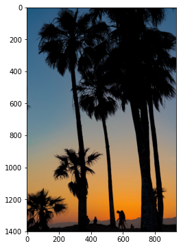
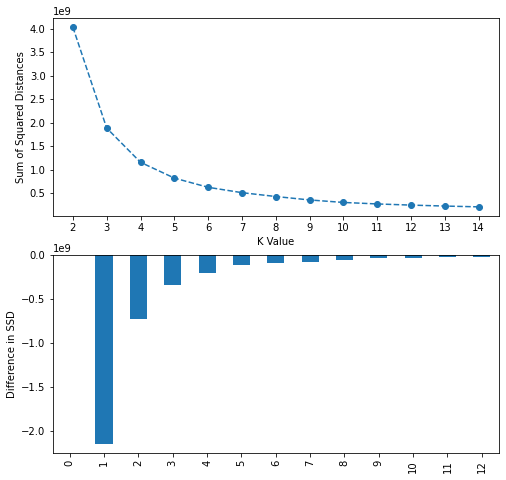
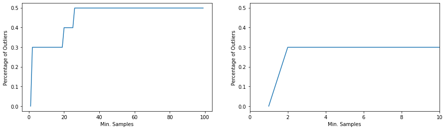

[<-PREV](../project.md)

# Unsupervised Learning
1. Clustering
    - K-Means clustering
    - Hierarchical clustering
    - Density Based Spatial Clustering of Applications with Noise (DBSCAN)
2. Dimensionality Reduction
    - PCA


```python
import numpy as np
import pandas as pd
import matplotlib.pyplot as plt
import seaborn as sns

import matplotlib.image as mpimg
```


```python
mypath = '/project/'
```

# 1. Clustering

## 1.1 K-Means Clustering


```python
image_as_array = mpimg.imread(mypath + 'palm_trees.jpg')
```


```python
image_as_array
plt.figure(figsize=(6,6))
plt.imshow(image_as_array);
```


    

    


```python
(h, w, c) = image_as_array.shape
X = image_as_array.reshape(h*w, c)
```


```python
from sklearn.cluster import KMeans
```


```python
ssd = []
for k in range(2, 15):
    model = KMeans(n_clusters=k)
    model.fit(X)

    ssd.append(model.inertia_)
```


```python
fig, ax = plt.subplots(nrows=2, ncols=1, figsize=(8, 8))
xs = range(2, 15)
ax[0].plot(xs, ssd, 'o--')
ax[0].set_xticks(xs)
ax[0].set_xlabel('K Value')
ax[0].set_ylabel('Sum of Squared Distances')

ssd = pd.Series(ssd)
ssd.diff().plot(kind='bar')
ax[1].set_ylabel('Difference in SSD');
```


    

    


```python
fig, ax = plt.subplots(nrows=1, ncols=3, figsize=(10, 20))

ks = [2, 6, 15]

for i in range(3):

    model = KMeans(n_clusters=ks[i])
    y_pred = model.fit_predict(X)
    rgb_codes = model.cluster_centers_.round(0).astype(int)
    quantized_image = np.reshape(rgb_codes[y_pred], (h, w, c))

    ax[i].imshow(quantized_image)
    ax[i].set_title(f'K={ks[i]}')
    ax[i].axis('off');
    
```


    

    


## 1.2 Hierarchical clustering


```python
import numpy as np
import pandas as pd
import matplotlib.pyplot as plt
import seaborn as sns

from scipy.cluster import hierarchy
```


```python
df = pd.read_csv(mypath + 'cluster_mpg.csv')
```


```python
df.head()
```


  <div id="df-c12640cf-64f3-44f1-b773-63c58d7765f2">
    <div class="colab-df-container">
      <div>
<style scoped>
    .dataframe tbody tr th:only-of-type {
        vertical-align: middle;
    }

    .dataframe tbody tr th {
        vertical-align: top;
    }

    .dataframe thead th {
        text-align: right;
    }
</style>
<table border="1" class="dataframe">
  <thead>
    <tr style="text-align: right;">
      <th></th>
      <th>mpg</th>
      <th>cylinders</th>
      <th>displacement</th>
      <th>horsepower</th>
      <th>weight</th>
      <th>acceleration</th>
      <th>model_year</th>
      <th>origin</th>
    </tr>
  </thead>
  <tbody>
    <tr>
      <th>0</th>
      <td>18.0</td>
      <td>8</td>
      <td>307.0</td>
      <td>130.0</td>
      <td>3504</td>
      <td>12.0</td>
      <td>70</td>
      <td>usa</td>
    </tr>
    <tr>
      <th>1</th>
      <td>15.0</td>
      <td>8</td>
      <td>350.0</td>
      <td>165.0</td>
      <td>3693</td>
      <td>11.5</td>
      <td>70</td>
      <td>usa</td>
    </tr>
    <tr>
      <th>2</th>
      <td>18.0</td>
      <td>8</td>
      <td>318.0</td>
      <td>150.0</td>
      <td>3436</td>
      <td>11.0</td>
      <td>70</td>
      <td>usa</td>
    </tr>
    <tr>
      <th>3</th>
      <td>16.0</td>
      <td>8</td>
      <td>304.0</td>
      <td>150.0</td>
      <td>3433</td>
      <td>12.0</td>
      <td>70</td>
      <td>usa</td>
    </tr>
    <tr>
      <th>4</th>
      <td>17.0</td>
      <td>8</td>
      <td>302.0</td>
      <td>140.0</td>
      <td>3449</td>
      <td>10.5</td>
      <td>70</td>
      <td>usa</td>
    </tr>
  </tbody>
</table>
</div>
      <button class="colab-df-convert" onclick="convertToInteractive('df-c12640cf-64f3-44f1-b773-63c58d7765f2')"
              title="Convert this dataframe to an interactive table."
              style="display:none;">

  <svg xmlns="http://www.w3.org/2000/svg" height="24px"viewBox="0 0 24 24"
       width="24px">
    <path d="M0 0h24v24H0V0z" fill="none"/>
    <path d="M18.56 5.44l.94 2.06.94-2.06 2.06-.94-2.06-.94-.94-2.06-.94 2.06-2.06.94zm-11 1L8.5 8.5l.94-2.06 2.06-.94-2.06-.94L8.5 2.5l-.94 2.06-2.06.94zm10 10l.94 2.06.94-2.06 2.06-.94-2.06-.94-.94-2.06-.94 2.06-2.06.94z"/><path d="M17.41 7.96l-1.37-1.37c-.4-.4-.92-.59-1.43-.59-.52 0-1.04.2-1.43.59L10.3 9.45l-7.72 7.72c-.78.78-.78 2.05 0 2.83L4 21.41c.39.39.9.59 1.41.59.51 0 1.02-.2 1.41-.59l7.78-7.78 2.81-2.81c.8-.78.8-2.07 0-2.86zM5.41 20L4 18.59l7.72-7.72 1.47 1.35L5.41 20z"/>
  </svg>
      </button>

  <style>
    .colab-df-container {
      display:flex;
      flex-wrap:wrap;
      gap: 12px;
    }

    .colab-df-convert {
      background-color: #E8F0FE;
      border: none;
      border-radius: 50%;
      cursor: pointer;
      display: none;
      fill: #1967D2;
      height: 32px;
      padding: 0 0 0 0;
      width: 32px;
    }

    .colab-df-convert:hover {
      background-color: #E2EBFA;
      box-shadow: 0px 1px 2px rgba(60, 64, 67, 0.3), 0px 1px 3px 1px rgba(60, 64, 67, 0.15);
      fill: #174EA6;
    }

    [theme=dark] .colab-df-convert {
      background-color: #3B4455;
      fill: #D2E3FC;
    }

    [theme=dark] .colab-df-convert:hover {
      background-color: #434B5C;
      box-shadow: 0px 1px 3px 1px rgba(0, 0, 0, 0.15);
      filter: drop-shadow(0px 1px 2px rgba(0, 0, 0, 0.3));
      fill: #FFFFFF;
    }
  </style>

      <script>
        const buttonEl =
          document.querySelector('#df-c12640cf-64f3-44f1-b773-63c58d7765f2 button.colab-df-convert');
        buttonEl.style.display =
          google.colab.kernel.accessAllowed ? 'block' : 'none';

        async function convertToInteractive(key) {
          const element = document.querySelector('#df-c12640cf-64f3-44f1-b773-63c58d7765f2');
          const dataTable =
            await google.colab.kernel.invokeFunction('convertToInteractive',
                                                     [key], {});
          if (!dataTable) return;

          const docLinkHtml = 'Like what you see? Visit the ' +
            '<a target="_blank" href=https://colab.research.google.com/notebooks/data_table.ipynb>data table notebook</a>'
            + ' to learn more about interactive tables.';
          element.innerHTML = '';
          dataTable['output_type'] = 'display_data';
          await google.colab.output.renderOutput(dataTable, element);
          const docLink = document.createElement('div');
          docLink.innerHTML = docLinkHtml;
          element.appendChild(docLink);
        }
      </script>
    </div>
  </div>


```python
print(df.info())
df.describe()
```

    <class 'pandas.core.frame.DataFrame'>
    RangeIndex: 392 entries, 0 to 391
    Data columns (total 8 columns):
     #   Column        Non-Null Count  Dtype  
    ---  ------        --------------  -----  
     0   mpg           392 non-null    float64
     1   cylinders     392 non-null    int64  
     2   displacement  392 non-null    float64
     3   horsepower    392 non-null    float64
     4   weight        392 non-null    int64  
     5   acceleration  392 non-null    float64
     6   model_year    392 non-null    int64  
     7   origin        392 non-null    object 
    dtypes: float64(4), int64(3), object(1)
    memory usage: 24.6+ KB
    None


  <div id="df-d5be7586-07ff-4948-8f14-a31483f9bf84">
    <div class="colab-df-container">
      <div>
<style scoped>
    .dataframe tbody tr th:only-of-type {
        vertical-align: middle;
    }

    .dataframe tbody tr th {
        vertical-align: top;
    }

    .dataframe thead th {
        text-align: right;
    }
</style>
<table border="1" class="dataframe">
  <thead>
    <tr style="text-align: right;">
      <th></th>
      <th>mpg</th>
      <th>cylinders</th>
      <th>displacement</th>
      <th>horsepower</th>
      <th>weight</th>
      <th>acceleration</th>
      <th>model_year</th>
    </tr>
  </thead>
  <tbody>
    <tr>
      <th>count</th>
      <td>392.000000</td>
      <td>392.000000</td>
      <td>392.000000</td>
      <td>392.000000</td>
      <td>392.000000</td>
      <td>392.000000</td>
      <td>392.000000</td>
    </tr>
    <tr>
      <th>mean</th>
      <td>23.445918</td>
      <td>5.471939</td>
      <td>194.411990</td>
      <td>104.469388</td>
      <td>2977.584184</td>
      <td>15.541327</td>
      <td>75.979592</td>
    </tr>
    <tr>
      <th>std</th>
      <td>7.805007</td>
      <td>1.705783</td>
      <td>104.644004</td>
      <td>38.491160</td>
      <td>849.402560</td>
      <td>2.758864</td>
      <td>3.683737</td>
    </tr>
    <tr>
      <th>min</th>
      <td>9.000000</td>
      <td>3.000000</td>
      <td>68.000000</td>
      <td>46.000000</td>
      <td>1613.000000</td>
      <td>8.000000</td>
      <td>70.000000</td>
    </tr>
    <tr>
      <th>25%</th>
      <td>17.000000</td>
      <td>4.000000</td>
      <td>105.000000</td>
      <td>75.000000</td>
      <td>2225.250000</td>
      <td>13.775000</td>
      <td>73.000000</td>
    </tr>
    <tr>
      <th>50%</th>
      <td>22.750000</td>
      <td>4.000000</td>
      <td>151.000000</td>
      <td>93.500000</td>
      <td>2803.500000</td>
      <td>15.500000</td>
      <td>76.000000</td>
    </tr>
    <tr>
      <th>75%</th>
      <td>29.000000</td>
      <td>8.000000</td>
      <td>275.750000</td>
      <td>126.000000</td>
      <td>3614.750000</td>
      <td>17.025000</td>
      <td>79.000000</td>
    </tr>
    <tr>
      <th>max</th>
      <td>46.600000</td>
      <td>8.000000</td>
      <td>455.000000</td>
      <td>230.000000</td>
      <td>5140.000000</td>
      <td>24.800000</td>
      <td>82.000000</td>
    </tr>
  </tbody>
</table>
</div>
      <button class="colab-df-convert" onclick="convertToInteractive('df-d5be7586-07ff-4948-8f14-a31483f9bf84')"
              title="Convert this dataframe to an interactive table."
              style="display:none;">

  <svg xmlns="http://www.w3.org/2000/svg" height="24px"viewBox="0 0 24 24"
       width="24px">
    <path d="M0 0h24v24H0V0z" fill="none"/>
    <path d="M18.56 5.44l.94 2.06.94-2.06 2.06-.94-2.06-.94-.94-2.06-.94 2.06-2.06.94zm-11 1L8.5 8.5l.94-2.06 2.06-.94-2.06-.94L8.5 2.5l-.94 2.06-2.06.94zm10 10l.94 2.06.94-2.06 2.06-.94-2.06-.94-.94-2.06-.94 2.06-2.06.94z"/><path d="M17.41 7.96l-1.37-1.37c-.4-.4-.92-.59-1.43-.59-.52 0-1.04.2-1.43.59L10.3 9.45l-7.72 7.72c-.78.78-.78 2.05 0 2.83L4 21.41c.39.39.9.59 1.41.59.51 0 1.02-.2 1.41-.59l7.78-7.78 2.81-2.81c.8-.78.8-2.07 0-2.86zM5.41 20L4 18.59l7.72-7.72 1.47 1.35L5.41 20z"/>
  </svg>
      </button>

  <style>
    .colab-df-container {
      display:flex;
      flex-wrap:wrap;
      gap: 12px;
    }

    .colab-df-convert {
      background-color: #E8F0FE;
      border: none;
      border-radius: 50%;
      cursor: pointer;
      display: none;
      fill: #1967D2;
      height: 32px;
      padding: 0 0 0 0;
      width: 32px;
    }

    .colab-df-convert:hover {
      background-color: #E2EBFA;
      box-shadow: 0px 1px 2px rgba(60, 64, 67, 0.3), 0px 1px 3px 1px rgba(60, 64, 67, 0.15);
      fill: #174EA6;
    }

    [theme=dark] .colab-df-convert {
      background-color: #3B4455;
      fill: #D2E3FC;
    }

    [theme=dark] .colab-df-convert:hover {
      background-color: #434B5C;
      box-shadow: 0px 1px 3px 1px rgba(0, 0, 0, 0.15);
      filter: drop-shadow(0px 1px 2px rgba(0, 0, 0, 0.3));
      fill: #FFFFFF;
    }
  </style>

      <script>
        const buttonEl =
          document.querySelector('#df-d5be7586-07ff-4948-8f14-a31483f9bf84 button.colab-df-convert');
        buttonEl.style.display =
          google.colab.kernel.accessAllowed ? 'block' : 'none';

        async function convertToInteractive(key) {
          const element = document.querySelector('#df-d5be7586-07ff-4948-8f14-a31483f9bf84');
          const dataTable =
            await google.colab.kernel.invokeFunction('convertToInteractive',
                                                     [key], {});
          if (!dataTable) return;

          const docLinkHtml = 'Like what you see? Visit the ' +
            '<a target="_blank" href=https://colab.research.google.com/notebooks/data_table.ipynb>data table notebook</a>'
            + ' to learn more about interactive tables.';
          element.innerHTML = '';
          dataTable['output_type'] = 'display_data';
          await google.colab.output.renderOutput(dataTable, element);
          const docLink = document.createElement('div');
          docLink.innerHTML = docLinkHtml;
          element.appendChild(docLink);
        }
      </script>
    </div>
  </div>


```python
X = pd.get_dummies(df)
X.head()
```


  <div id="df-8f5d04f6-cd50-4803-902c-a33771e5323d">
    <div class="colab-df-container">
      <div>
<style scoped>
    .dataframe tbody tr th:only-of-type {
        vertical-align: middle;
    }

    .dataframe tbody tr th {
        vertical-align: top;
    }

    .dataframe thead th {
        text-align: right;
    }
</style>
<table border="1" class="dataframe">
  <thead>
    <tr style="text-align: right;">
      <th></th>
      <th>mpg</th>
      <th>cylinders</th>
      <th>displacement</th>
      <th>horsepower</th>
      <th>weight</th>
      <th>acceleration</th>
      <th>model_year</th>
      <th>origin_europe</th>
      <th>origin_japan</th>
      <th>origin_usa</th>
    </tr>
  </thead>
  <tbody>
    <tr>
      <th>0</th>
      <td>18.0</td>
      <td>8</td>
      <td>307.0</td>
      <td>130.0</td>
      <td>3504</td>
      <td>12.0</td>
      <td>70</td>
      <td>0</td>
      <td>0</td>
      <td>1</td>
    </tr>
    <tr>
      <th>1</th>
      <td>15.0</td>
      <td>8</td>
      <td>350.0</td>
      <td>165.0</td>
      <td>3693</td>
      <td>11.5</td>
      <td>70</td>
      <td>0</td>
      <td>0</td>
      <td>1</td>
    </tr>
    <tr>
      <th>2</th>
      <td>18.0</td>
      <td>8</td>
      <td>318.0</td>
      <td>150.0</td>
      <td>3436</td>
      <td>11.0</td>
      <td>70</td>
      <td>0</td>
      <td>0</td>
      <td>1</td>
    </tr>
    <tr>
      <th>3</th>
      <td>16.0</td>
      <td>8</td>
      <td>304.0</td>
      <td>150.0</td>
      <td>3433</td>
      <td>12.0</td>
      <td>70</td>
      <td>0</td>
      <td>0</td>
      <td>1</td>
    </tr>
    <tr>
      <th>4</th>
      <td>17.0</td>
      <td>8</td>
      <td>302.0</td>
      <td>140.0</td>
      <td>3449</td>
      <td>10.5</td>
      <td>70</td>
      <td>0</td>
      <td>0</td>
      <td>1</td>
    </tr>
  </tbody>
</table>
</div>
      <button class="colab-df-convert" onclick="convertToInteractive('df-8f5d04f6-cd50-4803-902c-a33771e5323d')"
              title="Convert this dataframe to an interactive table."
              style="display:none;">

  <svg xmlns="http://www.w3.org/2000/svg" height="24px"viewBox="0 0 24 24"
       width="24px">
    <path d="M0 0h24v24H0V0z" fill="none"/>
    <path d="M18.56 5.44l.94 2.06.94-2.06 2.06-.94-2.06-.94-.94-2.06-.94 2.06-2.06.94zm-11 1L8.5 8.5l.94-2.06 2.06-.94-2.06-.94L8.5 2.5l-.94 2.06-2.06.94zm10 10l.94 2.06.94-2.06 2.06-.94-2.06-.94-.94-2.06-.94 2.06-2.06.94z"/><path d="M17.41 7.96l-1.37-1.37c-.4-.4-.92-.59-1.43-.59-.52 0-1.04.2-1.43.59L10.3 9.45l-7.72 7.72c-.78.78-.78 2.05 0 2.83L4 21.41c.39.39.9.59 1.41.59.51 0 1.02-.2 1.41-.59l7.78-7.78 2.81-2.81c.8-.78.8-2.07 0-2.86zM5.41 20L4 18.59l7.72-7.72 1.47 1.35L5.41 20z"/>
  </svg>
      </button>

  <style>
    .colab-df-container {
      display:flex;
      flex-wrap:wrap;
      gap: 12px;
    }

    .colab-df-convert {
      background-color: #E8F0FE;
      border: none;
      border-radius: 50%;
      cursor: pointer;
      display: none;
      fill: #1967D2;
      height: 32px;
      padding: 0 0 0 0;
      width: 32px;
    }

    .colab-df-convert:hover {
      background-color: #E2EBFA;
      box-shadow: 0px 1px 2px rgba(60, 64, 67, 0.3), 0px 1px 3px 1px rgba(60, 64, 67, 0.15);
      fill: #174EA6;
    }

    [theme=dark] .colab-df-convert {
      background-color: #3B4455;
      fill: #D2E3FC;
    }

    [theme=dark] .colab-df-convert:hover {
      background-color: #434B5C;
      box-shadow: 0px 1px 3px 1px rgba(0, 0, 0, 0.15);
      filter: drop-shadow(0px 1px 2px rgba(0, 0, 0, 0.3));
      fill: #FFFFFF;
    }
  </style>

      <script>
        const buttonEl =
          document.querySelector('#df-8f5d04f6-cd50-4803-902c-a33771e5323d button.colab-df-convert');
        buttonEl.style.display =
          google.colab.kernel.accessAllowed ? 'block' : 'none';

        async function convertToInteractive(key) {
          const element = document.querySelector('#df-8f5d04f6-cd50-4803-902c-a33771e5323d');
          const dataTable =
            await google.colab.kernel.invokeFunction('convertToInteractive',
                                                     [key], {});
          if (!dataTable) return;

          const docLinkHtml = 'Like what you see? Visit the ' +
            '<a target="_blank" href=https://colab.research.google.com/notebooks/data_table.ipynb>data table notebook</a>'
            + ' to learn more about interactive tables.';
          element.innerHTML = '';
          dataTable['output_type'] = 'display_data';
          await google.colab.output.renderOutput(dataTable, element);
          const docLink = document.createElement('div');
          docLink.innerHTML = docLinkHtml;
          element.appendChild(docLink);
        }
      </script>
    </div>
  </div>


```python
from sklearn.preprocessing import MinMaxScaler

scaler = MinMaxScaler()
scaled_X = scaler.fit_transform(X)
scaled_df = pd.DataFrame(data=scaled_X, columns=X.columns)
```

### 1.2.1 Choose a model based on clustermap


```python
sns.clustermap(scaled_df);
```


    

    


```python
from sklearn.cluster import AgglomerativeClustering

model = AgglomerativeClustering(n_clusters=4)
cluster_y = model.fit_predict(scaled_X)
cluster_y
```


    array([1, 1, 1, 1, 1, 1, 1, 1, 1, 1, 1, 1, 1, 1, 3, 0, 0, 0, 3, 2, 2, 2,
           2, 2, 0, 1, 1, 1, 1, 3, 0, 3, 0, 0, 0, 0, 0, 1, 1, 1, 1, 1, 1, 1,
           0, 0, 0, 0, 0, 2, 2, 2, 3, 3, 2, 0, 3, 0, 2, 0, 0, 1, 1, 1, 1, 1,
           1, 1, 1, 1, 3, 1, 1, 1, 1, 2, 2, 2, 2, 0, 3, 3, 0, 3, 1, 1, 1, 1,
           1, 1, 1, 1, 1, 1, 1, 1, 0, 0, 0, 0, 0, 2, 1, 1, 1, 1, 0, 3, 0, 3,
           3, 0, 0, 2, 1, 1, 2, 2, 2, 2, 1, 2, 3, 1, 0, 0, 0, 3, 0, 3, 0, 0,
           0, 0, 1, 1, 1, 1, 1, 2, 2, 2, 3, 3, 0, 2, 2, 3, 3, 2, 0, 0, 0, 0,
           1, 1, 1, 1, 0, 0, 0, 0, 0, 1, 1, 3, 0, 0, 0, 3, 2, 3, 0, 2, 0, 2,
           2, 2, 2, 3, 2, 2, 0, 0, 2, 1, 1, 1, 1, 0, 0, 0, 0, 0, 0, 2, 3, 0,
           0, 0, 0, 2, 3, 3, 0, 2, 1, 2, 3, 2, 1, 1, 1, 1, 3, 0, 2, 0, 3, 1,
           1, 1, 1, 0, 0, 0, 0, 1, 1, 1, 1, 2, 0, 3, 0, 0, 0, 3, 2, 3, 2, 3,
           2, 0, 3, 3, 3, 1, 1, 1, 0, 0, 0, 0, 0, 0, 0, 0, 0, 0, 1, 0, 1, 1,
           0, 3, 3, 0, 3, 0, 0, 3, 2, 2, 2, 2, 2, 3, 0, 0, 0, 0, 0, 1, 1, 1,
           1, 1, 1, 1, 1, 2, 3, 0, 0, 2, 1, 2, 1, 0, 0, 3, 2, 0, 0, 0, 0, 2,
           3, 0, 3, 0, 0, 0, 0, 2, 3, 3, 3, 3, 3, 0, 3, 2, 2, 2, 2, 3, 3, 2,
           3, 3, 2, 3, 0, 0, 0, 0, 0, 3, 0, 3, 3, 3, 3, 3, 0, 0, 0, 2, 3, 3,
           3, 3, 2, 2, 3, 3, 0, 1, 0, 0, 0, 0, 0, 0, 0, 0, 0, 2, 3, 3, 0, 0,
           3, 3, 3, 3, 3, 3, 0, 0, 0, 0, 3, 0, 0, 0, 2, 0, 0, 0])


### 1.2.2 Choose a model based on distance threshold
Distance threshold: The linkage distance threshold above which, clusters will not be merged.


```python
scaled_df.describe()
```


  <div id="df-76335552-aa68-47c3-911c-a7bfc1ceace6">
    <div class="colab-df-container">
      <div>
<style scoped>
    .dataframe tbody tr th:only-of-type {
        vertical-align: middle;
    }

    .dataframe tbody tr th {
        vertical-align: top;
    }

    .dataframe thead th {
        text-align: right;
    }
</style>
<table border="1" class="dataframe">
  <thead>
    <tr style="text-align: right;">
      <th></th>
      <th>mpg</th>
      <th>cylinders</th>
      <th>displacement</th>
      <th>horsepower</th>
      <th>weight</th>
      <th>acceleration</th>
      <th>model_year</th>
      <th>origin_europe</th>
      <th>origin_japan</th>
      <th>origin_usa</th>
    </tr>
  </thead>
  <tbody>
    <tr>
      <th>count</th>
      <td>392.000000</td>
      <td>392.000000</td>
      <td>392.000000</td>
      <td>392.000000</td>
      <td>392.000000</td>
      <td>392.000000</td>
      <td>392.000000</td>
      <td>392.000000</td>
      <td>392.000000</td>
      <td>392.000000</td>
    </tr>
    <tr>
      <th>mean</th>
      <td>0.384200</td>
      <td>0.494388</td>
      <td>0.326646</td>
      <td>0.317768</td>
      <td>0.386897</td>
      <td>0.448888</td>
      <td>0.498299</td>
      <td>0.173469</td>
      <td>0.201531</td>
      <td>0.625000</td>
    </tr>
    <tr>
      <th>std</th>
      <td>0.207580</td>
      <td>0.341157</td>
      <td>0.270398</td>
      <td>0.209191</td>
      <td>0.240829</td>
      <td>0.164218</td>
      <td>0.306978</td>
      <td>0.379136</td>
      <td>0.401656</td>
      <td>0.484742</td>
    </tr>
    <tr>
      <th>min</th>
      <td>0.000000</td>
      <td>0.000000</td>
      <td>0.000000</td>
      <td>0.000000</td>
      <td>0.000000</td>
      <td>0.000000</td>
      <td>0.000000</td>
      <td>0.000000</td>
      <td>0.000000</td>
      <td>0.000000</td>
    </tr>
    <tr>
      <th>25%</th>
      <td>0.212766</td>
      <td>0.200000</td>
      <td>0.095607</td>
      <td>0.157609</td>
      <td>0.173589</td>
      <td>0.343750</td>
      <td>0.250000</td>
      <td>0.000000</td>
      <td>0.000000</td>
      <td>0.000000</td>
    </tr>
    <tr>
      <th>50%</th>
      <td>0.365691</td>
      <td>0.200000</td>
      <td>0.214470</td>
      <td>0.258152</td>
      <td>0.337539</td>
      <td>0.446429</td>
      <td>0.500000</td>
      <td>0.000000</td>
      <td>0.000000</td>
      <td>1.000000</td>
    </tr>
    <tr>
      <th>75%</th>
      <td>0.531915</td>
      <td>1.000000</td>
      <td>0.536822</td>
      <td>0.434783</td>
      <td>0.567550</td>
      <td>0.537202</td>
      <td>0.750000</td>
      <td>0.000000</td>
      <td>0.000000</td>
      <td>1.000000</td>
    </tr>
    <tr>
      <th>max</th>
      <td>1.000000</td>
      <td>1.000000</td>
      <td>1.000000</td>
      <td>1.000000</td>
      <td>1.000000</td>
      <td>1.000000</td>
      <td>1.000000</td>
      <td>1.000000</td>
      <td>1.000000</td>
      <td>1.000000</td>
    </tr>
  </tbody>
</table>
</div>
      <button class="colab-df-convert" onclick="convertToInteractive('df-76335552-aa68-47c3-911c-a7bfc1ceace6')"
              title="Convert this dataframe to an interactive table."
              style="display:none;">

  <svg xmlns="http://www.w3.org/2000/svg" height="24px"viewBox="0 0 24 24"
       width="24px">
    <path d="M0 0h24v24H0V0z" fill="none"/>
    <path d="M18.56 5.44l.94 2.06.94-2.06 2.06-.94-2.06-.94-.94-2.06-.94 2.06-2.06.94zm-11 1L8.5 8.5l.94-2.06 2.06-.94-2.06-.94L8.5 2.5l-.94 2.06-2.06.94zm10 10l.94 2.06.94-2.06 2.06-.94-2.06-.94-.94-2.06-.94 2.06-2.06.94z"/><path d="M17.41 7.96l-1.37-1.37c-.4-.4-.92-.59-1.43-.59-.52 0-1.04.2-1.43.59L10.3 9.45l-7.72 7.72c-.78.78-.78 2.05 0 2.83L4 21.41c.39.39.9.59 1.41.59.51 0 1.02-.2 1.41-.59l7.78-7.78 2.81-2.81c.8-.78.8-2.07 0-2.86zM5.41 20L4 18.59l7.72-7.72 1.47 1.35L5.41 20z"/>
  </svg>
      </button>

  <style>
    .colab-df-container {
      display:flex;
      flex-wrap:wrap;
      gap: 12px;
    }

    .colab-df-convert {
      background-color: #E8F0FE;
      border: none;
      border-radius: 50%;
      cursor: pointer;
      display: none;
      fill: #1967D2;
      height: 32px;
      padding: 0 0 0 0;
      width: 32px;
    }

    .colab-df-convert:hover {
      background-color: #E2EBFA;
      box-shadow: 0px 1px 2px rgba(60, 64, 67, 0.3), 0px 1px 3px 1px rgba(60, 64, 67, 0.15);
      fill: #174EA6;
    }

    [theme=dark] .colab-df-convert {
      background-color: #3B4455;
      fill: #D2E3FC;
    }

    [theme=dark] .colab-df-convert:hover {
      background-color: #434B5C;
      box-shadow: 0px 1px 3px 1px rgba(0, 0, 0, 0.15);
      filter: drop-shadow(0px 1px 2px rgba(0, 0, 0, 0.3));
      fill: #FFFFFF;
    }
  </style>

      <script>
        const buttonEl =
          document.querySelector('#df-76335552-aa68-47c3-911c-a7bfc1ceace6 button.colab-df-convert');
        buttonEl.style.display =
          google.colab.kernel.accessAllowed ? 'block' : 'none';

        async function convertToInteractive(key) {
          const element = document.querySelector('#df-76335552-aa68-47c3-911c-a7bfc1ceace6');
          const dataTable =
            await google.colab.kernel.invokeFunction('convertToInteractive',
                                                     [key], {});
          if (!dataTable) return;

          const docLinkHtml = 'Like what you see? Visit the ' +
            '<a target="_blank" href=https://colab.research.google.com/notebooks/data_table.ipynb>data table notebook</a>'
            + ' to learn more about interactive tables.';
          element.innerHTML = '';
          dataTable['output_type'] = 'display_data';
          await google.colab.output.renderOutput(dataTable, element);
          const docLink = document.createElement('div');
          docLink.innerHTML = docLinkHtml;
          element.appendChild(docLink);
        }
      </script>
    </div>
  </div>


```python
maxi = scaled_df['mpg'].idxmax()
mini = scaled_df['mpg'].idxmin()
dist = np.linalg.norm(scaled_df.iloc[maxi] - scaled_df.iloc[mini])
dist
```


    2.3852929970374714


```python
# maximum possible distance
np.sqrt(len(scaled_df.columns))
```


    3.1622776601683795


```python
model = AgglomerativeClustering(n_clusters=None, distance_threshold=2)
cluster_y = model.fit_predict(scaled_X)
cluster_y
```


    array([ 3,  3,  3,  3,  3,  3,  3,  3,  3,  3,  3,  3,  3,  3,  1,  4,  4,
            4,  1,  0,  0,  0,  0,  0,  4,  3,  3,  3,  3,  1,  7,  1,  4,  4,
            4,  4,  4,  3,  3,  3,  3,  3,  3,  3,  4,  7,  4,  4,  7,  0,  0,
            0,  1,  1,  0,  7,  1,  7,  0,  7,  7,  3,  3,  3,  3,  3,  3,  3,
            3,  3,  1,  3,  3,  3,  3,  0,  0,  0,  0,  7,  1,  1,  7,  1,  3,
            3,  3,  3,  3,  3,  3,  3,  3,  3,  3,  3,  4,  4,  4,  4,  4,  0,
            3,  3,  3,  3,  4,  1,  7,  1,  1,  7,  4,  0,  3,  3,  0,  0,  0,
            0,  3,  0, 10,  3,  4,  4,  4,  1,  7,  1,  7,  4,  4,  4,  3,  3,
            3,  3,  3,  0,  0,  0,  1,  1,  7,  0,  0,  1,  1,  0,  4,  4,  4,
            4,  5,  3,  3,  3,  4,  4,  4,  4,  4,  5,  5,  1,  7,  4,  7,  1,
            0,  1,  4,  0,  4,  0,  0,  0,  0,  1,  0,  0,  7,  7,  0,  5,  5,
            5,  5,  4,  4,  4,  4,  7,  7,  0,  1,  9,  4,  9,  4,  0,  1,  1,
            7,  0,  5,  8, 10,  0,  5,  5,  5,  5,  1,  2,  8,  7,  1,  5,  5,
            5,  5,  9,  9,  9,  9,  5,  5,  5,  5,  0,  7,  1,  7,  2,  2,  1,
            0, 10,  0, 10,  8,  2,  1,  6,  1,  5,  5,  5,  9,  9,  9,  7,  9,
            9,  9,  9,  9,  9,  5,  9,  5,  5,  2, 10, 10,  2, 10,  2,  2, 10,
            0,  0,  0,  0,  8,  1,  9,  9,  2,  9,  9,  5,  5,  5,  5,  5,  5,
            5,  5,  8,  1,  2,  2,  8,  5,  8,  5,  2,  2,  1,  8,  2,  9,  9,
            2,  8,  6,  2,  6,  2,  2,  2,  9,  8,  6,  6,  6,  6,  6,  2,  6,
            8,  8,  8,  8,  6,  6,  8, 10, 10,  8,  6,  2,  2,  2,  9,  2,  6,
            2,  6,  6,  6,  6,  6,  2,  2,  2,  8,  6,  6,  6,  6,  8,  8, 10,
           10,  9,  5,  9,  9,  2,  2,  2,  2,  2,  2,  2,  8,  6,  6,  2,  2,
            6,  6,  6,  6,  6,  6,  9,  9,  2,  9,  6,  2,  2,  2,  8,  2,  2,
            2])


```python
np.unique(cluster_y)
```


    array([ 0,  1,  2,  3,  4,  5,  6,  7,  8,  9, 10])


```python
linkage_matrix = hierarchy.linkage(model.children_)
linkage_matrix.shape
```


    (390, 4)


```python
linkage_matrix
```


    array([[ 67.        , 161.        ,   1.41421356,   2.        ],
           [ 10.        ,  45.        ,   1.41421356,   2.        ],
           [ 47.        ,  99.        ,   1.41421356,   2.        ],
           ...,
           [340.        , 777.        ,  56.40035461, 389.        ],
           [332.        , 778.        ,  58.69412236, 390.        ],
           [349.        , 779.        ,  75.32595834, 391.        ]])


```python
plt.figure(figsize=(20, 10))
dn = hierarchy.dendrogram(linkage_matrix);
```


    

    


```python
plt.figure(figsize=(20, 10))
dn = hierarchy.dendrogram(linkage_matrix,truncate_mode='lastp',p=11);
```


    

    


## 1.3 DBSCAN


```python
import numpy as np
import pandas as pd
import matplotlib.pyplot as plt
import seaborn as sns
```


```python
df = pd.read_csv(mypath + 'cluster_two_blobs_outliers.csv')
```


```python
sns.scatterplot(data=df, x='X1', y='X2');
```


    

    


```python
from sklearn.cluster import DBSCAN
```


```python
def display_categories(model, data):
    y_cluster = model.fit_predict(data)
    sns.scatterplot(data=data, x='X1', y='X2', hue=y_cluster, palette='Set1')
```


```python
model = DBSCAN()
display_categories(model, df)
```


    

    


### 1.3.1 Choose an Epsilon either by a percentage or a number of outliers

- Choose a range targetting 1-5% as outliers


```python
outlier_percent = []
outlier_number = []

for eps in np.linspace(0.001, 10, 100):

    model = DBSCAN(eps=eps)
    y_cluster = model.fit_predict(df)

    outlier_number.append(np.sum(y_cluster == -1))

    perc = 100 * np.sum(y_cluster == -1) / len(y_cluster)
    outlier_percent.append(perc)
```


```python
xs = np.linspace(0.001, 10, 100)
fig, ax = plt.subplots(nrows=1, ncols=2, figsize=(15, 4))
ax[0].plot(xs, outlier_percent)
ax[0].set_xlabel('Epsilon')
ax[0].set_ylabel('Percentage of Outliers')

ax[1].plot(xs, outlier_percent)
ax[1].set_xlabel('Epsilon')
ax[1].set_ylabel('Percentage of Outliers')
ax[1].set_ylim(0, 5)
ax[1].set_xlim(0, 2)
ax[1].hlines(y=1, xmin=0, xmax=2, colors='red', ls='--');
```


    

    


```python
model = DBSCAN(eps=0.4)
display_categories(model, df)
```


    

    


```python
xs = np.linspace(0.001, 10, 100)
fig, ax = plt.subplots(nrows=1, ncols=2, figsize=(15, 4))
ax[0].plot(xs, outlier_number)
ax[0].set_xlabel('Epsilon')
ax[0].set_ylabel('Number of Outliers')

ax[1].plot(xs, outlier_number)
ax[1].set_xlabel('Epsilon')
ax[1].set_ylabel('Number of Outliers')
ax[1].set_ylim(0, 10)
ax[1].set_xlim(0, 6)
ax[1].hlines(y=3, xmin=0, xmax=10, colors='red', ls='--');
```


    

    


```python
model = DBSCAN(eps=0.75)
display_categories(model, df)
```


    

    


### 1.3.2 Choose  min_samples


```python
outlier_percent = []
outlier_number = []
for n in np.arange(1, 100):

    model = DBSCAN(eps=0.75, min_samples=n)
    y_cluster = model.fit_predict(df)

    perc = 100 * np.sum(y_cluster == -1) / len(y_cluster)
    outlier_percent.append(perc)

    num = np.sum(y_cluster == -1)
    outlier_number.append(num)
```


```python
xs = np.arange(1, 100)
fig, ax = plt.subplots(nrows=1, ncols=2, figsize=(15, 4))
ax[0].plot(xs, outlier_percent)
ax[0].set_xlabel('Min. Samples')
ax[0].set_ylabel('Percentage of Outliers')

ax[1].plot(xs, outlier_percent)
ax[1].set_xlabel('Min. Samples')
ax[1].set_ylabel('Percentage of Outliers')
ax[1].set_xlim(0, 10);
```


    

    


```python
xs = np.arange(1, 100)
fig, ax = plt.subplots(nrows=1, ncols=2, figsize=(15, 4))
ax[0].plot(xs, outlier_number)
ax[0].set_xlabel('Min. Samples')
ax[0].set_ylabel('Number of Outliers')

ax[1].plot(xs, outlier_number)
ax[1].set_xlabel('Min. Samples')
ax[1].set_ylabel('Number of Outliers')
ax[1].set_xlim(0, 10);
```


    

    


```python
num_dim = df.shape[1] # 2

model = DBSCAN(eps=0.75, min_samples=2*num_dim)
display_categories(model, df)
```


    

    


```python
model = DBSCAN(eps=0.5, min_samples=2*num_dim)
display_categories(model, df)
```


    

    


# Dimension Reduction

## 2.1 PCA 


```python
import numpy as np
import pandas as pd
import matplotlib.pyplot as plt
import seaborn as sns
```


```python
# Load y
from sklearn.datasets import load_breast_cancer
y_true = load_breast_cancer()['target']
```


```python
# Load X
df = pd.read_csv(mypath + 'cancer_tumor_data_features.csv')
```


```python
df.head()
```


  <div id="df-879c98d0-91fd-41a5-a274-e2382ac49fbf">
    <div class="colab-df-container">
      <div>
<style scoped>
    .dataframe tbody tr th:only-of-type {
        vertical-align: middle;
    }

    .dataframe tbody tr th {
        vertical-align: top;
    }

    .dataframe thead th {
        text-align: right;
    }
</style>
<table border="1" class="dataframe">
  <thead>
    <tr style="text-align: right;">
      <th></th>
      <th>mean radius</th>
      <th>mean texture</th>
      <th>mean perimeter</th>
      <th>mean area</th>
      <th>mean smoothness</th>
      <th>mean compactness</th>
      <th>mean concavity</th>
      <th>mean concave points</th>
      <th>mean symmetry</th>
      <th>mean fractal dimension</th>
      <th>...</th>
      <th>worst radius</th>
      <th>worst texture</th>
      <th>worst perimeter</th>
      <th>worst area</th>
      <th>worst smoothness</th>
      <th>worst compactness</th>
      <th>worst concavity</th>
      <th>worst concave points</th>
      <th>worst symmetry</th>
      <th>worst fractal dimension</th>
    </tr>
  </thead>
  <tbody>
    <tr>
      <th>0</th>
      <td>17.99</td>
      <td>10.38</td>
      <td>122.80</td>
      <td>1001.0</td>
      <td>0.11840</td>
      <td>0.27760</td>
      <td>0.3001</td>
      <td>0.14710</td>
      <td>0.2419</td>
      <td>0.07871</td>
      <td>...</td>
      <td>25.38</td>
      <td>17.33</td>
      <td>184.60</td>
      <td>2019.0</td>
      <td>0.1622</td>
      <td>0.6656</td>
      <td>0.7119</td>
      <td>0.2654</td>
      <td>0.4601</td>
      <td>0.11890</td>
    </tr>
    <tr>
      <th>1</th>
      <td>20.57</td>
      <td>17.77</td>
      <td>132.90</td>
      <td>1326.0</td>
      <td>0.08474</td>
      <td>0.07864</td>
      <td>0.0869</td>
      <td>0.07017</td>
      <td>0.1812</td>
      <td>0.05667</td>
      <td>...</td>
      <td>24.99</td>
      <td>23.41</td>
      <td>158.80</td>
      <td>1956.0</td>
      <td>0.1238</td>
      <td>0.1866</td>
      <td>0.2416</td>
      <td>0.1860</td>
      <td>0.2750</td>
      <td>0.08902</td>
    </tr>
    <tr>
      <th>2</th>
      <td>19.69</td>
      <td>21.25</td>
      <td>130.00</td>
      <td>1203.0</td>
      <td>0.10960</td>
      <td>0.15990</td>
      <td>0.1974</td>
      <td>0.12790</td>
      <td>0.2069</td>
      <td>0.05999</td>
      <td>...</td>
      <td>23.57</td>
      <td>25.53</td>
      <td>152.50</td>
      <td>1709.0</td>
      <td>0.1444</td>
      <td>0.4245</td>
      <td>0.4504</td>
      <td>0.2430</td>
      <td>0.3613</td>
      <td>0.08758</td>
    </tr>
    <tr>
      <th>3</th>
      <td>11.42</td>
      <td>20.38</td>
      <td>77.58</td>
      <td>386.1</td>
      <td>0.14250</td>
      <td>0.28390</td>
      <td>0.2414</td>
      <td>0.10520</td>
      <td>0.2597</td>
      <td>0.09744</td>
      <td>...</td>
      <td>14.91</td>
      <td>26.50</td>
      <td>98.87</td>
      <td>567.7</td>
      <td>0.2098</td>
      <td>0.8663</td>
      <td>0.6869</td>
      <td>0.2575</td>
      <td>0.6638</td>
      <td>0.17300</td>
    </tr>
    <tr>
      <th>4</th>
      <td>20.29</td>
      <td>14.34</td>
      <td>135.10</td>
      <td>1297.0</td>
      <td>0.10030</td>
      <td>0.13280</td>
      <td>0.1980</td>
      <td>0.10430</td>
      <td>0.1809</td>
      <td>0.05883</td>
      <td>...</td>
      <td>22.54</td>
      <td>16.67</td>
      <td>152.20</td>
      <td>1575.0</td>
      <td>0.1374</td>
      <td>0.2050</td>
      <td>0.4000</td>
      <td>0.1625</td>
      <td>0.2364</td>
      <td>0.07678</td>
    </tr>
  </tbody>
</table>
<p>5 rows × 30 columns</p>
</div>
      <button class="colab-df-convert" onclick="convertToInteractive('df-879c98d0-91fd-41a5-a274-e2382ac49fbf')"
              title="Convert this dataframe to an interactive table."
              style="display:none;">

  <svg xmlns="http://www.w3.org/2000/svg" height="24px"viewBox="0 0 24 24"
       width="24px">
    <path d="M0 0h24v24H0V0z" fill="none"/>
    <path d="M18.56 5.44l.94 2.06.94-2.06 2.06-.94-2.06-.94-.94-2.06-.94 2.06-2.06.94zm-11 1L8.5 8.5l.94-2.06 2.06-.94-2.06-.94L8.5 2.5l-.94 2.06-2.06.94zm10 10l.94 2.06.94-2.06 2.06-.94-2.06-.94-.94-2.06-.94 2.06-2.06.94z"/><path d="M17.41 7.96l-1.37-1.37c-.4-.4-.92-.59-1.43-.59-.52 0-1.04.2-1.43.59L10.3 9.45l-7.72 7.72c-.78.78-.78 2.05 0 2.83L4 21.41c.39.39.9.59 1.41.59.51 0 1.02-.2 1.41-.59l7.78-7.78 2.81-2.81c.8-.78.8-2.07 0-2.86zM5.41 20L4 18.59l7.72-7.72 1.47 1.35L5.41 20z"/>
  </svg>
      </button>

  <style>
    .colab-df-container {
      display:flex;
      flex-wrap:wrap;
      gap: 12px;
    }

    .colab-df-convert {
      background-color: #E8F0FE;
      border: none;
      border-radius: 50%;
      cursor: pointer;
      display: none;
      fill: #1967D2;
      height: 32px;
      padding: 0 0 0 0;
      width: 32px;
    }

    .colab-df-convert:hover {
      background-color: #E2EBFA;
      box-shadow: 0px 1px 2px rgba(60, 64, 67, 0.3), 0px 1px 3px 1px rgba(60, 64, 67, 0.15);
      fill: #174EA6;
    }

    [theme=dark] .colab-df-convert {
      background-color: #3B4455;
      fill: #D2E3FC;
    }

    [theme=dark] .colab-df-convert:hover {
      background-color: #434B5C;
      box-shadow: 0px 1px 3px 1px rgba(0, 0, 0, 0.15);
      filter: drop-shadow(0px 1px 2px rgba(0, 0, 0, 0.3));
      fill: #FFFFFF;
    }
  </style>

      <script>
        const buttonEl =
          document.querySelector('#df-879c98d0-91fd-41a5-a274-e2382ac49fbf button.colab-df-convert');
        buttonEl.style.display =
          google.colab.kernel.accessAllowed ? 'block' : 'none';

        async function convertToInteractive(key) {
          const element = document.querySelector('#df-879c98d0-91fd-41a5-a274-e2382ac49fbf');
          const dataTable =
            await google.colab.kernel.invokeFunction('convertToInteractive',
                                                     [key], {});
          if (!dataTable) return;

          const docLinkHtml = 'Like what you see? Visit the ' +
            '<a target="_blank" href=https://colab.research.google.com/notebooks/data_table.ipynb>data table notebook</a>'
            + ' to learn more about interactive tables.';
          element.innerHTML = '';
          dataTable['output_type'] = 'display_data';
          await google.colab.output.renderOutput(dataTable, element);
          const docLink = document.createElement('div');
          docLink.innerHTML = docLinkHtml;
          element.appendChild(docLink);
        }
      </script>
    </div>
  </div>


```python
print(df.info())
df.describe()
```

    <class 'pandas.core.frame.DataFrame'>
    RangeIndex: 569 entries, 0 to 568
    Data columns (total 30 columns):
     #   Column                   Non-Null Count  Dtype  
    ---  ------                   --------------  -----  
     0   mean radius              569 non-null    float64
     1   mean texture             569 non-null    float64
     2   mean perimeter           569 non-null    float64
     3   mean area                569 non-null    float64
     4   mean smoothness          569 non-null    float64
     5   mean compactness         569 non-null    float64
     6   mean concavity           569 non-null    float64
     7   mean concave points      569 non-null    float64
     8   mean symmetry            569 non-null    float64
     9   mean fractal dimension   569 non-null    float64
     10  radius error             569 non-null    float64
     11  texture error            569 non-null    float64
     12  perimeter error          569 non-null    float64
     13  area error               569 non-null    float64
     14  smoothness error         569 non-null    float64
     15  compactness error        569 non-null    float64
     16  concavity error          569 non-null    float64
     17  concave points error     569 non-null    float64
     18  symmetry error           569 non-null    float64
     19  fractal dimension error  569 non-null    float64
     20  worst radius             569 non-null    float64
     21  worst texture            569 non-null    float64
     22  worst perimeter          569 non-null    float64
     23  worst area               569 non-null    float64
     24  worst smoothness         569 non-null    float64
     25  worst compactness        569 non-null    float64
     26  worst concavity          569 non-null    float64
     27  worst concave points     569 non-null    float64
     28  worst symmetry           569 non-null    float64
     29  worst fractal dimension  569 non-null    float64
    dtypes: float64(30)
    memory usage: 133.5 KB
    None


  <div id="df-cc1a08df-c26f-437d-873d-27109b18d744">
    <div class="colab-df-container">
      <div>
<style scoped>
    .dataframe tbody tr th:only-of-type {
        vertical-align: middle;
    }

    .dataframe tbody tr th {
        vertical-align: top;
    }

    .dataframe thead th {
        text-align: right;
    }
</style>
<table border="1" class="dataframe">
  <thead>
    <tr style="text-align: right;">
      <th></th>
      <th>mean radius</th>
      <th>mean texture</th>
      <th>mean perimeter</th>
      <th>mean area</th>
      <th>mean smoothness</th>
      <th>mean compactness</th>
      <th>mean concavity</th>
      <th>mean concave points</th>
      <th>mean symmetry</th>
      <th>mean fractal dimension</th>
      <th>...</th>
      <th>worst radius</th>
      <th>worst texture</th>
      <th>worst perimeter</th>
      <th>worst area</th>
      <th>worst smoothness</th>
      <th>worst compactness</th>
      <th>worst concavity</th>
      <th>worst concave points</th>
      <th>worst symmetry</th>
      <th>worst fractal dimension</th>
    </tr>
  </thead>
  <tbody>
    <tr>
      <th>count</th>
      <td>569.000000</td>
      <td>569.000000</td>
      <td>569.000000</td>
      <td>569.000000</td>
      <td>569.000000</td>
      <td>569.000000</td>
      <td>569.000000</td>
      <td>569.000000</td>
      <td>569.000000</td>
      <td>569.000000</td>
      <td>...</td>
      <td>569.000000</td>
      <td>569.000000</td>
      <td>569.000000</td>
      <td>569.000000</td>
      <td>569.000000</td>
      <td>569.000000</td>
      <td>569.000000</td>
      <td>569.000000</td>
      <td>569.000000</td>
      <td>569.000000</td>
    </tr>
    <tr>
      <th>mean</th>
      <td>14.127292</td>
      <td>19.289649</td>
      <td>91.969033</td>
      <td>654.889104</td>
      <td>0.096360</td>
      <td>0.104341</td>
      <td>0.088799</td>
      <td>0.048919</td>
      <td>0.181162</td>
      <td>0.062798</td>
      <td>...</td>
      <td>16.269190</td>
      <td>25.677223</td>
      <td>107.261213</td>
      <td>880.583128</td>
      <td>0.132369</td>
      <td>0.254265</td>
      <td>0.272188</td>
      <td>0.114606</td>
      <td>0.290076</td>
      <td>0.083946</td>
    </tr>
    <tr>
      <th>std</th>
      <td>3.524049</td>
      <td>4.301036</td>
      <td>24.298981</td>
      <td>351.914129</td>
      <td>0.014064</td>
      <td>0.052813</td>
      <td>0.079720</td>
      <td>0.038803</td>
      <td>0.027414</td>
      <td>0.007060</td>
      <td>...</td>
      <td>4.833242</td>
      <td>6.146258</td>
      <td>33.602542</td>
      <td>569.356993</td>
      <td>0.022832</td>
      <td>0.157336</td>
      <td>0.208624</td>
      <td>0.065732</td>
      <td>0.061867</td>
      <td>0.018061</td>
    </tr>
    <tr>
      <th>min</th>
      <td>6.981000</td>
      <td>9.710000</td>
      <td>43.790000</td>
      <td>143.500000</td>
      <td>0.052630</td>
      <td>0.019380</td>
      <td>0.000000</td>
      <td>0.000000</td>
      <td>0.106000</td>
      <td>0.049960</td>
      <td>...</td>
      <td>7.930000</td>
      <td>12.020000</td>
      <td>50.410000</td>
      <td>185.200000</td>
      <td>0.071170</td>
      <td>0.027290</td>
      <td>0.000000</td>
      <td>0.000000</td>
      <td>0.156500</td>
      <td>0.055040</td>
    </tr>
    <tr>
      <th>25%</th>
      <td>11.700000</td>
      <td>16.170000</td>
      <td>75.170000</td>
      <td>420.300000</td>
      <td>0.086370</td>
      <td>0.064920</td>
      <td>0.029560</td>
      <td>0.020310</td>
      <td>0.161900</td>
      <td>0.057700</td>
      <td>...</td>
      <td>13.010000</td>
      <td>21.080000</td>
      <td>84.110000</td>
      <td>515.300000</td>
      <td>0.116600</td>
      <td>0.147200</td>
      <td>0.114500</td>
      <td>0.064930</td>
      <td>0.250400</td>
      <td>0.071460</td>
    </tr>
    <tr>
      <th>50%</th>
      <td>13.370000</td>
      <td>18.840000</td>
      <td>86.240000</td>
      <td>551.100000</td>
      <td>0.095870</td>
      <td>0.092630</td>
      <td>0.061540</td>
      <td>0.033500</td>
      <td>0.179200</td>
      <td>0.061540</td>
      <td>...</td>
      <td>14.970000</td>
      <td>25.410000</td>
      <td>97.660000</td>
      <td>686.500000</td>
      <td>0.131300</td>
      <td>0.211900</td>
      <td>0.226700</td>
      <td>0.099930</td>
      <td>0.282200</td>
      <td>0.080040</td>
    </tr>
    <tr>
      <th>75%</th>
      <td>15.780000</td>
      <td>21.800000</td>
      <td>104.100000</td>
      <td>782.700000</td>
      <td>0.105300</td>
      <td>0.130400</td>
      <td>0.130700</td>
      <td>0.074000</td>
      <td>0.195700</td>
      <td>0.066120</td>
      <td>...</td>
      <td>18.790000</td>
      <td>29.720000</td>
      <td>125.400000</td>
      <td>1084.000000</td>
      <td>0.146000</td>
      <td>0.339100</td>
      <td>0.382900</td>
      <td>0.161400</td>
      <td>0.317900</td>
      <td>0.092080</td>
    </tr>
    <tr>
      <th>max</th>
      <td>28.110000</td>
      <td>39.280000</td>
      <td>188.500000</td>
      <td>2501.000000</td>
      <td>0.163400</td>
      <td>0.345400</td>
      <td>0.426800</td>
      <td>0.201200</td>
      <td>0.304000</td>
      <td>0.097440</td>
      <td>...</td>
      <td>36.040000</td>
      <td>49.540000</td>
      <td>251.200000</td>
      <td>4254.000000</td>
      <td>0.222600</td>
      <td>1.058000</td>
      <td>1.252000</td>
      <td>0.291000</td>
      <td>0.663800</td>
      <td>0.207500</td>
    </tr>
  </tbody>
</table>
<p>8 rows × 30 columns</p>
</div>
      <button class="colab-df-convert" onclick="convertToInteractive('df-cc1a08df-c26f-437d-873d-27109b18d744')"
              title="Convert this dataframe to an interactive table."
              style="display:none;">

  <svg xmlns="http://www.w3.org/2000/svg" height="24px"viewBox="0 0 24 24"
       width="24px">
    <path d="M0 0h24v24H0V0z" fill="none"/>
    <path d="M18.56 5.44l.94 2.06.94-2.06 2.06-.94-2.06-.94-.94-2.06-.94 2.06-2.06.94zm-11 1L8.5 8.5l.94-2.06 2.06-.94-2.06-.94L8.5 2.5l-.94 2.06-2.06.94zm10 10l.94 2.06.94-2.06 2.06-.94-2.06-.94-.94-2.06-.94 2.06-2.06.94z"/><path d="M17.41 7.96l-1.37-1.37c-.4-.4-.92-.59-1.43-.59-.52 0-1.04.2-1.43.59L10.3 9.45l-7.72 7.72c-.78.78-.78 2.05 0 2.83L4 21.41c.39.39.9.59 1.41.59.51 0 1.02-.2 1.41-.59l7.78-7.78 2.81-2.81c.8-.78.8-2.07 0-2.86zM5.41 20L4 18.59l7.72-7.72 1.47 1.35L5.41 20z"/>
  </svg>
      </button>

  <style>
    .colab-df-container {
      display:flex;
      flex-wrap:wrap;
      gap: 12px;
    }

    .colab-df-convert {
      background-color: #E8F0FE;
      border: none;
      border-radius: 50%;
      cursor: pointer;
      display: none;
      fill: #1967D2;
      height: 32px;
      padding: 0 0 0 0;
      width: 32px;
    }

    .colab-df-convert:hover {
      background-color: #E2EBFA;
      box-shadow: 0px 1px 2px rgba(60, 64, 67, 0.3), 0px 1px 3px 1px rgba(60, 64, 67, 0.15);
      fill: #174EA6;
    }

    [theme=dark] .colab-df-convert {
      background-color: #3B4455;
      fill: #D2E3FC;
    }

    [theme=dark] .colab-df-convert:hover {
      background-color: #434B5C;
      box-shadow: 0px 1px 3px 1px rgba(0, 0, 0, 0.15);
      filter: drop-shadow(0px 1px 2px rgba(0, 0, 0, 0.3));
      fill: #FFFFFF;
    }
  </style>

      <script>
        const buttonEl =
          document.querySelector('#df-cc1a08df-c26f-437d-873d-27109b18d744 button.colab-df-convert');
        buttonEl.style.display =
          google.colab.kernel.accessAllowed ? 'block' : 'none';

        async function convertToInteractive(key) {
          const element = document.querySelector('#df-cc1a08df-c26f-437d-873d-27109b18d744');
          const dataTable =
            await google.colab.kernel.invokeFunction('convertToInteractive',
                                                     [key], {});
          if (!dataTable) return;

          const docLinkHtml = 'Like what you see? Visit the ' +
            '<a target="_blank" href=https://colab.research.google.com/notebooks/data_table.ipynb>data table notebook</a>'
            + ' to learn more about interactive tables.';
          element.innerHTML = '';
          dataTable['output_type'] = 'display_data';
          await google.colab.output.renderOutput(dataTable, element);
          const docLink = document.createElement('div');
          docLink.innerHTML = docLinkHtml;
          element.appendChild(docLink);
        }
      </script>
    </div>
  </div>


```python
from sklearn.preprocessing import StandardScaler

scaler = StandardScaler()
scaled_X = scaler.fit_transform(df)

scaled_X
```


    array([[ 1.09706398, -2.07333501,  1.26993369, ...,  2.29607613,
             2.75062224,  1.93701461],
           [ 1.82982061, -0.35363241,  1.68595471, ...,  1.0870843 ,
            -0.24388967,  0.28118999],
           [ 1.57988811,  0.45618695,  1.56650313, ...,  1.95500035,
             1.152255  ,  0.20139121],
           ...,
           [ 0.70228425,  2.0455738 ,  0.67267578, ...,  0.41406869,
            -1.10454895, -0.31840916],
           [ 1.83834103,  2.33645719,  1.98252415, ...,  2.28998549,
             1.91908301,  2.21963528],
           [-1.80840125,  1.22179204, -1.81438851, ..., -1.74506282,
            -0.04813821, -0.75120669]])


### 2.1.1 PCA manually implemented


```python
# Subtract the means 
scaled_X -= scaled_X.mean(axis=0) 

# Compute the covariance matrix
covariance_matrix = np.cov(scaled_X, rowvar=False)

# Determine the eigenvectors and eigenvalues of the covariance matrix
eigen_values, eigen_vectors = np.linalg.eig(covariance_matrix)

# Choose principal components and form a feature vector
num_components = 2
sorted_key = np.argsort(eigen_values)[::-1][:num_components]
eigen_values, eigen_vectors = eigen_values[sorted_key], eigen_vectors[:, sorted_key]

principal_components = np.dot(scaled_X, eigen_vectors)
principal_components
```


    array([[ 9.19283683,  1.94858307],
           [ 2.3878018 , -3.76817174],
           [ 5.73389628, -1.0751738 ],
           ...,
           [ 1.25617928, -1.90229671],
           [10.37479406,  1.67201011],
           [-5.4752433 , -0.67063679]])


```python
plt.figure(figsize=(8, 6))
sns.scatterplot(x=principal_components[:, 0], y=principal_components[:,1], hue=y_true, palette='Set1')
plt.xlabel('First Principal Component')
plt.ylabel('Second Principal Component');
```


    

    


### 2.1.2 PCA using Scikit-Learn


```python
from sklearn.decomposition import PCA

model = PCA(n_components=2)
principal_components = model.fit_transform(scaled_X)
```


```python
plt.figure(figsize=(8, 6))
sns.scatterplot(x=principal_components[:, 0], y=principal_components[:,1], hue=y_true, palette='Set1')
plt.xlabel('First Principal Component')
plt.ylabel('Second Principal Component');
```


    

    


```python
df_pca = pd.DataFrame(model.components_, index=['PC1', 'PC2'], columns=df.columns)
df_pca
```


  <div id="df-73ef4cc4-cf0f-4b0c-a18f-4aa7cd89a2b8">
    <div class="colab-df-container">
      <div>
<style scoped>
    .dataframe tbody tr th:only-of-type {
        vertical-align: middle;
    }

    .dataframe tbody tr th {
        vertical-align: top;
    }

    .dataframe thead th {
        text-align: right;
    }
</style>
<table border="1" class="dataframe">
  <thead>
    <tr style="text-align: right;">
      <th></th>
      <th>mean radius</th>
      <th>mean texture</th>
      <th>mean perimeter</th>
      <th>mean area</th>
      <th>mean smoothness</th>
      <th>mean compactness</th>
      <th>mean concavity</th>
      <th>mean concave points</th>
      <th>mean symmetry</th>
      <th>mean fractal dimension</th>
      <th>...</th>
      <th>worst radius</th>
      <th>worst texture</th>
      <th>worst perimeter</th>
      <th>worst area</th>
      <th>worst smoothness</th>
      <th>worst compactness</th>
      <th>worst concavity</th>
      <th>worst concave points</th>
      <th>worst symmetry</th>
      <th>worst fractal dimension</th>
    </tr>
  </thead>
  <tbody>
    <tr>
      <th>PC1</th>
      <td>0.218902</td>
      <td>0.103725</td>
      <td>0.227537</td>
      <td>0.220995</td>
      <td>0.142590</td>
      <td>0.239285</td>
      <td>0.258400</td>
      <td>0.260854</td>
      <td>0.138167</td>
      <td>0.064363</td>
      <td>...</td>
      <td>0.227997</td>
      <td>0.104469</td>
      <td>0.236640</td>
      <td>0.224871</td>
      <td>0.127953</td>
      <td>0.210096</td>
      <td>0.228768</td>
      <td>0.250886</td>
      <td>0.122905</td>
      <td>0.131784</td>
    </tr>
    <tr>
      <th>PC2</th>
      <td>-0.233857</td>
      <td>-0.059706</td>
      <td>-0.215181</td>
      <td>-0.231077</td>
      <td>0.186113</td>
      <td>0.151892</td>
      <td>0.060165</td>
      <td>-0.034768</td>
      <td>0.190349</td>
      <td>0.366575</td>
      <td>...</td>
      <td>-0.219866</td>
      <td>-0.045467</td>
      <td>-0.199878</td>
      <td>-0.219352</td>
      <td>0.172304</td>
      <td>0.143593</td>
      <td>0.097964</td>
      <td>-0.008257</td>
      <td>0.141883</td>
      <td>0.275339</td>
    </tr>
  </tbody>
</table>
<p>2 rows × 30 columns</p>
</div>
      <button class="colab-df-convert" onclick="convertToInteractive('df-73ef4cc4-cf0f-4b0c-a18f-4aa7cd89a2b8')"
              title="Convert this dataframe to an interactive table."
              style="display:none;">

  <svg xmlns="http://www.w3.org/2000/svg" height="24px"viewBox="0 0 24 24"
       width="24px">
    <path d="M0 0h24v24H0V0z" fill="none"/>
    <path d="M18.56 5.44l.94 2.06.94-2.06 2.06-.94-2.06-.94-.94-2.06-.94 2.06-2.06.94zm-11 1L8.5 8.5l.94-2.06 2.06-.94-2.06-.94L8.5 2.5l-.94 2.06-2.06.94zm10 10l.94 2.06.94-2.06 2.06-.94-2.06-.94-.94-2.06-.94 2.06-2.06.94z"/><path d="M17.41 7.96l-1.37-1.37c-.4-.4-.92-.59-1.43-.59-.52 0-1.04.2-1.43.59L10.3 9.45l-7.72 7.72c-.78.78-.78 2.05 0 2.83L4 21.41c.39.39.9.59 1.41.59.51 0 1.02-.2 1.41-.59l7.78-7.78 2.81-2.81c.8-.78.8-2.07 0-2.86zM5.41 20L4 18.59l7.72-7.72 1.47 1.35L5.41 20z"/>
  </svg>
      </button>

  <style>
    .colab-df-container {
      display:flex;
      flex-wrap:wrap;
      gap: 12px;
    }

    .colab-df-convert {
      background-color: #E8F0FE;
      border: none;
      border-radius: 50%;
      cursor: pointer;
      display: none;
      fill: #1967D2;
      height: 32px;
      padding: 0 0 0 0;
      width: 32px;
    }

    .colab-df-convert:hover {
      background-color: #E2EBFA;
      box-shadow: 0px 1px 2px rgba(60, 64, 67, 0.3), 0px 1px 3px 1px rgba(60, 64, 67, 0.15);
      fill: #174EA6;
    }

    [theme=dark] .colab-df-convert {
      background-color: #3B4455;
      fill: #D2E3FC;
    }

    [theme=dark] .colab-df-convert:hover {
      background-color: #434B5C;
      box-shadow: 0px 1px 3px 1px rgba(0, 0, 0, 0.15);
      filter: drop-shadow(0px 1px 2px rgba(0, 0, 0, 0.3));
      fill: #FFFFFF;
    }
  </style>

      <script>
        const buttonEl =
          document.querySelector('#df-73ef4cc4-cf0f-4b0c-a18f-4aa7cd89a2b8 button.colab-df-convert');
        buttonEl.style.display =
          google.colab.kernel.accessAllowed ? 'block' : 'none';

        async function convertToInteractive(key) {
          const element = document.querySelector('#df-73ef4cc4-cf0f-4b0c-a18f-4aa7cd89a2b8');
          const dataTable =
            await google.colab.kernel.invokeFunction('convertToInteractive',
                                                     [key], {});
          if (!dataTable) return;

          const docLinkHtml = 'Like what you see? Visit the ' +
            '<a target="_blank" href=https://colab.research.google.com/notebooks/data_table.ipynb>data table notebook</a>'
            + ' to learn more about interactive tables.';
          element.innerHTML = '';
          dataTable['output_type'] = 'display_data';
          await google.colab.output.renderOutput(dataTable, element);
          const docLink = document.createElement('div');
          docLink.innerHTML = docLinkHtml;
          element.appendChild(docLink);
        }
      </script>
    </div>
  </div>


```python
plt.figure(figsize=(18, 2))
sns.heatmap(df_pca, annot=True)
plt.title('n_components = 2');
```


    

    


```python
print(model.explained_variance_ratio_)
np.sum(model.explained_variance_ratio_)
```

    [0.44272026 0.18971182]


    0.6324320765155946


```python
explained_variance = []

for n in range(1, 31):
    model = PCA(n_components=n)
    model.fit(scaled_X)

    explained_variance.append(np.sum(model.explained_variance_ratio_))
```


```python
plt.plot(range(1, 31), explained_variance, 'o--')
plt.xlabel('n_components')
plt.ylabel('Variance Explained');
```


    

    

[<-PREV](../project.md)
