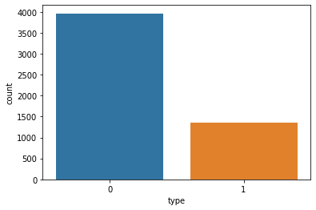
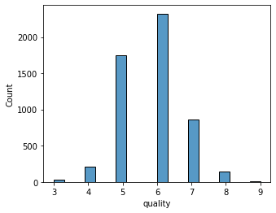
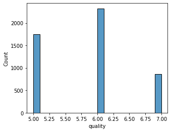
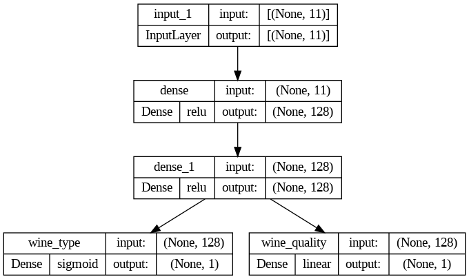
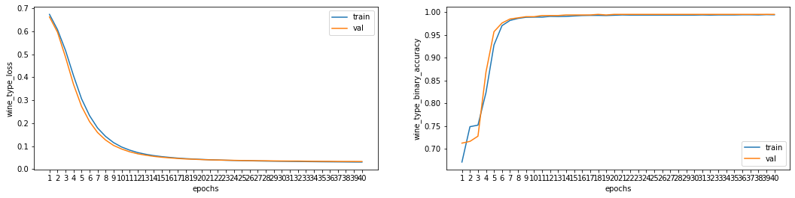
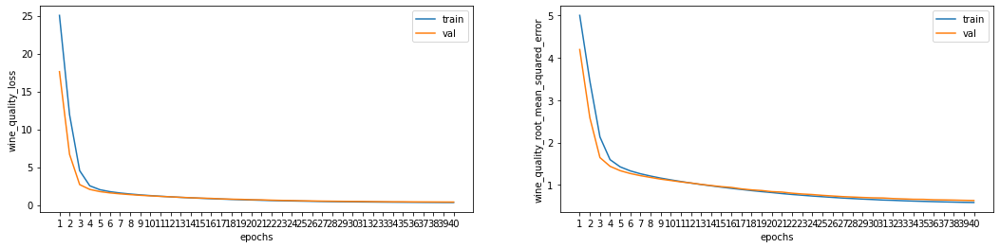
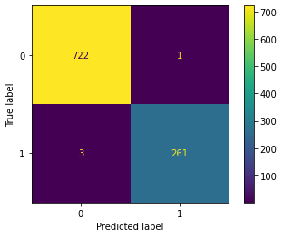
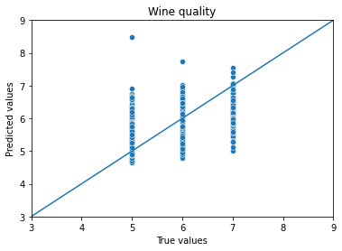

# Multi-outputs of wine type and quality for classification and regression


## 1. Import libraries, set up directories, read data and quick data check


---


```python
import numpy as np
import pandas as pd
import matplotlib.pyplot as plt
import seaborn as sns

import tensorflow as tf
print('TensorFlow version: ', tf.__version__)
```

    TensorFlow version:  2.11.0


```python
input_dir = '/wine/'
output_dir = '/wine/'
```


```python
white_df = pd.read_csv(input_dir + 'winequality-white.csv', sep=';')
white_df['type'] = 0
```


```python
white_df.info()
```

    <class 'pandas.core.frame.DataFrame'>
    RangeIndex: 4898 entries, 0 to 4897
    Data columns (total 13 columns):
     #   Column                Non-Null Count  Dtype  
    ---  ------                --------------  -----  
     0   fixed acidity         4898 non-null   float64
     1   volatile acidity      4898 non-null   float64
     2   citric acid           4898 non-null   float64
     3   residual sugar        4898 non-null   float64
     4   chlorides             4898 non-null   float64
     5   free sulfur dioxide   4898 non-null   float64
     6   total sulfur dioxide  4898 non-null   float64
     7   density               4898 non-null   float64
     8   pH                    4898 non-null   float64
     9   sulphates             4898 non-null   float64
     10  alcohol               4898 non-null   float64
     11  quality               4898 non-null   int64  
     12  type                  4898 non-null   int64  
    dtypes: float64(11), int64(2)
    memory usage: 497.6 KB


```python
white_df = white_df.drop_duplicates(keep='first')
```


```python
white_df.info()
```

    <class 'pandas.core.frame.DataFrame'>
    Int64Index: 3961 entries, 0 to 4897
    Data columns (total 13 columns):
     #   Column                Non-Null Count  Dtype  
    ---  ------                --------------  -----  
     0   fixed acidity         3961 non-null   float64
     1   volatile acidity      3961 non-null   float64
     2   citric acid           3961 non-null   float64
     3   residual sugar        3961 non-null   float64
     4   chlorides             3961 non-null   float64
     5   free sulfur dioxide   3961 non-null   float64
     6   total sulfur dioxide  3961 non-null   float64
     7   density               3961 non-null   float64
     8   pH                    3961 non-null   float64
     9   sulphates             3961 non-null   float64
     10  alcohol               3961 non-null   float64
     11  quality               3961 non-null   int64  
     12  type                  3961 non-null   int64  
    dtypes: float64(11), int64(2)
    memory usage: 433.2 KB


```python
white_df.isna().sum()
```


    fixed acidity           0
    volatile acidity        0
    citric acid             0
    residual sugar          0
    chlorides               0
    free sulfur dioxide     0
    total sulfur dioxide    0
    density                 0
    pH                      0
    sulphates               0
    alcohol                 0
    quality                 0
    type                    0
    dtype: int64


```python
white_df.describe().transpose()
```


  <div id="df-6bfeff1d-a718-4a9d-92fe-fe12b39514a7">
    <div class="colab-df-container">
      <div>
<style scoped>
    .dataframe tbody tr th:only-of-type {
        vertical-align: middle;
    }

    .dataframe tbody tr th {
        vertical-align: top;
    }

    .dataframe thead th {
        text-align: right;
    }
</style>
<table border="1" class="dataframe">
  <thead>
    <tr style="text-align: right;">
      <th></th>
      <th>count</th>
      <th>mean</th>
      <th>std</th>
      <th>min</th>
      <th>25%</th>
      <th>50%</th>
      <th>75%</th>
      <th>max</th>
    </tr>
  </thead>
  <tbody>
    <tr>
      <th>fixed acidity</th>
      <td>3961.0</td>
      <td>6.839346</td>
      <td>0.866860</td>
      <td>3.80000</td>
      <td>6.30000</td>
      <td>6.8000</td>
      <td>7.30000</td>
      <td>14.20000</td>
    </tr>
    <tr>
      <th>volatile acidity</th>
      <td>3961.0</td>
      <td>0.280538</td>
      <td>0.103437</td>
      <td>0.08000</td>
      <td>0.21000</td>
      <td>0.2600</td>
      <td>0.33000</td>
      <td>1.10000</td>
    </tr>
    <tr>
      <th>citric acid</th>
      <td>3961.0</td>
      <td>0.334332</td>
      <td>0.122446</td>
      <td>0.00000</td>
      <td>0.27000</td>
      <td>0.3200</td>
      <td>0.39000</td>
      <td>1.66000</td>
    </tr>
    <tr>
      <th>residual sugar</th>
      <td>3961.0</td>
      <td>5.914819</td>
      <td>4.861646</td>
      <td>0.60000</td>
      <td>1.60000</td>
      <td>4.7000</td>
      <td>8.90000</td>
      <td>65.80000</td>
    </tr>
    <tr>
      <th>chlorides</th>
      <td>3961.0</td>
      <td>0.045905</td>
      <td>0.023103</td>
      <td>0.00900</td>
      <td>0.03500</td>
      <td>0.0420</td>
      <td>0.05000</td>
      <td>0.34600</td>
    </tr>
    <tr>
      <th>free sulfur dioxide</th>
      <td>3961.0</td>
      <td>34.889169</td>
      <td>17.210021</td>
      <td>2.00000</td>
      <td>23.00000</td>
      <td>33.0000</td>
      <td>45.00000</td>
      <td>289.00000</td>
    </tr>
    <tr>
      <th>total sulfur dioxide</th>
      <td>3961.0</td>
      <td>137.193512</td>
      <td>43.129065</td>
      <td>9.00000</td>
      <td>106.00000</td>
      <td>133.0000</td>
      <td>166.00000</td>
      <td>440.00000</td>
    </tr>
    <tr>
      <th>density</th>
      <td>3961.0</td>
      <td>0.993790</td>
      <td>0.002905</td>
      <td>0.98711</td>
      <td>0.99162</td>
      <td>0.9935</td>
      <td>0.99571</td>
      <td>1.03898</td>
    </tr>
    <tr>
      <th>pH</th>
      <td>3961.0</td>
      <td>3.195458</td>
      <td>0.151546</td>
      <td>2.72000</td>
      <td>3.09000</td>
      <td>3.1800</td>
      <td>3.29000</td>
      <td>3.82000</td>
    </tr>
    <tr>
      <th>sulphates</th>
      <td>3961.0</td>
      <td>0.490351</td>
      <td>0.113523</td>
      <td>0.22000</td>
      <td>0.41000</td>
      <td>0.4800</td>
      <td>0.55000</td>
      <td>1.08000</td>
    </tr>
    <tr>
      <th>alcohol</th>
      <td>3961.0</td>
      <td>10.589358</td>
      <td>1.217076</td>
      <td>8.00000</td>
      <td>9.50000</td>
      <td>10.4000</td>
      <td>11.40000</td>
      <td>14.20000</td>
    </tr>
    <tr>
      <th>quality</th>
      <td>3961.0</td>
      <td>5.854835</td>
      <td>0.890683</td>
      <td>3.00000</td>
      <td>5.00000</td>
      <td>6.0000</td>
      <td>6.00000</td>
      <td>9.00000</td>
    </tr>
    <tr>
      <th>type</th>
      <td>3961.0</td>
      <td>0.000000</td>
      <td>0.000000</td>
      <td>0.00000</td>
      <td>0.00000</td>
      <td>0.0000</td>
      <td>0.00000</td>
      <td>0.00000</td>
    </tr>
  </tbody>
</table>
</div>
      <button class="colab-df-convert" onclick="convertToInteractive('df-6bfeff1d-a718-4a9d-92fe-fe12b39514a7')"
              title="Convert this dataframe to an interactive table."
              style="display:none;">

  <svg xmlns="http://www.w3.org/2000/svg" height="24px"viewBox="0 0 24 24"
       width="24px">
    <path d="M0 0h24v24H0V0z" fill="none"/>
    <path d="M18.56 5.44l.94 2.06.94-2.06 2.06-.94-2.06-.94-.94-2.06-.94 2.06-2.06.94zm-11 1L8.5 8.5l.94-2.06 2.06-.94-2.06-.94L8.5 2.5l-.94 2.06-2.06.94zm10 10l.94 2.06.94-2.06 2.06-.94-2.06-.94-.94-2.06-.94 2.06-2.06.94z"/><path d="M17.41 7.96l-1.37-1.37c-.4-.4-.92-.59-1.43-.59-.52 0-1.04.2-1.43.59L10.3 9.45l-7.72 7.72c-.78.78-.78 2.05 0 2.83L4 21.41c.39.39.9.59 1.41.59.51 0 1.02-.2 1.41-.59l7.78-7.78 2.81-2.81c.8-.78.8-2.07 0-2.86zM5.41 20L4 18.59l7.72-7.72 1.47 1.35L5.41 20z"/>
  </svg>
      </button>

  <style>
    .colab-df-container {
      display:flex;
      flex-wrap:wrap;
      gap: 12px;
    }

    .colab-df-convert {
      background-color: #E8F0FE;
      border: none;
      border-radius: 50%;
      cursor: pointer;
      display: none;
      fill: #1967D2;
      height: 32px;
      padding: 0 0 0 0;
      width: 32px;
    }

    .colab-df-convert:hover {
      background-color: #E2EBFA;
      box-shadow: 0px 1px 2px rgba(60, 64, 67, 0.3), 0px 1px 3px 1px rgba(60, 64, 67, 0.15);
      fill: #174EA6;
    }

    [theme=dark] .colab-df-convert {
      background-color: #3B4455;
      fill: #D2E3FC;
    }

    [theme=dark] .colab-df-convert:hover {
      background-color: #434B5C;
      box-shadow: 0px 1px 3px 1px rgba(0, 0, 0, 0.15);
      filter: drop-shadow(0px 1px 2px rgba(0, 0, 0, 0.3));
      fill: #FFFFFF;
    }
  </style>

      <script>
        const buttonEl =
          document.querySelector('#df-6bfeff1d-a718-4a9d-92fe-fe12b39514a7 button.colab-df-convert');
        buttonEl.style.display =
          google.colab.kernel.accessAllowed ? 'block' : 'none';

        async function convertToInteractive(key) {
          const element = document.querySelector('#df-6bfeff1d-a718-4a9d-92fe-fe12b39514a7');
          const dataTable =
            await google.colab.kernel.invokeFunction('convertToInteractive',
                                                     [key], {});
          if (!dataTable) return;

          const docLinkHtml = 'Like what you see? Visit the ' +
            '<a target="_blank" href=https://colab.research.google.com/notebooks/data_table.ipynb>data table notebook</a>'
            + ' to learn more about interactive tables.';
          element.innerHTML = '';
          dataTable['output_type'] = 'display_data';
          await google.colab.output.renderOutput(dataTable, element);
          const docLink = document.createElement('div');
          docLink.innerHTML = docLinkHtml;
          element.appendChild(docLink);
        }
      </script>
    </div>
  </div>


```python
red_df = pd.read_csv(input_dir + 'winequality-red.csv', sep=';')
red_df['type'] = 1
```


```python
red_df.info()
```

    <class 'pandas.core.frame.DataFrame'>
    RangeIndex: 1599 entries, 0 to 1598
    Data columns (total 13 columns):
     #   Column                Non-Null Count  Dtype  
    ---  ------                --------------  -----  
     0   fixed acidity         1599 non-null   float64
     1   volatile acidity      1599 non-null   float64
     2   citric acid           1599 non-null   float64
     3   residual sugar        1599 non-null   float64
     4   chlorides             1599 non-null   float64
     5   free sulfur dioxide   1599 non-null   float64
     6   total sulfur dioxide  1599 non-null   float64
     7   density               1599 non-null   float64
     8   pH                    1599 non-null   float64
     9   sulphates             1599 non-null   float64
     10  alcohol               1599 non-null   float64
     11  quality               1599 non-null   int64  
     12  type                  1599 non-null   int64  
    dtypes: float64(11), int64(2)
    memory usage: 162.5 KB


```python
red_df = red_df.drop_duplicates(keep='first')
```


```python
red_df.info()
```

    <class 'pandas.core.frame.DataFrame'>
    Int64Index: 1359 entries, 0 to 1598
    Data columns (total 13 columns):
     #   Column                Non-Null Count  Dtype  
    ---  ------                --------------  -----  
     0   fixed acidity         1359 non-null   float64
     1   volatile acidity      1359 non-null   float64
     2   citric acid           1359 non-null   float64
     3   residual sugar        1359 non-null   float64
     4   chlorides             1359 non-null   float64
     5   free sulfur dioxide   1359 non-null   float64
     6   total sulfur dioxide  1359 non-null   float64
     7   density               1359 non-null   float64
     8   pH                    1359 non-null   float64
     9   sulphates             1359 non-null   float64
     10  alcohol               1359 non-null   float64
     11  quality               1359 non-null   int64  
     12  type                  1359 non-null   int64  
    dtypes: float64(11), int64(2)
    memory usage: 148.6 KB


```python
red_df.isna().sum()
```


    fixed acidity           0
    volatile acidity        0
    citric acid             0
    residual sugar          0
    chlorides               0
    free sulfur dioxide     0
    total sulfur dioxide    0
    density                 0
    pH                      0
    sulphates               0
    alcohol                 0
    quality                 0
    type                    0
    dtype: int64


```python
red_df.describe().transpose()
```


  <div id="df-c8cd4c57-e7ee-48a5-b278-09cc8f487d90">
    <div class="colab-df-container">
      <div>
<style scoped>
    .dataframe tbody tr th:only-of-type {
        vertical-align: middle;
    }

    .dataframe tbody tr th {
        vertical-align: top;
    }

    .dataframe thead th {
        text-align: right;
    }
</style>
<table border="1" class="dataframe">
  <thead>
    <tr style="text-align: right;">
      <th></th>
      <th>count</th>
      <th>mean</th>
      <th>std</th>
      <th>min</th>
      <th>25%</th>
      <th>50%</th>
      <th>75%</th>
      <th>max</th>
    </tr>
  </thead>
  <tbody>
    <tr>
      <th>fixed acidity</th>
      <td>1359.0</td>
      <td>8.310596</td>
      <td>1.736990</td>
      <td>4.60000</td>
      <td>7.1000</td>
      <td>7.9000</td>
      <td>9.20000</td>
      <td>15.90000</td>
    </tr>
    <tr>
      <th>volatile acidity</th>
      <td>1359.0</td>
      <td>0.529478</td>
      <td>0.183031</td>
      <td>0.12000</td>
      <td>0.3900</td>
      <td>0.5200</td>
      <td>0.64000</td>
      <td>1.58000</td>
    </tr>
    <tr>
      <th>citric acid</th>
      <td>1359.0</td>
      <td>0.272333</td>
      <td>0.195537</td>
      <td>0.00000</td>
      <td>0.0900</td>
      <td>0.2600</td>
      <td>0.43000</td>
      <td>1.00000</td>
    </tr>
    <tr>
      <th>residual sugar</th>
      <td>1359.0</td>
      <td>2.523400</td>
      <td>1.352314</td>
      <td>0.90000</td>
      <td>1.9000</td>
      <td>2.2000</td>
      <td>2.60000</td>
      <td>15.50000</td>
    </tr>
    <tr>
      <th>chlorides</th>
      <td>1359.0</td>
      <td>0.088124</td>
      <td>0.049377</td>
      <td>0.01200</td>
      <td>0.0700</td>
      <td>0.0790</td>
      <td>0.09100</td>
      <td>0.61100</td>
    </tr>
    <tr>
      <th>free sulfur dioxide</th>
      <td>1359.0</td>
      <td>15.893304</td>
      <td>10.447270</td>
      <td>1.00000</td>
      <td>7.0000</td>
      <td>14.0000</td>
      <td>21.00000</td>
      <td>72.00000</td>
    </tr>
    <tr>
      <th>total sulfur dioxide</th>
      <td>1359.0</td>
      <td>46.825975</td>
      <td>33.408946</td>
      <td>6.00000</td>
      <td>22.0000</td>
      <td>38.0000</td>
      <td>63.00000</td>
      <td>289.00000</td>
    </tr>
    <tr>
      <th>density</th>
      <td>1359.0</td>
      <td>0.996709</td>
      <td>0.001869</td>
      <td>0.99007</td>
      <td>0.9956</td>
      <td>0.9967</td>
      <td>0.99782</td>
      <td>1.00369</td>
    </tr>
    <tr>
      <th>pH</th>
      <td>1359.0</td>
      <td>3.309787</td>
      <td>0.155036</td>
      <td>2.74000</td>
      <td>3.2100</td>
      <td>3.3100</td>
      <td>3.40000</td>
      <td>4.01000</td>
    </tr>
    <tr>
      <th>sulphates</th>
      <td>1359.0</td>
      <td>0.658705</td>
      <td>0.170667</td>
      <td>0.33000</td>
      <td>0.5500</td>
      <td>0.6200</td>
      <td>0.73000</td>
      <td>2.00000</td>
    </tr>
    <tr>
      <th>alcohol</th>
      <td>1359.0</td>
      <td>10.432315</td>
      <td>1.082065</td>
      <td>8.40000</td>
      <td>9.5000</td>
      <td>10.2000</td>
      <td>11.10000</td>
      <td>14.90000</td>
    </tr>
    <tr>
      <th>quality</th>
      <td>1359.0</td>
      <td>5.623252</td>
      <td>0.823578</td>
      <td>3.00000</td>
      <td>5.0000</td>
      <td>6.0000</td>
      <td>6.00000</td>
      <td>8.00000</td>
    </tr>
    <tr>
      <th>type</th>
      <td>1359.0</td>
      <td>1.000000</td>
      <td>0.000000</td>
      <td>1.00000</td>
      <td>1.0000</td>
      <td>1.0000</td>
      <td>1.00000</td>
      <td>1.00000</td>
    </tr>
  </tbody>
</table>
</div>
      <button class="colab-df-convert" onclick="convertToInteractive('df-c8cd4c57-e7ee-48a5-b278-09cc8f487d90')"
              title="Convert this dataframe to an interactive table."
              style="display:none;">

  <svg xmlns="http://www.w3.org/2000/svg" height="24px"viewBox="0 0 24 24"
       width="24px">
    <path d="M0 0h24v24H0V0z" fill="none"/>
    <path d="M18.56 5.44l.94 2.06.94-2.06 2.06-.94-2.06-.94-.94-2.06-.94 2.06-2.06.94zm-11 1L8.5 8.5l.94-2.06 2.06-.94-2.06-.94L8.5 2.5l-.94 2.06-2.06.94zm10 10l.94 2.06.94-2.06 2.06-.94-2.06-.94-.94-2.06-.94 2.06-2.06.94z"/><path d="M17.41 7.96l-1.37-1.37c-.4-.4-.92-.59-1.43-.59-.52 0-1.04.2-1.43.59L10.3 9.45l-7.72 7.72c-.78.78-.78 2.05 0 2.83L4 21.41c.39.39.9.59 1.41.59.51 0 1.02-.2 1.41-.59l7.78-7.78 2.81-2.81c.8-.78.8-2.07 0-2.86zM5.41 20L4 18.59l7.72-7.72 1.47 1.35L5.41 20z"/>
  </svg>
      </button>

  <style>
    .colab-df-container {
      display:flex;
      flex-wrap:wrap;
      gap: 12px;
    }

    .colab-df-convert {
      background-color: #E8F0FE;
      border: none;
      border-radius: 50%;
      cursor: pointer;
      display: none;
      fill: #1967D2;
      height: 32px;
      padding: 0 0 0 0;
      width: 32px;
    }

    .colab-df-convert:hover {
      background-color: #E2EBFA;
      box-shadow: 0px 1px 2px rgba(60, 64, 67, 0.3), 0px 1px 3px 1px rgba(60, 64, 67, 0.15);
      fill: #174EA6;
    }

    [theme=dark] .colab-df-convert {
      background-color: #3B4455;
      fill: #D2E3FC;
    }

    [theme=dark] .colab-df-convert:hover {
      background-color: #434B5C;
      box-shadow: 0px 1px 3px 1px rgba(0, 0, 0, 0.15);
      filter: drop-shadow(0px 1px 2px rgba(0, 0, 0, 0.3));
      fill: #FFFFFF;
    }
  </style>

      <script>
        const buttonEl =
          document.querySelector('#df-c8cd4c57-e7ee-48a5-b278-09cc8f487d90 button.colab-df-convert');
        buttonEl.style.display =
          google.colab.kernel.accessAllowed ? 'block' : 'none';

        async function convertToInteractive(key) {
          const element = document.querySelector('#df-c8cd4c57-e7ee-48a5-b278-09cc8f487d90');
          const dataTable =
            await google.colab.kernel.invokeFunction('convertToInteractive',
                                                     [key], {});
          if (!dataTable) return;

          const docLinkHtml = 'Like what you see? Visit the ' +
            '<a target="_blank" href=https://colab.research.google.com/notebooks/data_table.ipynb>data table notebook</a>'
            + ' to learn more about interactive tables.';
          element.innerHTML = '';
          dataTable['output_type'] = 'display_data';
          await google.colab.output.renderOutput(dataTable, element);
          const docLink = document.createElement('div');
          docLink.innerHTML = docLinkHtml;
          element.appendChild(docLink);
        }
      </script>
    </div>
  </div>


```python
df = pd.concat([red_df, white_df], ignore_index=True)
```


```python
df.info()
```

    <class 'pandas.core.frame.DataFrame'>
    RangeIndex: 5320 entries, 0 to 5319
    Data columns (total 13 columns):
     #   Column                Non-Null Count  Dtype  
    ---  ------                --------------  -----  
     0   fixed acidity         5320 non-null   float64
     1   volatile acidity      5320 non-null   float64
     2   citric acid           5320 non-null   float64
     3   residual sugar        5320 non-null   float64
     4   chlorides             5320 non-null   float64
     5   free sulfur dioxide   5320 non-null   float64
     6   total sulfur dioxide  5320 non-null   float64
     7   density               5320 non-null   float64
     8   pH                    5320 non-null   float64
     9   sulphates             5320 non-null   float64
     10  alcohol               5320 non-null   float64
     11  quality               5320 non-null   int64  
     12  type                  5320 non-null   int64  
    dtypes: float64(11), int64(2)
    memory usage: 540.4 KB


## 2. Exploratory data analysis (EDA)


```python
df['type'].value_counts()
```


    0    3961
    1    1359
    Name: type, dtype: int64


```python
sns.countplot(data=df, x='type');
```


    

    


```python
plt.figure(figsize=(5, 4))
sns.histplot(data=df, x='quality', bins=20);
```


    

    


```python
df = df[(df['quality']>4) & (df['quality']<8)]
df = df.reset_index(drop=True)
```


```python
df.info()
```

    <class 'pandas.core.frame.DataFrame'>
    RangeIndex: 4931 entries, 0 to 4930
    Data columns (total 13 columns):
     #   Column                Non-Null Count  Dtype  
    ---  ------                --------------  -----  
     0   fixed acidity         4931 non-null   float64
     1   volatile acidity      4931 non-null   float64
     2   citric acid           4931 non-null   float64
     3   residual sugar        4931 non-null   float64
     4   chlorides             4931 non-null   float64
     5   free sulfur dioxide   4931 non-null   float64
     6   total sulfur dioxide  4931 non-null   float64
     7   density               4931 non-null   float64
     8   pH                    4931 non-null   float64
     9   sulphates             4931 non-null   float64
     10  alcohol               4931 non-null   float64
     11  quality               4931 non-null   int64  
     12  type                  4931 non-null   int64  
    dtypes: float64(11), int64(2)
    memory usage: 500.9 KB


```python
plt.figure(figsize=(5, 4))
sns.histplot(data=df, x='quality', bins=20);
```


    

    


## 3. Modeling

### 3.1 Hyperparameters


```python
seed = 42

shape = (11, )

epochs = 40
batch_size= 32
```

### 3.2 Prepare train, valid, and test data


```python
X = df.drop(['type', 'quality'], axis=1)
y = df[['type', 'quality']]
```


```python
from sklearn.model_selection import train_test_split
X_train, X_test, y_train, y_test = train_test_split(X, y, test_size=0.2, random_state=seed, shuffle=True)
X_train, X_valid, y_train, y_valid = train_test_split(X_train, y_train, test_size=0.2, random_state=seed, shuffle=True)
```


```python
def format_outputs(y):
    return (y['type'].to_numpy(), y['quality'].to_numpy())
```


```python
y_train = format_outputs(y_train)
y_valid = format_outputs(y_valid)
y_test = format_outputs(y_test)
```


```python
n_train = len(X_train)
n_valid = len(X_valid)
n_test = len(X_test)

print('The size of data')
print(f'train: {n_train}, valid: {n_valid}, test: {n_test}')
```

    The size of data
    train: 3155, valid: 789, test: 987


```python
from sklearn.preprocessing import StandardScaler

scaler = StandardScaler()
scaled_X_train = scaler.fit_transform(X_train)
scaled_X_valid = scaler.transform(X_valid)
scaled_X_test = scaler.transform(X_test)
```

### 3.3 Build, Compile and Train a model 


```python
from tensorflow.keras import Model, Input
from tensorflow.keras.layers import Dense 
```


```python
def base_model(inputs):

    x = Dense(128, activation='relu')(inputs)
    x = Dense(128, activation='relu')(x)

    return x
```


```python
def final_model(inputs):

    x = base_model(inputs)

    wine_type = Dense(1, activation='sigmoid', name='wine_type')(x)
    wine_quality = Dense(1, name='wine_quality')(x)

    model = Model(inputs=inputs, outputs=[wine_type, wine_quality])

    return model
```


```python
inputs = Input(shape=shape)
optimizer = tf.keras.optimizers.RMSprop(learning_rate=0.0001)

model = final_model(inputs)

model.compile(optimizer=optimizer,
              loss={'wine_type': tf.keras.losses.BinaryCrossentropy(),
                    'wine_quality':tf.keras.losses.MeanSquaredError()
                    }, 
              metrics={'wine_type': tf.keras.metrics.BinaryAccuracy(),
                       'wine_quality': tf.keras.metrics.RootMeanSquaredError()
                      }
              )
```


```python
print(model.summary())

from tensorflow.keras.utils import plot_model
plot_model(model, show_shapes=True, show_layer_names=True, show_layer_activations=True)
```

    Model: "model"
    __________________________________________________________________________________________________
     Layer (type)                   Output Shape         Param #     Connected to                     
    ==================================================================================================
     input_1 (InputLayer)           [(None, 11)]         0           []                               
                                                                                                      
     dense (Dense)                  (None, 128)          1536        ['input_1[0][0]']                
                                                                                                      
     dense_1 (Dense)                (None, 128)          16512       ['dense[0][0]']                  
                                                                                                      
     wine_type (Dense)              (None, 1)            129         ['dense_1[0][0]']                
                                                                                                      
     wine_quality (Dense)           (None, 1)            129         ['dense_1[0][0]']                
                                                                                                      
    ==================================================================================================
    Total params: 18,306
    Trainable params: 18,306
    Non-trainable params: 0
    __________________________________________________________________________________________________
    None


    

    


```python
history = model.fit(scaled_X_train, y_train, epochs = epochs, batch_size=batch_size, validation_data=(scaled_X_valid, y_valid))
```

    Epoch 1/40
    99/99 [==============================] - 2s 5ms/step - loss: 25.7248 - wine_type_loss: 0.6738 - wine_quality_loss: 25.0510 - wine_type_binary_accuracy: 0.6707 - wine_quality_root_mean_squared_error: 5.0051 - val_loss: 18.2819 - val_wine_type_loss: 0.6626 - val_wine_quality_loss: 17.6193 - val_wine_type_binary_accuracy: 0.7123 - val_wine_quality_root_mean_squared_error: 4.1975
    Epoch 2/40
    99/99 [==============================] - 0s 3ms/step - loss: 12.5405 - wine_type_loss: 0.6074 - wine_quality_loss: 11.9331 - wine_type_binary_accuracy: 0.7483 - wine_quality_root_mean_squared_error: 3.4544 - val_loss: 7.2889 - val_wine_type_loss: 0.5962 - val_wine_quality_loss: 6.6927 - val_wine_type_binary_accuracy: 0.7161 - val_wine_quality_root_mean_squared_error: 2.5870
    Epoch 3/40
    99/99 [==============================] - 0s 3ms/step - loss: 5.0585 - wine_type_loss: 0.5169 - wine_quality_loss: 4.5416 - wine_type_binary_accuracy: 0.7518 - wine_quality_root_mean_squared_error: 2.1311 - val_loss: 3.1869 - val_wine_type_loss: 0.4876 - val_wine_quality_loss: 2.6993 - val_wine_type_binary_accuracy: 0.7275 - val_wine_quality_root_mean_squared_error: 1.6429
    Epoch 4/40
    99/99 [==============================] - 0s 3ms/step - loss: 2.9482 - wine_type_loss: 0.4067 - wine_quality_loss: 2.5415 - wine_type_binary_accuracy: 0.8231 - wine_quality_root_mean_squared_error: 1.5942 - val_loss: 2.4333 - val_wine_type_loss: 0.3688 - val_wine_quality_loss: 2.0645 - val_wine_type_binary_accuracy: 0.8682 - val_wine_quality_root_mean_squared_error: 1.4368
    Epoch 5/40
    99/99 [==============================] - 0s 3ms/step - loss: 2.3343 - wine_type_loss: 0.3062 - wine_quality_loss: 2.0281 - wine_type_binary_accuracy: 0.9277 - wine_quality_root_mean_squared_error: 1.4241 - val_loss: 2.0521 - val_wine_type_loss: 0.2734 - val_wine_quality_loss: 1.7787 - val_wine_type_binary_accuracy: 0.9569 - val_wine_quality_root_mean_squared_error: 1.3337
    Epoch 6/40
    99/99 [==============================] - 0s 3ms/step - loss: 1.9990 - wine_type_loss: 0.2328 - wine_quality_loss: 1.7662 - wine_type_binary_accuracy: 0.9702 - wine_quality_root_mean_squared_error: 1.3290 - val_loss: 1.8111 - val_wine_type_loss: 0.2067 - val_wine_quality_loss: 1.6044 - val_wine_type_binary_accuracy: 0.9759 - val_wine_quality_root_mean_squared_error: 1.2667
    Epoch 7/40
    99/99 [==============================] - 0s 3ms/step - loss: 1.7686 - wine_type_loss: 0.1789 - wine_quality_loss: 1.5897 - wine_type_binary_accuracy: 0.9816 - wine_quality_root_mean_squared_error: 1.2608 - val_loss: 1.6382 - val_wine_type_loss: 0.1592 - val_wine_quality_loss: 1.4790 - val_wine_type_binary_accuracy: 0.9848 - val_wine_quality_root_mean_squared_error: 1.2161
    Epoch 8/40
    99/99 [==============================] - 0s 3ms/step - loss: 1.5984 - wine_type_loss: 0.1423 - wine_quality_loss: 1.4561 - wine_type_binary_accuracy: 0.9861 - wine_quality_root_mean_squared_error: 1.2067 - val_loss: 1.5054 - val_wine_type_loss: 0.1265 - val_wine_quality_loss: 1.3789 - val_wine_type_binary_accuracy: 0.9873 - val_wine_quality_root_mean_squared_error: 1.1743
    Epoch 9/40
    99/99 [==============================] - 0s 3ms/step - loss: 1.4565 - wine_type_loss: 0.1152 - wine_quality_loss: 1.3414 - wine_type_binary_accuracy: 0.9886 - wine_quality_root_mean_squared_error: 1.1582 - val_loss: 1.3887 - val_wine_type_loss: 0.1029 - val_wine_quality_loss: 1.2859 - val_wine_type_binary_accuracy: 0.9899 - val_wine_quality_root_mean_squared_error: 1.1340
    Epoch 10/40
    99/99 [==============================] - 0s 3ms/step - loss: 1.3428 - wine_type_loss: 0.0961 - wine_quality_loss: 1.2467 - wine_type_binary_accuracy: 0.9889 - wine_quality_root_mean_squared_error: 1.1165 - val_loss: 1.3012 - val_wine_type_loss: 0.0873 - val_wine_quality_loss: 1.2139 - val_wine_type_binary_accuracy: 0.9899 - val_wine_quality_root_mean_squared_error: 1.1018
    Epoch 11/40
    99/99 [==============================] - 0s 3ms/step - loss: 1.2446 - wine_type_loss: 0.0826 - wine_quality_loss: 1.1620 - wine_type_binary_accuracy: 0.9889 - wine_quality_root_mean_squared_error: 1.0779 - val_loss: 1.2178 - val_wine_type_loss: 0.0753 - val_wine_quality_loss: 1.1425 - val_wine_type_binary_accuracy: 0.9924 - val_wine_quality_root_mean_squared_error: 1.0689
    Epoch 12/40
    99/99 [==============================] - 0s 3ms/step - loss: 1.1550 - wine_type_loss: 0.0720 - wine_quality_loss: 1.0830 - wine_type_binary_accuracy: 0.9905 - wine_quality_root_mean_squared_error: 1.0407 - val_loss: 1.1535 - val_wine_type_loss: 0.0666 - val_wine_quality_loss: 1.0870 - val_wine_type_binary_accuracy: 0.9924 - val_wine_quality_root_mean_squared_error: 1.0426
    Epoch 13/40
    99/99 [==============================] - 0s 3ms/step - loss: 1.0777 - wine_type_loss: 0.0644 - wine_quality_loss: 1.0132 - wine_type_binary_accuracy: 0.9902 - wine_quality_root_mean_squared_error: 1.0066 - val_loss: 1.0798 - val_wine_type_loss: 0.0605 - val_wine_quality_loss: 1.0193 - val_wine_type_binary_accuracy: 0.9924 - val_wine_quality_root_mean_squared_error: 1.0096
    Epoch 14/40
    99/99 [==============================] - 0s 3ms/step - loss: 1.0102 - wine_type_loss: 0.0586 - wine_quality_loss: 0.9516 - wine_type_binary_accuracy: 0.9905 - wine_quality_root_mean_squared_error: 0.9755 - val_loss: 1.0197 - val_wine_type_loss: 0.0554 - val_wine_quality_loss: 0.9643 - val_wine_type_binary_accuracy: 0.9937 - val_wine_quality_root_mean_squared_error: 0.9820
    Epoch 15/40
    99/99 [==============================] - 0s 3ms/step - loss: 0.9459 - wine_type_loss: 0.0541 - wine_quality_loss: 0.8918 - wine_type_binary_accuracy: 0.9914 - wine_quality_root_mean_squared_error: 0.9444 - val_loss: 0.9655 - val_wine_type_loss: 0.0516 - val_wine_quality_loss: 0.9140 - val_wine_type_binary_accuracy: 0.9937 - val_wine_quality_root_mean_squared_error: 0.9560
    Epoch 16/40
    99/99 [==============================] - 0s 3ms/step - loss: 0.8897 - wine_type_loss: 0.0508 - wine_quality_loss: 0.8390 - wine_type_binary_accuracy: 0.9924 - wine_quality_root_mean_squared_error: 0.9160 - val_loss: 0.9277 - val_wine_type_loss: 0.0487 - val_wine_quality_loss: 0.8790 - val_wine_type_binary_accuracy: 0.9937 - val_wine_quality_root_mean_squared_error: 0.9375
    Epoch 17/40
    99/99 [==============================] - 0s 3ms/step - loss: 0.8390 - wine_type_loss: 0.0478 - wine_quality_loss: 0.7912 - wine_type_binary_accuracy: 0.9927 - wine_quality_root_mean_squared_error: 0.8895 - val_loss: 0.8619 - val_wine_type_loss: 0.0461 - val_wine_quality_loss: 0.8158 - val_wine_type_binary_accuracy: 0.9937 - val_wine_quality_root_mean_squared_error: 0.9032
    Epoch 18/40
    99/99 [==============================] - 0s 3ms/step - loss: 0.7896 - wine_type_loss: 0.0454 - wine_quality_loss: 0.7442 - wine_type_binary_accuracy: 0.9927 - wine_quality_root_mean_squared_error: 0.8627 - val_loss: 0.8179 - val_wine_type_loss: 0.0440 - val_wine_quality_loss: 0.7739 - val_wine_type_binary_accuracy: 0.9949 - val_wine_quality_root_mean_squared_error: 0.8797
    Epoch 19/40
    99/99 [==============================] - 0s 3ms/step - loss: 0.7469 - wine_type_loss: 0.0436 - wine_quality_loss: 0.7033 - wine_type_binary_accuracy: 0.9924 - wine_quality_root_mean_squared_error: 0.8386 - val_loss: 0.7900 - val_wine_type_loss: 0.0427 - val_wine_quality_loss: 0.7473 - val_wine_type_binary_accuracy: 0.9937 - val_wine_quality_root_mean_squared_error: 0.8645
    Epoch 20/40
    99/99 [==============================] - 0s 3ms/step - loss: 0.7088 - wine_type_loss: 0.0420 - wine_quality_loss: 0.6668 - wine_type_binary_accuracy: 0.9930 - wine_quality_root_mean_squared_error: 0.8166 - val_loss: 0.7434 - val_wine_type_loss: 0.0413 - val_wine_quality_loss: 0.7021 - val_wine_type_binary_accuracy: 0.9949 - val_wine_quality_root_mean_squared_error: 0.8379
    Epoch 21/40
    99/99 [==============================] - 0s 3ms/step - loss: 0.6685 - wine_type_loss: 0.0405 - wine_quality_loss: 0.6279 - wine_type_binary_accuracy: 0.9937 - wine_quality_root_mean_squared_error: 0.7924 - val_loss: 0.7251 - val_wine_type_loss: 0.0400 - val_wine_quality_loss: 0.6850 - val_wine_type_binary_accuracy: 0.9949 - val_wine_quality_root_mean_squared_error: 0.8277
    Epoch 22/40
    99/99 [==============================] - 0s 3ms/step - loss: 0.6344 - wine_type_loss: 0.0395 - wine_quality_loss: 0.5949 - wine_type_binary_accuracy: 0.9933 - wine_quality_root_mean_squared_error: 0.7713 - val_loss: 0.6812 - val_wine_type_loss: 0.0394 - val_wine_quality_loss: 0.6418 - val_wine_type_binary_accuracy: 0.9949 - val_wine_quality_root_mean_squared_error: 0.8011
    Epoch 23/40
    99/99 [==============================] - 0s 3ms/step - loss: 0.6054 - wine_type_loss: 0.0384 - wine_quality_loss: 0.5670 - wine_type_binary_accuracy: 0.9933 - wine_quality_root_mean_squared_error: 0.7530 - val_loss: 0.6506 - val_wine_type_loss: 0.0386 - val_wine_quality_loss: 0.6120 - val_wine_type_binary_accuracy: 0.9949 - val_wine_quality_root_mean_squared_error: 0.7823
    Epoch 24/40
    99/99 [==============================] - 0s 3ms/step - loss: 0.5769 - wine_type_loss: 0.0375 - wine_quality_loss: 0.5394 - wine_type_binary_accuracy: 0.9933 - wine_quality_root_mean_squared_error: 0.7345 - val_loss: 0.6297 - val_wine_type_loss: 0.0379 - val_wine_quality_loss: 0.5917 - val_wine_type_binary_accuracy: 0.9949 - val_wine_quality_root_mean_squared_error: 0.7692
    Epoch 25/40
    99/99 [==============================] - 0s 2ms/step - loss: 0.5528 - wine_type_loss: 0.0367 - wine_quality_loss: 0.5161 - wine_type_binary_accuracy: 0.9933 - wine_quality_root_mean_squared_error: 0.7184 - val_loss: 0.6003 - val_wine_type_loss: 0.0373 - val_wine_quality_loss: 0.5630 - val_wine_type_binary_accuracy: 0.9949 - val_wine_quality_root_mean_squared_error: 0.7503
    Epoch 26/40
    99/99 [==============================] - 0s 4ms/step - loss: 0.5292 - wine_type_loss: 0.0360 - wine_quality_loss: 0.4931 - wine_type_binary_accuracy: 0.9933 - wine_quality_root_mean_squared_error: 0.7022 - val_loss: 0.5776 - val_wine_type_loss: 0.0368 - val_wine_quality_loss: 0.5408 - val_wine_type_binary_accuracy: 0.9949 - val_wine_quality_root_mean_squared_error: 0.7354
    Epoch 27/40
    99/99 [==============================] - 0s 4ms/step - loss: 0.5073 - wine_type_loss: 0.0353 - wine_quality_loss: 0.4720 - wine_type_binary_accuracy: 0.9933 - wine_quality_root_mean_squared_error: 0.6870 - val_loss: 0.5552 - val_wine_type_loss: 0.0364 - val_wine_quality_loss: 0.5188 - val_wine_type_binary_accuracy: 0.9949 - val_wine_quality_root_mean_squared_error: 0.7203
    Epoch 28/40
    99/99 [==============================] - 0s 4ms/step - loss: 0.4890 - wine_type_loss: 0.0347 - wine_quality_loss: 0.4543 - wine_type_binary_accuracy: 0.9933 - wine_quality_root_mean_squared_error: 0.6740 - val_loss: 0.5405 - val_wine_type_loss: 0.0361 - val_wine_quality_loss: 0.5044 - val_wine_type_binary_accuracy: 0.9949 - val_wine_quality_root_mean_squared_error: 0.7102
    Epoch 29/40
    99/99 [==============================] - 0s 4ms/step - loss: 0.4724 - wine_type_loss: 0.0342 - wine_quality_loss: 0.4382 - wine_type_binary_accuracy: 0.9933 - wine_quality_root_mean_squared_error: 0.6619 - val_loss: 0.5251 - val_wine_type_loss: 0.0354 - val_wine_quality_loss: 0.4897 - val_wine_type_binary_accuracy: 0.9949 - val_wine_quality_root_mean_squared_error: 0.6998
    Epoch 30/40
    99/99 [==============================] - 0s 4ms/step - loss: 0.4580 - wine_type_loss: 0.0338 - wine_quality_loss: 0.4242 - wine_type_binary_accuracy: 0.9933 - wine_quality_root_mean_squared_error: 0.6513 - val_loss: 0.5137 - val_wine_type_loss: 0.0351 - val_wine_quality_loss: 0.4786 - val_wine_type_binary_accuracy: 0.9949 - val_wine_quality_root_mean_squared_error: 0.6918
    Epoch 31/40
    99/99 [==============================] - 0s 4ms/step - loss: 0.4421 - wine_type_loss: 0.0333 - wine_quality_loss: 0.4088 - wine_type_binary_accuracy: 0.9937 - wine_quality_root_mean_squared_error: 0.6394 - val_loss: 0.5076 - val_wine_type_loss: 0.0348 - val_wine_quality_loss: 0.4728 - val_wine_type_binary_accuracy: 0.9949 - val_wine_quality_root_mean_squared_error: 0.6876
    Epoch 32/40
    99/99 [==============================] - 0s 4ms/step - loss: 0.4328 - wine_type_loss: 0.0329 - wine_quality_loss: 0.3999 - wine_type_binary_accuracy: 0.9933 - wine_quality_root_mean_squared_error: 0.6324 - val_loss: 0.4898 - val_wine_type_loss: 0.0348 - val_wine_quality_loss: 0.4550 - val_wine_type_binary_accuracy: 0.9949 - val_wine_quality_root_mean_squared_error: 0.6745
    Epoch 33/40
    99/99 [==============================] - 0s 4ms/step - loss: 0.4201 - wine_type_loss: 0.0325 - wine_quality_loss: 0.3876 - wine_type_binary_accuracy: 0.9937 - wine_quality_root_mean_squared_error: 0.6225 - val_loss: 0.4779 - val_wine_type_loss: 0.0343 - val_wine_quality_loss: 0.4436 - val_wine_type_binary_accuracy: 0.9949 - val_wine_quality_root_mean_squared_error: 0.6660
    Epoch 34/40
    99/99 [==============================] - 0s 4ms/step - loss: 0.4101 - wine_type_loss: 0.0322 - wine_quality_loss: 0.3779 - wine_type_binary_accuracy: 0.9937 - wine_quality_root_mean_squared_error: 0.6147 - val_loss: 0.4659 - val_wine_type_loss: 0.0339 - val_wine_quality_loss: 0.4319 - val_wine_type_binary_accuracy: 0.9949 - val_wine_quality_root_mean_squared_error: 0.6572
    Epoch 35/40
    99/99 [==============================] - 0s 4ms/step - loss: 0.4015 - wine_type_loss: 0.0318 - wine_quality_loss: 0.3698 - wine_type_binary_accuracy: 0.9937 - wine_quality_root_mean_squared_error: 0.6081 - val_loss: 0.4633 - val_wine_type_loss: 0.0337 - val_wine_quality_loss: 0.4296 - val_wine_type_binary_accuracy: 0.9949 - val_wine_quality_root_mean_squared_error: 0.6555
    Epoch 36/40
    99/99 [==============================] - 0s 4ms/step - loss: 0.3937 - wine_type_loss: 0.0315 - wine_quality_loss: 0.3622 - wine_type_binary_accuracy: 0.9940 - wine_quality_root_mean_squared_error: 0.6018 - val_loss: 0.4506 - val_wine_type_loss: 0.0336 - val_wine_quality_loss: 0.4171 - val_wine_type_binary_accuracy: 0.9949 - val_wine_quality_root_mean_squared_error: 0.6458
    Epoch 37/40
    99/99 [==============================] - 0s 4ms/step - loss: 0.3860 - wine_type_loss: 0.0312 - wine_quality_loss: 0.3547 - wine_type_binary_accuracy: 0.9940 - wine_quality_root_mean_squared_error: 0.5956 - val_loss: 0.4455 - val_wine_type_loss: 0.0332 - val_wine_quality_loss: 0.4123 - val_wine_type_binary_accuracy: 0.9949 - val_wine_quality_root_mean_squared_error: 0.6421
    Epoch 38/40
    99/99 [==============================] - 0s 3ms/step - loss: 0.3799 - wine_type_loss: 0.0310 - wine_quality_loss: 0.3490 - wine_type_binary_accuracy: 0.9937 - wine_quality_root_mean_squared_error: 0.5907 - val_loss: 0.4402 - val_wine_type_loss: 0.0331 - val_wine_quality_loss: 0.4070 - val_wine_type_binary_accuracy: 0.9949 - val_wine_quality_root_mean_squared_error: 0.6380
    Epoch 39/40
    99/99 [==============================] - 0s 3ms/step - loss: 0.3729 - wine_type_loss: 0.0306 - wine_quality_loss: 0.3424 - wine_type_binary_accuracy: 0.9943 - wine_quality_root_mean_squared_error: 0.5851 - val_loss: 0.4329 - val_wine_type_loss: 0.0331 - val_wine_quality_loss: 0.3997 - val_wine_type_binary_accuracy: 0.9949 - val_wine_quality_root_mean_squared_error: 0.6323
    Epoch 40/40
    99/99 [==============================] - 0s 3ms/step - loss: 0.3686 - wine_type_loss: 0.0304 - wine_quality_loss: 0.3382 - wine_type_binary_accuracy: 0.9940 - wine_quality_root_mean_squared_error: 0.5815 - val_loss: 0.4276 - val_wine_type_loss: 0.0329 - val_wine_quality_loss: 0.3947 - val_wine_type_binary_accuracy: 0.9949 - val_wine_quality_root_mean_squared_error: 0.6283


### 3.4 Visualise the training


```python
# Visualize 
fig, ax = plt.subplots(1, 2, figsize=(18, 4))
ax = ax.flatten() #ravel() 
x = np.arange(1, len(history.history['loss'])+1)

loc = ['upper right', 'lower right']
for i, met in enumerate(['wine_type_loss', 'wine_type_binary_accuracy']):
    ax[i].plot(x, history.history[met])
    ax[i].plot(x, history.history['val_' + met])
    ax[i].set_xlabel('epochs')
    ax[i].set_xticks(x)
    ax[i].set_ylabel(met)
    ax[i].legend(['train', 'val'], loc=loc[i])
```


    

    


```python
# Visualize 
fig, ax = plt.subplots(1, 2, figsize=(18, 4))
ax = ax.flatten() #ravel() 
x = np.arange(1, len(history.history['loss'])+1)

loc = ['upper right', 'upper right']
for i, met in enumerate(['wine_quality_loss', 'wine_quality_root_mean_squared_error']):
    ax[i].plot(x, history.history[met])
    ax[i].plot(x, history.history['val_' + met])
    ax[i].set_xlabel('epochs')
    ax[i].set_xticks(x)
    ax[i].set_ylabel(met)
    ax[i].legend(['train', 'val'], loc=loc[i])
```


    

    


## 4. Evaluate the model performance


```python
loss, wine_type_loss, wine_quality_loss, wine_type_binary_accuracy, wine_quality_root_mean_squared_error = model.evaluate(scaled_X_test, y_test)

print(f'loss: {loss:.4f}')
print(f'wine_type_loss: {wine_type_loss:.4f}')
print(f'wine_quality_loss: {wine_quality_loss:.4f}')
print(f'wine_type_binary_accuracy: {wine_type_binary_accuracy:.4f}')
print(f'wine_quality_root_mean_squared_error: {wine_quality_root_mean_squared_error:.4f}')

```

    31/31 [==============================] - 0s 7ms/step - loss: 0.4331 - wine_type_loss: 0.0268 - wine_quality_loss: 0.4063 - wine_type_binary_accuracy: 0.9959 - wine_quality_root_mean_squared_error: 0.6374
    loss: 0.4331
    wine_type_loss: 0.0268
    wine_quality_loss: 0.4063
    wine_type_binary_accuracy: 0.9959
    wine_quality_root_mean_squared_error: 0.6374


```python
y_test_pred_prob_type, y_test_pred_quality = model.predict(scaled_X_test)
y_test_pred_prob_type = y_test_pred_prob_type.flatten()
y_test_pred_quality = y_test_pred_quality.flatten()
y_test_pred_class_type = np.round(y_test_pred_prob_type)
```

    31/31 [==============================] - 0s 4ms/step


```python
from sklearn.metrics import ConfusionMatrixDisplay, classification_report

ConfusionMatrixDisplay.from_predictions(y_test[0], y_test_pred_class_type)
print(classification_report(y_test[0], y_test_pred_class_type))
```

                  precision    recall  f1-score   support
    
               0       1.00      1.00      1.00       723
               1       1.00      0.99      0.99       264
    
        accuracy                           1.00       987
       macro avg       1.00      0.99      0.99       987
    weighted avg       1.00      1.00      1.00       987
    


    

    


```python
sns.scatterplot(x=y_test[1], y=y_test_pred_quality)
plt.plot([0,10], [0, 10])
plt.xlim(3, 9)
plt.ylim(3, 9)
plt.xlabel('True values')
plt.ylabel('Predicted values')
plt.title('Wine quality');
```


    

    


```python

```
